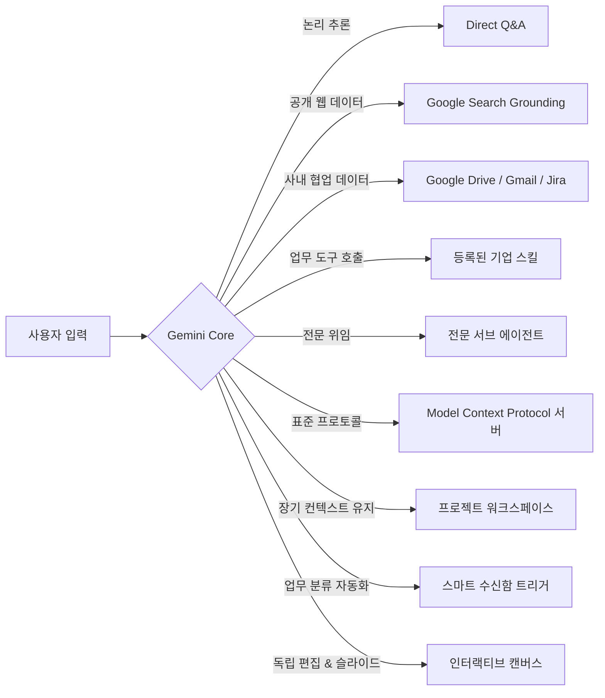
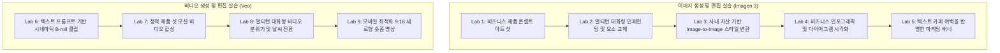
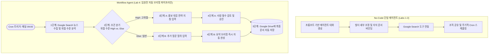
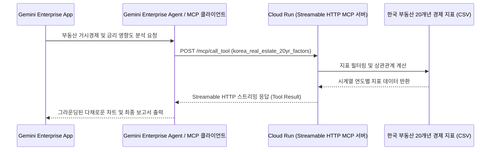

# 🧠 Gemini Enterprise Lab - 워크스페이스 스킬 및 에이전트 카탈로그

**Gemini Enterprise Lab**의 **`.agents/`** 워크스페이스 저장소에 오신 것을 환영합니다.  
본 디렉토리는 Gemini Enterprise 생태계 내에서 동작하는 자율형 AI 코딩 에이전트 및 페어 프로그래밍 어시스턴트를 위해 제작된 **커스텀 워크스페이스 스킬(Custom Workspace Skills, `.agents/skills/`)**의 중앙 관리 저장소입니다.

이곳에 정의된 모든 스킬은 **Jetski / Agent Skill 표준 규격**을 완벽히 준수하며, [`GEMINI.md`](file:///Users/hangsik/Documents/my_project/gemini_enterprise_lab/GEMINI.md)에 명시된 리포지토리 규칙에 따라 에이전트 런타임에 의해 자동 검색(Auto-Discovery) 및 호출됩니다.

---

## 📌 목차

1. [아키텍처 및 디렉토리 구조](#1-아키텍처-및-디렉토리-구조)
2. [스킬 자동 검색 및 호출 규칙](#2-스킬-자동-검색-및-호출-규칙)
3. [워크스페이스 스킬 카탈로그 매트릭스](#3-워크스페이스-스킬-카탈로그-매트릭스)
4. [상세 스킬 명세서](#4-상세-스킬-명세서)
   - [4.1 `ge-general` - Gemini Enterprise 10대 핵심 기능](#41-ge-general---gemini-enterprise-10대-핵심-기능)
   - [4.2 `media-gen` - 멀티모달 이미지 및 비디오 생성/편집](#42-media-gen---멀티모달-이미지-및-비디오-생성편집)
   - [4.3 `nocode-basic` - 노코드 및 워크플로우 에이전트 스튜디오](#43-nocode-basic---노코드-및-워크플로우-에이전트-스튜디오)
   - [4.4 `build-mcp-server` - Cloud Run 기반 HTTP MCP 서버 구축 및 배포](#44-build-mcp-server---cloud-run-기반-http-mcp-서버-구축-및-배포)
5. [신규 커스텀 스킬 작성 가이드](#5-신규-커스텀-스킬-작성-가이드)
6. [보안 가드레일 및 운영 원칙](#6-보안-가드레일-및-운영-원칙)

---

## 1. 아키텍처 및 디렉토리 구조

커스텀 에이전트 스킬은 `.agents/skills/<스킬명>/SKILL.md` 구조로 체계화되어 있습니다. 각 스킬은 AI 에이전트가 사용자를 안내하거나 자율 업무를 수행하는 데 필요한 도메인 지식, 실행 절차, 실무 프롬프트, 검증 체크리스트를 포함합니다.

```text
.agents/
├── README.md                           # 워크스페이스 스킬 총괄 가이드 문서 (본 문서)
└── skills/
    ├── ge-general/                     # Gemini Enterprise 10대 핵심 기능 검증 스킬
    │   └── SKILL.md
    ├── media-gen/                      # Imagen 3 & Veo 기반 멀티모달 미디어 생성/편집 스킬
    │   └── SKILL.md
    ├── nocode-basic/                   # 노코드 단일 에이전트 및 워크플로우 에이전트 제작 스킬
    │   └── SKILL.md
    ├── nocode-advance/                 # 심화 워크플로우 에이전트 개발 및 오케스트레이션 스킬
    │   └── SKILL.md
    ├── agent-realestate/               # Google ADK & A2A 커스텀 에이전트(agent_realestate) 제작 및 Vertex AI 배포 스킬
    │   └── SKILL.md
    ├── build-mcp-server/               # Cloud Run 상의 Streamable HTTP MCP 서버 배포 스킬
    │   └── SKILL.md
    ├── agent_gateway/                  # (준비 중) 엔터프라이즈 에이전트 게이트웨이 연동 스킬
    └── caa-analysis/                   # (준비 중) 컨텍스트 및 아키텍처 분석 스킬
```

### 핸즈온 랩 실습 문서(`ge_lab/`)와의 연계 관계

`.agents/skills/`의 스킬들이 AI 에이전트의 작동 명세와 자동화 지침을 제공한다면, [`ge_lab/`](file:///Users/hangsik/Documents/my_project/gemini_enterprise_lab/ge_lab)은 실제 사용자가 단계별로 따라 할 수 있는 튜토리얼 매뉴얼, UI 캡처 화면, 실습 리소스를 제공합니다:

| 워크스페이스 스킬 (AI 에이전트용) | 대응 핸즈온 랩 매뉴얼 (사용자 실습용) | 실습 리소스 디렉토리 |
| :--- | :--- | :--- |
| [`ge-general`](file:///Users/hangsik/Documents/my_project/gemini_enterprise_lab/.agents/skills/ge-general/SKILL.md) | [`ge_lab/ge_general/ge_general.md`](file:///Users/hangsik/Documents/my_project/gemini_enterprise_lab/ge_lab/ge_general/ge_general.md) | [`ge_lab/ge_general/resources/`](file:///Users/hangsik/Documents/my_project/gemini_enterprise_lab/ge_lab/ge_general/resources) |
| [`media-gen`](file:///Users/hangsik/Documents/my_project/gemini_enterprise_lab/.agents/skills/media-gen/SKILL.md) | [`ge_lab/media_gen/ge_media.md`](file:///Users/hangsik/Documents/my_project/gemini_enterprise_lab/ge_lab/media_gen/ge_media.md) | [`ge_lab/media_gen/resources/`](file:///Users/hangsik/Documents/my_project/gemini_enterprise_lab/ge_lab/media_gen/resources) |
| [`nocode-basic`](file:///Users/hangsik/Documents/my_project/gemini_enterprise_lab/.agents/skills/nocode-basic/SKILL.md) | [`ge_lab/nocode_basic/nocode_basic.md`](file:///Users/hangsik/Documents/my_project/gemini_enterprise_lab/ge_lab/nocode_basic/nocode_basic.md) | [`ge_lab/nocode_basic/resources/`](file:///Users/hangsik/Documents/my_project/gemini_enterprise_lab/ge_lab/nocode_basic/resources) |
| [`nocode-advance`](file:///Users/hangsik/Documents/my_project/gemini_enterprise_lab/.agents/skills/nocode-advance/SKILL.md) | [`ge_lab/nocode_advance/nocode_advance.md`](file:///Users/hangsik/Documents/my_project/gemini_enterprise_lab/ge_lab/nocode_advance/nocode_advance.md) | [`ge_lab/nocode_advance/resources/`](file:///Users/hangsik/Documents/my_project/gemini_enterprise_lab/ge_lab/nocode_advance/resources) |
| [`agent-realestate`](file:///Users/hangsik/Documents/my_project/gemini_enterprise_lab/.agents/skills/agent-realestate/SKILL.md) | [`src/agent/agent_realestate/README.md`](file:///Users/hangsik/Documents/my_project/gemini_enterprise_lab/src/agent/agent_realestate/README.md) | [`src/agent/agent_realestate/`](file:///Users/hangsik/Documents/my_project/gemini_enterprise_lab/src/agent/agent_realestate) |
| [`build-mcp-server`](file:///Users/hangsik/Documents/my_project/gemini_enterprise_lab/.agents/skills/build-mcp-server/SKILL.md) | [`src/mcp/mcp_realestate/`](file:///Users/hangsik/Documents/my_project/gemini_enterprise_lab/src/mcp/mcp_realestate) | [`src/mcp/mcp_realestate/deploy.sh`](file:///Users/hangsik/Documents/my_project/gemini_enterprise_lab/src/mcp/mcp_realestate/deploy.sh) |

---

## 2. 스킬 자동 검색 및 호출 규칙

[`GEMINI.md`](file:///Users/hangsik/Documents/my_project/gemini_enterprise_lab/GEMINI.md)에 규정된 에이전트 작동 규칙:
- **재귀적 자동 탐색 (Auto-Discovery)**: 에이전트는 사용자의 요청을 처리하거나 실습 자산을 생성할 때 `.agents/skills/*/*/SKILL.md` 경로를 재귀적으로 탐색하여 관련 스킬을 자동으로 식별합니다.
- **사전 로딩 원칙 (Pre-Flight Execution)**: 식별된 스킬 관련 작업을 시작하기 전, 에이전트는 해당 `SKILL.md`의 전체 내용을 먼저 조회하여 도메인 컨텍스트, 프롬프트 파라미터, 검증 체크리스트를 완전히 숙지해야 합니다.
- **YAML Frontmatter 필수 구조**: 모든 `SKILL.md`는 파일 최상단에 `name`, `description`, `version` 메타데이터를 포함해야 합니다.

```yaml
---
name: 스킬명
description: 스킬의 핵심 역량 및 활성화 트리거 조건을 명확히 기술한 설명문.
version: 1.0.0
---
```

---

## 3. 워크스페이스 스킬 카탈로그 매트릭스

| 스킬명 | 버전 | 주요 목적 | 핵심 기술 및 파운데이션 모델 | 실습 모듈 수 |
| :--- | :---: | :--- | :--- | :---: |
| [**`ge-general`**](file:///Users/hangsik/Documents/my_project/gemini_enterprise_lab/.agents/skills/ge-general/SKILL.md) | `1.1.0` | Gemini Enterprise 10대 핵심 기능 종합 검증 | Gemini Core LLM, Google Search, 커넥터, MCP, 프로젝트 | 총 10개 랩 |
| [**`media-gen`**](file:///Users/hangsik/Documents/my_project/gemini_enterprise_lab/.agents/skills/media-gen/SKILL.md) | `1.1.0` | 노코드 기반 고품질 이미지 및 비디오 생성/편집 | Imagen 3 (T2I, 인페인팅), Veo (T2V, I2V, 스타일 변환) | 총 9개 랩 (이미지 5, 비디오 4) |
| [**`nocode-basic`**](file:///Users/hangsik/Documents/my_project/gemini_enterprise_lab/.agents/skills/nocode-basic/SKILL.md) | `1.0.0` | 노코드 단일 에이전트 및 멀티스텝 워크플로우 에이전트 제작 | Gemini 3.5 Flash/Pro, Agent Designer, 비주얼 빌더, HITL 승인 | 총 4개 랩 (단일 3, 워크플로우 1) |
| [**`build-mcp-server`**](file:///Users/hangsik/Documents/my_project/gemini_enterprise_lab/.agents/skills/build-mcp-server/SKILL.md) | `1.0.0` | Cloud Run 상의 Streamable HTTP MCP 서버 구축/배포 | Google Cloud Run, Streamable HTTP MCP, FastMCP / Python | Cloud Run 배포 랩 |

---

## 4. 상세 스킬 명세서

### 4.1 `ge-general` - Gemini Enterprise 10대 핵심 기능

- **스킬 경로**: [`file:///Users/hangsik/Documents/my_project/gemini_enterprise_lab/.agents/skills/ge-general/SKILL.md`](file:///Users/hangsik/Documents/my_project/gemini_enterprise_lab/.agents/skills/ge-general/SKILL.md)
- **개요**: Gemini Enterprise의 핵심 기능 10가지를 실제 기업 업무 환경에서 검증하고 실습할 수 있도록 단계별 시나리오, 프롬프트, 검증 포인트를 제공합니다.



#### 모듈 구성 (10 Modules)
1. **Lab 1. 일반 질문 처리 (Direct Q&A & Reasoning)**: 외부 도구 없이 순수 LLM 추론 모드를 통한 이탈률 원인 분석 및 전문 영문 이메일 재작성.
2. **Lab 2. Google 검색 연동 (Web Grounding & Citations)**: 실시간 검색 토글을 활성화하여 최신 공개 동향을 분석하고 출처(Citation) URL 검증.
3. **Lab 3. 기업 커넥터 연동 (Enterprise Connectors)**: Google Drive, Gmail, Calendar, Jira 등 사내 저장소를 권한(ACL) 기반으로 안전하게 검색.
4. **Lab 4. 등록된 스킬 사용 (Skill Invocation & Execution)**: 사내에 사전 등록된 특수 업무 스킬(`load_skill`) 자동 호출 및 결과 확인.
5. **Lab 5. 전문 서브 에이전트 위임 (Specialist Agents Delegation)**: 특화 서브 에이전트(Canvas Agent, Imagen Agent, SlideGen)로 제어권 위임(`transfer_to_agent`).
6. **Lab 6. MCP 서버 연동 (Model Context Protocol)**: 표준 프로토콜 기반 외부 데이터베이스 및 텔레메트리 도구 연동.
7. **Lab 7. 커스텀 스킬 제작 및 배포 (Custom Skill Authoring)**: `.agents/skills/` 내 신규 스킬 디렉토리 구조 및 `SKILL.md` 메타데이터 작성 실습.
8. **Lab 8. 프로젝트 워크스페이스 활용 (Projects Space)**: 프로젝트별 문서 격리, 장기 컨텍스트 유지 및 전용 지식 베이스 바인딩.
9. **Lab 9. 스마트 수신함 활용 (Smart Inbox)**: 미확인 이메일 및 업무 우선순위 분석, 일정 등록 및 답장 초안 자동 생성.
10. **Lab 10. 인터랙티브 캔버스 및 슬라이드 생성 (Interactive Canvas & Slides)**: 대화창과 독립된 캔버스 공간에서 실시간 문서 편집 및 Google Slides/PPTX 즉시 내보내기.

---

### 4.2 `media-gen` - 멀티모달 이미지 및 비디오 생성/편집

- **스킬 경로**: [`file:///Users/hangsik/Documents/my_project/gemini_enterprise_lab/.agents/skills/media-gen/SKILL.md`](file:///Users/hangsik/Documents/my_project/gemini_enterprise_lab/.agents/skills/media-gen/SKILL.md)
- **개요**: 별도의 복잡한 코딩이나 외부 API 호출 없이, Gemini Enterprise 웹 챗 인터페이스와 파일 업로드 기능만으로 Google 최신 생성 미디어 모델(Imagen 3 및 Veo)을 활용하여 최고 품질의 마케팅 애셋, 인포그래픽, B-roll 영상을 제작하는 실무 가이드입니다.



#### 모듈 구성 (9 Modules)
- **Part I: Image 생성 및 편집 실습 (5 Modules)**:
  - **Lab 1**: 매크로 피사계 심도, 조명 연출을 반영한 상용 제품 4K 콘셉트 샷 생성.
  - **Lab 2**: 이전 생성 결과를 유지하면서 특정 요소만 대화형으로 수정하는 인페인팅(In-painting).
  - **Lab 3**: 사내 스케치나 제품 이미지를 업로드하여 본체 형상을 보존한 채 스타일을 변환하는 Image-to-Image.
  - **Lab 4**: 마케팅 퍼널 및 옴니채널 클라우드 아키텍처 다이어그램 직관적 시각화.
  - **Lab 5**: 마케팅 문구 오버레이를 위해 계획된 여백(Negative Space)을 확보한 광고 배너 제작.
- **Part II: Video 생성 및 편집 실습 (4 Modules)**:
  - **Lab 6**: 정밀한 카메라 동선(Dolly-in, Tilt)과 볼류메트릭 조명 지시를 반영한 시네마틱 B-roll 클립 생성.
  - **Lab 7**: 정적 제품 사진에 자연스러운 물리 모션과 줌인을 부여하는 Image-to-Video.
  - **Lab 8**: 생성된 비디오의 조명(골든 아워), 기상(비), 컬러 그레이딩을 대화형으로 전환하는 Video Editing.
  - **Lab 9**: 모바일 플랫폼용 360도 턴테이블 회전 9:16 세로형 티저 클립 생성.

---

### 4.3 `nocode-basic` - 노코드 및 워크플로우 에이전트 스튜디오

- **스킬 경로**: [`file:///Users/hangsik/Documents/my_project/gemini_enterprise_lab/.agents/skills/nocode-basic/SKILL.md`](file:///Users/hangsik/Documents/my_project/gemini_enterprise_lab/.agents/skills/nocode-basic/SKILL.md)
- **개요**: 코딩 없이 프롬프트 대화와 비주얼 빌더만으로 현업 맞춤형 단일 No-Code 에이전트와 다단계 비즈니스 자동화 워크플로우 에이전트(Workflow Agent)를 직접 설계하고, 스케줄링하며, 사내에 배포하는 실무 스킬입니다.



#### 모듈 구성 (4 Modules)
- **Part I: 단일 No-Code Agent 제작 실습 (3 Modules)**:
  - **Lab 1. 대화형 프롬프트 기반 에이전트 자동 생성**: Agent Designer 챗 모드에서 자연어 대화만으로 전문 역할(시니어 테크 채용 평가관)을 지닌 에이전트 즉각 구축.
  - **Lab 2. 빌더 기반 맞춤형 구성 & 검색 도구 연동**: 프롬프트 지침 상세 튜닝, 평가 기준 문서(PDF) 지식 베이스 바인딩, Google Search 실시간 웹 검색 도구 활성화.
  - **Lab 3. 에이전트 조직 공유 및 자동 실행 스케줄링**: 팀/부서 단위 RBAC 권한 부여 및 주기적(매일 오전 등) 자동 실행 스케줄(Cron) 설정.
- **Part II: Workflow Agent 구축 및 비동기 자동화 실습 (1 Module)**:
  - **Lab 4. 프롬프트 기반 워크플로우 에이전트 자동 생성 및 Google Drive 저장**: 단 한 번의 통합 자연어 프롬프트로 다단계 비즈니스 파이프라인 자동 설계:
    - *1단계*: 최근 24시간 AI 규제 뉴스 검색 및 위협 수준(`High` vs `Low`) 자동 판별.
    - *2단계*: 위협 수준에 따른 조건부 작업 분기 라우팅.
    - *3단계 (High 트랙)*: 홍보 대응 전략 지침 요청 후 필수 인간 검토(HITL Review) 승인 절차 수행.
    - *3단계 (Else 트랙)*: 간단한 질문 입력 후 요약 브리핑 초안 자동 완성.
    - *4단계*: 최종 확정된 브리핑 문서를 지정된 Google Drive 폴더에 파일로 영구 저장.

---

### 4.4 `build-mcp-server` - Cloud Run 기반 HTTP MCP 서버 구축 및 배포

- **스킬 경로**: [`file:///Users/hangsik/Documents/my_project/gemini_enterprise_lab/.agents/skills/build-mcp-server/SKILL.md`](file:///Users/hangsik/Documents/my_project/gemini_enterprise_lab/.agents/skills/build-mcp-server/SKILL.md)
- **개요**: Streamable HTTP Model Context Protocol (MCP) 서버를 Google Cloud Run 환경에 컨테이너로 빌드 및 배포하고, Gemini Enterprise Agent Registry에 공식 도구로 등록하여 실시간 도구 호출을 수행하는 인프라 관리 스킬입니다.



#### 주요 자산 및 구성 파일
- **배포 쉘 스크립트**: [`src/mcp/mcp_realestate/deploy.sh`](file:///Users/hangsik/Documents/my_project/gemini_enterprise_lab/src/mcp/mcp_realestate/deploy.sh)
- **FastMCP 서버 코드**: [`src/mcp/mcp_realestate/server.py`](file:///Users/hangsik/Documents/my_project/gemini_enterprise_lab/src/mcp/mcp_realestate/server.py)
- **에이전트 등록 메타데이터**: [`src/mcp/mcp_realestate/mcp_config.json`](file:///Users/hangsik/Documents/my_project/gemini_enterprise_lab/src/mcp/mcp_realestate/mcp_config.json)
- **20개년 원천 데이터셋**: [`src/mcp/mcp_realestate/korea_real_estate_20yr_factors.csv`](file:///Users/hangsik/Documents/my_project/gemini_enterprise_lab/src/mcp/mcp_realestate/korea_real_estate_20yr_factors.csv)

---

## 5. 신규 커스텀 스킬 작성 가이드

저장소에 새로운 커스텀 워크스페이스 스킬을 추가할 때 준수해야 할 표준 절차:

1. **스킬 디렉토리 생성**:
   ```bash
   mkdir -p .agents/skills/<신규스킬명>
   touch .agents/skills/<신규스킬명>/SKILL.md
   ```
2. **표준 YAML Frontmatter 정의**:
   ```yaml
   ---
   name: <신규스킬명>
   description: >-
     스킬의 핵심 역할, 지원 기능 및 실행 트리거 조건을 한눈에 알 수 있는 명확한 설명문.
   version: 1.0.0
   ---
   ```
3. **표준 문서 섹션 구성**:
   - **개요 및 학습 목표**: 비즈니스 가치와 대상 사용자 명시.
   - **사전 준비 사항 및 권한**: 필요한 GCP IAM 권한, Workspace 라이선스, 도구 활성화 여부.
   - **단계별 실습 시나리오 및 프롬프트**: 복사하여 바로 실행 가능한 한국어/영어 프롬프트 및 예상 출력.
   - **검증 체크리스트**: 수행 완료 여부를 점검할 수 있는 체크박스 (`- [ ]`).
   - **트러블슈팅 및 권장사항**: 자주 발생하는 오류 및 해결 가이드.
4. **핸즈온 랩 문서 연계**:
   스킬이 사용자의 직접 실습을 수반하는 경우 [`ge_lab/`](file:///Users/hangsik/Documents/my_project/gemini_enterprise_lab/ge_lab) 내의 튜토리얼 문서와 상호 참조 링크를 연결합니다.

---

## 6. 보안 가드레일 및 운영 원칙

> [!IMPORTANT]
> **엄격한 비밀정보 관리 및 엔터프라이즈 보안 원칙**  
> [`GEMINI.md`](file:///Users/hangsik/Documents/my_project/gemini_enterprise_lab/GEMINI.md) 및 리포지토리 글로벌 보안 규칙:
> 1. **비밀정보 노출 절대 금지**: API 키(`GOOGLE_API_KEY`, `GEMINI_API_KEY`), 서비스 계정 키 파일, 액세스 토큰, `.env` 파일은 절대로 스테이징하거나 커밋/푸시하지 않습니다.
> 2. **`.gitignore` 사전 확인**: `.env` 파일이 `.gitignore`에 의해 정상적으로 제외되고 있는지 항상 확인합니다.
> 3. **안전한 템플릿만 커밋**: 플레이스홀더 값만 포함된 템플릿 파일(예: `.env.example`)만 버전 관리에 포함될 수 있습니다.
> 4. **엔터프라이즈 프라이버시 경계 준수**: Gemini Enterprise에 입력되거나 업로드된 고객사 데이터는 Google의 기본 파운데이션 모델 재학습에 활용되지 않으며 완벽히 격리됩니다.
