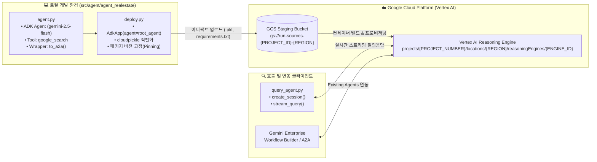

# 🏗️ Custom ADK & A2A 에이전트(`agent_realestate`) 제작 및 Vertex AI 배포 가이드

본 스킬 명세서는 **Google ADK (Agent Development Kit)**와 차세대 에이전트 간 상호운용 표준인 **A2A (Agent-to-Agent) 프로토콜**, 그리고 실시간 **Google Search** 도구를 결합하여 커스텀 검색·분석 에이전트(`agent_realestate`)를 구축하고, 이를 Google Cloud **Vertex AI Reasoning Engine (Agent Engine)**에 서버리스로 배포 및 검증하는 전 과정을 안내합니다.

---

## 📌 목차
1. [아키텍처 및 프로젝트 구조](#1-아키텍처-및-프로젝트-구조)
2. [사전 준비 및 GCP 인증 검증 (Step 0 Pre-flight)](#2-사전-준비-및-gcp-인증-검증-step-0-pre-flight)
3. [커스텀 에이전트(`agent_realestate`) 구현 가이드](#3-커스텀-에이전트agent_realestate-구현-가이드)
4. [Vertex AI Reasoning Engine 배포 및 업데이트 절차](#4-vertex-ai-reasoning-engine-배포-및-업데이트-절차)
5. [원격 스트리밍 질의 검증 및 로컬 A2A 서버 구동](#5-원격-스트리밍-질의-검증-및-로컬-a2a-서버-구동)
6. [보안 가드레일 및 실전 트러블슈팅 매트릭스](#6-보안-가드레일-및-실전-트러블슈팅-매트릭스)

---

## 1. 아키텍처 및 프로젝트 구조

### 1.1 엔드투엔드 동작 아키텍처



### 1.2 소스 디렉토리 레이아웃 (`src/agent/agent_realestate/`)

```text
src/agent/agent_realestate/
├── agent.py              # Google ADK 에이전트 코어 정의 및 A2A(to_a2a) 앱 변환
├── deploy.py             # Vertex AI Reasoning Engine 패키징 및 원격 배포 스크립트
├── query_agent.py        # 배포된 원격 Reasoning Engine 세션 생성 및 실시간 스트리밍 질의 클라이언트
├── a2a_server.py         # 로컬 A2A 프로토콜 검증용 FastAPI/Uvicorn 서버 (/.well-known/agent-card.json)
├── requirements.txt      # ADK, A2A SDK, Vertex AI Agent Engines 의존성 패키지 목록
└── README.md             # 에이전트 구성 및 배포 매뉴얼
```

---

## 2. 사전 준비 및 GCP 인증 검증 (Step 0 Pre-flight)

배포 스크립트(`deploy.py`)나 질의 스크립트(`query_agent.py`)를 실행하기 전에 반드시 대상 GCP 프로젝트에 대한 CLI 인증 및 **Application Default Credentials (ADC)** 설정을 완료해야 합니다.

### 2.1 GCP 로그인 및 프로젝트 환경 설정
```bash
# 1. gcloud CLI 사용자 인증
gcloud auth login

# 2. Vertex AI Python SDK 구동에 필수적인 ADC(Application Default Credentials) 인증
gcloud auth application-default login

# 3. 대상 프로젝트 설정 (실제 배포할 GCP 프로젝트 ID로 변경)
export PROJECT_ID="your-gcp-project-id"
export REGION="us-central1"

gcloud config set project "${PROJECT_ID}"
gcloud auth application-default set-quota-project "${PROJECT_ID}"
```

### 2.2 필수 API 활성화 및 GCS 스테이징 버킷 생성
Vertex AI Reasoning Engine은 에이전트 객체(`reasoning_engine.pkl`)와 의존성 목록(`requirements.txt`)을 업로드할 **Cloud Storage 스테이징 버킷**이 필요합니다.

```bash
# 1. Vertex AI 및 Cloud Storage API 활성화
gcloud services enable aiplatform.googleapis.com storage.googleapis.com --project="${PROJECT_ID}"

# 2. 스테이징 버킷 확인 및 생성 (없을 경우 생성)
export GCS_STAGING_BUCKET="gs://run-sources-${PROJECT_ID}-${REGION}"
gcloud storage buckets describe "${GCS_STAGING_BUCKET}" --project="${PROJECT_ID}" || \
  gcloud storage buckets create "${GCS_STAGING_BUCKET}" --project="${PROJECT_ID}" --location="${REGION}"
```

---

## 3. 커스텀 에이전트(`agent_realestate`) 구현 가이드

### 3.1 `agent.py` — ADK 에이전트 정의 및 A2A 래핑
[`src/agent/agent_realestate/agent.py`](file:///Users/hangsik/Documents/my_project/gemini_enterprise_lab/src/agent/agent_realestate/agent.py)에서는 `gemini-2.5-flash` 모델과 `google_search` 내장 도구를 결합하고, `to_a2a()` 유틸리티로 A2A 호환 인터페이스를 노출합니다.

```python
from google.adk.agents.llm_agent import Agent
from google.adk.tools import google_search
from google.adk.a2a.utils.agent_to_a2a import to_a2a

root_agent = Agent(
    model='gemini-2.5-flash',
    name='search_agent',
    description='A search agent that gathers detailed information on real estate and market trends using Google Search.',
    instruction=(
        "You are a helpful Real Estate & Market Search Assistant. "
        "Use the google_search tool to look up detailed, up-to-date information on the user's query, "
        "analyze the search results, and explain them clearly and systematically."
    ),
    tools=[google_search]
)

# ADK 에이전트를 A2A(Agent-to-Agent) 호환 앱으로 래핑
a2a_app = to_a2a(root_agent)
```

### 3.2 `deploy.py` — 패키지 버전 고정(Version Pinning) 및 배포 설계
[`src/agent/agent_realestate/deploy.py`](file:///Users/hangsik/Documents/my_project/gemini_enterprise_lab/src/agent/agent_realestate/deploy.py) 작성 시 가장 중요한 아키텍처 원칙은 **로컬 직렬화 환경과 클라우드 컨테이너 역직렬화 환경의 패키지 버전을 일치시키는 것**입니다.

> [!IMPORTANT]
> **`cloudpickle` 버전 호환성 필수 규칙**:
> `ReasoningEngine.create()`는 로컬 Python 환경의 `AdkApp(agent=root_agent)` 인스턴스를 `cloudpickle`로 직렬화하여 업로드합니다. 만약 `requirements`에 버전을 지정하지 않으면 클라우드 컨테이너가 최신 버전을 설치하면서 Pydantic 내부 속성(`_resolved_model` 등) 구조가 달라져 런타임에 `TypeError: 'NoneType' object is not subscriptable` 오류가 발생할 수 있습니다. 반드시 로컬에 설치된 `google-adk`, `pydantic`, `google-cloud-aiplatform` 버전을 확인(`pip show`)하여 고정하십시오.

```python
import os
import vertexai
from vertexai.agent_engines import AdkApp
from vertexai.preview import reasoning_engines
from agent import root_agent

def main():
    # .env에 빈 문자열("")이 정의되어 있어도 안전하게 기본값으로 폴백하도록 `or` 연산자 사용
    PROJECT_ID = os.getenv("PROJECT_ID") or "your-gcp-project-id"
    REGION = os.getenv("REGION") or "us-central1"
    STAGING_BUCKET = os.getenv("GCS_STAGING_BUCKET") or f"gs://run-sources-{PROJECT_ID}-{REGION}"

    vertexai.init(project=PROJECT_ID, location=REGION, staging_bucket=STAGING_BUCKET)
    app = AdkApp(agent=root_agent)

    remote_engine = reasoning_engines.ReasoningEngine.create(
        app,
        requirements=[
            "google-adk[a2a]==2.6.3",
            "pydantic==2.13.4",
            "a2a-sdk",
            "sse-starlette",
            "google-cloud-aiplatform[adk,agent_engines]==1.163.0",
        ],
        display_name="Search Agent Engine (A2A)",
        description="Google ADK, Gemini 2.5 Flash, Google Search 도구가 통합된 A2A 호환 검색 에이전트 엔진입니다."
    )
    print(f"Resource Name: {remote_engine.resource_name}")
    return remote_engine
```

---

## 4. Vertex AI Reasoning Engine 배포 및 업데이트 절차

### 4.1 신규 배포 실행 (`deploy.py`)
```bash
cd src/agent/agent_realestate

CLOUDSDK_AUTH_ACCESS_TOKEN="$(gcloud auth application-default print-access-token)" \
PROJECT_ID="your-gcp-project-id" \
REGION="us-central1" \
GCS_STAGING_BUCKET="gs://run-sources-your-gcp-project-id-us-central1" \
python3 deploy.py
```
- 배포에는 약 **3~5분**이 소요되며, 완료 시 다음과 같은 형식의 고유 리소스 이름이 반환됩니다:
  ```text
  projects/{PROJECT_NUMBER}/locations/us-central1/reasoningEngines/{REASONING_ENGINE_ID}
  ```

### 4.2 기존 Reasoning Engine 인플레이스 업데이트 (In-place Update)
이미 배포된 리소스 ID를 유지한 채 에이전트 로직이나 `requirements`만 수정하려면 `agent_engines.get().update()`를 사용합니다:
```python
from vertexai import agent_engines
from vertexai.agent_engines import AdkApp
from agent import root_agent

remote_app = agent_engines.get("projects/YOUR_PROJECT_NUMBER/locations/us-central1/reasoningEngines/YOUR_REASONING_ENGINE_ID")
remote_app.update(
    agent_engine=AdkApp(agent=root_agent),
    requirements=[
        "google-adk[a2a]==2.6.3",
        "pydantic==2.13.4",
        "a2a-sdk",
        "sse-starlette",
        "google-cloud-aiplatform[adk,agent_engines]==1.163.0",
    ]
)
```

---

## 5. 원격 스트리밍 질의 검증 및 로컬 A2A 서버 구동

### 5.1 원격 Reasoning Engine 스트리밍 질의 (`query_agent.py`)
배포 완료 후 반환된 리소스 경로를 환경 변수 `REASONING_ENGINE_RESOURCE_NAME`으로 전달하여 실시간 부동산 시장 동향 질의를 수행합니다:

```bash
cd src/agent/agent_realestate

PROJECT_ID="your-gcp-project-id" \
REGION="us-central1" \
REASONING_ENGINE_RESOURCE_NAME="projects/YOUR_PROJECT_NUMBER/locations/us-central1/reasoningEngines/YOUR_REASONING_ENGINE_ID" \
python3 query_agent.py
```

### 5.2 로컬 A2A 호환 서버 실행 (`a2a_server.py`)
클라우드 배포 전 로컬에서 A2A 프로토콜 명세 카드(`agent-card.json`)와 엔드포인트를 테스트할 수 있습니다:
```bash
cd src/agent/agent_realestate
python3 a2a_server.py
# 로컬 A2A Agent Card 확인: curl http://localhost:8000/.well-known/agent-card.json
```

---

## 6. 보안 가드레일 및 실전 트러블슈팅 매트릭스

### 6.1 보안 및 설정 관리 원칙 (Security Guardrails)
- **프로젝트 ID 및 리소스 식별자 하드코딩 금지**: 실제 운영/실습 GCP 프로젝트 ID, 프로젝트 번호(`PROJECT_NUMBER`), Reasoning Engine 고유 ID는 `.env` 파일(Git 추적 제외) 또는 런타임 환경 변수로 주입하며, 마크다운 문서(`README.md`, `SKILL.md`) 및 Git 커밋 코드에는 `your-gcp-project-id`, `YOUR_PROJECT_NUMBER`, `YOUR_REASONING_ENGINE_ID`와 같은 일반 플레이스홀더를 사용합니다.
- **`.env` 파일 커밋 절대 금지**: 자격 증명이나 내부 리소스 경로가 담긴 `.env` 파일은 반드시 `.gitignore`로 격리합니다.

### 6.2 트러블슈팅 매트릭스 (Troubleshooting)

| 증상 및 오류 메시지 | 발생 원인 | 해결 방법 |
| :--- | :--- | :--- |
| **`ValueError: Resource  is not a valid resource id.`** | 상위 `.env` 파일에 `REASONING_ENGINE_RESOURCE_NAME=""` 빈 문자열이 선언되어 `os.getenv("...", DEFAULT)`가 빈 문자열을 반환함 | `os.getenv("REASONING_ENGINE_RESOURCE_NAME") or DEFAULT_RESOURCE_NAME` 구문을 사용하여 빈 문자열일 때도 기본값으로 안전하게 폴백되도록 처리 |
| **`TypeError: 'NoneType' object is not subscriptable` (`canonical_model` / `_resolved_model`)** | 로컬에서 `AdkApp`을 `cloudpickle`로 직렬화할 때의 `google-adk`/`pydantic` 버전과 클라우드 컨테이너에 설치된 최신 버전이 불일치함 | 로컬 버전(`python3 -c "import google.adk, pydantic; print(google.adk.__version__, pydantic.__version__)"`)을 확인하여 `deploy.py`의 `requirements` 배열에 동일한 버전을 명시적으로 고정(`==`) 후 재배포 |
| **`[account] does not have permission to access projects instance`** | 현재 활성화된 `gcloud` 계정이나 ADC 자격 증명이 대상 프로젝트 권한이 없음 | 터미널에서 `gcloud auth login`, `gcloud auth application-default login`, `gcloud config set project <PROJECT_ID>`를 실행하여 권한 있는 계정으로 전환 |
| **`NotFound: 404 gs://run-sources-... does not exist`** | Vertex AI 스테이징 버킷이 대상 프로젝트에 아직 생성되지 않음 | `gcloud storage buckets create gs://run-sources-${PROJECT_ID}-${REGION} --project=${PROJECT_ID} --location=${REGION}` 명령으로 스테이징 버킷 먼저 생성 |
