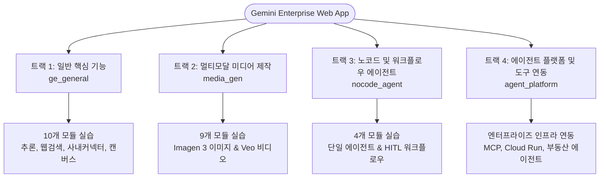
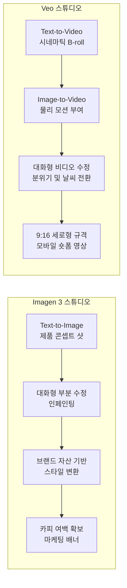
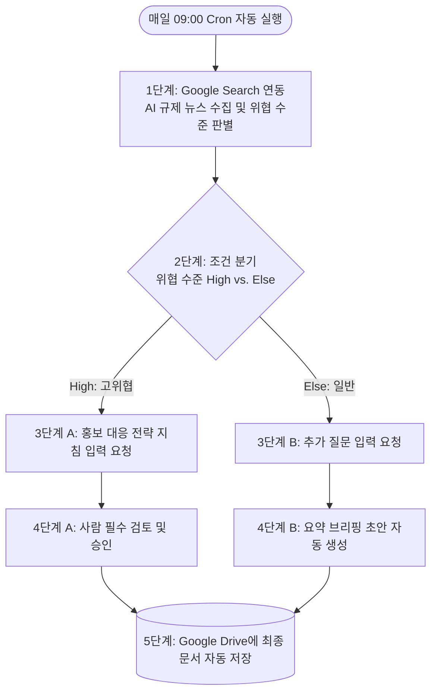

# 🧪 Gemini Enterprise 핸즈온 랩 포털 (`ge_lab`)

**Gemini Enterprise 핸즈온 랩** 마스터 포털에 오신 것을 환영합니다.  
본 포털은 엔터프라이즈 실무자, 아키텍트, 마케터 및 개발자가 복잡한 로컬 개발 환경 구성이나 외부 코드 연동 없이도 **Gemini Enterprise 공식 웹 어플리케이션** 내에서 핵심 기능 전반을 직접 체험하고 검증할 수 있도록 구성된 종합 실습 가이드 모음입니다.

---

## 📌 목차

1. [핸즈온 랩 포털 개요](#1-핸즈온-랩-포털-개요)
2. [디렉토리 구조](#2-디렉토리-구조)
3. [전체 실습 커리큘럼 매트릭스](#3-전체-실습-커리큘럼-매트릭스)
4. [트랙별 상세 실습 가이드](#4-트랙별-상세-실습-가이드)
   - [트랙 1: 엔터프라이즈 일반 핵심 기능 (`ge_general`)](#트랙-1-엔터프라이즈-일반-핵심-기능-ge_general)
   - [트랙 2: 멀티모달 미디어 생성 및 편집 (`media_gen`)](#트랙-2-멀티모달-미디어-생성-및-편집-media_gen)
   - [트랙 3: 노코드 및 워크플로우 에이전트 스튜디오 (`nocode_agent`)](#트랙-3-노코드-및-워크플로우-에이전트-스튜디오-nocode_agent)
   - [트랙 4: 에이전트 플랫폼 및 인프라 연동 확장 (`agent_platform`)](#트랙-4-에이전트-플랫폼-및-인프라-연동-확장-agent_platform)
5. [사전 준비 사항 및 환경 점검](#5-사전-준비-사항-및-환경-점검)
6. [AI 에이전트 스킬(`.agents/skills/`)과의 상호 매핑](#6-ai-에이전트-스킬agentsskills과의-상호-매핑)
7. [엔터프라이즈 보안 및 데이터 거버넌스 원칙](#7-엔터프라이즈-보안-및-데이터-거버넌스-원칙)

---

## 1. 핸즈온 랩 포털 개요

**Gemini Enterprise Lab** 커리큘럼은 실제 기업 비즈니스 현장에서 직면하는 핵심 과제들을 해결할 수 있도록 4개의 특화 트랙으로 설계되었습니다.  
모든 트랙은 생생한 업무 시나리오, 실무 검증된 프롬프트 템플릿, 직관적인 UI 스크린샷 가이드 및 자가 검증 체크리스트를 완비하고 있습니다.



---

## 2. 디렉토리 구조

```text
ge_lab/
├── README.md                            # 핸즈온 랩 마스터 포털 가이드 (본 문서)
├── ge_general/                          # 트랙 1: 엔터프라이즈 일반 핵심 기능
│   ├── ge_general.md                    # 10대 핵심 기능 종합 실습 가이드
│   └── resources/
│       ├── files/                       # 테스트용 샘플 문서 및 데이터
│       └── img/                         # 단계별 UI 스크린샷 (Prep-1, lab1-1 ~ lab10-4)
├── media_gen/                           # 트랙 2: 멀티모달 미디어 생성 및 편집 (Imagen 3 & Veo)
│   ├── ge_media.md                      # 9대 이미지 및 비디오 생성/편집 실습 매뉴얼
│   └── resources/
│       ├── files/                       # 참조용 원본 스케치 및 브랜드 자산
│       └── img/                         # 단계별 생성 산출물 및 UI 화면 (lab1-1 ~ lab9-1)
├── nocode_agent/                        # 트랙 3: 노코드 및 워크플로우 에이전트 스튜디오
│   ├── nocode_agent.md                  # 4대 단일 에이전트 및 워크플로우 에이전트 매뉴얼
│   └── resources/
│       └── img/                         # 비주얼 빌더 단계별 스크린샷 (lab1-1 ~ lab4-11)
└── agent_platform/                      # 트랙 4: 에이전트 플랫폼 및 고급 인프라 연동 확장
```

---

## 3. 전체 실습 커리큘럼 매트릭스

| 실습 트랙 | 모듈 / 랩 번호 | 기능 영역 | 파운데이션 모델 및 연동 도구 | 핵심 실습 목표 및 검증 포인트 |
| :--- | :--- | :--- | :--- | :--- |
| **트랙 1**<br>`ge_general` | [**Lab 1**](file:///Users/hangsik/Documents/my_project/gemini_enterprise_lab/ge_lab/ge_general/ge_general.md#lab-1-일반-질문-처리-direct-qa--reasoning) | 일반 질문 처리 (Direct Q&A) | Gemini Core LLM | 순수 LLM 다단계 논리 추론, SaaS 이탈률 원인 분석 및 외교적 영문 이메일 재작성 |
| | [**Lab 2**](file:///Users/hangsik/Documents/my_project/gemini_enterprise_lab/ge_lab/ge_general/ge_general.md#lab-2-google-검색-연동-web-grounding--citations) | Google 검색 연동 (Web Grounding) | Google Search 토글 | 최신 공개 데이터 실시간 검색 및 답변 내 출처(Citation) URL 앵커링 검증 |
| | [**Lab 3**](file:///Users/hangsik/Documents/my_project/gemini_enterprise_lab/ge_lab/ge_general/ge_general.md#lab-3-기업-커넥터-연동-enterprise-connectors) | 기업 커넥터 연동 (Connectors) | Google Drive / Gmail / Jira | 사내 협업 저장소를 사용자 권한(ACL) 및 보안 경계를 준수하여 검색 |
| | [**Lab 4**](file:///Users/hangsik/Documents/my_project/gemini_enterprise_lab/ge_lab/ge_general/ge_general.md#lab-4-등록된-스킬-사용-skill-invocation--execution) | 등록된 스킬 사용 (Skill Invocation) | 사전 등록된 기업 스킬 | 사전 등록된 전문 업무 스킬(`load_skill`) 선택 및 자동 실행 |
| | [**Lab 5**](file:///Users/hangsik/Documents/my_project/gemini_enterprise_lab/ge_lab/ge_general/ge_general.md#lab-5-전문-서브-에이전트-위임-specialist-agents-delegation) | 전문 서브 에이전트 위임 (Delegation) | 특화 챗 에이전트 | Canvas Agent, Imagen Agent 등으로의 지능형 제어권 위임(`transfer_to_agent`) |
| | [**Lab 6**](file:///Users/hangsik/Documents/my_project/gemini_enterprise_lab/ge_lab/ge_general/ge_general.md#lab-6-mcp-서버-연동-model-context-protocol) | MCP 서버 연동 (MCP Integration) | Model Context Protocol | 표준 프로토콜 기반 외부 데이터베이스 및 시스템 텔레메트리 실시간 질의 |
| | [**Lab 7**](file:///Users/hangsik/Documents/my_project/gemini_enterprise_lab/ge_lab/ge_general/ge_general.md#lab-7-커스텀-스킬-제작-및-배포-custom-skill-authoring) | 커스텀 스킬 제작 (Skill Authoring) | 커스텀 스킬 스튜디오 | 신규 `SKILL.md` 작성 및 디렉토리 구조 검증, 에이전트 호출 확인 |
| | [**Lab 8**](file:///Users/hangsik/Documents/my_project/gemini_enterprise_lab/ge_lab/ge_general/ge_general.md#lab-8-프로젝트-워크스페이스-활용-projects-space) | 프로젝트 워크스페이스 (Projects) | Projects 격리 공간 | 프로젝트별 지식 문서 격리 바인딩 및 세션 간 영구 컨텍스트 유지 |
| | [**Lab 9**](file:///Users/hangsik/Documents/my_project/gemini_enterprise_lab/ge_lab/ge_general/ge_general.md#lab-9-스마트-수신함-활용-inbox--action-automation) | 스마트 수신함 (Smart Inbox) | Inbox 자동 분류 및 초안 | 미확인 업무/이메일 우선순위 능동 분류 및 캘린더 등록/답장 초안 자동 생성 |
| | [**Lab 10**](file:///Users/hangsik/Documents/my_project/gemini_enterprise_lab/ge_lab/ge_general/ge_general.md#lab-10-인터랙티브-캔버스-및-슬라이드-생성-interactive-canvas--presentation-slides) | 인터랙티브 캔버스 (Interactive Canvas) | Canvas / Google Slides | 대화창 독립 공간에서 문서 실시간 편집 및 Google Slides/PPTX 즉시 내보내기 |
| **트랙 2**<br>`media_gen` | [**Lab 1**](file:///Users/hangsik/Documents/my_project/gemini_enterprise_lab/ge_lab/media_gen/ge_media.md#lab-1-비즈니스-콘셉트-아트-및-고해상도-제품-이미지-생성) | 제품 콘셉트 아트 샷 생성 | Imagen 3 (Text-to-Image) | 스튜디오 조명 연출 및 매크로 피사계 심도를 반영한 상용 제품 4K 샷 생성 |
| | [**Lab 2**](file:///Users/hangsik/Documents/my_project/gemini_enterprise_lab/ge_lab/media_gen/ge_media.md#lab-2-멀티턴-대화를-통한-부분-수정-in-painting-및-요소-교체) | 대화형 부분 수정 (In-painting) | 대화형 인페인팅 | 대화 맥락을 유지한 특정 디자인 요소 교체 및 부분 수정 |
| | [**Lab 3**](file:///Users/hangsik/Documents/my_project/gemini_enterprise_lab/ge_lab/media_gen/ge_media.md#lab-3-사내-자산-기반-image-to-image-스타일-변환) | Image-to-Image 스타일 변환 | 멀티모달 이미지 업로드 | 사내 스케치나 자산의 고유 형태를 보존하면서 시각 스타일 변환 |
| | [**Lab 4**](file:///Users/hangsik/Documents/my_project/gemini_enterprise_lab/ge_lab/media_gen/ge_media.md#lab-4-비즈니스-인포그래픽-및-다이어그램-시각화) | 비즈니스 인포그래픽 시각화 | 레이아웃 & 다이어그램 합성 | 디지털 마케팅 퍼널 및 클라우드 시스템 아키텍처 다이어그램 직관적 표현 |
| | [**Lab 5**](file:///Users/hangsik/Documents/my_project/gemini_enterprise_lab/ge_lab/media_gen/ge_media.md#lab-5-카피라이트-공간negative-space을-고려한-마케팅-배너-제작) | 여백을 고려한 마케팅 배너 제작 | 구도 및 여백 통제 | 광고 문구(Typography) 오버레이를 위해 의도된 여백을 배치한 광고 배너 |
| | [**Lab 6**](file:///Users/hangsik/Documents/my_project/gemini_enterprise_lab/ge_lab/media_gen/ge_media.md#lab-6-텍스트-프롬프트를-통한-시네마틱-b-roll-클립-생성) | 시네마틱 B-roll 비디오 생성 | Veo (Text-to-Video) | 카메라 동선(Dolly, Tilt)과 볼류메트릭 조명 지시를 반영한 고화질 영상 제작 |
| | [**Lab 7**](file:///Users/hangsik/Documents/my_project/gemini_enterprise_lab/ge_lab/media_gen/ge_media.md#lab-7-정적-이미지-기반-모션-비디오-생성-image-to-video) | 정적 이미지 기반 모션 비디오 | Veo (Image-to-Video) | 정적 제품 렌더링에 자연스러운 물리 역학과 카메라 줌인 모션 부여 |
| | [**Lab 8**](file:///Users/hangsik/Documents/my_project/gemini_enterprise_lab/ge_lab/media_gen/ge_media.md#lab-8-멀티턴-대화형-비디오-분위기-및-환경-전환-video-editing) | 대화형 비디오 분위기 및 날씨 전환 | Video-to-Video 편집 | 기생성 비디오의 시간대(골든 아워), 기상 조건(비), 컬러 톤 대화형 변경 |
| | [**Lab 9**](file:///Users/hangsik/Documents/my_project/gemini_enterprise_lab/ge_lab/media_gen/ge_media.md#lab-9-소셜-미디어-플랫폼-맞춤형-숏폼916-영상-제작) | 9:16 모바일 세로형 숏폼 영상 | 9:16 세로형 영상 합성 | 모바일 소셜 채널용 360도 턴테이블 회전 제품 티저 영상 합성 |
| **트랙 3**<br>`nocode_agent` | [**Lab 1**](file:///Users/hangsik/Documents/my_project/gemini_enterprise_lab/ge_lab/nocode_agent/nocode_agent.md#lab-1-대화형-프롬프트-기반-에이전트-자동-생성) | 프롬프트 기반 에이전트 생성 | Agent Designer 대화 모드 | 자연어 대화만으로 전문 역할(시니어 테크 채용 평가관) 에이전트 즉각 구축 |
| | [**Lab 2**](file:///Users/hangsik/Documents/my_project/gemini_enterprise_lab/ge_lab/nocode_agent/nocode_agent.md#lab-2-빌더builder-기반-맞춤형-에이전트-수동-구성--검색-도구-연동) | 빌더 맞춤 구성 & 검색 도구 연동 | Builder 모드 & Google Search | 지식 베이스(평가 기준 문서 PDF) 바인딩 및 Google Search 도구 연결 |
| | [**Lab 3**](file:///Users/hangsik/Documents/my_project/gemini_enterprise_lab/ge_lab/nocode_agent/nocode_agent.md#lab-3-에이전트-조직-공유-및-자동-실행-스케줄링) | 조직 공유 및 자동 실행 스케줄링 | 조직 RBAC 공유 & Cron 트리거 | 팀/부서 단위 권한 부여 및 주기적(매일 아침) 자동 실행 스케줄 설정 |
| | [**Lab 4**](file:///Users/hangsik/Documents/my_project/gemini_enterprise_lab/ge_lab/nocode_agent/nocode_agent.md#lab-4-프롬프트-기반-워크플로우-에이전트workflow-agent-자동-생성-및-최종-브리핑-구글드라이브에-저장) | 프롬프트 기반 워크플로우 에이전트 | 다단계 워크플로우 스튜디오 | 매일 09시 실행, Google Search 뉴스 수집, 위협 수준 분기, 사람 승인, Drive 저장 |

---

## 4. 트랙별 상세 실습 가이드

### 트랙 1: 엔터프라이즈 일반 핵심 기능 (`ge_general`)

- **실습 매뉴얼**: [`ge_lab/ge_general/ge_general.md`](file:///Users/hangsik/Documents/my_project/gemini_enterprise_lab/ge_lab/ge_general/ge_general.md)
- **대상 독자**: 전사 비즈니스 실무자, 프로젝트 매니저, 데이터 분석가 및 솔루션 엔지니어.
- **핵심 가치**:
  Gemini Enterprise가 어떻게 최첨단 생성 AI 파운데이션 모델을 기업 고유의 보안 및 거버넌스 체계와 결합하는지 검증합니다. 참가자는 순수 LLM 추론을 시작으로 실시간 Google Search Web Grounding, Google Drive/Gmail/Jira 권한 기반 커넥터, Model Context Protocol (MCP) 연동, 그리고 팀 단위 협업을 위한 Projects 워크스페이스와 Interactive Canvas를 망라하여 경험합니다.

#### 주요 검증 포인트:
- **인터랙티브 캔버스(Interactive Canvas)**: 대화창과 독립된 작업 영역에서 실시간 문서를 작성하고 Google Slides 프레젠테이션으로 즉시 내보내기.
- **스마트 수신함(Smart Inbox)**: 미확인 이메일과 메신저 내용을 능동적으로 분류하여 캘린더 일정 및 답장 초안 자동 생성.
- **엔터프라이즈 데이터 그라운딩**: 권한이 부여된 문서만 검색하고 정확한 출처(Citation)를 명시.

---

### 트랙 2: 멀티모달 미디어 생성 및 편집 (`media_gen`)

- **실습 매뉴얼**: [`ge_lab/media_gen/ge_media.md`](file:///Users/hangsik/Documents/my_project/gemini_enterprise_lab/ge_lab/media_gen/ge_media.md)
- **대상 독자**: 브랜드 마케터, 비주얼 디자이너, 크리에이티브 디렉터 및 콘텐츠 기획자.
- **핵심 가치**:
  Google의 최고 사양 미디어 파운데이션 모델인 **Imagen 3**와 **Veo**를 코딩 없이 웹 챗 인터페이스에서 즉시 활용할 수 있습니다. 상용 제품 샷, 마케팅 배너, 비즈니스 인포그래픽 제작부터 시네마틱 B-roll 영상 및 9:16 모바일 세로형 숏폼 영상 제작까지 전 과정을 다룹니다.



#### 전문 시각 프롬프트 키워드:
- **종횡비(Aspect Ratio)**: `16:9`, `9:16`, `1:1`, `4:3` 명시.
- **카메라 렌즈 및 동선**: `f/1.8 조리개`, `85mm 인물 렌즈`, `슬로우 돌리인(slow dolly-in)`, `360도 턴테이블 회전`.
- **조명 및 렌더링**: `볼류메트릭 소프트박스 스튜디오 조명`, `골든 아워 역광`, `사이버펑크 네온 앰비언트`.

---

### 트랙 3: 노코드 및 워크플로우 에이전트 스튜디오 (`nocode_agent`)

- **실습 매뉴얼**: [`ge_lab/nocode_agent/nocode_agent.md`](file:///Users/hangsik/Documents/my_project/gemini_enterprise_lab/ge_lab/nocode_agent/nocode_agent.md)
- **대상 독자**: 비즈니스 운영 매니저, 인사/채용 담당자, 리스크 분석가 및 업무 자동화 리드.
- **핵심 가치**:
  프로그래밍 지식이 없는 현업 실무자가 Gemini Enterprise의 **Agent Designer**를 통해 사내 전용 AI 팀원을 제작하고 배포하는 방법을 습득합니다. 대화를 통한 단일 에이전트 생성, 평가 기준 문서 바인딩 및 Google Search 연동, 조직 공유 및 스케줄링뿐만 아니라, 자연어 프롬프트 단 하나로 조건 분기, 사람 필수 승인(HITL), Google Drive 저장이 통합된 워크플로우 에이전트를 완성합니다.



---

### 트랙 4: 에이전트 플랫폼 및 인프라 연동 확장 (`agent_platform`)

- **디렉토리**: [`ge_lab/agent_platform/`](file:///Users/hangsik/Documents/my_project/gemini_enterprise_lab/ge_lab/agent_platform)
- **연계 리소스**:
  - Cloud Run Streamable HTTP MCP 서버: [`src/mcp/mcp_realestate/deploy.sh`](file:///Users/hangsik/Documents/my_project/gemini_enterprise_lab/src/mcp/mcp_realestate/deploy.sh)
  - 에이전트 등록 메타데이터: [`src/mcp/mcp_realestate/mcp_config.json`](file:///Users/hangsik/Documents/my_project/gemini_enterprise_lab/src/mcp/mcp_realestate/mcp_config.json)
  - MCP 배포 스킬: [`.agents/skills/build-mcp-server/SKILL.md`](file:///Users/hangsik/Documents/my_project/gemini_enterprise_lab/.agents/skills/build-mcp-server/SKILL.md)
- **대상 독자**: 클라우드 아키텍트, 백엔드 엔지니어 및 엔터프라이즈 플랫폼 리드.
- **진행 내용**:
  - Model Context Protocol (MCP) 표준 서버를 컨테이너화하여 Google Cloud Run에 배포.
  - 사내 레거시 시스템, 데이터 웨어하우스(BigQuery, Cloud SQL) 및 엔터프라이즈 API를 Gemini Enterprise 에이전트에 도구(Tool)로 안전하게 연결.

---

## 5. 사전 준비 사항 및 환경 점검

실습을 시작하기 전 아래 점검 항목을 확인합니다:

1. **엔터프라이즈 계정 및 로그인**:
   - Gemini Enterprise 활성화 라이선스가 부여된 Google Workspace 또는 Cloud Identity 계정 로그인.
2. **도구 및 기능 활성화 상태 점검**:
   - **Google Search 검색 토글**: 챗 프롬프트 입력창 하단에 검색 스위치가 정상 표시되는지 확인.
   - **기업 커넥터(Enterprise Connectors)**: Google Drive, Gmail, Calendar 권한 연결 확인.
   - **Agent Designer**: 좌측 네비게이션 메뉴에 에이전트 스튜디오 접근 권한 확인.
   - **Projects 공간**: 독립 프로젝트 생성 및 파일 업로드 권한 확인.
3. **효과적인 실습 팁**:
   - **멀티턴 정제 (Iterative Refinement)**: 첫 번째 출력 후 연속 대화를 통해 구체적인 세부 사항을 다듬어 나갑니다.
   - **구조화된 프롬프트 양식 활용**: 글머리 기호, XML 태그(`<context>`, `<guideline>`), 명확한 출력 양식을 지정하면 응답 품질이 극대화됩니다.

---

## 6. AI 에이전트 스킬(`.agents/skills/`)과의 상호 매핑

`ge_lab/`의 튜토리얼 매뉴얼은 [`.agents/skills/`](file:///Users/hangsik/Documents/my_project/gemini_enterprise_lab/.agents/skills)에 정의된 자율형 에이전트 스킬과 1:1로 긴밀하게 결합되어 있습니다. 사람이 `ge_lab/` 매뉴얼을 보고 실습을 진행하는 동안, AI 에이전트는 `.agents/skills/`의 스펙 문서를 읽고 사용자를 도울 수 있습니다:

```text
ge_lab/ (사용자를 위한 튜토리얼 매뉴얼)     <--->   .agents/skills/ (AI 에이전트용 실행 명세서)
├── ge_general/ge_general.md            <--->   ├── ge-general/SKILL.md
├── media_gen/ge_media.md               <--->   ├── media-gen/SKILL.md
├── nocode_agent/nocode_agent.md        <--->   ├── nocode-agent/SKILL.md
└── agent_platform/                     <--->   └── build-mcp-server/SKILL.md
```

---

## 7. 엔터프라이즈 보안 및 데이터 거버넌스 원칙

> [!IMPORTANT]
> **엔터프라이즈 데이터 프라이버시 및 격리 원칙**  
> 본 실습 과정에서 처리되는 모든 데이터는 Google의 엄격한 엔터프라이즈 보안 및 컴플라이언스 경계 내에서 보호됩니다:
> 1. **모델 재학습 절대 금지**: 사용자가 입력한 프롬프트, 업로드한 사내 문서, 생성된 이미지/비디오 및 에이전트 지식 파일은 Google 기본 파운데이션 모델 학습에 일체 사용되지 않습니다.
> 2. **사용자 접근 권한(ACL) 준수**: 사내 저장소 검색 시 로그인한 사용자가 실제로 접근할 수 있는 권한 범위 내의 문서만 그라운딩 소스로 반환됩니다.
> 3. **저장소 비밀정보 보호 원칙**: [`GEMINI.md`](file:///Users/hangsik/Documents/my_project/gemini_enterprise_lab/GEMINI.md)에 따라 API 키, 토큰, `.env` 파일은 절대로 버전 관리에 추가하지 않습니다.
