# 🚀 Gemini Enterprise Hands-on Workshop 가이드

**Gemini Enterprise 핸즈온 워크숍**에 오신 것을 환영합니다! 본 가이드는 **Google Gemini Enterprise**의 기업용 AI 기능과 에이전트 구축 프로세스를 직접 체험하고 쉽게 이해할 수 있도록 구성되었습니다. 본 가이드의 각각의 lab 내용은 독립적으로 실행됩니다. 관심있는 분야부터 실행해도 됩니다. 

---

## 💡 Gemini Enterprise란 무엇인가요?

**Gemini Enterprise**는 기업의 생산성 향상, 내부 데이터 결합(Grounding), 그리고 지능형 업무 자동화를 위해 설계된 구글 클라우드의 차세대 기업용 AI 플랫폼입니다. 일반 소비자용 AI 서비스와 달리 다음과 같은 차별화된 핵심 가치를 제공합니다:

1. **🔒 강력한 보안 및 프라이버시 (Enterprise Security)**
   - 입력한 데이터와 프롬프트는 모델 학습에 사용되지 않으며, 전용 환경에서 완전히 격리됩니다.
   - **Model Armor**를 통해 PII(개인식별정보) 및 민감 정보의 유출을 실시간으로 감시하고 마스킹(비식별화) 처리합니다.
2. **🔌 기업 데이터 및 도구 연결 (Enterprise Connectors)**
   - Google Workspace(Drive, Docs, Gmail)뿐만 아니라 Jira, Confluence 등 외부 협업 툴 및 엔터프라이즈 시스템 데이터와 직접 연동됩니다.
3. **🔍 실시간 검색 및 심층 분석 (Grounding & Deep Research)**
   - 최신 구글 웹 검색을 실시간 데이터 소스로 활용하여 복잡한 보고서 작성 및 수백 개의 소스를 검증하는 심층 리서치를 수행합니다.
4. **🤖 로우코드 에이전트 스튜디오 (Agent Designer)**
   - 코딩 없이 프롬프트와 데이터 설정만으로 단일/다중 에이전트(Multi-Agent) 시스템을 직접 제작하고 스케줄링할 수 있습니다.
5. **🎨 멀티모달 콘텐츠 및 캔버스 (Canvas & Media Generation)**
<span style="color: #1a73e8; font-weight: bold;">👉 - 텍스트, 엑셀/데이터 분석, 프레젠테이션 슬라이드, 최신 Imagen 3 기반 이미지 생성/편집 및 Veo 기반 고품질 동영상을 즉시 생성합니다.</span>

---

## 📌 워크숍 목차 및 개요

| 모듈 | 핵심 주제 | 실습 주요 내용 |
| :--- | :--- | :--- |
| **01. 기본 기능 & 웹 검색** | 옴니바, 웹 검색, 세션 공유 | 트렌드 검색 프롬프트 실행 및 대화 세션 링크 공유 |
| **02. 데이터 분석 (Excel)** | 설문 & 매출 데이터 추론 | 피벗 분석, 매출 추이 파악, t-test 통계 검정 |
| **03. 문서 요약 (PPT)** | 신규 기능 요약 및 GA/Preview 분류 | BigQuery PPT 보고서 요약 및 표 정형화 |
| **04. 미디어 생성 (생성 AI)** | Imagen 3 & Veo 동영상 | 포스터/아키텍처 이미지 편집, 고화질 홍보 영상 생성 |
| **05. 심층 리서치 (Deep Research)** | 수백 개 소스 종합 분석 | 로봇 사업 종합 분석 보고서 생성 및 Docs 내보내기 |
| **06. 캔버스 (Canvas & Slide)** | 실시간 문서 및 슬라이드 작업 | GCP 아키텍처 슬라이드 자동 생성 및 PPTX 다운로드 |
| **07. NotebookLM 활용** | 출처 기반 맞춤형 AI 어시스턴트 | 아이디어 기반 인포그래픽, 촌철살인 슬라이드 제작 |
| **08. Agent Designer** | 로우코드 업무 자동화 | 소셜 미디어 포스팅 에이전트 제작 및 자동 스케줄링 |
| **09. 멀티 에이전트 구축** | 메인-하위 에이전트 오케스트레이션 | GOOG전자 채용 서류 검토 3단계 자동화 에이전트 |
| **10. 데모 및 참고 자료** | 고급 연동 및 스페셜 데모 | Conversational Analytics (CA) 및 MCP 비디오 참고 |

---

## 1. 💬 기본 기능 및 스마트 웹 검색

<span style="color: #1a73e8; font-weight: bold;">👉 각자 부여받은 **Gemini Enterprise App**에 접속하여 옴니바(Omnibar) 입력, 구글 실시간 웹 검색 연동, 대화 공유 기능을 익힙니다.</span>

### 1.1 최신 AI 기술 분석 프롬프트
<span style="color: #1a73e8; font-weight: bold;">👉 대화창에 다음 프롬프트를 입력합니다:</span>

> 💬 **프롬프트:**
> ```text
> 나는 10년차 글로벌 테크 전략 전문가야.
> 최근 구글의 AI 기술(Google AI Technology) 및 최신 생성형 AI 트렌드를 검색해서 요약해줘. 특히 구글의 최신 AI 모델과 엔터프라이즈 솔루션의 핵심 차별점을 도출하고, 기업의 AI 도입 전략에 적용할 만한 핵심 인사이트를 제시해줘.
> ```

실행결과 이미지는 다음과 같습니다.

<p align="left">
  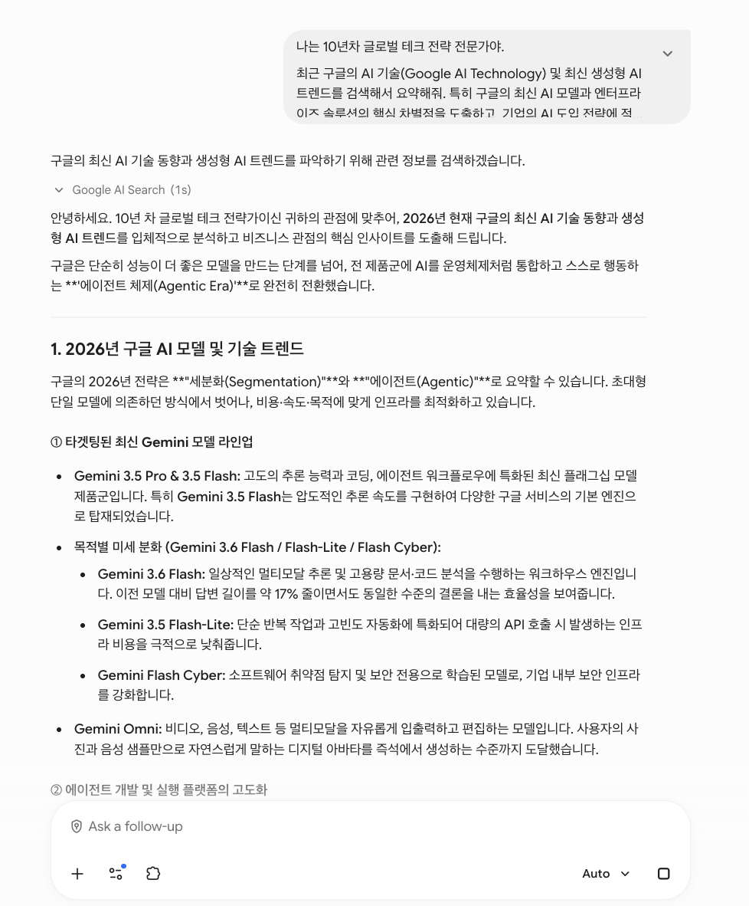
</p>

> 💡 **팁:** 답변 하단의 Source(출처)를 확인하고 추천되는 Follow-up Questions(추적 질문)를 클릭해보세요.

### 1.2 추가 실습 프롬프트 모음

<summary>👉아래 프롬프트도 다양하게 테스트 해보세요.  멀티모달 AI, RAG 아키텍처, AI 에이전트, 엔터프라이즈 AI ROI </summary>


```text
최근 각광받고 있는 '자율형 AI 에이전트(Autonomous AI Agents)' 및 멀티 에이전트 오케스트레이션(Multi-Agent Orchestration) 동향을 웹 검색으로 분석해 줘. 복잡한 업무를 자동화하기 위해 AI 에이전트 시스템을 도입할 때 고려해야 할 핵심 요구사항과 기대효과를 SWOT(강점, 약점, 기회, 위협) 매트릭스 형태로 정리해 줘.
```

```text
글로벌 엔터프라이즈 기업들의 '생성형 AI 도입 ROI(투자 대비 효과)' 및 AI 에이전트 전환 성공 사례를 검색해 줘. 이 정보를 바탕으로 C-Level 경영진을 설득하기 위한 '전사 Enterprise AI 플랫폼 도입 제안서'의 세일즈 피치덱(Pitch Deck) 슬라이드별 핵심 목차 구성을 짜줘.
```

---

### 1.3 협업: 대화 세션 공유하기
진행 중인 채팅 세션을 공유하여 동료와 함께 대화를 이어나갈 수 있습니다.

<span style="color: #1a73e8; font-weight: bold;">👉 1. 우측 상단의 **공유(Share)** 버튼을 클릭합니다.</span>

실행결과 이미지는 다음과 같습니다.

<p align="left">
  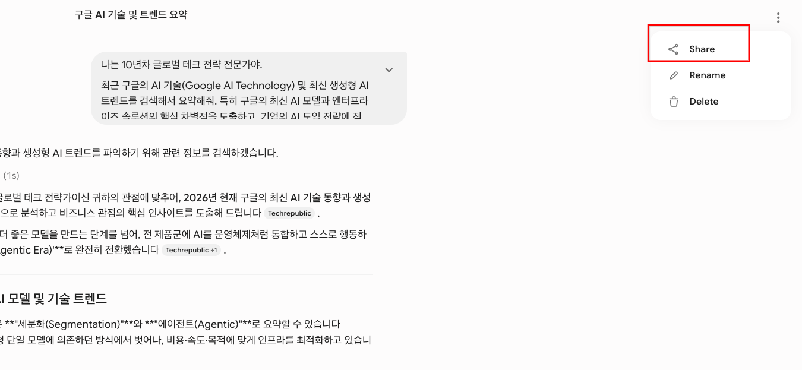
</p>

<span style="color: #1a73e8; font-weight: bold;">👉 아래와 같이 링크를 복사해서 동료에게 전달해서 접근이 가능한지 확인합니다.</span>
<p align="left">
  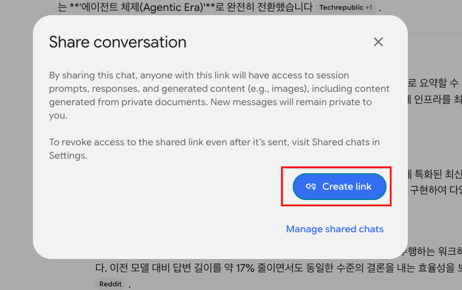
  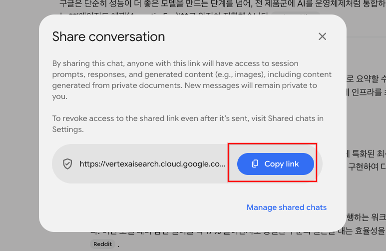

</p>

<span style="color: #1a73e8; font-weight: bold;">👉 2. 생성된 URL을 복사하여 동료에게 전달합니다.</span>

동료의 브라우저에서 복사해서 붙여놓은 후 실행결과 이미지는 다음과 같습니다.

<p align="left">
  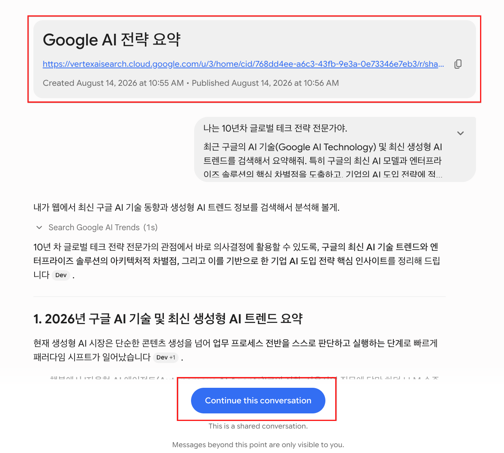
</p>

<span style="color: #1a73e8; font-weight: bold;">👉 3. 전달받은 URL로 접속하여 이전 대화 맥락이 잘 유지되는지 확인하고 추가 질문을 진행합니다.</span>

Continue the converstaion 버튼을 누르고 실행한 실행결과 이미지는 다음과 같습니다.

<p align="left">
  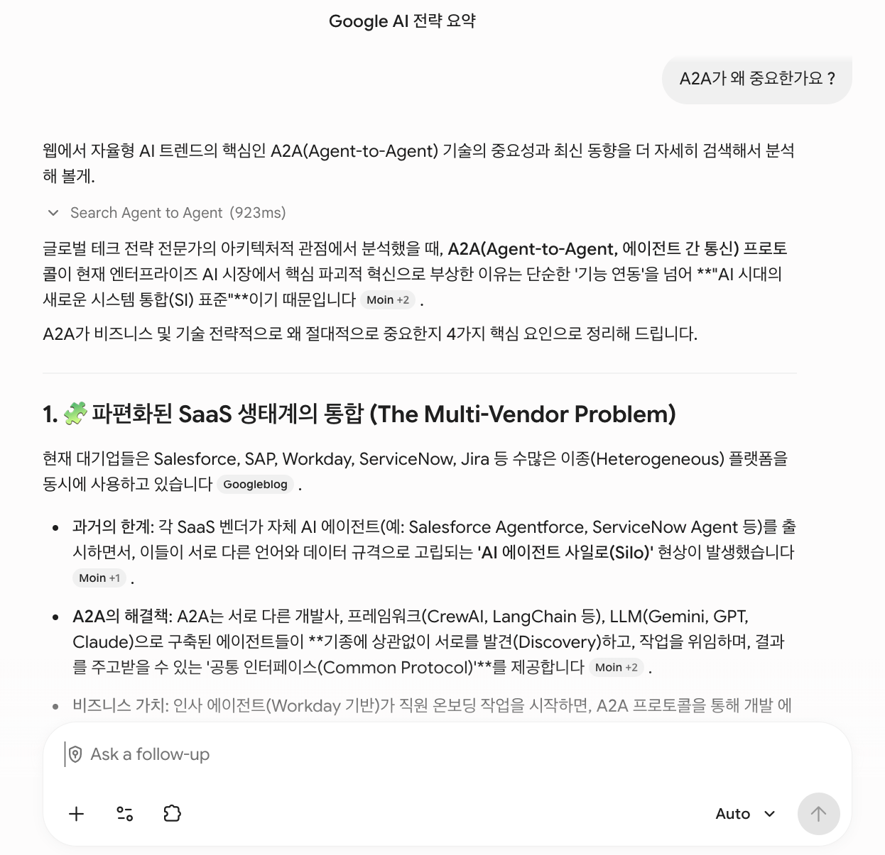
</p>

---

## 2. 📊 엑셀(Excel) 데이터 분석 및 추론

Gemini Enterprise는 코드 수식 작성 없이 대용량 엑셀 데이터를 업로드하는 것만으로 자동 데이터 해석, 패턴 도출, 통계 검정을 수행합니다.

### 2.1 설문조사(Survey) 데이터 분석
<span style="color: #1a73e8; font-weight: bold;">👉 `kospi_industry_index.xlsx` 파일을 대화창에 첨부합니다.</span>

실행결과 이미지는 다음과 같습니다.

<p align="left">
  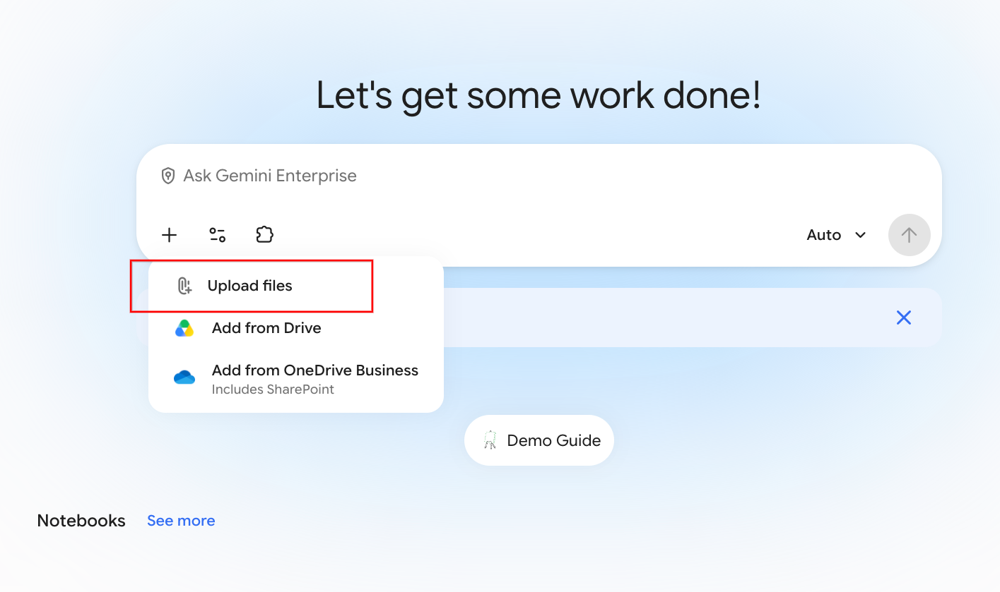
</p>


> 💬 **추천 프롬프트:**
> ```text
> 이 문서로 어떤 분석을 할 수 있어?
> ```
<p align="left">
  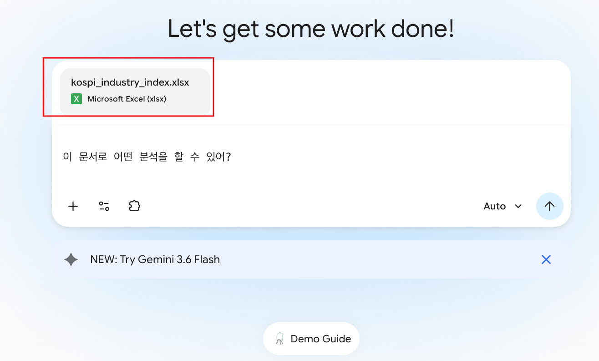
</p>
<p align="left">
  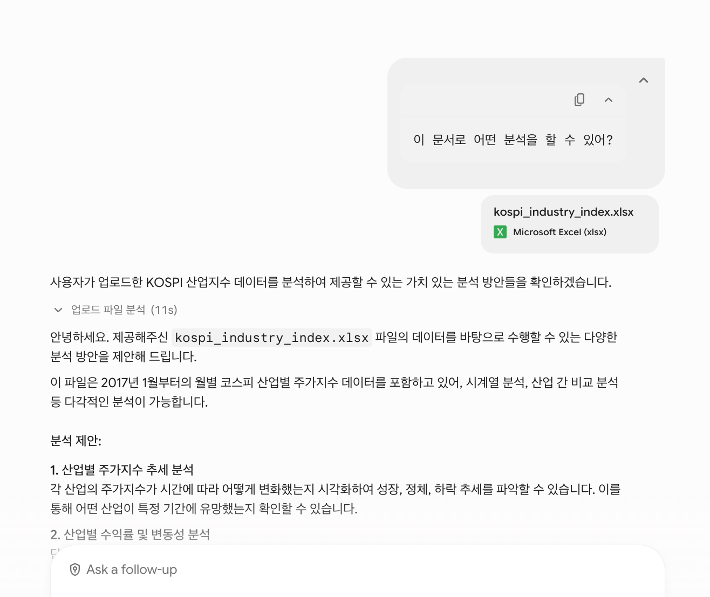
</p>

> 💬 **추천 프롬프트:**
> ```text
> AI 기술주에 관심 있습니다. 전반적인 IT, 통신쪽의 주가지수 흐름은 어떻게 해석해야 할까요 ?
> ```
<p align="left">
  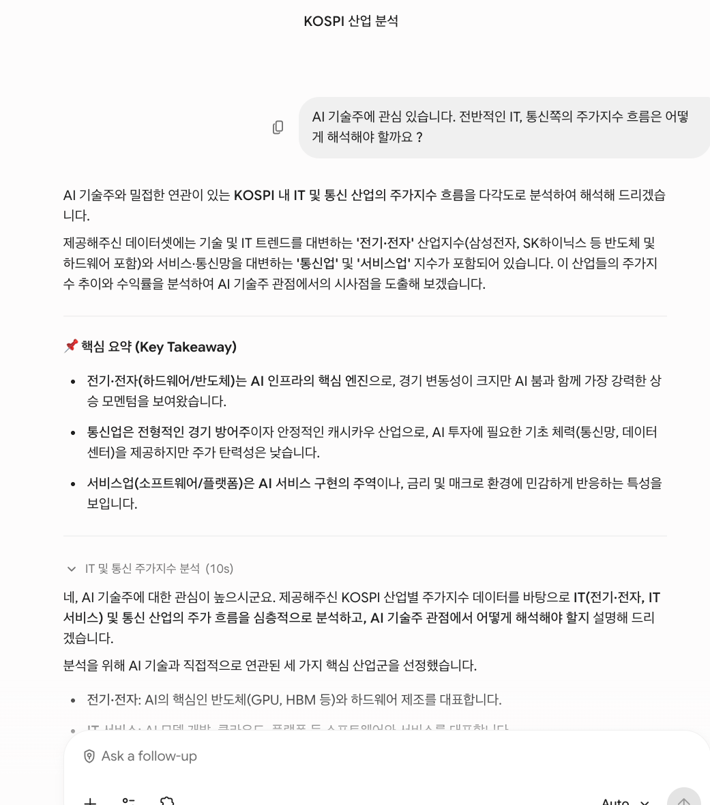
</p>

---

### 2.2 매출(Sales) 데이터 분석
<span style="color: #1a73e8; font-weight: bold;">👉 `coffee orders.xlsx` 파일을 첨부합니다.</span>

아래와 같이 다양한 통계 분석 요구사항을 요청합니다. 

> 💬 **추천 매출 추이 및 통계 분석 프롬프트:**
> ```text
> (주문 완료일)을 기준으로 일별, 주별, 월별 매출(Orders Total Sales)의 변화를 분석하여 매출이 높은 시기와 낮은 시기를 파악해줘.
> ```
> ```text
> (주문 유형: Dine-in, Takeaway)에 따라 매출이 어떻게 다른지 분석하여 매장 내 식사와 포장 판매의 비중을 파악해줘.
> ```
> ```text
> 매장 내 식사와 포장 판매의 주문당 평균 매출 차이가 의미 있는지 통계적으로 분석해줘.
> ```

마지막 프롬프트 처리 결과 이미지는 다음과 같습니다.

<p align="left">
  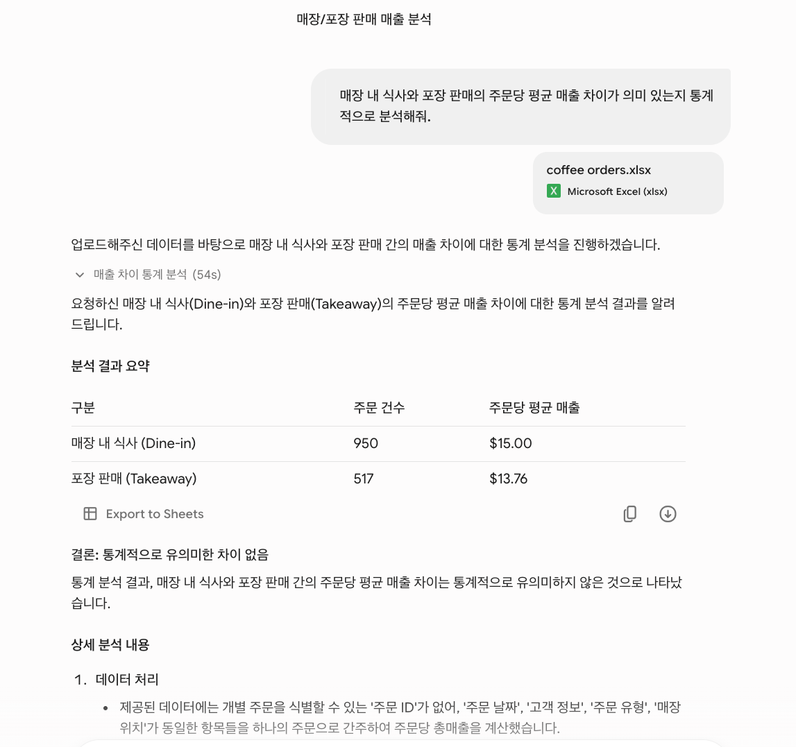
</p>

---

## 3. 📑 파워포인트(PPT) 문서 핵심 요약

비정형 문서 자료를 업로드하여 해당 파일 내용에 있는 주요 정보를 빠르게 추출합니다.  
Gemini Enterprise app Overview.pdf 파일을 업로드해서 아래와 같이 프롬프트를 사용해주세요.

> 💬 **프롬프트:**
> ```text
> 첨부된 발표 자료내 제품의 주요 특징을 빠르게 추출해서 정리 및 요약해주세요. 
> ```

실행결과 다음과 같습니다.

<p align="left">
  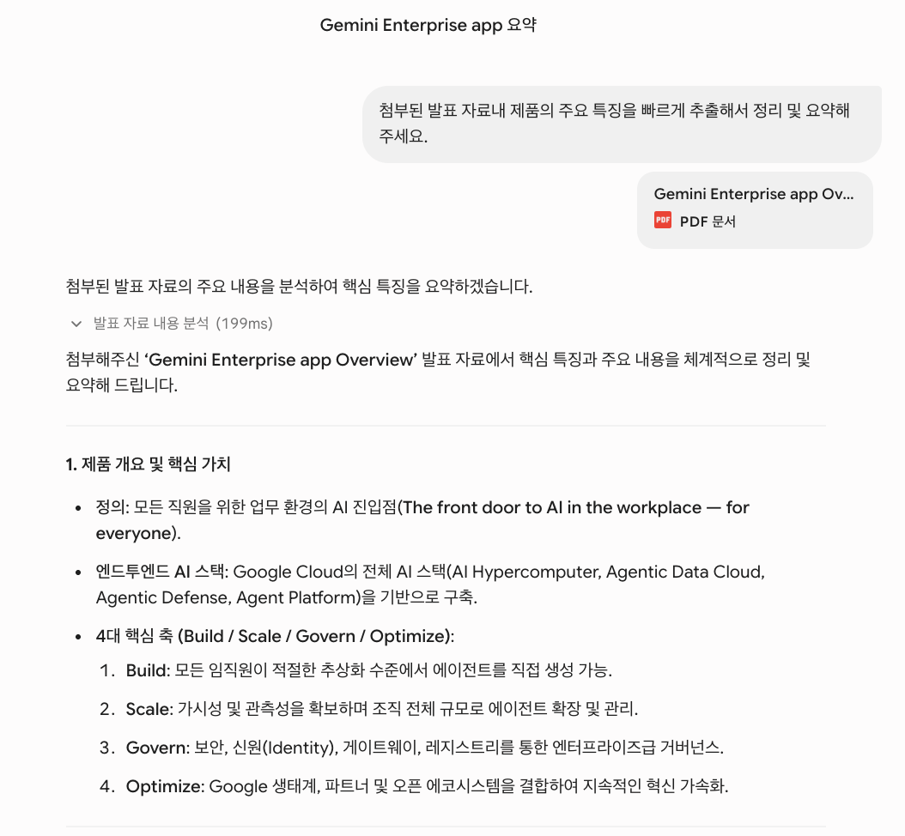
</p>

---

## 4. 🎨 미디어 생성 (이미지 및 비디오)

구글의 최첨단 **GenMedia 모델**을 활용합니다.

### 4.1 프롬프트 기반 포스터/이미지 생성
<span style="color: #1a73e8; font-weight: bold;">👉 **이미지 만들기** 도구를 선택하고 프롬프트를 입력합니다.</span>

<p align="left">
  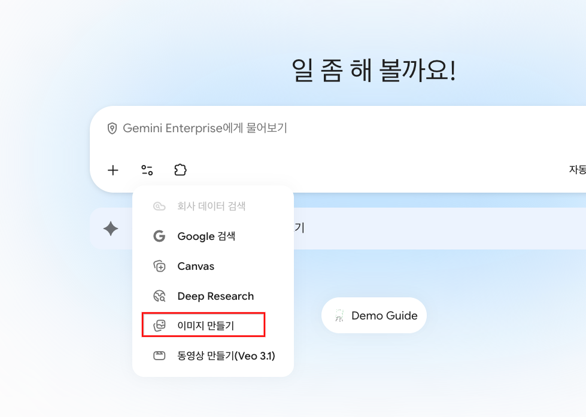
</p>

> 💬 **프롬프트:**
> ```text
> Gemini Enterprise를 잘 쓰고 싶어하는 직장인을 위한 팁과 핵심 기능을 알려주는 포스터(9:16)를 그려줘.
> 
> 내용 참고:
> - AI Assistant & Web Search
> - Deep Research
> - NotebookLM
> - Agent Designer
> - Enterprise Connectors
> - Model Armor & Security
> ```

실행결과 이미지는 다음과 같습니다.

<p align="left">
  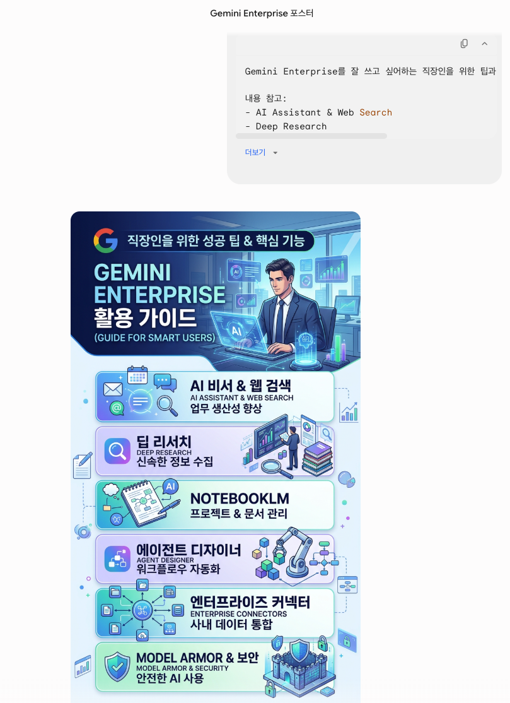
</p>

### 4.2 기존 이미지 편집 및 스타일 변환

1. **`Infografía_AI.jpg`** 첨부 후 이미지 도구 선택:

<p align="left">
  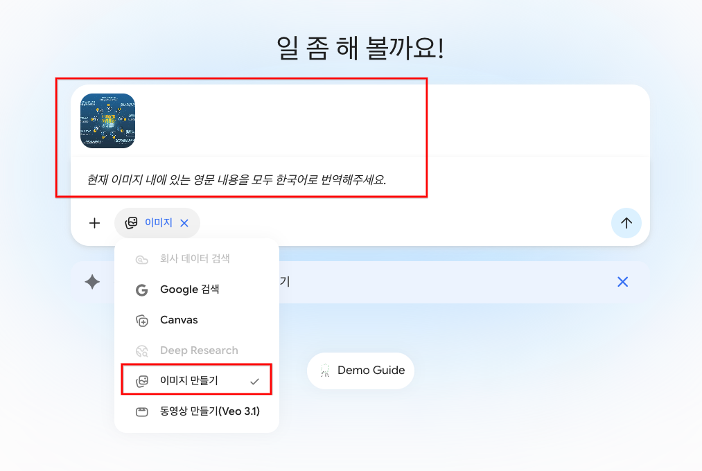
</p>

> ```text
> 현재 이미지 내에 있는 영문 내용을 모두 한국어로 번역해주세요.
> ```

실행결과 이미지는 다음과 같습니다.

<p align="left">
  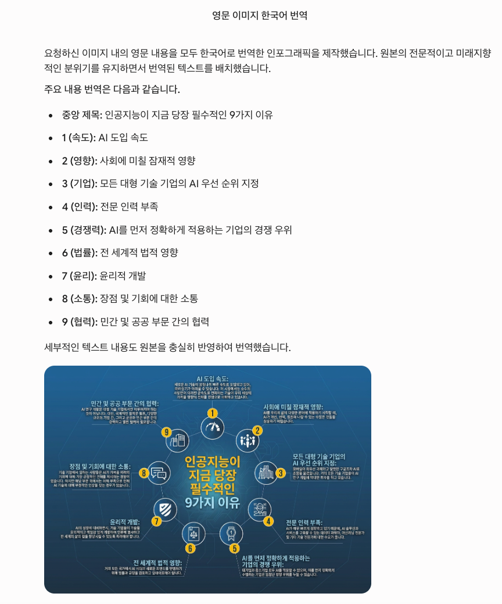
</p>

2. **`Handwrite_arch.png`** 첨부:
배치되어 있습니다. 전체적으로 우아하고 신선하며 세련된 분위기입니다.
> ```text
> 첨부한 아키텍처를 Google Cloud Architecture 스타일로 다시 그려줘.
> ```

실행결과 이미지는 다음과 같습니다.

<p align="left">
  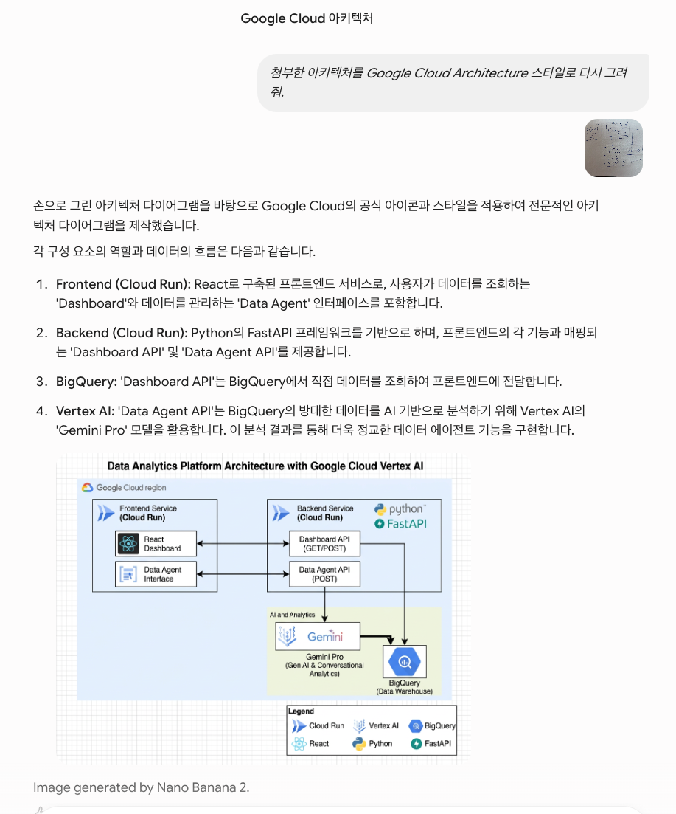
</p>

---

### 4.3 초고화질 비디오 생성 (Veo)

상세한 연출 프롬프트를 제공하여 하이엔드 광고 영상과 같은 동영상을 제작합니다.  
'동영상 만들기' 를 선택하고 아래 프롬프트를 실행 하세요.  

> ```text
> 거대하고 관중으로 가득 찬 로마 콜로세움을 위에서 아래로 내려다보는 시네마틱 와이드 앵글 드론 샷. 대기 중의 강렬한 먼지 입자를 뚫고 들어오는 골든 아워의 햇살. 배경에는 환호하는 수천 명의 관중들이 얕은 심도(아웃포커싱)로 흐릿하게 보임. 서사적이고 웅장한 분위기, 고대 석조 벽면의 매우 상세한 실사 질감, 8k 해상도, 35mm 필름 룩.
> ```
<p align="left">
  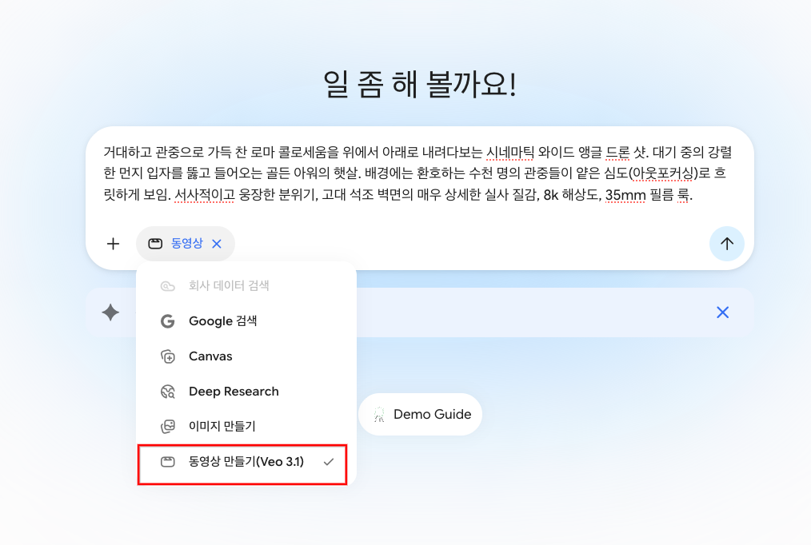
</p>


실행결과 동영상은 다음과 같습니다.

<p align="left">
  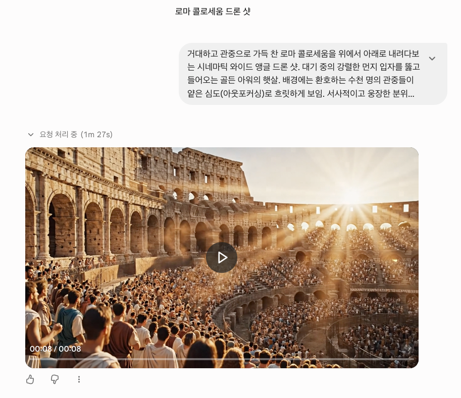
</p>


다음은 이미지를 참고해서 동영상을 만드는 방법으로 아래와 같이 설정해서 실행합니다.
이미지는 files 디토리에 있는 hands_in_reed.jpg 를 업로드 한 후 아래와 같이 프롬프트를 실행하세요.
> ```text
> 광활한 밀밭에서 황금빛 밀줄기를 부드럽게 스치는 전사의 거칠고 흉터 가득한 손을 잡은 익스트림 클로즈업 핸드헬드 샷. 배경을 비추는 부드럽고 따뜻한 일몰 빛. 밀밭 사이로 부는 은은한 미풍. 감정적이고 우울하면서도 웅장한 무드, 향수를 자극하는 색보정, 시네마틱 필름 그레인, 실사 같은 퀄리티.
> ```
<p align="left">
  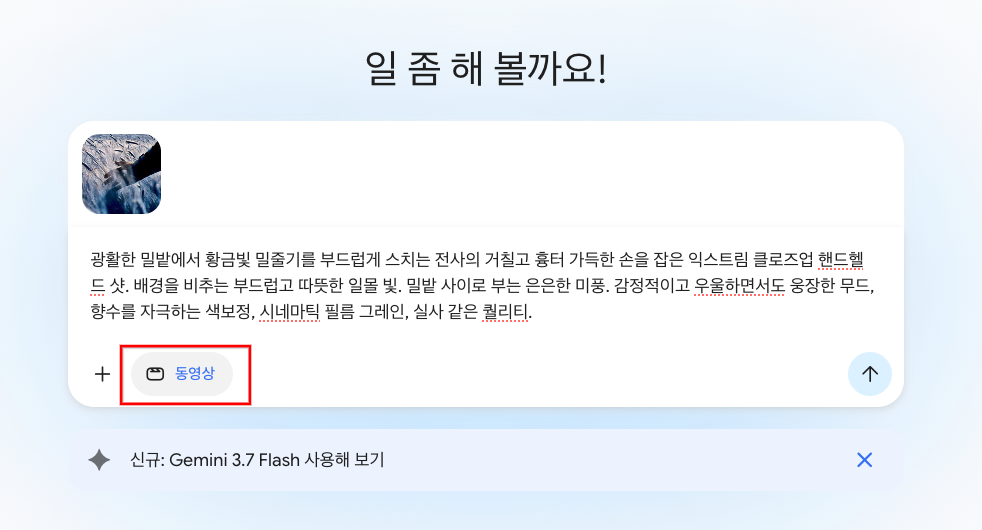
</p>


<p align="left">
  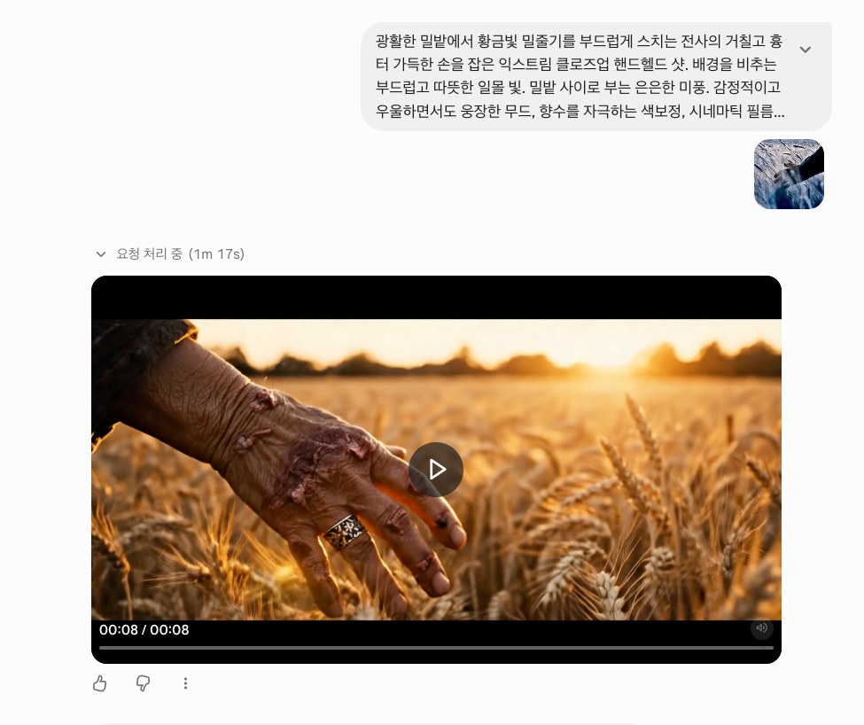
</p>


---

## 5. 🔬 심층 리서치 (Deep Research)

**Deep Research** 기능은 수십~수백 개의 웹 출처를 자동 탐색 및 교차 검증하여 인용 출처가 포함된 전문 보고서를 작성해 줍니다.

> 💬 **프롬프트:**
> ```text
> 구글의 AI 기술(Google AI Technology)과 최신 생성형 AI 생태계의 경쟁력 및 미래 전망을 종합적으로 분석해 줘. 먼저 글로벌 AI 시장에서의 구글 Gemini 모델 및 구글 클라우드 AI의 포지셔닝과 핵심 경쟁 우위를 진단해 줘. 이어서 멀티모달 AI, Deep Research, 에이전트 오케스트레이션을 포함한 엔터프라이즈 영역으로의 확장이 가지는 의미를 평가하고, 이를 바탕으로 향후 구글 AI 기술 생태계가 직면할 주요 기회와 위협 요인을 논리적으로 설명해 줘.
> ```

실행결과 이미지는 다음과 같습니다.

<p align="left">
  
</p>

> 💡 **Docs 내보내기:** 보고서 작성이 완료되면 **Google Docs로 내보내기**를 통해 드라이브 문서로 즉시 저장할 수 있습니다.

---

## 6. 🎨 캔버스 (Canvas) & 발표 슬라이드 생성

Gemini Enterprise **Canvas** 기능을 이용하면 실시간 인터랙티브 문서 편집, HTML 구성, 구글 슬라이드 연동 작성이 가능합니다.

실행결과 이미지는 다음과 같습니다.

<p align="left">
  
</p>

> 💬 **클라우드 백엔드 아키텍처 슬라이드 프롬프트:**
> ```text
> 새로운 모바일 앱을 위한 백엔드 아키텍처를 GCP에서 처음부터 설계하려고 해. 트래픽 자동 확장(Auto-scaling)과 실시간 로그 수집/분석 파이프라인이 필요해. 서버리스(Serverless) 및 완전 관리형(Managed) 서비스 위주로 인프라를 설계하고 각 서비스 선택 이유를 설명해 줘.
> 
> 그리고 슬라이드로 요약해줘. 하얀색 바탕의 깔끔하고 모던한 IT 기술 문서 스타일로 작성해줘.
> ```

실행결과 이미지는 다음과 같습니다.

<p align="left">
  
</p>
<p align="left">
  
</p>

> 📥 **PPTX 다운로드:** 생성된 슬라이드는 바로 `.pptx` 파일로 다운로드하거나 구글 슬라이드로 내보낼 수 있습니다.

---

## 7. 📔 NotebookLM 활용

NotebookLM은 **사용자가 직접 업로드한 원본 자료(PDF, 텍스트, 이미지)만을 기반으로 환각(Hallucination) 없이 정확히 답변하는 전용 AI 리서치 어시스턴트**입니다.

실행결과 이미지는 다음과 같습니다.

<p align="left">
  
</p>

### 7.1 노트북 생성 및 출처 입력
<span style="color: #1a73e8; font-weight: bold;">👉 1. NotebookLM 메뉴를 열고 새로 만들기를 클릭합니다.</span>
<span style="color: #1a73e8; font-weight: bold;">👉 2. 소스 추가에서 'LG 안심 홈 가디언', '루미케어', '센티넬 컴패니언' 아이디어 텍스트를 붙여넣습니다.</span>

실행결과 이미지는 다음과 같습니다.

<p align="left">
  
</p>

### 7.2 인포그래픽 & 스케치 노트 생성
업로드된 소스 내용만을 바탕으로 시각적 인포그래픽을 만듭니다:

> 💬 **프롬프트 예시:**
> - *"LG '루미케어' - 공감하는 세탁 도우미를 인포그래픽으로 생성해주세요."*
> - *"LG '안심' 홈 가디언 에코시스템 아이디어를 손으로 그린 듯한 (Sketch Note) 스타일로 작성해주세요."*
> - *"LG 센티넬 컴패니언 아이디어를 신문 인포그래픽 스타일로 작성해 주세요."*

실행결과 이미지는 다음과 같습니다.

<p align="left">
  
</p>
<p align="left">
  
</p>

---

### 7.3 스크린샷 모음으로 따라하기 가이드 작성
<span style="color: #1a73e8; font-weight: bold;">👉 캡처 이미지 모음(예: `data_agent.zip` 내 10개 캡처 파일)을 소스로 첨부합니다:</span>

> 💬 **프롬프트:** *"BigQuery Data Agent를 생성하는 과정을 초보자도 쉽게 따라할 수 있도록 가이드 문서를 작성해줘."*

| 좌측 단계 | 우측 단계 |
| :---: | :---: |
| <br> | <br> |

---

## 8. 🛠️ 로우코드 에이전트 스튜디오 (Agent Designer)

<span style="color: #1a73e8; font-weight: bold;">👉 코딩 없이 아이디어와 프롬프트만으로 나만의 AI 에이전트를 만들고, 조직 전체에 공유하며, 원하는 시간에 자동 실행되도록 스케줄을 설정합니다.</span>

### 8.1 소셜 미디어 콘텐츠 생성 에이전트 만들기
<span style="color: #1a73e8; font-weight: bold;">👉 1. **Agent** 메뉴로 이동하여 **새 에이전트**를 클릭합니다.</span>
<span style="color: #1a73e8; font-weight: bold;">👉 2. 대화창에 에이전트 역할을 입력합니다:</span>
   > 💬 *"뉴스 링크를 입력 받아서 Social Media 포스팅할 게시물 문구를 생성하는 에이전트를 만들어줘. 간략한 한 줄 문장과 bullet point 5개, 추천 해시태그를 포함해줘."*

실행결과 이미지는 다음과 같습니다.

<p align="left">
  
</p>

3. 생성된 에이전트 워크플로우를 **Flow 뷰**에서 확인하고 **Create**를 누릅니다:

실행결과 이미지는 다음과 같습니다.

<p align="left">
  
</p>

4. 뉴스 기사 URL을 전달하여 테스트합니다:

실행결과 이미지는 다음과 같습니다.

<p align="left">
  
</p>

---

### 8.2 에이전트 자동 실행 스케줄링 (Scheduling)
매일 아침 자동 실행되는 리포트 에이전트를 구성합니다:

1. 만든 에이전트를 클릭하여 **Agent Designer**로 들어갑니다.
<span style="color: #1a73e8; font-weight: bold;">👉 2. **Schedule** 탭에서 **Add Schedule**을 클릭합니다.</span>
<span style="color: #1a73e8; font-weight: bold;">👉 3. 실행 시간(실습 시 현재 시간 기준 2분 뒤)을 설정합니다.</span>
<span style="color: #1a73e8; font-weight: bold;">👉 4. **Update**를 눌러 스케줄 상태가 **Active**가 되었는지 확인합니다.</span>

실행결과 이미지는 다음과 같습니다.

<p align="left">
  
</p>
<p align="left">
  
</p>

---

## 9. 🤝 멀티 에이전트(Multi-Agent) 시스템 구축

메인 오케스트레이터(Root Agent)가 3개의 전문 하위 에이전트(Sub-Agents)를 순차적으로 제어하고 결과를 종합하는 **채용 서류 검토 멀티 에이전트**를 제작합니다.

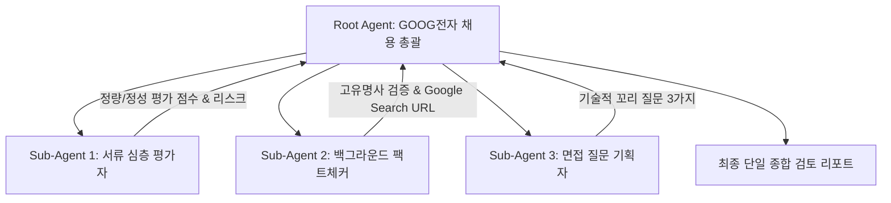
```mermaid
graph TD
    A[Root Agent: GOOG전자 채용 총괄] --> B[Sub-Agent 1: 서류 심층 평가자]
    A --> C[Sub-Agent 2: 백그라운드 팩트체커]
    A --> D[Sub-Agent 3: 면접 질문 기획자]
    
    B -- 정량/정성 평가 점수 & 리스크 --> A
    C -- 고유명사 검증 & Google Search URL --> A
    D -- 기술적 꼬리 질문 3가지 --> A
    
    A --> E[최종 단일 종합 검토 리포트]
```

### 9.1 상위 메인 에이전트: GOOG전자 채용 총괄 에이전트
- **Name:** GOOG전자 채용 총괄 에이전트
- **Description:** 채용 프로세스 전체를 총괄하며 하위 에이전트를 지정된 순서로 호출하여 결과를 취합합니다.
- **Model:** Gemini 3.5 Flash
- **Knowledge:** `2026년 GOOG전자 서류전형 평가 가이드라인.docx`

<details>
<summary>📜 (클릭) 메인 에이전트 프롬프트 Instruction 보기</summary>

```text
## Role
당신은 GOOG전자의 채용 프로세스 전체를 오케스트레이션하는 메인 에이전트입니다. 3명의 하위 전문가 에이전트를 정해진 순서대로 호출하고 결과를 누락 없이 매끄럽게 취합하여 하나의 최종 종합 리포트를 작성하십시오.

## Execution Protocol
1. Silent Execution: 사용자에게 중간 과정을 노출하지 말고 오직 최종 결과만 출력해야 합니다.
2. Step 1: '서류 심층 평가자' 에이전트를 호출하여 평가 결과를 수집하십시오.
3. Step 2: '백그라운드 팩트체커' 에이전트를 호출하여 팩트체크 리포트를 수집하십시오.
4. Step 3: '면접 질문 기획자' 에이전트를 호출하여 앞선 평가와 팩트체크 맥락을 전달하고 질문을 수집하십시오.

## Output Expectations
[GOOG전자 채용 서류 종합 검토 리포트]
1. 서류 심층 평가 결과 (종합 점수, Plus/Minus Point, PASS/FAIL 추천)
2. 백그라운드 팩트체크 검증 리포트 (고유명사 검증 리포트 & Google Search 출처 URL)
3. 심층 면접 꼬리 질문 3가지
```
</details>

실행결과 이미지는 다음과 같습니다.

<p align="left">
  
</p>

---

### 9.2 하위 에이전트(Sub-Agents) 구성

#### 1️⃣ Sub-Agent 1: 서류 심층 평가자
- **Role:** 가이드라인 지식을 바탕으로 직무 적합성, 문제 해결 경험, 조직 적합도를 평가하여 100점 만점 점수 산출.

#### 2️⃣ Sub-Agent 2: 백그라운드 팩트체커
- **Role:** 지원서 내 고유명사(기업명, 프로젝트명 등)를 추출하고 Google Search 연동 툴을 통해 실제 존재 여부 및 출처 URL 검증.
- **Tools:** Google Search 연동.

#### 3️⃣ Sub-Agent 3: 면접 질문 기획자
- **Role:** 앞선 심층 평가 결과와 팩트체크 리포트 맥락을 수신하여 약점 및 특이사항을 파고드는 심층 꼬리 질문 3가지 생성.

실행결과 이미지는 다음과 같습니다.

<p align="left">
  
</p>
<p align="left">
  
</p>

### 9.3 멀티 에이전트 파이프라인 실행
<span style="color: #1a73e8; font-weight: bold;">👉 지원자 이력서(`GOOG전자 입사지원서_이OO.pdf`)를 업로드하여 멀티 에이전트 실행 결과를 확인합니다:</span>

실행결과 이미지는 다음과 같습니다.

<p align="left">
  
</p>
<p align="left">
  
</p>

---

## 10. 📹 고급 연동 영상 및 참고 링크

| 주제 | 유튜브 영상 바로가기 |
| :--- | :--- |
| **Canvas 발표 슬라이드 제작** | 📺 [Canvas 슬라이드 생성 데모 보기](https://www.youtube.com/watch?v=Bk5Ha2cceEY) |
| **Canvas 동영상 비디오 제작** | 📺 [Canvas 비디오 생성 데모 보기](https://www.youtube.com/watch?v=4-5qeh4IXVY) |
| **MCP (Model Context Protocol)** | 📺 [MCP 외부 연동 실습 데모 보기](https://www.youtube.com/watch?v=wIbSGZsU5WI) |
| **BigQuery CA 에이전트 구축** | 📺 [Conversational Analytics Agent 제작 보기](https://www.youtube.com/watch?v=VFdJIaGQhhY) |
| **Gemini Enterprise CA 연동** | 📺 [Gemini Enterprise CA 연동 데모 보기](https://www.youtube.com/watch?v=l3Qc1RIXCvw) |

---

<p align="left"><b>🎉 Gemini Enterprise 핸즈온 워크숍을 완료하신 것을 축하드립니다! 🎉</b></p>
