# 🚀 Gemini Enterprise 일반 기능 핸즈온 랩 실행 환경 가이드

본 문서는 **Gemini Enterprise**의 핵심 기능 전반을 실제 엔터프라이즈 환경에서 검증하고 체험할 수 있도록 구성된 종합 실습 환경 가이드입니다.  
Gemini Enterprise의 10가지 핵심 모듈을 바탕으로 참가자가 직관적이고 체계적으로 실습을 진행할 수 있도록 환경 설정, UI 인터페이스 구조, 단계별 시나리오 및 검증 포인트를 제공합니다.

---

## 📌 목차
1. [Gemini Enterprise 핸즈온 환경 개요](#1-gemini-enterprise-핸즈온-환경-개요)
2. [실습 환경 사전 준비 및 인터페이스 구성](#2-실습-환경-사전-준비-및-인터페이스-구성)
3. [10단계 핵심 기능 핸즈온 실습](#3-10단계-핵심-기능-핸즈온-실습)
   - [Lab 1. 일반 질문 처리 (Direct Q&A & Reasoning)](#lab-1-일반-질문-처리-direct-qa--reasoning)
   - [Lab 2. Google 검색 연동 (Web Grounding & Citations)](#lab-2-google-검색-연동-web-grounding--citations)
   - [Lab 3. 기업 커넥터 연동 (Enterprise Connectors)](#lab-3-기업-커넥터-연동-enterprise-connectors)
   - [Lab 4. 등록된 스킬 사용 (Skill Invocation & Execution)](#lab-4-등록된-스킬-사용-skill-invocation--execution)
   - [Lab 5. 전문 서브 에이전트 위임 (Specialist Agents Delegation)](#lab-5-전문-서브-에이전트-위임-specialist-agents-delegation)
   - [Lab 6. MCP 서버 연동 (Model Context Protocol)](#lab-6-mcp-서버-연동-model-context-protocol)
   - [Lab 7. 커스텀 스킬 제작 및 배포 (Custom Skill Authoring)](#lab-7-커스텀-스킬-제작-및-배포-custom-skill-authoring)
   - [Lab 8. 프로젝트 워크스페이스 활용 (Projects Space)](#lab-8-프로젝트-워크스페이스-활용-projects-space)
   - [Lab 9. 스마트 수신함 활용 (Inbox & Action Automation)](#lab-9-스마트-수신함-활용-inbox--action-automation)
   - [Lab 10. 인터랙티브 캔버스 및 슬라이드 생성 (Interactive Canvas & Presentation Slides)](#lab-10-인터랙티브-캔버스-및-슬라이드-생성-interactive-canvas--presentation-slides)
4. [트러블슈팅 및 운영 권장사항](#4-트러블슈팅-및-운영-권장사항)

---

## 1. Gemini Enterprise 핸즈온 환경 개요

**Gemini Enterprise**는 기업의 데이터 보안(Security & Privacy), 내부 업무 시스템 결합(Enterprise Grounding), 로우코드 에이전트 오케스트레이션을 통합 제공하는 구글의 차세대 엔터프라이즈 생성형 AI 플랫폼입니다.

### 10가지 핵심 기능 검증 매트릭스

| 모듈 | 기능 영역 | 핵심 검증 목표 | 주요 활용 도구/기능 |
| :--- | :--- | :--- | :--- |
| **Lab 1** | **Direct Q&A** | 순수 LLM 추론, 텍스트 요약, 다국어 교정 | Gemini Core LLM Reasoning |
| **Lab 2** | **Web Grounding** | 최신 공개 데이터 검색 및 신뢰할 수 있는 출처 인용 | Google Search 연동 토글 |
| **Lab 3** | **Enterprise Connectors** | 사내 저장소/협업 도구 검색 및 권한 기반 응답 | Google Drive, Gmail, Calendar, Jira 등 |
| **Lab 4** | **Skill Invocation** | 스킬을 선택해서 원하는 특정업무 실행 | 사전에 등록된 Skills  |
| **Lab 5** | **Agent Delegation** | 특화 서브 에이전트로의 제어권 위임 | Chat agent 실행 |
| **Lab 6** | **MCP Integration** | MCP 표준 프로토콜 기반 외부 도구/리소스 실행 | Model Context Protocol |
| **Lab 7** | **Skill Authoring** | 신규 스킬 작성 및 디렉토리 구조 검증 | Custom Skill Studio / Workspace Skills |
| **Lab 8** | **Projects Space** | 프로젝트별 문서 격리 및 장기 컨텍스트 유지 | Projects Workspace & Context Persistence |
| **Lab 9** | **Smart Inbox** | 미확인 업무 분석, 우선순위 분류 및 후속 액션 자동화 | Inbox Triage & Calendar/Email Draft Actions |
| **Lab 10** | **Interactive Canvas** | 대화창 독립 작업 공간에서 실시간 문서/슬라이드 편집 및 PPTX/Google Slides 내보내기 | Canvas Workspace, Google Slides Export, In-line Editing |

---

## 2. 실습 환경 사전 준비 및 인터페이스 구성

### 2.1 사전 준비 사항 (Prerequisites)
1. **Gemini Enterprise 전용 계정**: 실습용 Google Workspace / Cloud Identity 계정 로그인
2. **권한 확인 (Access Check)**:
   - Google Drive 및 Gmail/Calendar 연동 권한 활성화 여부 확인
   - 실습 프로젝트(Project) 생성 및 파일 업로드 권한 확인
   - MCP 서버 엔드포인트 네트워크 접근 가능 상태 확인

### 2.2 UI 인터페이스 레이아웃

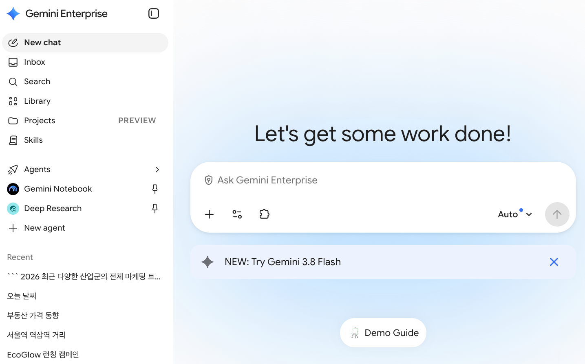

- **어시스턴트**: 프롬프트 입력창으로, 텍스트 입력뿐만 아니라 도구 토글, 파일 드래그앤드롭, 스킬 직접 선택 지원
- **좌측 네비게이션**: 프로젝트(Projects), 스마트 수신함(Inbox), 에이전트 목록 및 연결 설정
- **도구 선택 패널**: Google Search 활성화 토글, Enterprise Connectors 목록, MCP Tools 연동 상태 표시

---

## 3. 10단계 핵심 기능 핸즈온 실습

---

### Lab 1. 일반 질문 처리 (Direct Q&A & Reasoning)

외부 검색 도구나 커넥터 호출 없이 **Gemini 본연의 고급 논리 추론, 요약, 비즈니스 텍스트 재작성 능력**을 검증합니다.

#### 1) 실행 환경 설정
- 하단 도구 바에서 **Google Search 토글을 비활성화(OFF)** 합니다.
- 순수 LLM 추론 모드로 단일 대화창을 시작합니다.

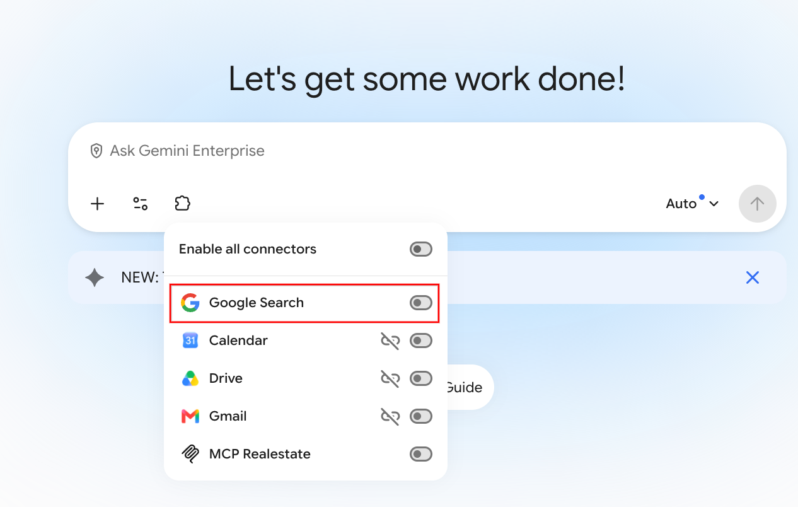

#### 2) 실습 프롬프트
> 💬 **프롬프트 1 (비즈니스 논리 추론):**
> ```text
> B2B SaaS 기업의 분기 이탈률(Churn Rate)이 3.2%에서 5.8%로 증가했습니다. 고객 세그먼트별 원인 분석 프레임워크와 즉각적인 대응을 위한 3단계 액션 플랜을 표 형태로 정리해 줘.
> ```

> 💬 **프롬프트 2 (전문 영문 비즈니스 이메일 재작성):**
> ```text
> 아래 거친 피드백을 글로벌 파트너사 임원에게 보낼 정중하고 전문적인 영문 비즈니스 이메일로 다듬어 줘:
> "너희 일정 못 맞추면 계약 파기할 수도 있어. 금요일까지 답변 줘."
> ```

#### 3) 검증 포인트
- [ ] 외부 검색/도구 호출 없이 즉각적으로 구조화된 답변을 생성하는가?
- [ ] 마크다운 표 레이아웃과 항목별 우선순위가 명확히 시각화되는가?
- [ ] 비즈니스 톤앤매너가 적절하게 반영되어 외교적이고 전문적인 표현으로 변경되었는가?

---

### Lab 2. Google 검색 연동 (Web Grounding & Citations)

실시간 최신 웹 데이터를 안전하게 검색하고, **팩트 기반의 정확한 수치와 신뢰할 수 있는 출처(Citation) 링크**를 제공하는지 검증합니다.

#### 1) 실행 환경 설정
- 하단 도구 바에서 **Google Search 토글을 활성화(ON)** 합니다.

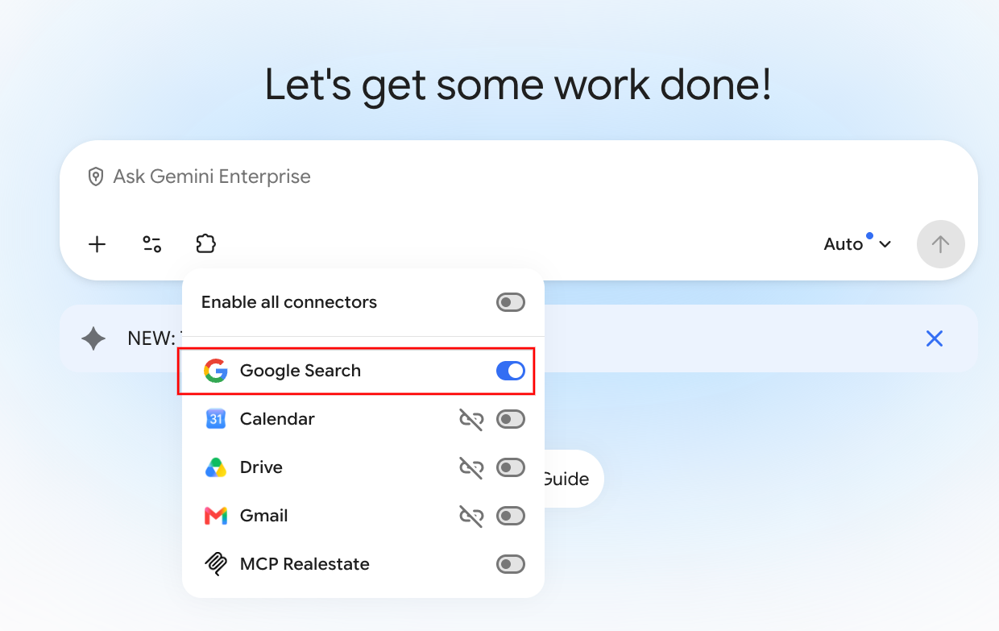

#### 2) 실습 프롬프트
> 💬 **프롬프트 1 (최신 시장 및 오픈소스 트렌드):**
> ```text
> 최근 3개월간 발표된 글로벌 주요 생성형 AI 오픈소스 모델들의 벤치마크 순위와 주요 특징을 검색해서 비교해 줘.
> ```

> 💬 **프롬프트 2 (글로벌 규제 및 팩트 확인):**
> ```text
> 2026년 기준 EU AI Act의 고위험 AI 시스템 규제 적용 현황과 기업 준수 요건을 출처 링크와 함께 요약해 줘.
> ```

#### 3) 검증 포인트
- [ ] 응답 문장 곳곳에 클릭 가능한 출처 링크(Citations)가 명시되는가?
- [ ] 모델 응답 맨 하단의 Source 버튼을 클릭했을 때 관련된 참조 웹사이트가 우측에 열리는가?
- [ ] 최신 시점의 정보를 환각(Hallucination) 없이 정확하게 제시하는가?

---

### Lab 3. 기업 커넥터 연동 (Enterprise Connectors)

사내 연동 시스템(**Google Drive, Gmail, Calendar, Jira** 등)의 데이터를 안전하게 검색하고, 권한 범위 내에서 문서를 종합하는지 검증합니다.

#### 1) 실행 환경 설정
- **Settings > Connectors**에서 Google Drive, Gmail, Calendar가 연결되어 있는지 확인합니다. 연결되지 않은 경우 **Authorize**를 눌러 연결합니다.

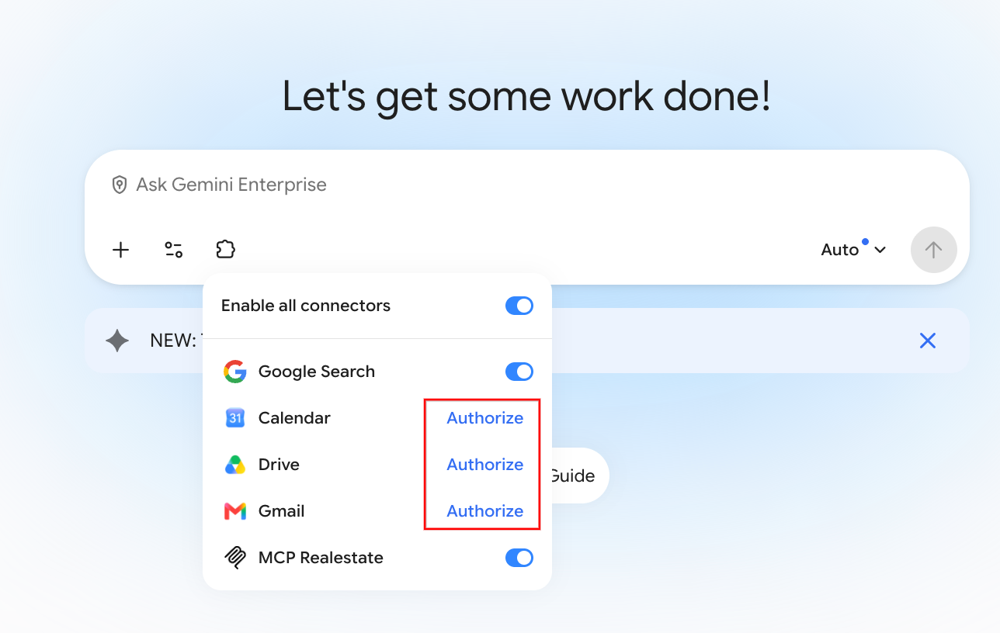

#### 2) 실습 프롬프트

실습을 시작하기 전에 아래와 같이 프롬프트 입력창 하단에서 해당하는 Connector들을 활성화합니다.

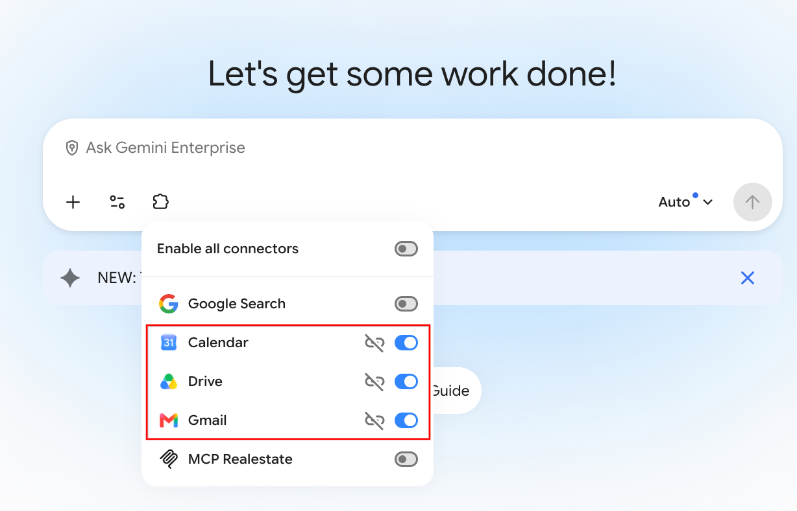

> 💬 **프롬프트 1 (Google Docs 문서 생성 및 드라이브 저장):**
> 
> 사내 문서 검색 실습을 위해 아래 두 개의 문서를 작성하여 Google Drive에 저장합니다:
> ```text
> 가정에서 주로 사용하는 신제품에 대한 신규 런칭 전략을 최신 트렌드에 맞게 구성해주고 해당 문서를 google docs 로 만들어서 저장해주세요.
> ```
> ```text
> 2026년 최신 산업군별 마케팅 트렌드 종합 리포트 문서를 google docs 로 만들어서 저장해주세요.
> ```

명령이 정상 처리되면, 현재 계정의 [Google Drive](https://drive.google.com/)에서 아래와 같이 두 개의 문서가 생성된 것을 확인할 수 있습니다.

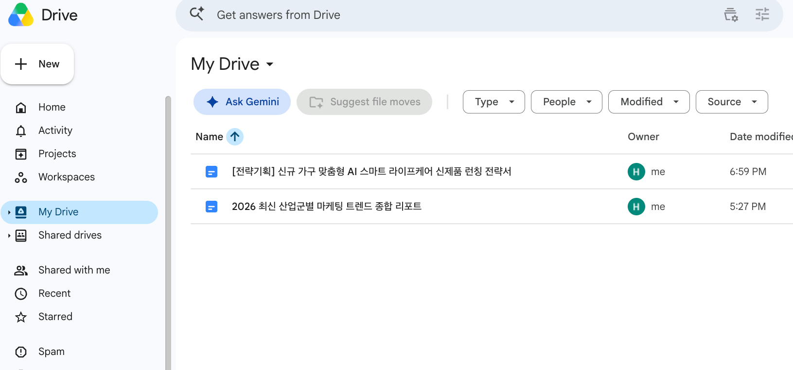

> 💬 **프롬프트 2 (사내 드라이브 문서 검색 및 요약):**
> ```text
> 내 Google Drive에서 '2026 마케팅 로드맵' 과 '신제품 런칭 전략' 관련 문서를 찾아서 전략적인 핵심요소를 3줄로 요약해 줘.
> ```

> 💬 **프롬프트 3 (요약 내용 이메일 발송):**
> ```text
> 위에서 정리한 내용을 요약해서 내 메일로 전달해줘.
> ```

이메일 전송 후 [Gmail](https://mail.google.com/)에 접속하면 요약 내용이 이메일로 정상 수신된 것을 확인할 수 있습니다.

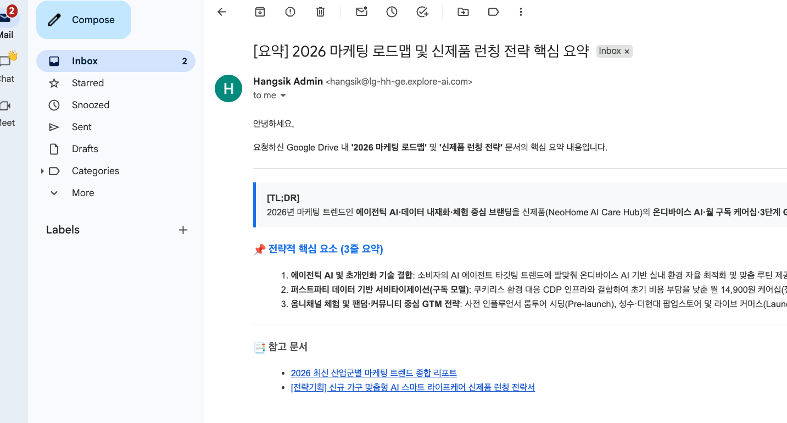

#### 3) 검증 포인트
- [ ] 사전 연동된 커넥터(Drive, Calendar, Mail) 도구가 자동으로 감지 및 병렬 호출되는가?
- [ ] 사용자 본인 계정에 접근 권한이 있는 문서만을 기반으로 답변이 생성되는가?
- [ ] 파일 이름 및 수정 일자 등 메타데이터가 정확히 연계되는가?

---

### Lab 4. 등록된 스킬 사용 (Skill Invocation & Execution)

특정 업무 목적을 달성하기 위해 사전에 정의된 **전문 스킬**이 올바른 매개변수와 함께 자동 실행되는지 검증합니다.

#### 1) 실행 환경 설정
- 좌측 메뉴에서 **Skills**를 클릭한 후 **Browse skills**를 선택합니다.

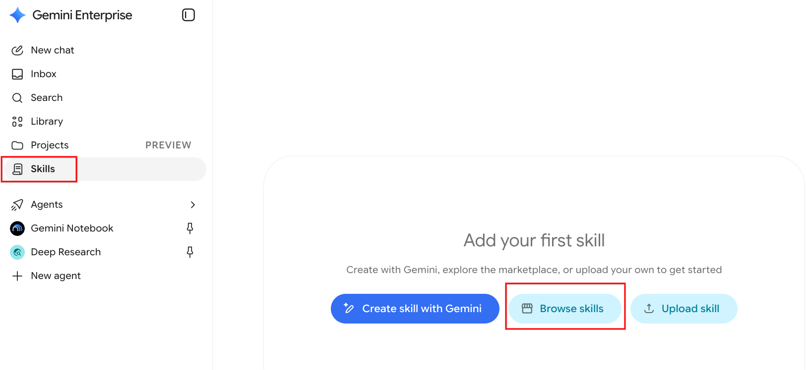

- 스킬 목록에서 `/answer-format`을 찾아 **Install**을 클릭합니다.

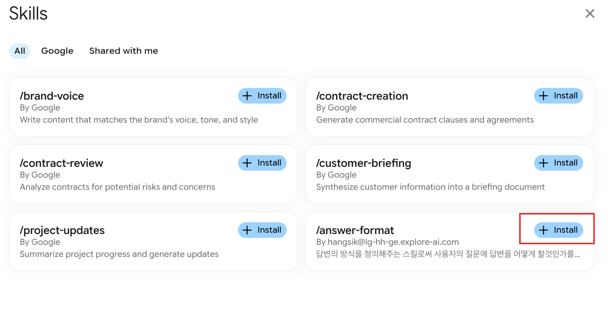

- 설치 완료 후 아래 화면과 같이 해당 스킬을 활성화합니다.

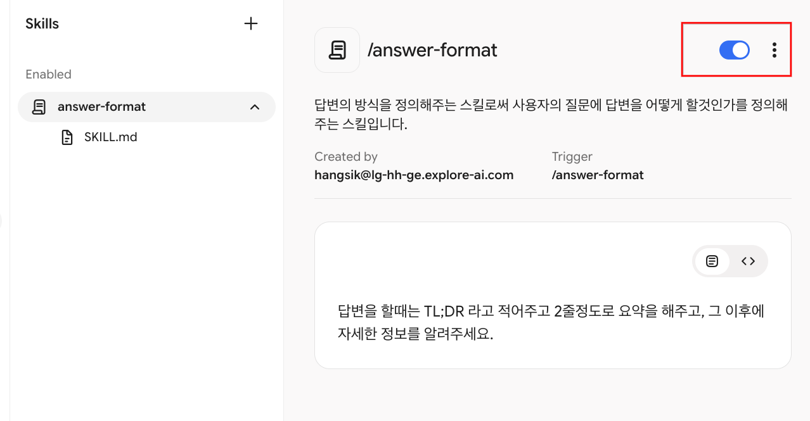

#### 2) 실습 프롬프트

프롬프트 입력창에서 `@`를 입력하면 등록된 스킬 목록이 나타납니다. `/answer-format` 스킬을 선택한 후 프롬프트를 입력합니다.

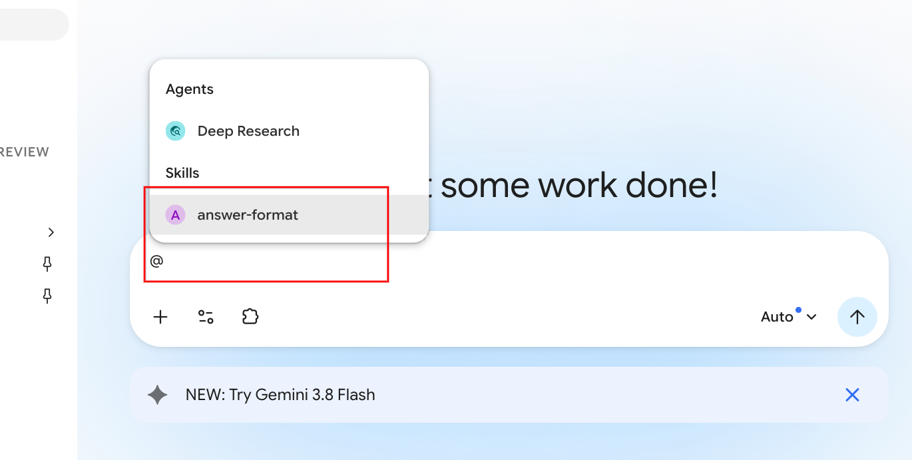

> 💬 **프롬프트 1 (스킬을 활용한 답변 생성):**
> ```text
> 최근 다양한 산업분야에서 AI 에 대한 활용이 늘어나고 있습니다. 제조 산업에서의 특이한 적용분야에 대해서 요약해주세요.
> ```

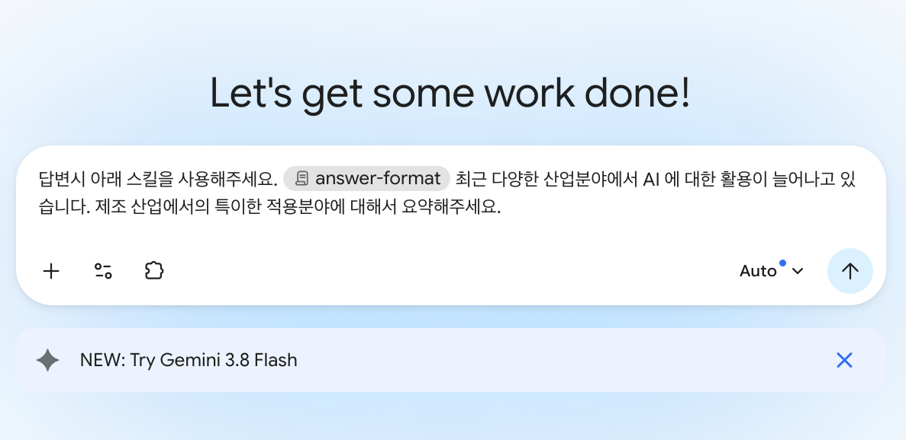

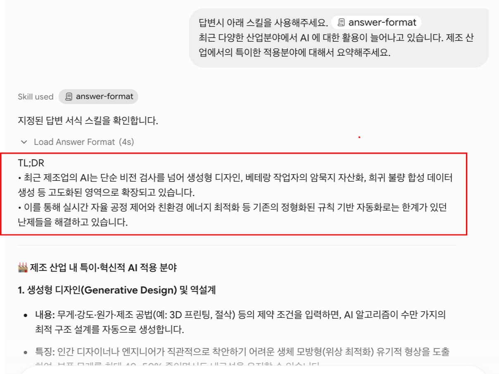

> 💡 **참고:** 본 실습에서는 특정 스킬을 `@`로 명시적 선택하여 호출하였으나, 프롬프트 내용에 따라 시스템이 질문 의도를 파악하여 관련 스킬을 자동으로 호출할 수도 있습니다.

#### 3) 검증 포인트
- [ ] 시스템이 사용자의 의도를 분석하여 적절한 스킬을 호출하는가?
- [ ] `SKILL.md`에 정의된 절차대로 답변의 결과가 정상적으로 처리되었는가?

---

### Lab 5. 전문 서브 에이전트 위임 (Specialist Agents Delegation)

특정 업무 수행 시 사전에 공유된 Agent를 통해 업무를 위임하고 처리하는 방법을 실습합니다. 본 Lab에서는 사전 구성된 **"AI 시장 뉴스 및 리스크 브리핑 자동화" Agent**를 호출하여 처리합니다. Agent 내부의 로직 구조는 아래와 같습니다.

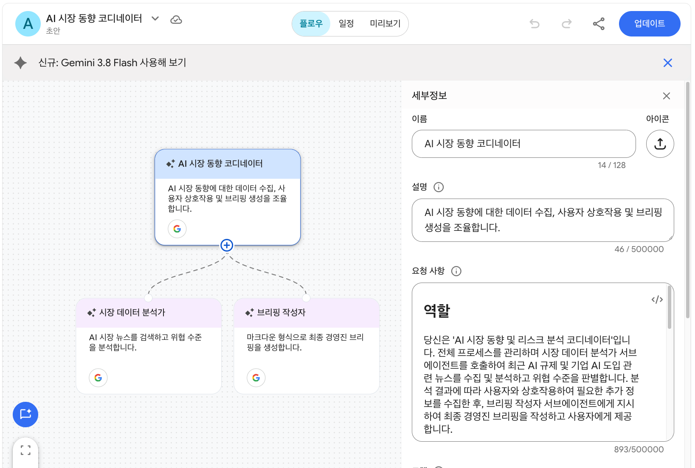

#### 1) 실행 환경 설정
- 좌측 네비게이션에서 **Agents** 메뉴를 클릭하여 사용 가능한 서브 에이전트 목록을 확인합니다.

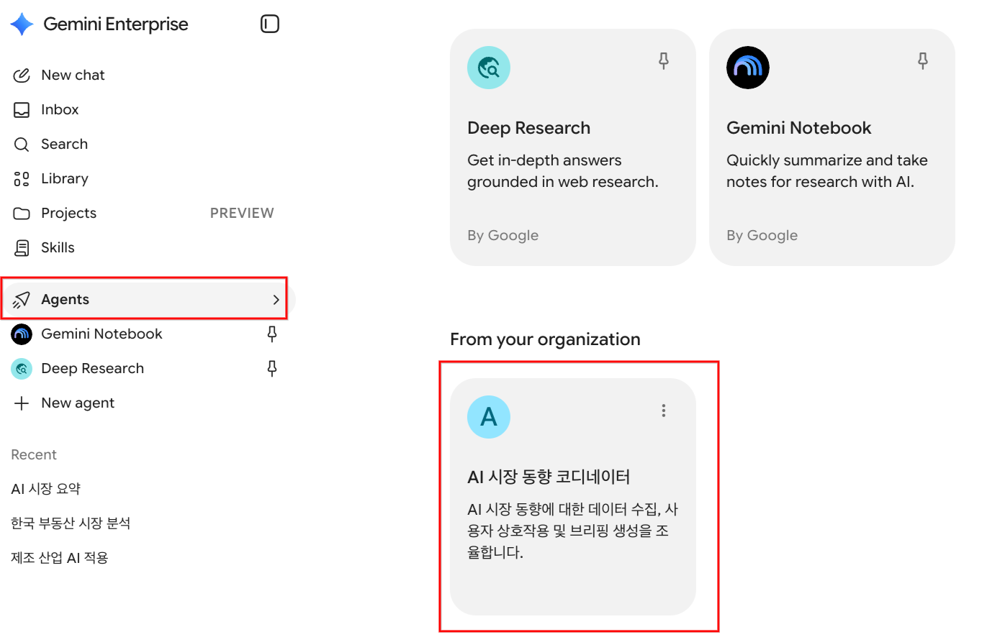

- 에이전트 실행 시 스킬과 마찬가지로 `@` 입력을 통해 호출이 가능합니다.

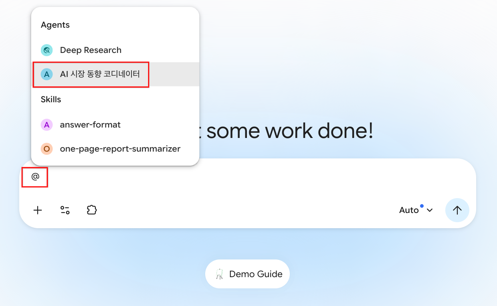

#### 2) 실습 프롬프트
> 💬 **프롬프트 1 (에이전트를 활용한 분석):**
> ```text
> 최근 AI뉴스를 검색해서 AI관련 위협요인이 있는지 파악해줘.
> ```

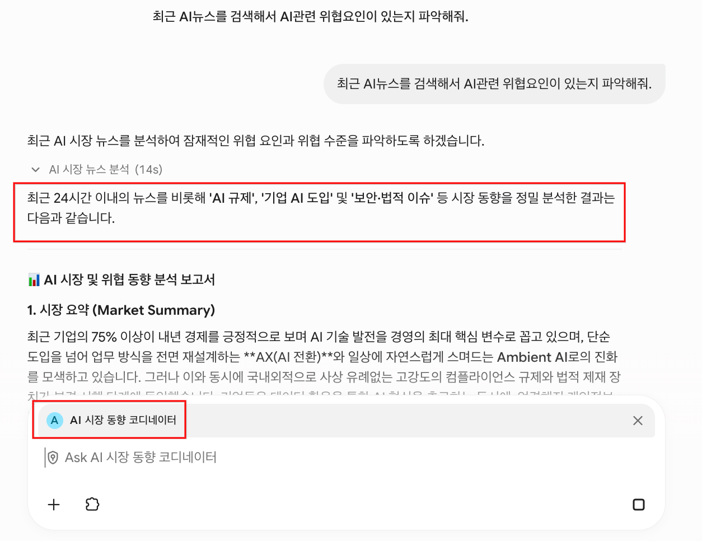

#### 3) 검증 포인트
- [ ] 공유된 에이전트에 정상적으로 접근하여 호출할 수 있는가?
- [ ] 선택된 Agent에 의해 의도한 작업이 정확하게 수행되었는가?

---

### Lab 6. MCP 서버 연동 (Model Context Protocol)

표준화된 **Model Context Protocol (MCP)** 서버를 통해 외부 데이터베이스, 사내 백엔드 시스템, 모니터링 도구를 호출하고 파라미터를 준수하는지 검증합니다. 본 Lab에서는 사전 배포된 한국 부동산 지표 분석 MCP 서버를 호출합니다.

#### 1) 실행 환경 설정
- 하단 도구 패널에서 **MCP Realestate** (한국 부동산 분석 MCP) 도구를 활성화합니다.

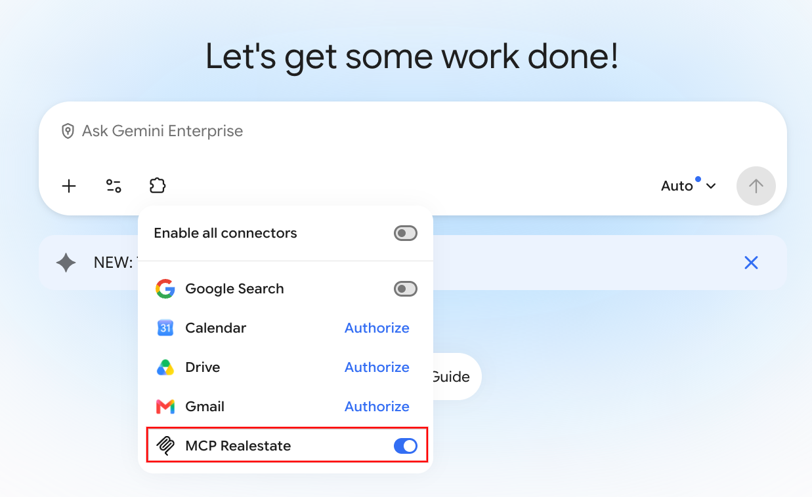

#### 2) 실습 프롬프트
> 💬 **프롬프트 1 (실시간 부동산 정보 쿼리 도구):**
> ```text
> 최근 10년 동안의 한국의 부동산 시장에 대한 데이터를 기반으로 분석을 해주세요.
> ```

#### 3) 검증 포인트
- [ ] MCP 서버에 정의된 Parameter Schema에 맞는 정확한 인자값으로 호출하는가?
- [ ] 처리 과정에서 MCP 도구 호출 과정 및 반환 데이터가 명확하게 반영되는가?

---

### Lab 7. 커스텀 스킬 제작 및 배포 (Custom Skill Authoring)

사내 업무 표준화를 위해 새로운 스킬을 설계하고, **표준 YAML Frontmatter 및 단계별 행동 지침(`SKILL.md`)**을 대화형 인터페이스를 통해 직접 작성·등록합니다.

#### 1) 실행 환경 설정
- 좌측 네비게이션에서 **Skills** 메뉴를 클릭하여 Gemini 기반 스킬 생성 마법사로 진입합니다.

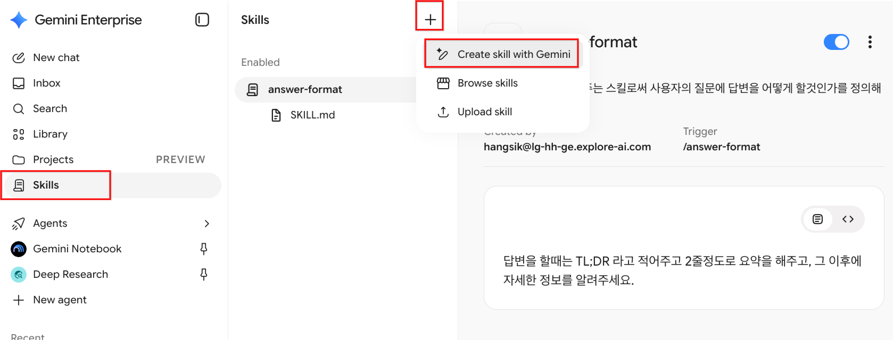

#### 2) 스킬 만들기
> 💬 **스킬 생성 프롬프트:**
> ```text
> 리포트를 구조적인 형태로서 읽기 쉬운 문장으로 만들어지는, 가급적 1페이지로 짧고 간략하게 리포트 작성하는 스킬을 만들어줘. 한국어로 작성해줘.
> ```

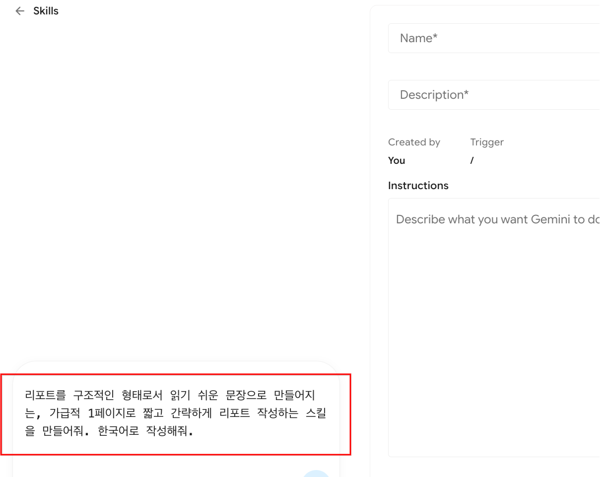

프롬프트 입력 후 아래와 같이 스킬 메타데이터와 지침이 자동 생성됩니다:

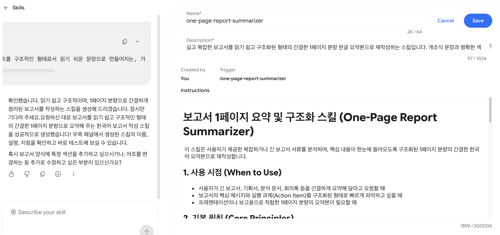

등록된 커스텀 스킬을 참조하여 의도된 형식의 리포트를 생성할 수 있습니다:

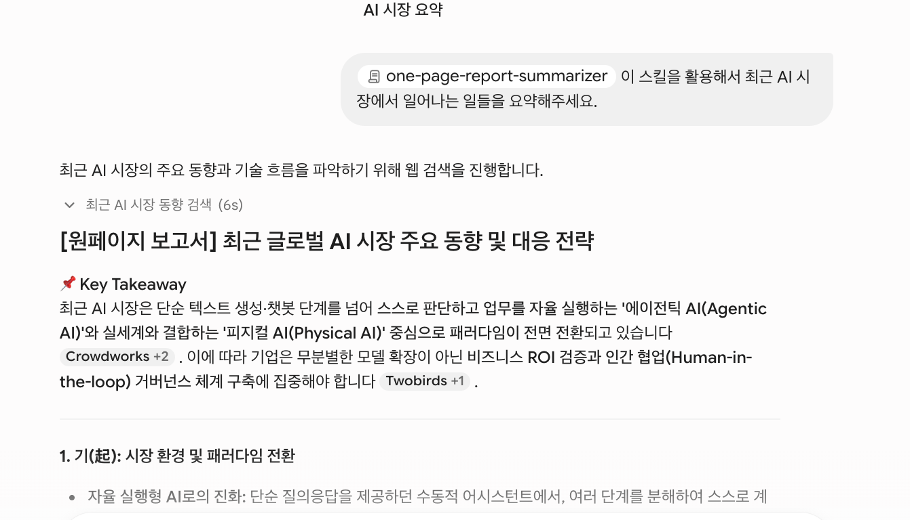

#### 3) 검증 포인트
- [ ] YAML Frontmatter에 `name`, `description` 필드가 누락 없이 작성되었는가?
- [ ] 사용자의 요구사항(1페이지 간략 리포트, 구조화)이 스킬 본문에 잘 반영되었는가?
- [ ] 새로운 스킬이 등록된 후 실제 프롬프트에서 의도대로 호출되는가?

---

### Lab 8. 프로젝트 워크스페이스 활용 (Projects Space)

특정 업무나 팀 단위로 **독립된 프로젝트(Project) 워크스페이스**를 생성하고, 지식 자산(PDF, 문서, 가이드)을 업로드하여 지속적인 컨텍스트를 유지하는지 검증합니다.

#### 1) 실행 환경 설정
- 좌측 사이드바에서 **[Projects] > [+ New Project]**를 클릭하여 프로젝트 제목(예: "AI 기술동향")을 입력하고 프로젝트를 생성합니다.

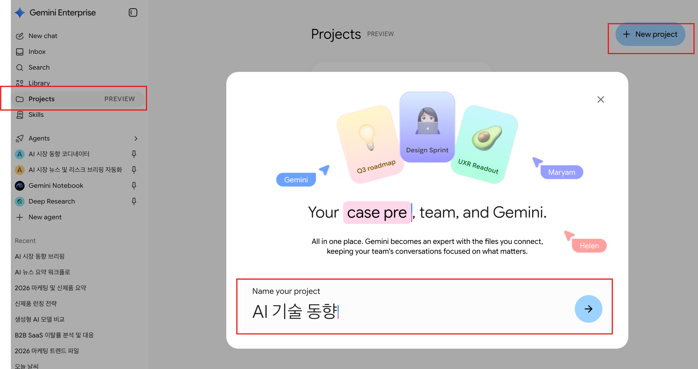

- 참조 자료(제공된 실습 파일 또는 관련 업무 문서)를 프로젝트 파일로 업로드합니다.

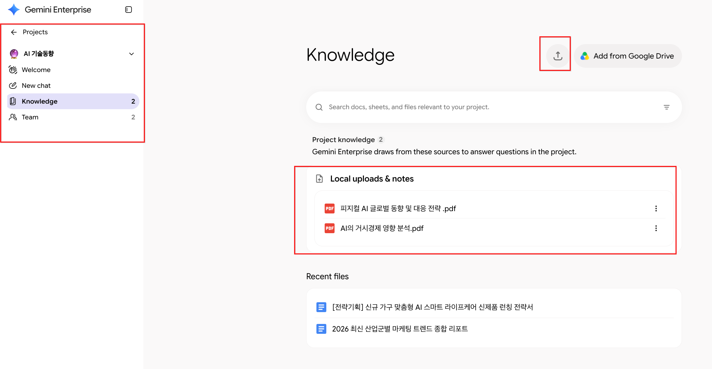

- 함께 작업할 팀원 계정을 추가합니다. (개인 계정 등록 가능, 그룹 계정은 지원되지 않음)

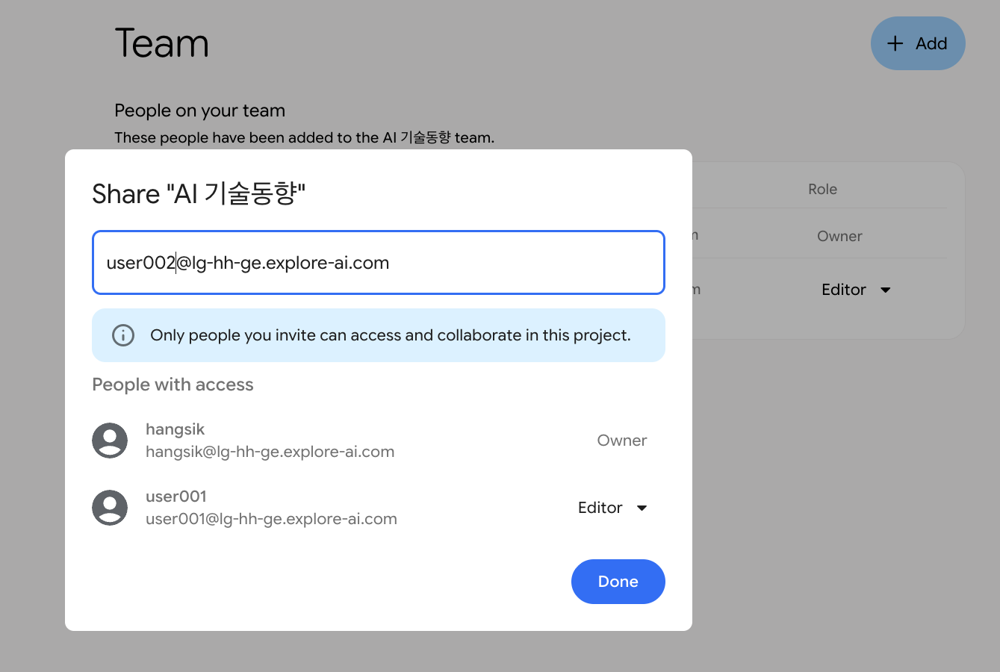

#### 2) 실습 프롬프트
> 💬 **프롬프트 1 (프로젝트 파일 기반 질의):**
> ```text
> 첨부된 파일을 기반으로 AI 최근 기술동향 알려주세요.
> ```

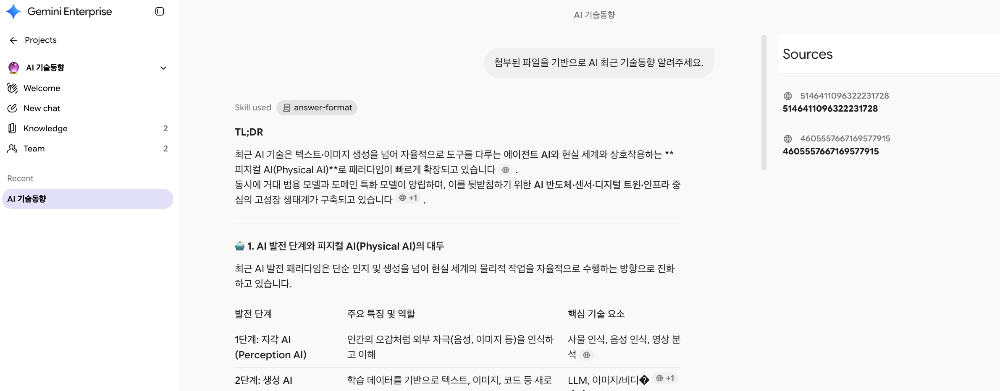

#### 3) 검증 포인트
- [ ] 프로젝트 외적인 불필요한 데이터가 혼입되지 않고 업로드된 사내 자산에 가중치를 두는가?
- [ ] 여러 턴의 대화나 새 세션이 시작되어도 프로젝트 레벨의 지식 정보들이 그대로 유지되는가?

---

### Lab 9. 스마트 수신함 활용 (Inbox & Action Automation)

다양한 채널에서 유입된 이메일, 일정 알림, 업무 요청 및 백그라운드 에이전트 실행 결과를 **스마트 수신함(Inbox)에서 일괄 분석하고 우선순위 분류 및 후속 조치를 자동화**하는지 검증합니다.

#### 1) 실행 환경 설정
- 좌측 네비게이션에서 **[Inbox]** 메뉴를 선택하거나 관련 메일/알림이 수신된 상태에서 진행합니다.
- Deep Research, Workflow Agent 등 장시간 소요되는 비동기 작업이 완료되면 Inbox에 해당 처리 결과가 기록됩니다.
- Workflow 에이전트가 스케줄에 따라 실행될 때 이메일 발송 등 오류가 발생하거나, Human-in-the-loop(HITL) 과정에서 사용자의 최종 승인이 필요한 경우 Inbox를 통해 알림이 제공됩니다.

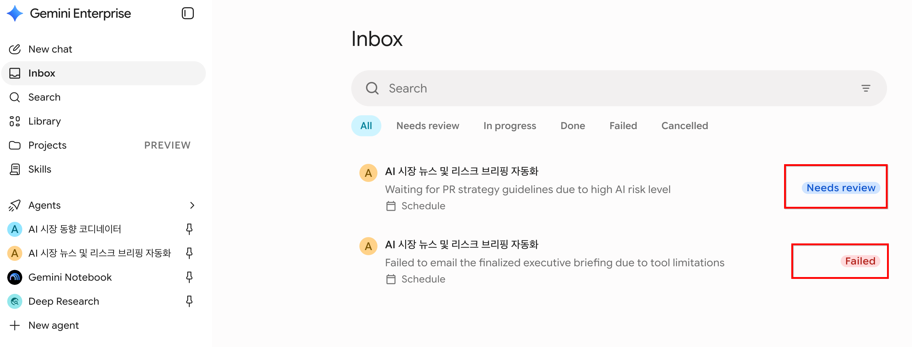

#### 2) 실습 시나리오 및 처리 결과 확인
> 💬 **수신함 메시지 확인 및 승인 조치:**
> 1. Inbox 목록에서 미처리된 알림 및 Workflow 실행 실패/성공 내역을 확인합니다.
> 2. Human-in-the-loop 승인 요청 항목이 있는 경우 세부 내용을 검토한 후 승인(Approve) 또는 반려를 진행합니다.

#### 3) 검증 포인트
- [ ] Inbox 내에서 완료 및 미완료된 비동기 작업 결과가 정확히 표시되는가?
- [ ] 사용자 승인이 필요한 항목에 대해 승인/반려 조치가 원활히 진행되는가?

---

### Lab 10. 인터랙티브 캔버스 및 슬라이드 생성 (Interactive Canvas & Presentation Slides)

대화창과 분리된 독립된 인터랙티브 작업 공간인 **Canvas**를 활용하여, 긴 형식의 기술 기획서 및 클라우드 백엔드 아키텍처를 실시간으로 작성하고 이를 **구글 슬라이드(Google Slides) 프레젠테이션으로 자동 변환 및 PPTX 다운로드/내보내기**하는 전 과정을 검증합니다.

#### 1) 실행 환경 설정
- 어시스턴트 프롬프트 입력창 상단 또는 도구 메뉴에서 **Canvas** 기능을 활성화하거나, 프롬프트 입력 시 직접 캔버스 작업 또는 슬라이드 생성을 지정합니다.

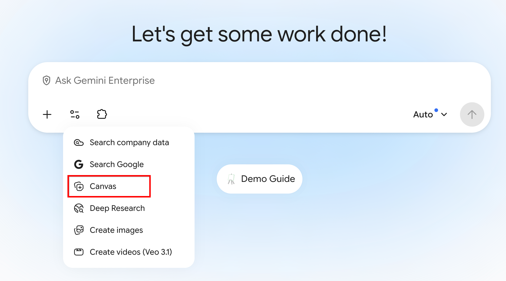

#### 2) 실습 프롬프트
> 💬 **프롬프트 1 (GCP 클라우드 백엔드 아키텍처 설계 및 구글 슬라이드 자동 요약):**
> ```text
> 새로운 모바일 앱을 위한 백엔드 아키텍처를 GCP에서 처음부터 설계하려고 해. 초기에는 트래픽이 적겠지만, 이벤트 기간에는 트래픽이 평소 대비 10배 이상 급증할 수 있어서 자동 확장(Auto-scaling)이 매우 중요해. 또한, 사용자의 행동 로그 데이터를 초당 수천 건씩 실시간으로 수집하고 분석할 수 있는 파이프라인도 필요해. 운영 인력이 부족하므로 최대한 서버리스(Serverless) 및 완전 관리형(Managed) 서비스를 위주로 사용하여 인프라를 설계하고, 각 서비스를 선택한 이유를 설명해 줘.
> 
> 그리고 구글 슬라이드로 요약해줘.
> ```

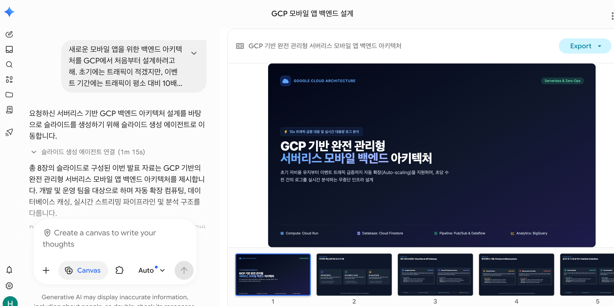

> 💬 **프롬프트 2 (캔버스 테마 및 IT 기술 문서 스타일 커스터마이징):**
> ```text
> 위에서 생성된 슬라이드를 하얀색 바탕의 깔끔하고 모던한 IT 기술 문서 스타일로 다시 작성해줘. 아키텍처 구성 요소(Compute, Storage, Streaming Analytics)를 시각적인 카드 형태로 구분하고 발표용 핵심 요약 포인트를 포함해줘.
> ```

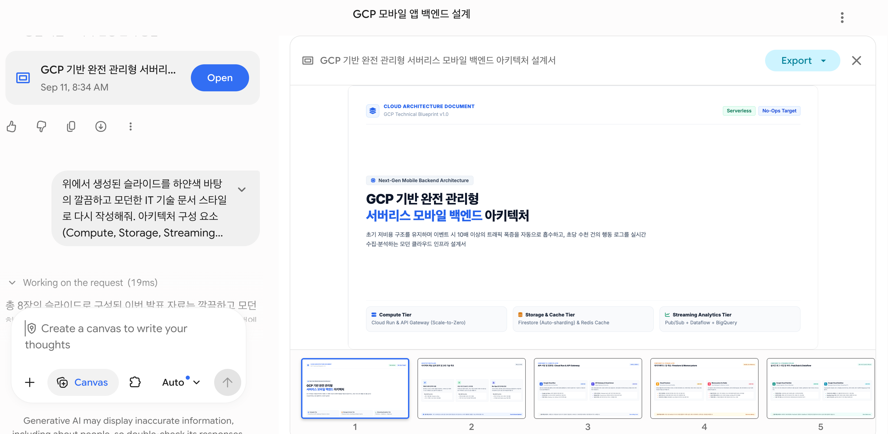

> 💬 **프롬프트 3 (PDF, PPTX, Google Slides 다운로드/내보내기):**
> 
> 생성된 프레젠테이션 슬라이드는 상단의 내보내기(Export) 메뉴를 통해 PDF, PPTX 또는 Google Slides로 다운로드 및 연동할 수 있습니다.

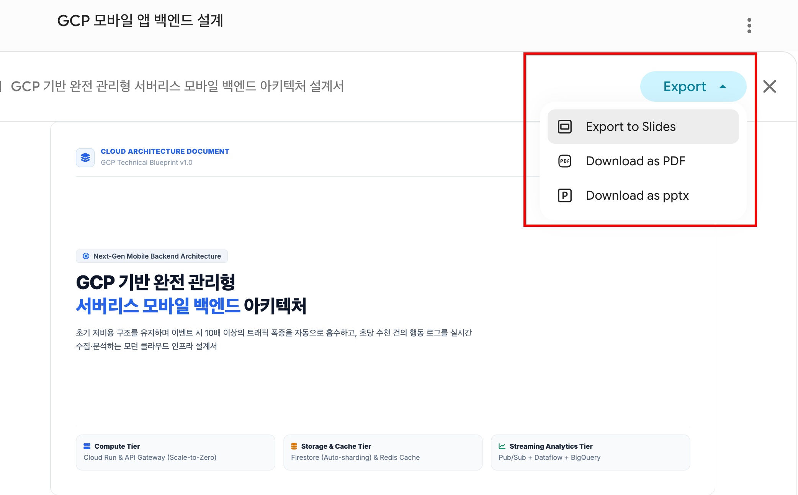

#### 3) 검증 포인트
- [ ] 대화창 우측에 독립된 Canvas 인터랙티브 워크스페이스가 열리며 문서 및 슬라이드가 실시간 렌더링되는가?
- [ ] 단순 텍스트 나열을 넘어 구조화된 멀티 슬라이드(제목, 아키텍처 개요, 서비스 매핑, 결론) 레이아웃으로 자동 구성되는가?
- [ ] 스타일 지정 프롬프트(모던 IT 기술 문서, 하얀색 배경 등)에 맞추어 슬라이드 템플릿과 디자인 톤이 즉시 변경되는가?
- [ ] 생성된 슬라이드를 로컬 `.pptx` 파일로 다운로드하거나 Google Slides로 직접 내보내기(Export)할 수 있는가?

---

## 4. 트러블슈팅 및 운영 권장사항

| 증상 / 오류 | 점검 및 조치 방안 |
| :--- | :--- |
| **커넥터(Drive/Mail) 검색 결과 없음** | 1. 계정 연동 권한 및 Google Workspace Admin 설정 확인<br>2. 색인 지연 여부 점검 (최근 업로드 파일은 수 분 소요 가능) |
| **스킬이 자동으로 로드되지 않음** | 1. `SKILL.md`의 `description`에 명확한 트리거 키워드가 포함되었는지 확인<br>2. `.agents/skills/` 디렉토리 경로 및 YAML 문법 오류 점검 |
| **서브 에이전트 위임 실패** | 1. 프롬프트에 구체적인 산출물 형태(예: "캔버스 문서로 작성", "4K 이미지 생성") 명시<br>2. 에이전트 라우팅 권한 상태 확인 |
| **MCP 도구 호출 오류** | 1. MCP 서버 구동 여부 및 JSON-RPC 연결 상태 확인<br>2. 입력 파라미터 스키마가 일치하는지 `mcp_config.json` 로그 점검 |
| **Canvas 슬라이드 생성/내보내기 실패** | 1. 프롬프트에 "구글 슬라이드로 요약해줘" 또는 "Canvas로 작성" 키워드를 명시<br>2. 브라우저 팝업 차단 해제 (.pptx 다운로드 시) 및 Google Slides 연동 권한 확인 |
