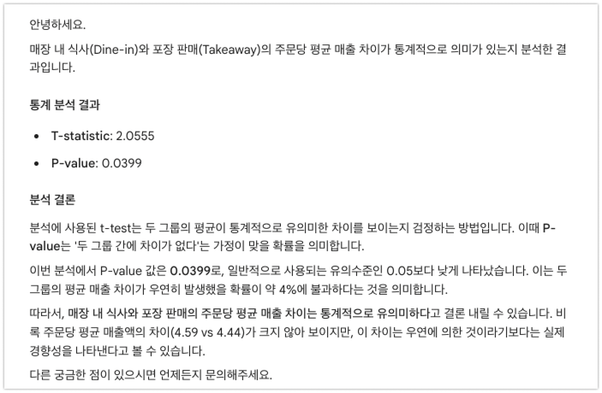
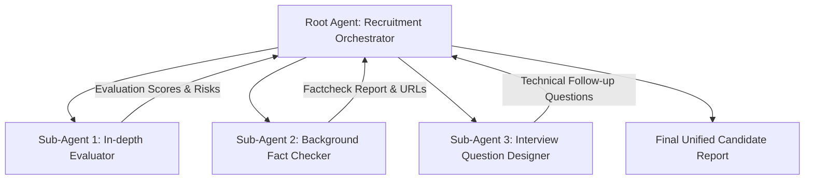

# 🚀 Gemini Enterprise Hands-on Workshop Guide

Welcome to the **Gemini Enterprise Hands-on Workshop**! This guide is designed to help you explore and master the enterprise-grade AI capabilities of **Google Gemini Enterprise**. 

---

## 💡 What is Gemini Enterprise?

**Gemini Enterprise** is Google Cloud's AI platform tailored for business productivity, enterprise data grounding, and intelligent workflow automation. Unlike consumer AI tools, Gemini Enterprise offers:

1. **🔒 Enterprise-Grade Security & Privacy**: Your prompts, data, and models are fully isolated and protected with strict governance (e.g., Model Armor for PII masking).
2. **🔌 Deep Enterprise Connectivity**: Direct integration with Google Workspace (Drive, Docs, Gmail) and third-party platforms (Jira, Confluence, Salesforce, Databases).
3. **🔍 Real-Time Grounding & Deep Research**: Combines live Google Web Search with complex document reasoning and citation verification.
4. **🤖 No-Code / Low-Code Agent Studio**: Build, schedule, and orchestrate single or multi-agent workflows tailored to specific business processes without writing code.
5. **🎨 Multimodal Content & Canvas Creation**: Native generation and editing of text, structured tables, presentation slides, images (Imagen 3), and videos (Veo).

---

## 📌 Workshop Agenda & Overview

| Module | Key Focus Areas | Hands-on Highlights |
| :--- | :--- | :--- |
| **01. Core Features & Chat** | Omnibar, Web Search, Sharing | Executing business prompts, sharing chat links |
| **02. Data Analysis (Excel)** | Survey & Sales Data Reasoning | Pivot insights, trend analysis, statistical tests |
| **03. Document Reasoning (PPT)** | Executive Summarization | Feature extraction & GA/Preview status mapping |
| **04. Media Generation** | Imagen 3 & Veo Video | Poster generation, image editing, video clips |
| **05. Deep Research** | Multi-source Synthesis | Deep business analysis & exporting to Docs |
| **06. Canvas & Slides** | Slide & Report Generator | Architecture design, slide deck creation |
| **07. NotebookLM** | Grounded AI Assistant | Studio audio, infographics, cinematic slides |
| **08. Agent Designer** | Low-code Automation | Social media agent, scheduling automated runs |
| **09. Multi-Agent System** | Root & Sub-agent Orchestration | HR Recruitment evaluation multi-agent pipeline |
| **10. Demos & Resources** | Advanced Integrations | Conversational Analytics (CA) & MCP Demos |

---

## 1. 💬 Core Features & Smart Web Search

Connect to your assigned **Gemini Enterprise App** to start exploring basic prompts, grounding with live Web Search, and chat sharing.

### 1.1 Market & Competitor Analysis Prompt
Enter the following prompt into the Omnibar:

> 💬 **Prompt:**
> ```text
> 나는 10년차 글로벌 마케팅 전문가야.
> 최근 북미 및 유럽 시장의 ‘스마트홈(ThinQ 연동) 프리미엄 가전’ 트렌드를 검색해서 요약해줘. 특히 주요 경쟁사들의 최근 마케팅 소구점(Selling Point)을 도출하고, LG전자 제품에 적용할 만한 인사이트를 제시해줘.
> ```

<p align="center">
  
</p>

> 💡 **Tip:** Review the generated sources and try clicking the **Follow-up Questions** generated at the bottom.

### 1.2 Additional Business Practice Prompts

<details>
<summary>👉 Click to expand additional business prompts (Matter, CES 2026, EU Policy, B2B Robots)</summary>

```text
최근 3개월간 북미 테크 매체에서 보도된 '스마트홈 매터(Matter) 표준' 및 'AI 가전' 관련 기사들을 검색해서 주요 동향을 요약해 줘. 이 트렌드를 바탕으로 LG 씽큐(ThinQ) 앱의 2026년 하반기 업데이트에 추가할 만한 타사 기기 연동 기반의 차별화된 고객 경험 시나리오 3가지를 제안해 줘.
```

```text
최근 열린 'CES 2026'에서 주요 경쟁사들이 발표한 프리미엄 TV 기술 및 마케팅 트렌드를 웹 검색으로 분석해 줘. 특히 중국 업체들의 추격 양상을 요약하고, 이를 방어하기 위해 LG 올레드(OLED) TV가 글로벌 게이머들을 타겟으로 내세워야 할 핵심 마케팅 메시지를 3줄로 작성해 줘.
```

```text
2026년 현재 유럽연합(EU)의 전기차(EV) 보조금 정책 변화와 탄소국경조정제도(CBAM) 관련 최신 글로벌 뉴스를 검색해 줘. 이러한 정책 변화가 LG전자의 전장(VS) 사업부 유럽 시장 진출에 미칠 영향을 SWOT(강점, 약점, 기회, 위협) 분석 매트릭스 형태로 시각화해서 정리해 줘.
```

```text
현재 미국 B2B 시장 내 서빙 로봇 및 물류 로봇의 시장 규모 전망과 주요 경쟁사(예: 베어로보틱스 등)의 최근 행보를 검색해 줘. 이 정보를 바탕으로 LG 클로이(CLOi) 로봇이 북미 대형 프랜차이즈 레스토랑을 공략하기 위한 영문 세일즈 피치덱(Pitch Deck)의 슬라이드별 핵심 목차 구성을 짜줘.
```
</details>

---

### 1.3 Collaboration: Sharing Chat Sessions
Share your active session with your lab partner using the Share feature.

1. Click the **Share** button at the top right of the chat window.
<p align="center">
  
</p>

2. Copy the generated URL and send it to your partner.
<p align="center">
  
</p>

3. Open the shared link to verify the full conversation history and ask follow-up questions together.
<p align="center">
  
</p>

---

## 2. 📊 Excel Data Analysis & Reasoning

Gemini Enterprise features advanced code execution and reasoning capabilities to analyze raw Excel and CSV spreadsheets without writing manual formulas or Python scripts.

### 2.1 Survey Analysis
Upload `Excel_example_survey.xlsx` to the chat.

<p align="center">
  
</p>

> 💬 **Prompts to try:**
> ```text
> 이 문서로 어떤 분석을 할 수 있어?
> ```
> ```text
> 가장 만족도가 높았던 세션은 무엇이고, 가장 만족도가 낮았던 세션은 무엇이며, 이유가 뭐였어?
> ```
> ```text
> 향후 이벤트에 도움이 될 개선사항을 포함한 이벤트 결과 보고서를 작성해줘.
> ```

<p align="center">
  
</p>
<p align="center">
  
</p>

---

### 2.2 Sales & Order Data Analysis
Upload `coffee orders.xlsx` to the chat.

> 💬 **Prompts for Sales Trends & Statistical Testing:**
> ```text
> (주문 완료일)을 기준으로 일별, 주별, 월별 매출(Orders Total Sales)의 변화를 분석하여 매출이 높은 시기와 낮은 시기를 파악해줘.
> ```
> ```text
> (주문 유형: Dine-in, Takeaway)에 따라 매출이 어떻게 다른지 분석하여 매장 내 식사와 포장 판매의 비중을 파악해줘.
> ```
> ```text
> 매장 내 식사와 포장 판매의 주문당 평균 매출 차이가 의미 있는지 통계적으로 분석해줘.
> ```

<p align="center">
  
</p>
<p align="center">
  
</p>

---

## 3. 📑 PowerPoint Document Summarization

Upload `202603-BigQuery New Feature 업데이트.pptx` to extract release notes and feature status.

> 💬 **Prompt:**
> ```text
> BigQuery New Feature 들에 대해서 각 기능별로 기능 요약을 해주고, 기능별로 GA, Preview 여부를 표로 작성해서 보여줘.
> ```

<p align="center">
  
</p>

---

## 4. 🎨 Media Generation (Image & Video)

Powered by Google's state-of-the-art **Imagen 3** (Image) and **Veo** (Video) generative models.

### 4.1 Image Creation from Text Prompts
Select the **Image Generation** tool and enter:

> 💬 **Prompt:**
> ```text
> Gemini Enterprise를 잘 쓰고 싶어하는 직장인을 위한 팁과 핵심 기능을 알려주는 포스터(9:16)를 그려줘.
> 
> 내용 참고:
> - AI Assistant & Web Search
> - Deep Research
> - NotebookLM
> - Agent Designer
> - Enterprise Connectors
> - Model Armor & Security
> ```

<p align="center">
  
</p>
<p align="center">
  
</p>

### 4.2 Image Editing & Translation
1. Upload **`lg wash tower.jpg`** and select the Image tool:
   > 💬 *"좌측 상단의 로고를 제외한 모든 Text를 한국어로 번역해줘."*
   <p align="center"></p>

2. Upload **`Handwrite_arch.png`**:
   > 💬 *"첨부한 아키텍처를 Google Cloud Architecture 스타일로 다시 그려줘."*

3. Upload a **Personal Photo**:
   > 💬 *"사진 속 인물을 아이소메트릭(isometric) 시점의 LEGO 미니피규어 포장 상자 스타일로 변환하세요. 상자에는 'Gemini Enterprise Hands on Workshop'라는 라벨을 붙이세요."*

---

### 4.3 High-Quality Video Generation (Veo)

Enter cinematic prompt descriptions to produce commercial-ready videos:

> 💬 **Perfume Commercial Prompt:**
> ```text
> 향수병을 소개하는 고급스러운 홍보 영상을 만드세요. 호박색 액체로 채워진 투명한 유리 향수병의 각진 마개에 초점을 맞춰 밀착한 클로즈업 돌리 레프트 샷으로 동영상을 시작합니다. 유리병에 물방울이 은은하게 맺혀 있습니다. 병은 욕실의 깔끔한 흰색 대리석 위에 놓여 있습니다. 배경의 창문에서 부드러운 자연광이 흘러들어와 장면을 비춥니다. 유칼립투스 잎과 천연 나무 향의 디퓨저 스틱이 병 주위로 튀지 않게 배치되어 있습니다. 전체적으로 우아하고 신선하며 세련된 분위기입니다.
> ```

<p align="center">
  
</p>

<details>
<summary>🎬 Click to view Cheeseburger & Skateboarding video prompts</summary>

```text
프롬프트: "꽉 눌려 짜지는 육즙 가득한 치즈버거의 익스트림 클로즈업 매크로 샷."
상세 묘사: "녹아내린 치즈가 옆으로 천천히 흘러내림. 김이 모락모락 피어오름."
촬영 기법: "전문적인 음식 사진 촬영, 하이 키 조명(high key lighting), 4k 해상도, 슬로우 모션."
```

<p align="center"></p>

```text
프롬프트: "1990년대 VHS 미학. 스케이트보더가 교외의 거리에서 카메라를 스쳐 지나가며 빠르게 올리(ollie) 기술을 선보임."
상세 묘사: "수동 촬영 특유의 흔들림, 색 번짐(chroma bleeding), 날짜 스탬프 효과."
```
</details>

---

## 5. 🔬 Deep Research Mode

**Deep Research** automatically executes multi-step web searches, reads dozens of sources, cross-references citations, and compiles comprehensive research reports.

> 💬 **Prompt:**
> ```text
> 현재 LG전자의 로봇 사업 경쟁력과 미래 전망을 종합적으로 분석해 줘. 먼저 글로벌 및 국내 상업용 로봇 시장에서의 LG전자 포지셔닝과 핵심 경쟁 우위를 진단해 줘. 이어서 최근 공개된 '스마트홈 AI 에이전트'를 포함한 B2C 영역으로의 확장이 가지는 의미를 평가하고, 이를 바탕으로 향후 LG전자 로봇 사업이 직면할 주요 기회와 위협 요인을 논리적으로 설명해 줘.
> ```

<p align="center">
  
</p>

> 💡 **Export:** Click **Export to Docs** to save the generated report directly to Google Drive.

---

## 6. 🎨 Canvas & Presentation Generation

Gemini Enterprise **Canvas** allows real-time interactive generation of documents, HTML widgets, and Google Slides.

<p align="center">
  
</p>

> 💬 **Cloud Architecture Slide Prompt:**
> ```text
> 새로운 모바일 앱을 위한 백엔드 아키텍처를 GCP에서 처음부터 설계하려고 해. 트래픽 자동 확장(Auto-scaling)과 실시간 로그 수집/분석 파이프라인이 필요해. 서버리스(Serverless) 및 완전 관리형(Managed) 서비스 위주로 인프라를 설계하고 각 서비스 선택 이유를 설명해 줘.
> 
> 그리고 슬라이드로 요약해줘. 하얀색 바탕의 깔끔하고 모던한 IT 기술 문서 스타일로 작성해줘.
> ```

<p align="center">
  
</p>
<p align="center">
  
</p>

> 📥 **Export to PPTX:** Download your generated slide decks as `.pptx` or open directly in Google Slides.

---

## 7. 📔 NotebookLM Studio

NotebookLM acts as a **personalized AI research assistant grounded exclusively in your uploaded source materials**.

<p align="center">
  
</p>

### 7.1 Creating Notebooks & Adding Grounded Sources
1. Open NotebookLM and create a new notebook.
2. Paste source text (e.g., *LG "안심" Home Guardian Ecosystem*, *LumiCare*, *Sentinel Companion* product proposals).

<p align="center">
  
</p>

### 7.2 Infographic & Sketch Note Generation
Generate visual artifacts based strictly on the uploaded text sources:

> 💬 **Prompts:**
> - *"LG '루미케어' - 공감하는 세탁 도우미를 인포그래픽으로 생성해주세요."*
> - *"LG '안심' 홈 가디언 에코시스템 아이디어를 손으로 그린 듯한 (Sketch Note) 스타일로 작성해주세요."*
> - *"LG 센티넬 컴패니언 아이디어를 신문 인포그래픽 스타일로 작성해 주세요."*

<p align="center">
  
</p>
<p align="center">
  
</p>

---

### 7.3 Step-by-Step Guide Creation from Screenshots
Upload walkthrough screenshots (e.g., `data_agent.zip` containing 10 image steps) to NotebookLM:

> 💬 **Prompt:** *"BigQuery Data Agent를 생성하는 과정을 초보자도 쉽게 따라할 수 있도록 가이드 문서를 작성해줘."*

| Left Steps | Right Steps |
| :---: | :---: |
| <br> | <br> |

---

## 8. 🛠️ Low-Code Agent Studio (Agent Designer)

Build, test, share, and schedule autonomous custom AI agents without writing code.

### 8.1 Creating a Social Media Content Agent
1. Navigate to the **Agent** menu and click **New Agent**.
2. Enter the prompt description:
   > 💬 *"뉴스 링크를 입력 받아서 Social Media 포스팅할 게시물 문구를 생성하는 에이전트를 만들어줘. 한 줄 요약문, Bullet point 5개, 추천 해시태그를 포함해줘."*

<p align="center">
  
</p>

3. View the generated workflow in **Flow View** and click **Create**:
<p align="center">
  
</p>

4. Test your agent with a news URL:
<p align="center">
  
</p>

---

### 8.2 Agent Scheduling
Automate agent executions (e.g., daily morning reports):

1. Open your agent in **Agent Designer**.
2. Click the **Schedule** tab and select **Add Schedule**.
3. Set execution time (test by setting it to 2 minutes from now).
4. Save and verify that the schedule turns **Active**.

<p align="center">
  
</p>
<p align="center">
  
</p>

---

## 9. 🤝 Multi-Agent Orchestration

Learn how to build a **hierarchical multi-agent system** where a Root Orchestrator delegates specialized tasks to Sub-Agents in sequence.



### 9.1 Root Agent: GOOG전자 채용 총괄 에이전트
- **Name:** GOOG전자 채용 총괄 에이전트
- **Description:** Orchestrates candidate resume review by sequentially calling Sub-Agents.
- **Model:** Gemini 3.5 Flash
- **Knowledge Base:** `2026년 GOOG전자 서류전형 평가 가이드라인.docx`

<details>
<summary>📜 Click to view Root Agent Instruction Prompt</summary>

```text
## Role
당신은 GOOG전자의 채용 프로세스 전체를 오케스트레이션하는 메인 에이전트입니다. 하위 전문가 에이전트 3명을 순서대로 호출하고 결과를 취합하여 최종 종합 리포트를 작성하십시오.

## Execution Protocol
1. Silent Execution: 중간 과정 메시지를 노출하지 말고 최종 리포트만 출력하십시오.
2. Step 1: '서류 심층 평가자' 에이전트를 호출하여 심층 평가 점수를 수집하십시오.
3. Step 2: '백그라운드 팩트체커' 에이전트를 호출하여 팩트체크 리포트를 수집하십시오.
4. Step 3: '면접 질문 기획자' 에이전트를 호출하여 심층 면접 질문을 기획하십시오.

## Output Expectations
[GOOG전자 채용 서류 종합 검토 리포트]
1. 서류 심층 평가 결과 (종합 점수, Plus/Minus Point, PASS/FAIL 추천)
2. 백그라운드 팩트체크 검증 리포트 (고유명사 검증 & Google Search 출처 URL)
3. 심층 면접 꼬리 질문 3가지
```
</details>

<p align="center">
  
</p>

---

### 9.2 Sub-Agents Configuration

#### 1️⃣ Sub-Agent 1: 서류 심층 평가자
- **Role:** Analyzes resume against HR scoring guidelines (0-100 points).
- **Hand-off:** Returns evaluation directly to Parent Agent without talking to user.

#### 2️⃣ Sub-Agent 2: 백그라운드 팩트체커
- **Role:** Extracts key nouns, projects, and companies; verifies truthfulness via Google Search Connector.
- **Tools:** Google Search Enabled.

#### 3️⃣ Sub-Agent 3: 면접 질문 기획자
- **Role:** Takes evaluation and factcheck context to design 3 sharp follow-up interview questions.

<p align="center">
  
</p>
<p align="center">
  
</p>

### 9.3 Execution & Candidate Report Result
Upload candidate resume (`GOOG전자 입사지원서_이OO.pdf`) to trigger the Multi-Agent pipeline:

<p align="center">
  
</p>
<p align="center">
  
</p>

---

## 10. 📹 Advanced Video Demos & References

| Feature | Video Walkthrough Link |
| :--- | :--- |
| **Canvas Interactive Slides** | 📺 [Watch Canvas Slide Creation](https://www.youtube.com/watch?v=Bk5Ha2cceEY) |
| **Canvas Video Generation** | 📺 [Watch Canvas Video Walkthrough](https://www.youtube.com/watch?v=4-5qeh4IXVY) |
| **Model Context Protocol (MCP)** | 📺 [Watch MCP Integration Demo](https://www.youtube.com/watch?v=wIbSGZsU5WI) |
| **BigQuery CA Agent Creation** | 📺 [Watch Conversational Analytics Agent Build](https://www.youtube.com/watch?v=VFdJIaGQhhY) |
| **BigQuery CA Agent Usage** | 📺 [Watch Gemini Enterprise CA Demo](https://www.youtube.com/watch?v=l3Qc1RIXCvw) |

---

<p align="center"><b>🎉 Congratulations on completing the Gemini Enterprise Hands-on Workshop! 🎉</b></p>
