# 🏘️ Gemini Enterprise 심화 워크플로 에이전트(Workflow Agent) 개발 및 핸즈온 랩 가이드
### — 수동(Manual) 빌더로 한 스텝씩 직접 조립하는 부동산 맞춤형 자문 파이프라인 —

본 문서는 자연어 자동 생성(Scaffolding)에 의존하지 않고, **Gemini Enterprise Workflow Builder의 빈 캔버스(Empty Canvas)에서 시작하여 모든 노드(Trigger, Gemini Agent, JSON Schema, MCP 서버, 기존 에이전트 호출, Condition 분기, HITL 승인, Gmail 발송, Google Drive 저장)를 처음부터 하나씩 수동(Step-by-Step Manual)으로 추가하고 연결하는 심화 핸즈온 개발 가이드**입니다.

이 워크플로 에이전트는 **부동산에 관심이 많은 사용자에게 적합한 다양한 부동산 정보를 제공하는 것**을 목적으로 하며, **사용자가 Gmail에서 부동산 관련 질문 이메일을 송신(발송, `When an email is sent`)하면** 다음 과정을 순차적으로 실행합니다:
1. 질문 내용을 분석하여 **JSON Schema**로 핵심 변수(관심 지역, 조회 연도, 심층 분석 주제, 자문 중요도)를 추출합니다.
2. **한국 부동산 20개년 지표 MCP 서버(`MCP Realestate`)**를 호출해 기준금리, 서울/지방 아파트 평균가, M2 통화량, 미분양 데이터를 조회합니다.
3. 구글 검색(Google Search)을 통해 최신 부동산 정보를 검색·분석해 주는 **`Realest_research` 에이전트**를 호출하여 최신 시장 동향, 부동산 정책·규제 이슈, 지역별 매매·전세 수급 상황을 실시간으로 분석합니다.
4. 정량 시계열 데이터와 최신 부동산 시장 검색·분석 인사이트를 하나의 맞춤형 보고서로 통합한 뒤, 중요도(`priority`)에 따라 분기하여 **`High` 등급인 경우 사람의 승인(HITL)을 거쳐 Gemini Agent가 질문자에게 Gmail 답변 발송 및 Google Drive 보고서 파일 저장을 수행하고, `Else` 상황에서는 이메일만 발송**합니다.

---

## 📌 목차
1. [워크플로 에이전트 개요 및 사전 준비 (Overview & Prerequisites)](#1-워크플로-에이전트-개요-및-사전-준비-overview--prerequisites)
2. [엔드투엔드 부동산 자문 워크플로 아키텍처](#2-엔드투엔드-부동산-자문-워크플로-아키텍처)
3. [처음부터 수동(Step-by-Step Manual)으로 워크플로 직접 구축하기 (7 Hands-on Labs)](#3-처음부터-수동step-by-step-manual으로-워크플로-직접-구축하기-7-hands-on-labs)
   - [Lab 1. 빈 캔버스에서 새 워크플로 생성 및 트리거(Trigger) 수동 구성](#lab-1-빈-캔버스에서-새-워크플로-생성-및-트리거trigger-수동-구성)
   - [Lab 2. [Step 1 추가] Gemini Agent 1: 부동산 Knowledge 바인딩 및 JSON Schema 출력 설정](#lab-2-step-1-추가-gemini-agent-1-부동산-knowledge-바인딩-및-json-schema-출력-설정)
   - [Lab 3. [Step 2 추가] MCP 서버(`MCP Realestate`) 연동: 20개년 부동산 및 거시경제 지표 조회](#lab-3-step-2-추가-mcp-서버mcp-realestate-연동-20개년-부동산-및-거시경제-지표-조회)
   - [Lab 4. [Step 3 & 4 추가] `Realest_research` 에이전트 호출 및 종합 보고서 작성 노드](#lab-4-step-3--4-추가-realest_research-에이전트-호출-및-종합-보고서-작성-노드)
   - [Lab 5. [Step 5 & 6 추가] 흐름 제어(`Condition`) 분기 및 `Human-in-the-Loop` 승인 게이트 배치](#lab-5-step-5--6-추가-흐름-제어condition-분기-및-human-in-the-loop-승인-게이트-배치)
   - [Lab 6. [Step 7 & 8 추가] 분기별 `Gemini Agent` 액션 연동: `High` 경로(이메일 발송 + Drive 저장) 및 `Else` 경로(이메일만 발송)](#lab-6-step-7--8-추가-분기별-gemini-agent-액션-연동-high-경로이메일-발송--drive-저장-및-else-경로이메일만-발송)
   - [Lab 7. 시뮬레이션 테스트(`Test`), 버전 배포(`Turn on`) 및 실행 로그(`Runs`) 검증](#lab-7-시뮬레이션-테스트test-버전-배포turn-on-및-실행-로그runs-검증)
4. [Workflow Agent Prompt 참고](#4-workflow-agent-prompt-참고)
5. [엔터프라이즈 아키텍처 모범 사례 및 트러블슈팅 (Best Practices & FAQ)](#5-엔터프라이즈-아키텍처-모범-사례-및-트러블슈팅-best-practices--faq)

---

## 1. 워크플로 에이전트 개요 및 사전 준비 (Overview & Prerequisites)

### 1.1 왜 수동(Manual) 빌더로 워크플로를 설계하는가?
초기 입문 과정([`nocode_basic.md`])에서는 자연어 프롬프트 한 줄로 에이전트를 자동 생성했지만, 실제 엔터프라이즈 환경에서 **외부 MCP 서버(`MCP Realestate`)의 정수형 파라미터(`start_year`, `end_year`)를 정확히 바인딩하고, 기존 에이전트(`Realest_research`)의 구글 검색 기반 최신 부동산 분석 결과를 후속 노드에 합성하며, 분기별 `Gemini Agent`에 Gmail 및 Google Drive 앱을 연결해 실행 액션을 세밀하게 제어**하려면 비주얼 빌더에서 각 노드를 직접 추가(`+ Add step`)하고 조립하는 방법을 반드시 숙지해야 합니다.

| 비교 항목 | 일반 대화형 에이전트 (Chat Agent) | 수동 빌더 기반 부동산 Workflow Agent |
| :--- | :--- | :--- |
| **구축 방식** | 프롬프트 지침 위주 설정 | 빈 캔버스에서 **`+ Add step`으로 8개 노드를 직접 배치 및 변수 바인딩** |
| **실행 트리거** | 사용자가 채팅창에 직접 질문 입력 | **Gmail에서 부동산 질문 메일 송신(`When an email is sent`) 시 자동 시작** (수동/스케줄 트리거 지원) |
| **데이터 정형화** | 비정형 텍스트 응답 | **JSON Schema**로 `target_region`, `start_year`, `end_year`, `priority` 정밀 추출 |
| **정량 + 최신 정보 결합** | 단일 LLM의 웹 검색 의존 | **`MCP Realestate` (20년 정량 지표)** + **`Realest_research` (구글 검색 기반 최신 부동산 시장·정책 분석)** 파이프라인 결합 |
| **최종 분기 액션** | 채팅 화면 답변 출력으로 종료 | • **`Priority == High`**: 사람 승인(HITL) 후 **Gemini Agent가 Gmail 발송 + Google Drive 파일 저장**<br>• **`Else` (일반 문의)**: **Gemini Agent가 Gmail로 이메일만 발송** |

### 1.2 사전 점검 항목 (Prerequisites)
실습을 시작하기 전에 다음 3가지 환경이 준비되어 있는지 확인합니다. (이 항목들은 사전에 Lab 환경 구성 담당자가 미리 설정해 두므로, 실습자는 정상 등록 여부만 점검하면 됩니다.)

1. **관리자 기능 및 커넥터 권한 확인**:
   - Gemini Enterprise에서 **Workflow Builder** 기능이 활성화되어 있어야 합니다.
2. **`MCP Realestate` (한국 부동산 20개년 지표 MCP 서버) 등록 확인**:
   - `MCP Realestate` 서버가 Cloud Run에 배포되어 Gemini Enterprise의 **MCP servers**에 등록되어 있어야 합니다.
   - 제공 도구: `get_factors_by_year(year)`, `get_factors_range(start_year, end_year)`, `get_all_factors()`
3. **`Realest_research` (최신 부동산 검색·분석 에이전트) 준비**:
   - 구글 검색(Google Search)을 통해 최신 부동산 뉴스, 시장 동향, 정책·규제 정보를 검색하여 심층 분석해 주는 **`Realest_research`** 에이전트가 에이전트 목록에 등록되어 있어야 합니다.

---

## 2. 엔드투엔드 부동산 자문 워크플로 아키텍처

우리가 빈 캔버스 위에서 **`+ Add step`** 버튼을 눌러 순서대로 직접 조립할 전체 노드 구조도입니다.

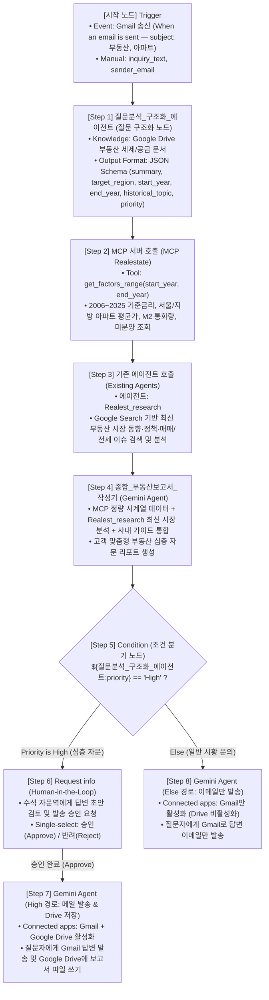
```mermaid
flowchart TD
    Trigger["[시작 노드] Trigger<br>• Event: Gmail 송신 (When an email is sent — subject: 부동산, 아파트)<br>• Manual: inquiry_text, sender_email"] --> Step1["[Step 1] 질문분석_구조화_에이전트 (질문 구조화 노드)<br>• Knowledge: Google Drive 부동산 세제/공급 문서<br>• Output Format: JSON Schema (summary, target_region, start_year, end_year, historical_topic, priority)"]
    
    Step1 --> Step2["[Step 2] MCP 서버 호출 (MCP Realestate)<br>• Tool: get_factors_range(start_year, end_year)<br>• 2006~2025 기준금리, 서울/지방 아파트 평균가, M2 통화량, 미분양 조회"]
    
    Step2 --> Step3["[Step 3] 기존 에이전트 호출 (Existing Agents)<br>• 에이전트: Realest_research<br>• Google Search 기반 최신 부동산 시장 동향·정책·매매/전세 이슈 검색 및 분석"]
    
    Step3 --> Step4["[Step 4] 종합_부동산보고서_작성기 (Gemini Agent)<br>• MCP 정량 시계열 데이터 + Realest_research 최신 시장 분석 + 사내 가이드 통합<br>• 고객 맞춤형 부동산 심층 자문 리포트 생성"]

    Step4 --> Step5{"[Step 5] Condition (조건 분기 노드)<br>${질문분석_구조화_에이전트:priority} == 'High' ?"}
    
    Step5 -->|"Priority is High (심층 자문)"| Step6["[Step 6] Request info (Human-in-the-Loop)<br>• 수석 자문역에게 답변 초안 검토 및 발송 승인 요청<br>• Single-select: 승인(Approve) / 반려(Reject)"]
    
    Step6 -->|"승인 완료 (Approve)"| Step7["[Step 7] Gemini Agent (High 경로: 메일 발송 & Drive 저장)<br>• Connected apps: Gmail + Google Drive 활성화<br>• 질문자에게 Gmail 답변 발송 및 Google Drive에 보고서 파일 쓰기"]
    
    Step5 -->|"Else (일반 시황 문의)"| Step8["[Step 8] Gemini Agent (Else 경로: 이메일만 발송)<br>• Connected apps: Gmail만 활성화 (Drive 비활성화)<br>• 질문자에게 Gmail로 답변 이메일만 발송"]
```

실제 구현 화면은 아래와 유사합니다. 

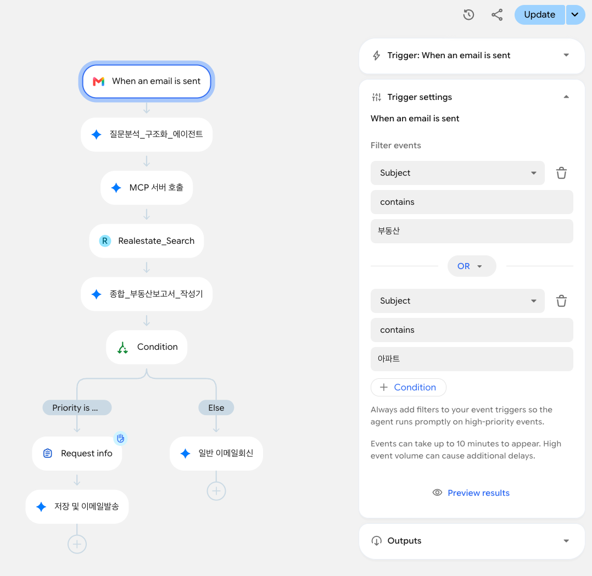

---

## 3. 처음부터 수동(Step-by-Step Manual)으로 워크플로 직접 구축하기 (7 Hands-on Labs)

자연어 프롬프트 자동 생성(Scaffolding)을 사용하지 않고, **수동 빌더 모드**로 진입하여 첫 번째 트리거부터 마지막 구글 드라이브 저장 노드까지 직접 클릭하며 만들어 봅니다.

---

### Lab 1. 빈 캔버스에서 새 워크플로 생성 및 트리거(Trigger) 수동 구성

#### 1) 수동 워크플로 빌더(Empty Canvas) 진입 및 기본 정보 입력
1. Gemini Enterprise 웹 앱 좌측 메뉴에서 **Agents (에이전트)**를 클릭합니다.
2. 우측 상단의 **Create agent** ➔ **Workflows**를 선택합니다.
3. 프롬프트 입력창 대신 화면 오른쪽 하단에서 **"빌더로 직접 만들기(Build Manually)"** 버튼을 클릭하여 **빈 워크플로 캔버스(Empty Canvas)**를 엽니다.
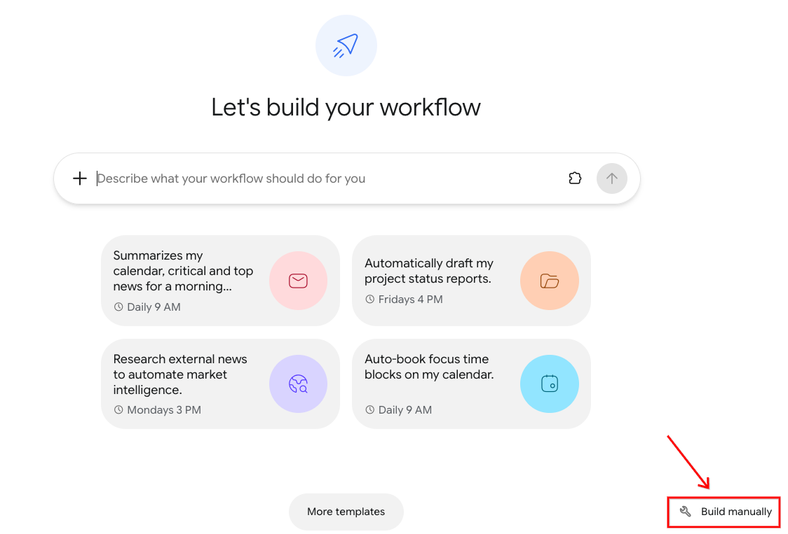

4. 좌측 상단(또는 에이전트 기본 정보 패널)에 워크플로의 이름과 설명을 수동으로 입력합니다:
   - **Name (워크플로 이름)**: `맞춤형 부동산 인사이트 에이전트`
   - **Description (설명)**:
     ```text
     Gmail에서 발송(송신)된 부동산 관련 질문 이메일을 분석하여 한국 부동산 20개년 지표(MCP Realestate)와 Realest_research 에이전트의 최신 부동산 검색·분석 결과를 결합한 뒤, 질문자에게 Gmail로 자동 답변을 보내고 Google Drive에 답변 보고서를 저장하는 워크플로 에이전트입니다.
     ```
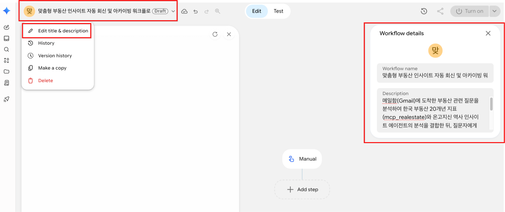


#### 2) 캔버스 최상단 `Trigger` 노드 수동 설정
캔버스 내에서 중앙에 기본 배치된 **Trigger(Manual(아이콘))** 블록을 클릭하여 우측 속성 패널을 엽니다.

##### ① 앱 이벤트 트리거 (Event Trigger — 메일 송신 시 자동 실행)
1. 트리거 유형 드롭다운에서 **`Event trigger`**를 선택합니다.
2. **Connector**: `Google Mail` (`Gmail`)을 선택합니다. (최초 연결 시 OAuth 계정 승인 팝업에서 허용 클릭)
3. **Event**: **`When an email is sent`** (이메일 송신/발송 시)를 선택합니다.
4. **Filter (필터 조건)** 입력란에 부동산 관련 질문 메일만 감지하도록 아래 검색어를 직접 입력합니다:
   ```text
   subject: 부동산
   subject: 아파트
   ```

> [!IMPORTANT]
> **왜 `이메일 수신(When an email is received)` 대신 `이메일 송신(When an email is sent)`으로 트리거링하나요?**
> 1. **사용자 주도형 트리거링의 편의성**: 실습 및 실무 테스트 환경에서 워크플로를 실행하기 위해 외부에서 이메일을 '받는 것(수신)'을 기다리는 것보다, **사용자 본인이 직접 질문 이메일을 '보내는 것(송신)'으로 워크플로를 트리거하는 것이 훨씬 즉각적이고 효과적**입니다.
> 2. **본인에게 보낸 메일(Self-sent Email)의 미작동 방지**: Gmail 커넥터의 `When an email is received`(이메일 수신) 이벤트는 **사용자 본인이 자기 자신의 이메일 주소로 보낸 메일에 대해서는 트리거링이 작동하지 않는 시스템적 제약**이 있습니다. 반면 **`When an email is sent`(이메일 송신)**를 선택하면 본인이 메일을 발송하는 것만으로도 100% 확실하게 워크플로가 트리거링됩니다.
> *(참고: 아래 일부 UI 참고 이미지에 `When an email is received`로 캡처된 항목이 있더라도, 실제 설정 시에는 반드시 바로 아래에 있는 **`When an email is sent`**를 선택하여 진행하세요.)*

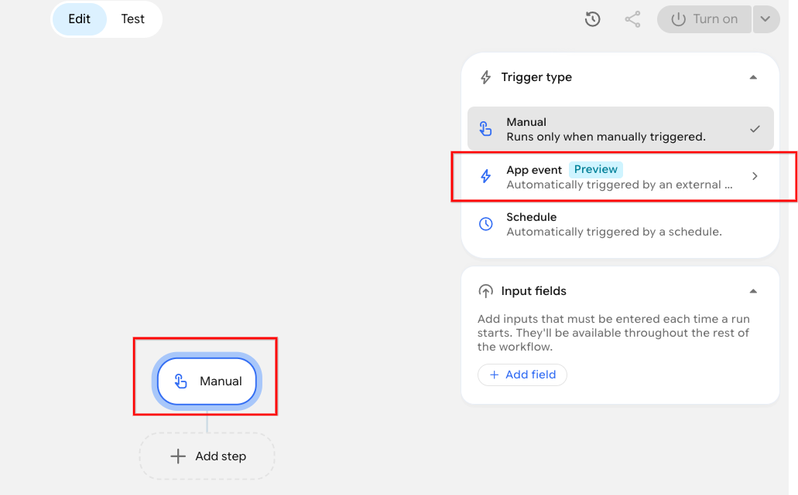

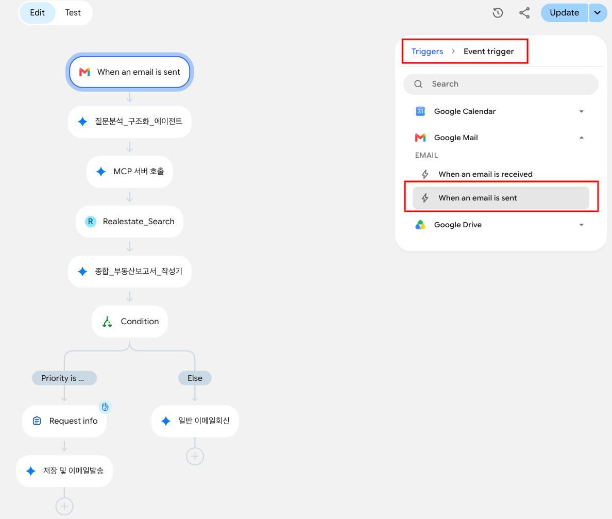

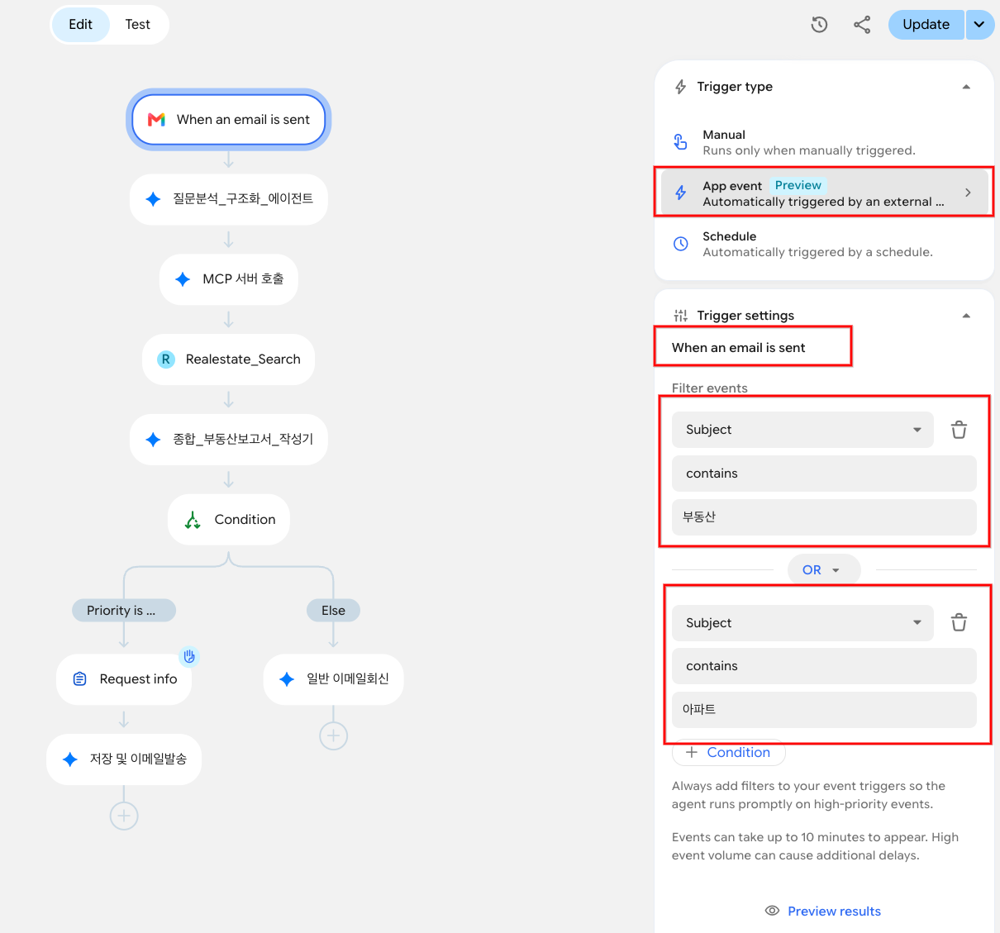


> [!IMPORTANT]
> **Gmail 이벤트 폴링(Polling) 참고사항**: `Event trigger`는 약 5~10분 주기로 메일함을 폴링합니다. 워크플로 조립 후 기다리지 않고 즉시 테스트하려면 **Lab 7의 Preview (`Test`) 시뮬레이션**을 사용합니다.

---

### Lab 2. [Step 1 추가] Gemini Agent 1: 부동산 Knowledge 바인딩 및 JSON Schema 출력 설정

Trigger 노드 바로 아래에 첫 번째 작업 노드로 **질문을 분석하고 정형화된 JSON 변수를 출력하는 `Gemini Agent` 노드**를 수동으로 추가합니다.

#### 1) `Gemini Agent` 노드 추가 및 이름 지정
1. 캔버스의 **Trigger** 노드 하단 중앙에 있는 **`+` (`+ Add step`)** 버튼을 클릭합니다.
2. 스텝 메뉴에서 **`Gemini Agent`**를 클릭하여 노드를 추가합니다.
3. 우측 설정 패널 상단에서 노드 식별자(Name)를 **`질문분석_구조화_에이전트`**로 확인/지정합니다.
4. **More**를 눌러 **Model** 드롭다운에서 **`Gemini 3.8 Flash`**(또는 **`최신 모델`**)를 선택합니다.

#### 2) Instructions (시스템 지침) 수동 입력
설정 패널의 **Instructions** 입력란에서 `</>`(텍스트 입력 모드)를 선택한 후 아래 프롬프트를 복사해 붙여넣습니다. (일반 편집 모드에서는 입력란 내부에서 `/` 또는 `+ Insert variable`을 눌러 Trigger(`When an email is sent`)의 메일 본문 변수를 직접 선택하여 삽입할 수 있습니다.)

> [!IMPORTANT]
> **참고**: 아래 텍스트 내의 변수명은 사용자의 설정 환경에 따라 달라질 수 있으므로, 가급적 `+ Insert variable` 버튼을 눌러 정확한 변수를 삽입해 주세요.

```text
당신은 부동산에 관심이 많은 사용자에게 최적의 데이터 분석 설계를 수행하는 '부동산 수석 분석 기획 에이전트'입니다.

송신(발송)된 이메일 본문(${when_an_email_is_sent.plaintextBody})과 제목(${when_an_email_is_sent.subject}), 그리고 연결된 Google Drive의 부동산 세제/청약 정책 문서를 참고하여 다음 6가지 항목을 정확히 도출하세요:

1. summary: 사용자의 부동산 질문 핵심 요약 (2~3문장)
2. target_region: 질문 대상 지역 (예: '서울', '수도권', '지방', '전국')
3. start_year: MCP 부동산 시계열 조회를 시작할 연도 (2006~2025 사이 정수, 명시되지 않으면 2015)
4. end_year: MCP 부동산 시계열 조회를 종료할 연도 (2006~2025 사이 정수, 명시되지 않으면 2025)
5. historical_topic: 'Realest_research' 에이전트에 질의할 최신 부동산 시장·정책 심층 검색 및 비교 분석 주제 (예: '최근 금리 전환기 서울 아파트 매매·전세 수급 동향 및 최신 대출·세제 규제 영향 분석')
6. priority: 자문 중요도 분류. 실제 매수/매도 의사결정 및 고액 투자 자문이면 'High', 단순 시황/지표 조회이면 'Low'로 분류하세요.
```

> [!IMPORTANT]
> **참고**: 아래 그림은 이메일을 수신했을 때(`When an email is received`)를 기준으로 캡처된 예시 이미지입니다. 본 실습에서는 앞서 설정한 이메일 송신(`When an email is sent`) 변수를 기준으로 설정해 주세요.

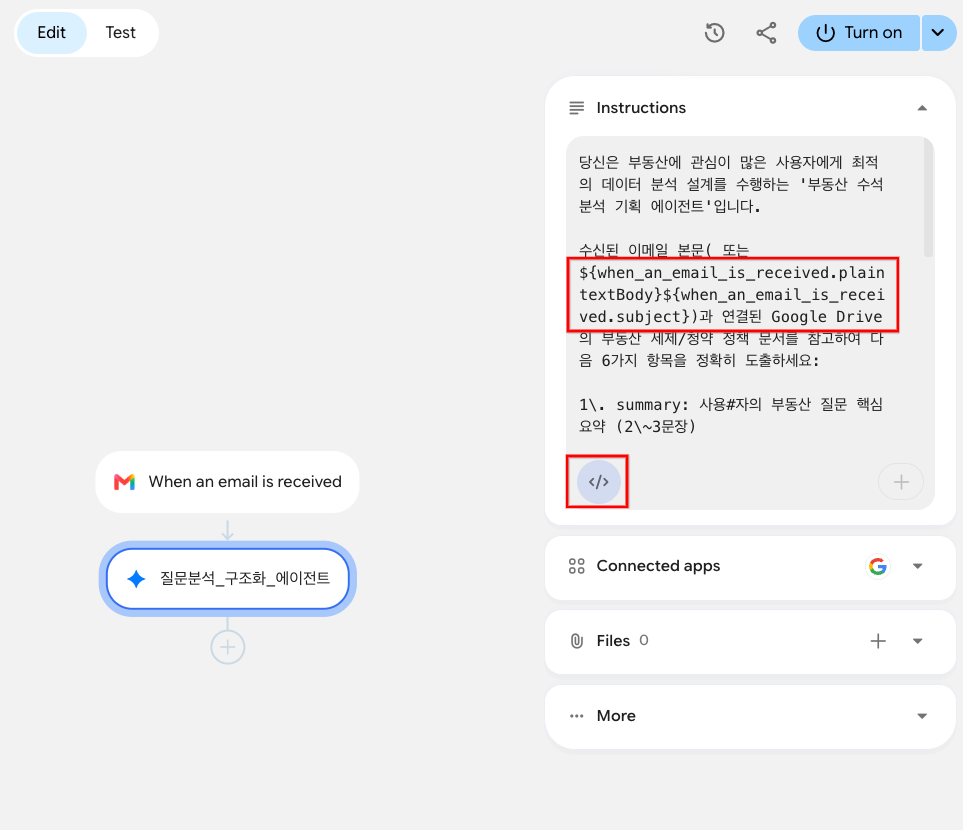
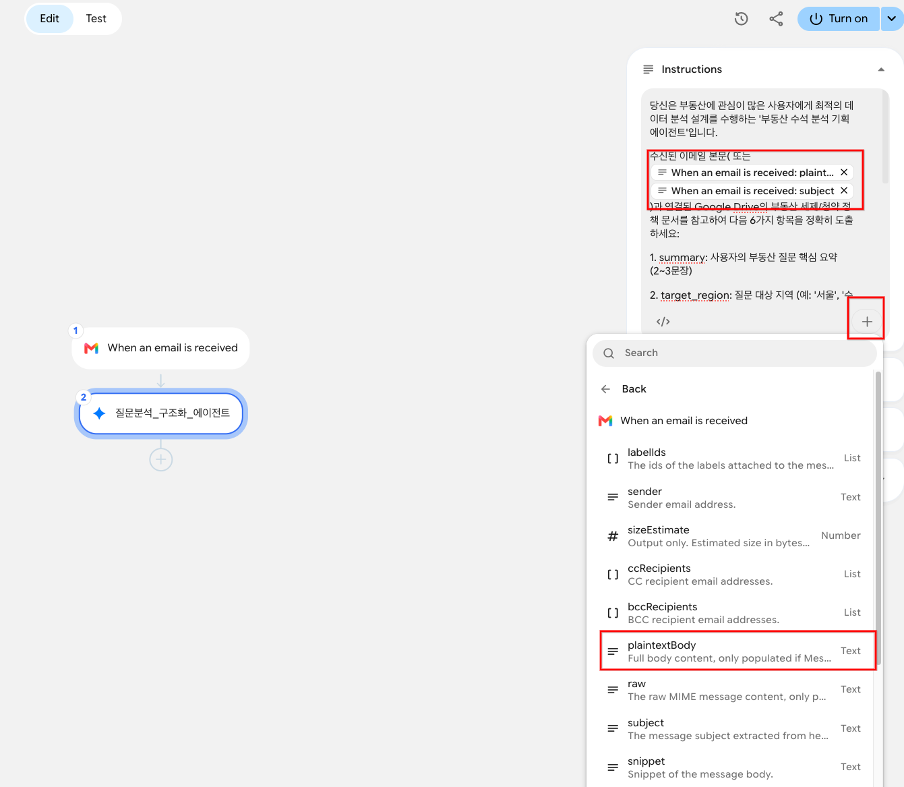


#### 3) Knowledge (부동산 정책 문서) 수동 바인딩
1. 우측 설정 패널의 **Knowledge** 항목에서 **`Add from Drive`** 버튼을 클릭합니다.
2. Google Drive 선택 창에서 사내 **부동산 세제 및 공급 관련 파일 2개**를 선택하여 추가합니다.

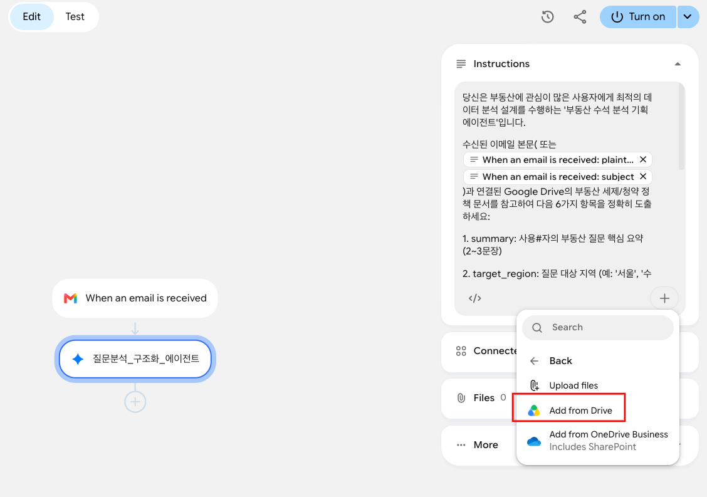
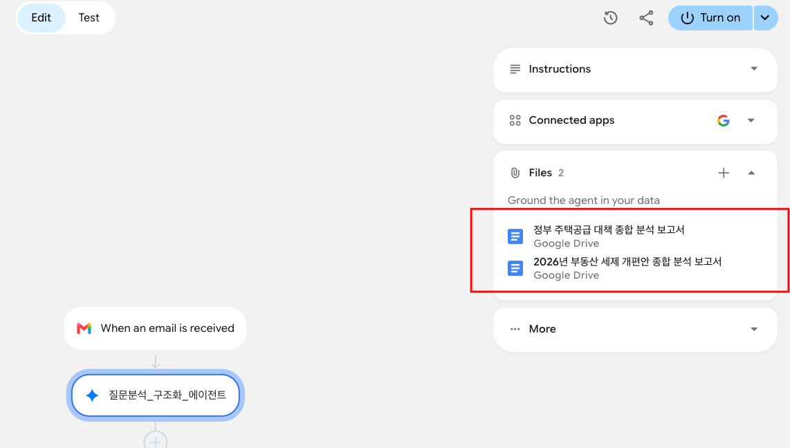

3. **Connected apps** 항목에서 **Drive**는 `Search for data`를 **Disable**로, `Add or update data`는 **Enable**로 설정합니다. (검색 시 드라이브 전체가 아닌 **Knowledge**에 연결된 지정 문서 2개만 참고하도록 제한하기 위함입니다.)

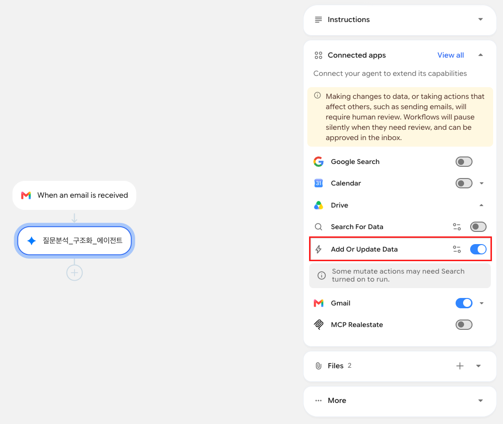

4. **Connected apps** 항목에서 **Gmail**의 `Search for data`와 `Add or update data`는 둘 다 **Enable**로 설정합니다. (메일 조회 및 발송 기능을 모두 사용할 수 있도록 권한을 부여합니다.)

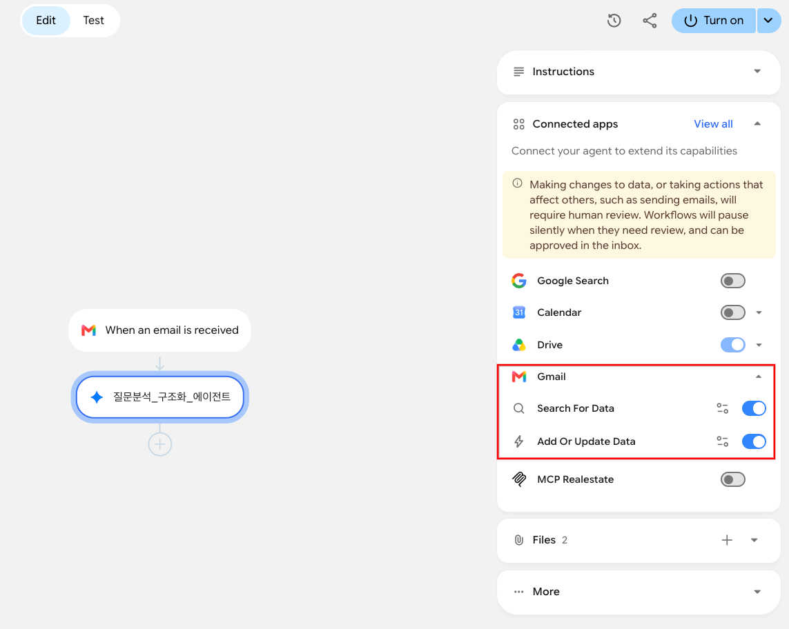


#### 4) Output format에 JSON Schema 직접 등록
1. 우측 설정 패널 하단의 **Output format**을 기본 `Plain Text`에서 **`Structured output`**으로 변경합니다.
2. 스키마 에디터 창에 아래와 같이 6개 필드 정보를 정확히 채워 넣습니다.

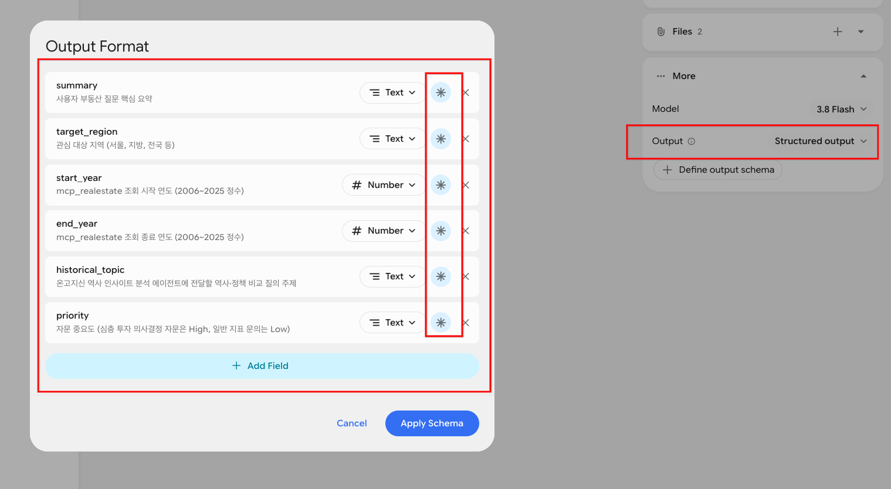

| 필드명 (Property) | 데이터 타입 (Type) | 설명 (Description) | 필수 여부 (Required) |
|---|---|---|---|
| `summary` | `string` | 사용자 부동산 질문 핵심 요약 | 필수 (Yes) |
| `target_region` | `string` | 관심 대상 지역 (서울, 지방, 전국 등) | 필수 (Yes) |
| `start_year` | `integer` | MCP Realestate 조회 시작 연도 (2006~2025 정수) | 필수 (Yes) |
| `end_year` | `integer` | MCP Realestate 조회 종료 연도 (2006~2025 정수) | 필수 (Yes) |
| `historical_topic` | `string` | `Realest_research` 에이전트에 전달할 최신 부동산 시장·정책 검색 및 심층 분석 주제 | 필수 (Yes) |
| `priority` | `string`<br>(Enum: `"High"`, `"Medium"`, `"Low"`) | 자문 중요도 (심층 투자 의사결정 자문은 High, 일반 지표 문의는 Low) | 필수 (Yes) |

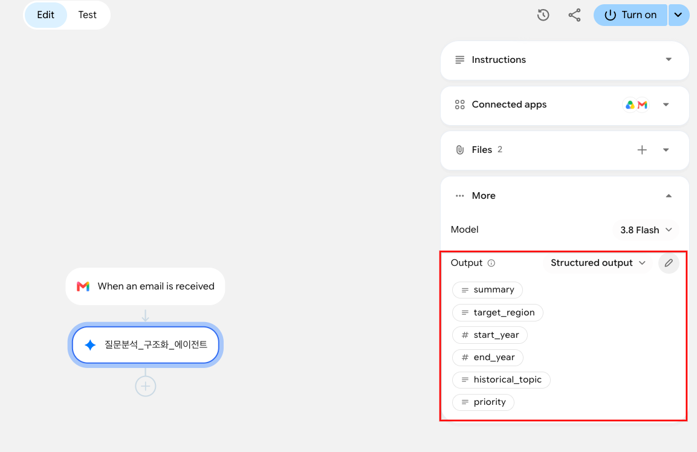


---

### Lab 3. [Step 2 추가] MCP 서버(`MCP Realestate`) 연동: 20개년 부동산 및 거시경제 지표 조회

이제 앞단 `질문분석_구조화_에이전트`(`gemini_agent`) 노드 아래에 **`MCP Realestate` (Korea Real Estate MCP Server)**를 연동하여 2006~2025년 한국 부동산 정량 지표를 조회합니다.  

> [!NOTE]
> `MCP Realestate` 서버는 이미 관리자에 의해 현재 Gemini Enterprise 환경에 배포 및 등록되어 있습니다.

Gemini Enterprise Workflow Builder에서 MCP 서버를 호출하는 방식은 **두 가지 옵션**이 제공되며, 시나리오의 특성에 맞게 선택하여 구성할 수 있습니다:

| 비교 항목 | 옵션 1: `Gemini Agent`를 통해 MCP 서버 호출 (에이전트 매개 방식) | 옵션 2: `MCP 서버` 스텝을 직접 선택하여 호출 (직접 노드 배치 방식) |
| :--- | :--- | :--- |
| **스텝 추가 경로** | `+ Add step` ➔ **`Gemini Agent`** 추가 후, 노드 내부의 **Connected Apps > `MCP servers`**에서 `MCP Realestate` 연결 | `+ Add step` ➔ **`MCP servers`** ➔ **`MCP Realestate`** ➔ 특정 Tool(`get_factors_range`) 직접 선택 |
| **파라미터 전달 방식** | 에이전트의 **Instructions(프롬프트)** 내에 `${...start_year}`, `${...end_year}` 변수를 넣어 LLM이 추론 중 자율적으로 툴 파라미터를 구성해 호출 | 우측 패널의 도구 입력 필드(`start_year`, `end_year`)에 `{x}` 변수 버튼으로 값을 **1:1 직접 바인딩** |
| **동작 특징 및 장점** | • 상황에 따라 `get_factors_by_year`, `get_factors_range`, `get_all_factors` 중 최적의 툴을 에이전트가 유연하게 선택/복합 호출 가능<br>• 조회된 원시 JSON 데이터를 에이전트가 1차 가공·해석하여 후속 노드로 전달 가능 | • LLM 추론을 거치지 않고 **100% 결정론적(Deterministic)**으로 지정된 단일 MCP 도구를 즉시 실행<br>• 응답 속도(Latency)가 빠르고 원시 JSON 응답 구조가 그대로 보장됨 |

---

> [!IMPORTANT]
> **참고**: Gemini Enterprise 최신 버전에서는 옵션 2까지 지원하지만, 버전에 따라 직접 MCP 스텝 추가가 보이지 않는 환경에서는 **옵션 1**을 선택해 진행하세요.

#### 🔹 옵션 1: `Gemini Agent` 노드를 통해서 MCP 서버를 호출하는 방법 (Agent-Mediated 방식)

`Gemini Agent` 노드를 하나 생성하고, 그 에이전트에게 `MCP Realestate` 도구 사용 권한을 부여하여 프롬프트 지시에 따라 MCP 서버를 호출하도록 구성하는 방법입니다.

1. **Gemini Agent 스텝 추가 및 이름 변경**:
   - 캔버스에서 `질문분석_구조화_에이전트` 노드 바로 아래의 **`+` (`+ Add step`)** 버튼을 클릭하고 **`Gemini Agent`**를 선택합니다.
   - 생성된 에이전트 노드의 이름을 **`MCP 서버 호출`**로 변경합니다.
   - 우측 메뉴의 **More**를 클릭해 모델을 **`Gemini 3.8 Flash`**로 설정합니다.
2. **Connected Apps에서 `MCP Realestate` 서버 연결**:
   - 우측 설정 패널의 **Connected Apps (또는 Tools & Integrations)** 목록에서 **`MCP servers`**를 클릭합니다.
   - 등록된 MCP 서버 목록에서 **`MCP Realestate`**를 선택합니다.

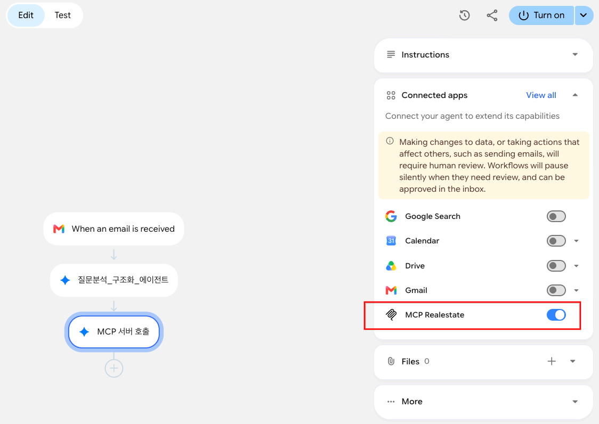

3. **Instructions (MCP 호출 지침 및 변수 전달) 작성**:
   - 우측 **Instructions** 입력란에 아래와 같이 지침을 작성하고 `+ Insert variable` (변수 삽입) 아이콘을 눌러 앞단 노드의 시작/종료 연도 변수를 포함시킵니다:
   ```text
   이 에이전트는 MCP 서버(MCP Realestate)를 호출해서 정해진 결과값을 전달해 주는 에이전트입니다.
   앞 단계에서 전달된 조회 시작 연도(${gemini_agent.start_year})와 종료 연도(${gemini_agent.end_year})를 기준으로,
   연결된 MCP Realestate 서버의 도구를 호출하여 해당 기간의 한국 부동산 및 거시경제 지표(기준금리, KOSPI, 서울/지방 아파트 평균 매매가, M2 통화량, 미분양 주택 수) 데이터를 빠짐없이 조회한 뒤 결과값을 반환하세요.
   ```
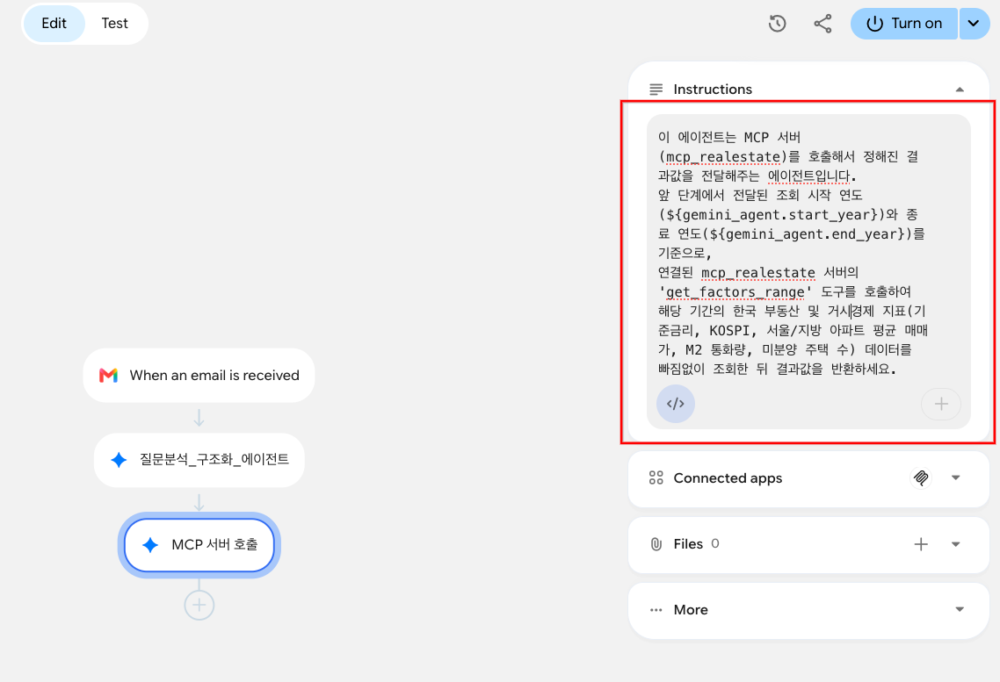

---

#### 🔹 옵션 2: 워크플로 캔버스에서 `MCP 서버` 스텝을 직접 선택하는 방법 (Direct MCP Step 방식)

중간에 별도의 Gemini Agent를 두지 않고, 워크플로 캔버스에 **`MCP Realestate`의 특정 도구(`get_factors_range`)를 독립된 실행 스텝으로 직접 배치**하고 파라미터를 고정 바인딩하는 방법입니다.

1. **MCP 서버 도구 스텝 직접 추가**:
   - 캔버스에서 `질문분석_구조화_에이전트` 노드 바로 아래의 **`+` (`+ Add step`)** 버튼을 클릭합니다.
   - 스텝 유형 목록에서 `Gemini Agent`가 아닌 **`MCP servers`**(또는 도구 목록 내 **`MCP Realestate`**)를 직접 클릭합니다.
   - 제공하는 3개의 도구(`get_factors_by_year`, `get_factors_range`, `get_all_factors`) 중 기간별 시계열 데이터를 조회하는 **`get_factors_range`**를 직접 선택하여 캔버스 노드로 배치합니다.
2. **MCP 도구 입력 파라미터(`start_year`, `end_year`) 수동 바인딩**:
   - 우측에 열린 `get_factors_range` 전용 속성 패널에서 두 개의 필수 정수(Integer) 파라미터 입력란에 앞단 노드의 Structured Output 변수를 직접 매핑합니다:
   - **`start_year` 입력란**:
     - 입력란 우측의 **`{x}` (변수 삽입)** 아이콘을 클릭합니다.
     - `질문분석_구조화_에이전트` (`gemini_agent`) ➔ `output` ➔ **`start_year`**를 선택하여 `${질문분석_구조화_에이전트.output.start_year}` (`${gemini_agent.start_year}`)를 바인딩합니다.
   - **`end_year` 입력란**:
     - 동일하게 **`{x}` (변수 삽입)** 아이콘을 클릭합니다.
     - `질문분석_구조화_에이전트` (`gemini_agent`) ➔ `output` ➔ **`end_year`**를 선택하여 `${질문분석_구조화_에이전트.output.end_year}` (`${gemini_agent.end_year}`)를 바인딩합니다.

> 📊 **조회되는 부동산 지표 데이터 (공통)**: 옵션 1 또는 옵션 2를 통해 `MCP Realestate`가 실행되면 해당 연도 구간의 **기준금리(`interest_rate`), KOSPI(`kospi`), 서울 아파트 평균 매매가(`seoul_apartment_avg_price`), 지방 아파트 평균 매매가(`regional_apartment_avg_price`), 전국 아파트 가격지수(`national_apartment_price_index`), 소비자물가지수(`cpi`), M2 통화량(`m2_money_supply`), 미분양 주택 수(`unsold_housing`)** 데이터가 후속 노드로 전달됩니다.

---

### Lab 4. [Step 3 & 4 추가] `Realest_research` 에이전트 호출 및 종합 보고서 작성 노드

`MCP 서버 호출`(`MCP Realestate`) 노드 아래에 구글 검색(Google Search)을 통해 최신 부동산 정보를 실시간으로 검색·분석해 주는 **`Realest_research`** 에이전트를 수동으로 연결하고, 앞선 20개년 정량 시계열 데이터와 최신 부동산 시장 분석 결과를 하나의 완성된 부동산 자문 보고서로 통합하는 Gemini Agent 노드를 추가합니다.

#### 1) [Step 3] `Existing agents`로 `Realest_research` 에이전트 수동 추가
1. 캔버스에서 `MCP 서버 호출` (`MCP Realestate`) 스텝 바로 아래의 **`+` (`+ Add step`)** 버튼을 클릭합니다.
2. 스텝 추가 메뉴에서 **`Existing agents`** (또는 등록된 커스텀 에이전트 항목)를 클릭합니다.
3. 에이전트 선택 목록에서 구글 검색 기반으로 최신 부동산 시장·정책 동향을 분석해 주는 **`Realest_research`** 에이전트를 클릭하여 캔버스에 추가합니다.

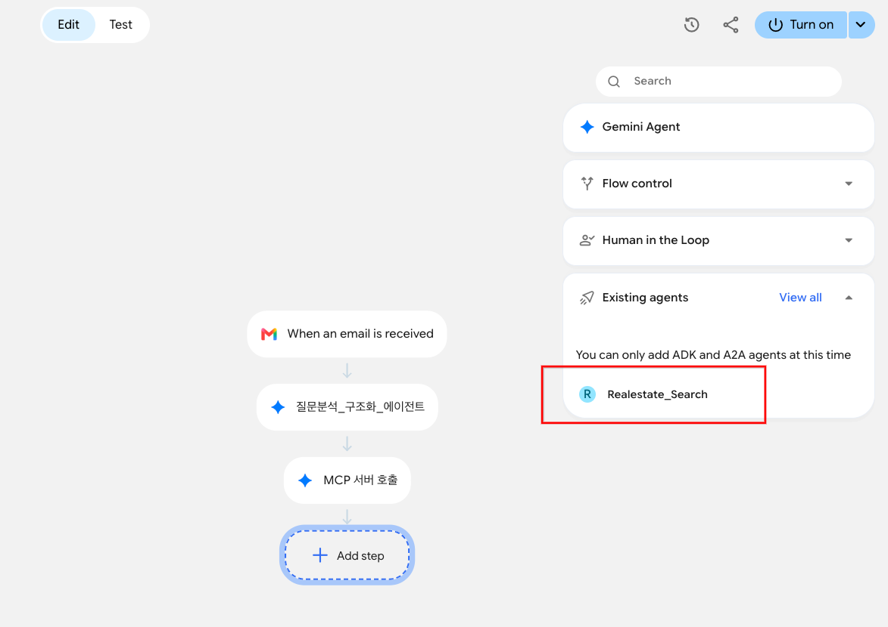

4. 우측 속성 패널의 **Input / Prompt (전달할 요청 메시지)** 입력란에 아래 내용을 입력하고 `+` (변수 삽입) 버튼으로 앞단 `질문분석_구조화_에이전트`의 출력 변수를 매핑합니다:


```text
사용자의 부동산 질문 요약: ${gemini_agent.summary}
관심 대상 지역: ${gemini_agent.target_region}
중점 검색 및 심층 분석 주제: ${gemini_agent.historical_topic}

구글 검색(Google Search)을 활용하여 위 관심 지역(${gemini_agent.target_region})과 관련된 최신 부동산 시장 동향(최근 아파트 매매·전세가 흐름, 거래량 추이, 입주 및 공급 물량), 최신 부동산 정책 및 규제(금리·대출 규제·세제·청약 제도 변화), 그리고 주요 시장 핵심 이슈를 검색하여 심층 분석해 주세요.
이를 바탕으로 현재 시점에서 부동산 수요자 및 투자자가 주목해야 할 3대 최신 시장 인사이트와 실천 제언을 도출해 주세요.
```

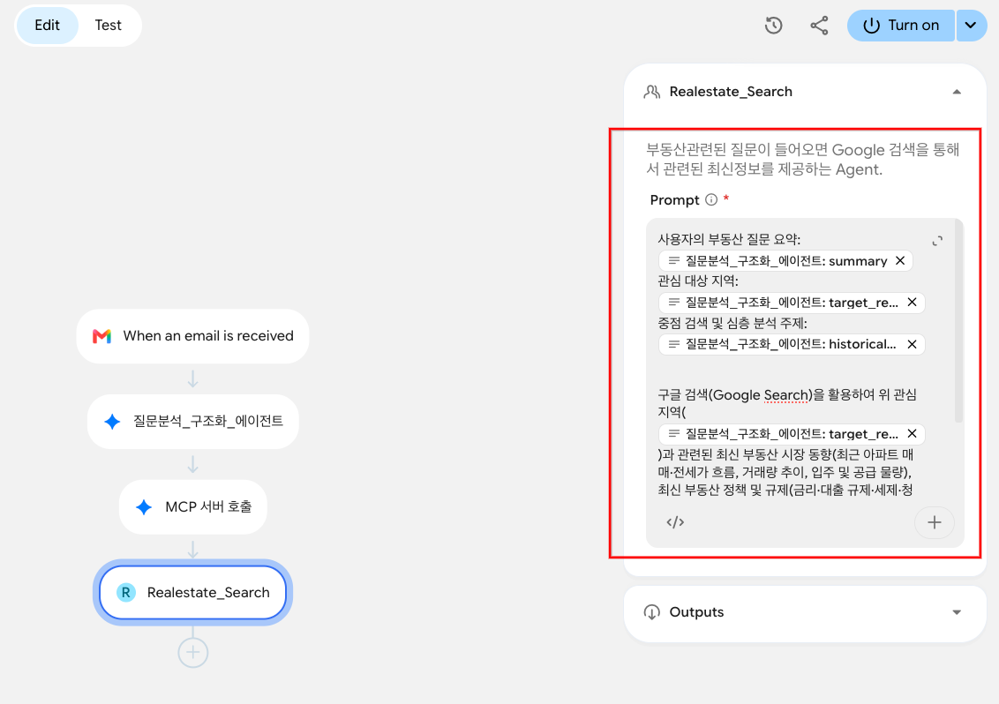


#### 2) [Step 4] 종합 부동산 자문 보고서 작성 노드 수동 추가
1. `Realest_research` 에이전트 노드 바로 아래의 **`+` (`+ Add step`)** 버튼을 클릭합니다.
2. **`Gemini Agent`**를 선택하여 에이전트 노드를 배치하고 이름을 **`종합_부동산보고서_작성기`**로 지정합니다.
3. **Model**: **`Gemini 3.8 Flash`**를 선택합니다.
4. **Instructions** 입력란에 **① 질문 요약 + ② `MCP Realestate` 20개년 시계열 수치 + ③ `Realest_research` 구글 검색 기반 최신 부동산 분석 결과**를 하나로 결합하는 아래 프롬프트를 입력합니다:

```text
당신은 부동산에 관심이 많은 고객에게 20개년 정량 시계열 데이터와 최신 실시간 시장 검색 분석이 결합된 최고 수준의 자문을 제공하는 '수석 부동산 컨설턴트'입니다.
앞선 스텝에서 수집된 3가지 핵심 결과물을 통합하여 고객에게 이메일로 발송하고 구글 드라이브에 보관할 최종 부동산 분석 보고서를 작성하세요.

[입력 데이터]
1. 고객 질문 요약 및 관심 지역:
   - 요약: ${gemini_agent.summary}
   - 관심 지역: ${gemini_agent.target_region} (시계열 분석 기간: ${gemini_agent.start_year}년 ~ ${gemini_agent.end_year}년)
2. 한국 부동산 20개년 정량 지표 (MCP Realestate 조회 결과):
   ${MCP 서버 호출:output}
3. 최신 부동산 시장 동향 및 정책 심층 분석 (Realest_research 구글 검색 분석 결과):
   ${Realest_research.output}

[최종 보고서 작성 포맷 (한국어 마크다운)]
# 🏘️ 맞춤형 부동산 심층 분석 및 최신 시장 동향 보고서

## 1. 📌 핵심 결론 및 맞춤형 자문 요약
- 고객님의 질문에 대한 핵심 결론을 3줄 이내로 명쾌하게 제시합니다.

## 2. 📊 한국 부동산 시계열 지표 분석 (MCP Realestate 데이터 기반)
- ${gemini_agent.start_year}년~${gemini_agent.end_year}년 구간의 **기준금리, 서울/지방 아파트 평균 매매가, M2 통화량, 미분양 물량** 추이를 마크다운 표(Table)로 일목요연하게 정리하고 장기 상관관계를 해설합니다.

## 3. 🔍 최신 부동산 시장 동향 및 정책 심층 분석 (Realest_research 검색 기반)
- `Realest_research` 에이전트가 구글 검색을 통해 수집·분석한 최신 부동산 매매/전세 시황, 대출·금리·세제·공급 정책 변화, 그리고 관심 지역(${gemini_agent.target_region})의 최신 핵심 이슈를 체계적으로 정리합니다.

## 4. 🧭 부동산 수요자/투자자를 위한 3대 실전 체크리스트
- 1) 매수/매도 타이밍 및 자금 계획 (금리·유동성·최신 대출 규제 관점)
- 2) 지역 및 상품 선택 전략 (서울 vs 지방 시계열 추이 및 최신 수급·미분양 지표 관점)
- 3) 최신 세제·청약·공급 정책 변화 대응 가이드
```

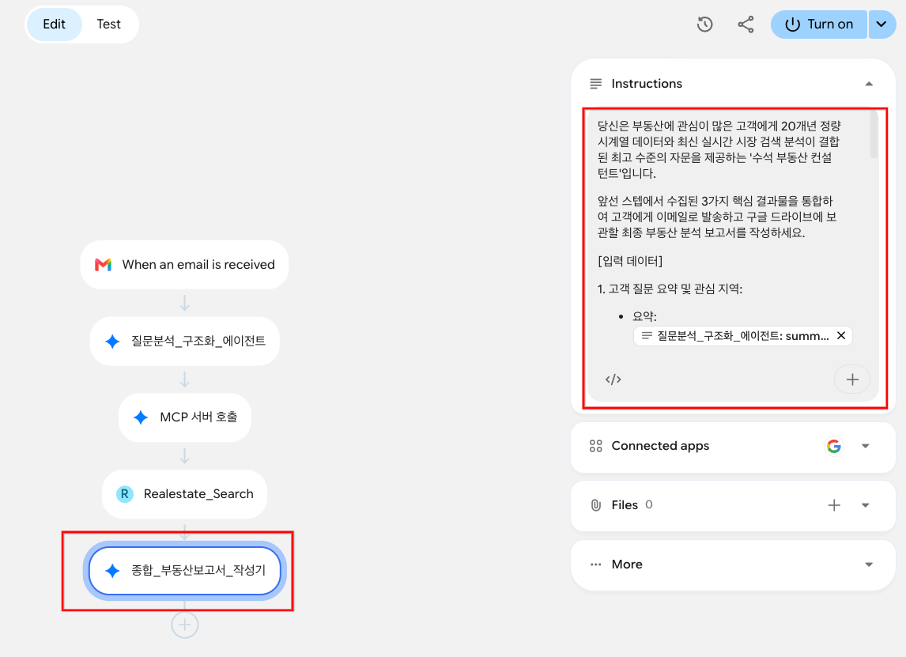


---

### Lab 5. [Step 5 & 6 추가] 흐름 제어(`Condition`) 분기 및 `Human-in-the-Loop` 승인 게이트 배치

보고서 작성이 완료되면 자문 중요도(`priority`)가 `High`(고액 투자/매수 의사결정)인지 판별하여, 중요 자문은 수석 컨설턴트의 승인(`Request info`)을 거치도록 수동으로 분기 노드를 조립합니다.

#### 1) [Step 5] `Condition` 조건 분기 노드 수동 추가
1. `종합_부동산보고서_작성기` 노드 하단의 **`+` (`+ Add step`)** 버튼을 클릭합니다.
2. **`Flow control`** ➔ **`Condition`**을 클릭하여 분기 노드를 배치합니다.
3. 우측 Condition 설정 패널에서 **Branch 1 (`If` 조건)**을 다음과 같이 수동 입력합니다:
   - **Branch Name**: `Priority is High`
   - **Variable**: `+` 버튼을 눌러 **`${질문분석_구조화_에이전트:priority}`** (`${gemini_agent.priority}`) 선택
   - **Operator**: **`equals`** 선택
   - **Value**: 직접 텍스트로 **`High`** 입력
4. 조건이 거짓일 때 이동하는 **`Else` 분기(일반 시황/지표 문의 경로)**가 우측 갈래로 자동 생성된 것을 확인합니다.

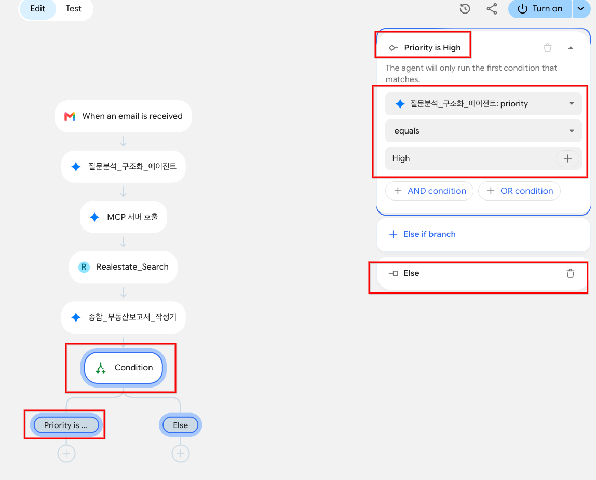


#### 2) [Step 6] `Priority == High` 경로 아래에 `Human-in-the-Loop (Request info)` 노드 수동 추가
1. 캔버스에서 왼쪽 **`Priority is High` 분기선 아래의 `+` (`+ Add step`)** 버튼을 클릭합니다.
2. **`Human in the loop`** ➔ **`Request info`**를 클릭하여 승인 노드를 배치합니다.

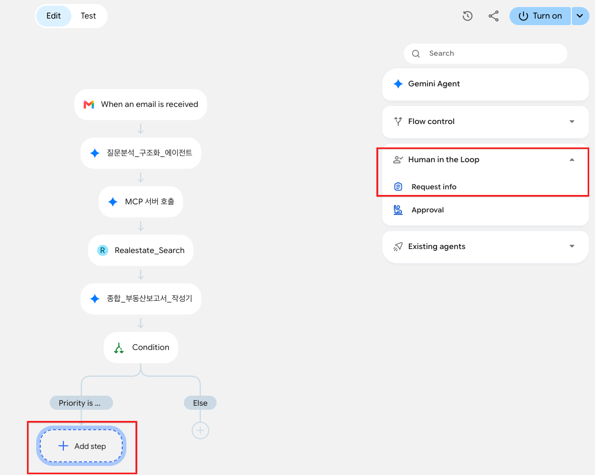


3. 우측 설정 패널에 승인 요청 메시지와 선택 옵션을 직접 입력합니다:
   - **Message (검토 메시지)**:
     ```text
     🚨 [중요 부동산 자문 메일 발송 승인 요청]
     발송자(${When an email is sent:sender})로부터 중요도 'High' 등급의 부동산 자문 문의 이메일이 발송되어 맞춤형 분석 보고서가 생성되었습니다.

     • 질문 요약: ${질문분석_구조화_에이전트.summary}
     • 관심 지역 및 분석 연도: ${질문분석_구조화_에이전트:target_region} (${질문분석_구조화_에이전트:start_year}~${질문분석_구조화_에이전트:end_year})

     --- [작성된 부동산 자문 보고서 초안] ---
     ${종합_부동산보고서_작성기:output}
     ----------------------------------------

     위 답변 내용을 질문자에게 Gmail로 자동 발송하고 Google Drive에 공식 보고서로 저장하시겠습니까?
     ```

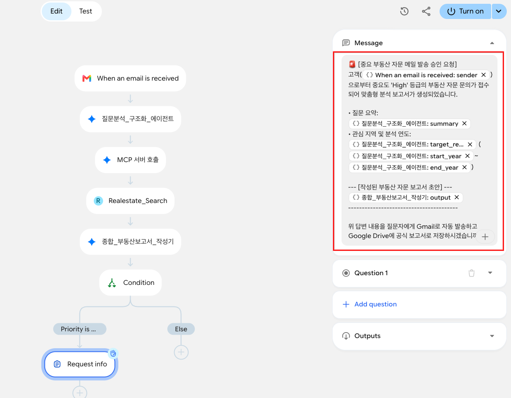

   - **Questions (응답 버튼 설정)**:
     - **Question Type**: `Single-select` (단일 선택)
     - **Question**: `위의 보고서 내용을 승인하시겠습니까? `
     - **Option 1**: `승인 (Approve)`
     - **Option 2**: `반려 (Reject)`

---

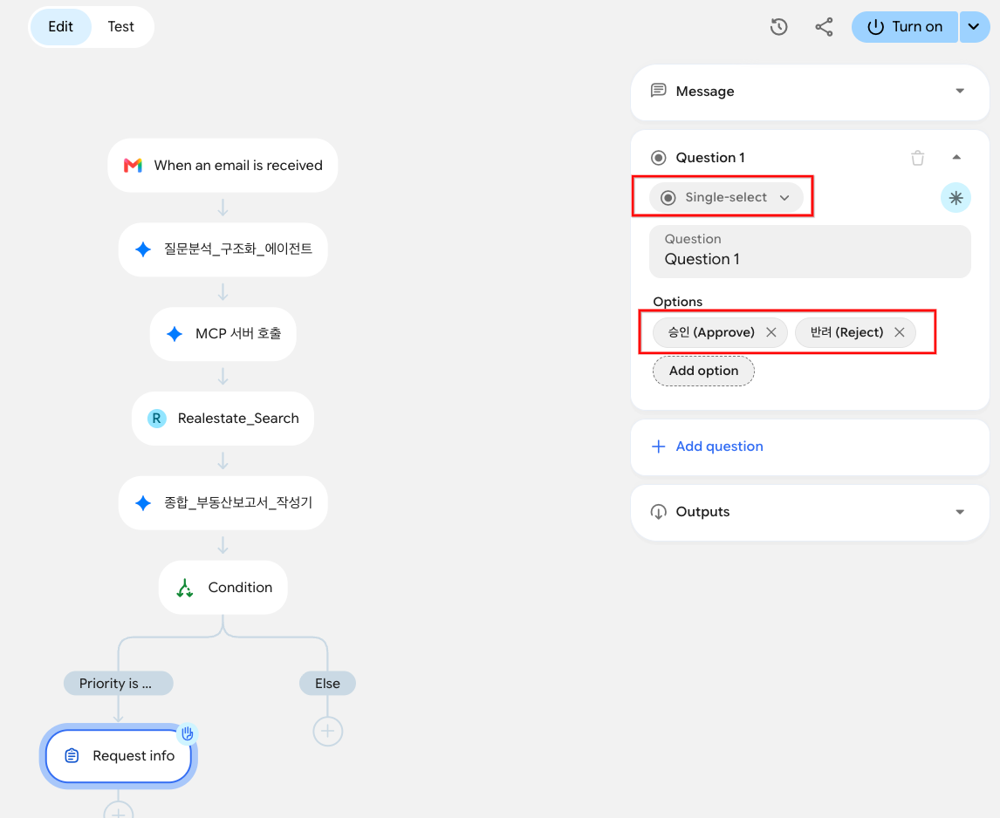


### Lab 6. [Step 7 & 8 추가] 분기별 `Gemini Agent` 액션 연동: `High` 경로(이메일 발송 + Drive 저장) 및 `Else` 경로(이메일만 발송)

Gemini Enterprise Workflow Builder에서는 별도의 `Connectors` 전용 노드를 배치하는 대신, 각 분기 아래에 **`Gemini Agent` 노드를 추가하고 우측 `Connected apps`에서 `Gmail` 및 `Google Drive` 도구를 활성화**하여 메일 발송과 드라이브 파일 쓰기 작업을 수행합니다.

여기서는 앞선 `Condition` 노드의 두 갈래 분기에 따라 서로 다른 역할을 하는 `Gemini Agent`를 각각 배치합니다:
- **[Step 7] `Priority is High` 분기 (`Request info` 승인 노드 하단)**: 수석 컨설턴트가 승인(`승인 (Approve)`)하면 **질문자에게 Gmail로 답변 이메일을 발송하고, 동시에 Google Drive에 보고서 파일을 생성(쓰기)**합니다. (`Gmail` + `Drive` 모두 활성화)
- **[Step 8] `Else` 분기 (`Else` 하단)**: 일반 부동산 시황 문의의 경우 Google Drive에 별도 파일을 쓰지 않고 **질문자에게 Gmail로 답변 이메일만 발송**합니다. (`Gmail`만 활성화, `Drive` 비활성화)

#### 1) `Connected apps` 권한 설정 핵심 규칙 (`Search for data` + `Add or update data`)
> [!WARNING]
> **필수 확인 — Gemini Agent의 Connected Apps 권한 의존성**:
> `Gemini Agent`가 Gmail로 이메일을 발송하거나 Google Drive에 새 파일을 작성하려면, 우측 **Connected apps** 설정에서 해당 앱(Gmail / Drive)의 토글을 켠 뒤 하위 옵션인 **`Add or update data`(생성/발송 권한)**와 **`Search for data`(발송자/수신자 및 폴더 식별자 조회 권한)**를 **반드시 함께 켜야(Enable)** 합니다.

---

#### 2) [Step 7] `Priority is High` 경로 (`Request info` 하단): 이메일 발송 및 Google Drive 파일 쓰기 `Gemini Agent` 추가

1. 캔버스 왼쪽 갈래인 **`Priority is High`** 경로의 `Request info` 노드 바로 아래에 있는 **`+` (`+ Add step`)** 버튼을 클릭합니다.
2. 스텝 메뉴에서 **`Gemini Agent`**를 선택하여 노드를 추가하고, 상단 이름을 **`저장 및 이메일발송`**으로 지정합니다.
3. 우측 설정 패널의 **Connected apps** 항목을 열어 두 앱을 모두 활성화합니다:
   - **Gmail**: 토글 **`On`** ➔ `Search for data` (**Enable**) + `Add or update data` (**Enable**)
   - **Drive**: 토글 **`On`** ➔ `Search for data` (**Enable**) + `Add or update data` (**Enable**)
4. 우측 설정 패널의 **Instructions** 입력란에 `+` (변수 삽입) 버튼을 활용하여 **이메일 발송과 Google Drive 파일 저장을 모두 수행하는 지침**을 입력합니다:

```text
당신은 승인된 중요 부동산 자문 보고서를 질문자에게 이메일(Gmail)로 발송하고, 동시에 Google Drive에 공식 보고서 파일로 저장하는 실행 에이전트입니다.

앞 단계의 승인 응답(${Request info:Question 1})이 '승인 (Approve)'인 경우 아래 [작업 1]과 [작업 2]를 모두 실행하세요.
(만약 '반려 (Reject)'인 경우에는 이메일 발송과 드라이브 저장을 수행하지 말고 "승인이 반려되어 발송을 취소했습니다."라고만 출력하세요.)

[작업 1: Gmail로 답변 이메일 발송]
연결된 Gmail 도구를 사용하여 질문자(발송자)에게 아래 내용으로 답변 이메일을 보내세요.
- 받는 사람(To): ${When an email is sent:sender}
- 이메일 제목(Subject): Re: [맞춤형 부동산 심층 자문 리포트] 요청하신 ${질문분석_구조화_에이전트:target_region} 20개년 지표 및 최신 시장 동향 답변드립니다.
- 이메일 본문(Body):
안녕하세요, Gemini Enterprise 부동산 자문 워크플로 에이전트입니다.

문의하신 부동산 질문(${질문분석_구조화_에이전트:summary})에 대하여 한국 부동산 20개년 지표(MCP Realestate)와 최신 부동산 시장·정책 검색 분석(Realest_research 에이전트)을 종합한 맞춤형 심층 분석 리포트를 보내드립니다.

============================================================
${종합_부동산보고서_작성기:output}
============================================================

감사합니다.

[작업 2: Google Drive에 보고서 파일 생성 및 쓰기]
연결된 Google Drive 도구를 사용하여 아래 파일명과 내용으로 새 문서를 생성하여 저장하세요.
- 파일명(File Name): [부동산자문리포트]_${질문분석_구조화_에이전트:target_region}_${질문분석_구조화_에이전트:start_year}-${질문분석_구조화_에이전트:end_year}.md
- 파일 내용(Content):
# 🏘️ 부동산 맞춤형 심층 자문 보고서 아카이브
- 질문자 이메일: ${When an email is sent:sender}
- 질문 요약: ${질문분석_구조화_에이전트:summary}
- 관심 지역: ${질문분석_구조화_에이전트:target_region}
- 분석 기간: ${질문분석_구조화_에이전트:start_year}년 ~ ${질문분석_구조화_에이전트:end_year}년
- 자문 중요도: ${질문분석_구조화_에이전트:priority}

---

${종합_부동산보고서_작성기:output}
```

---

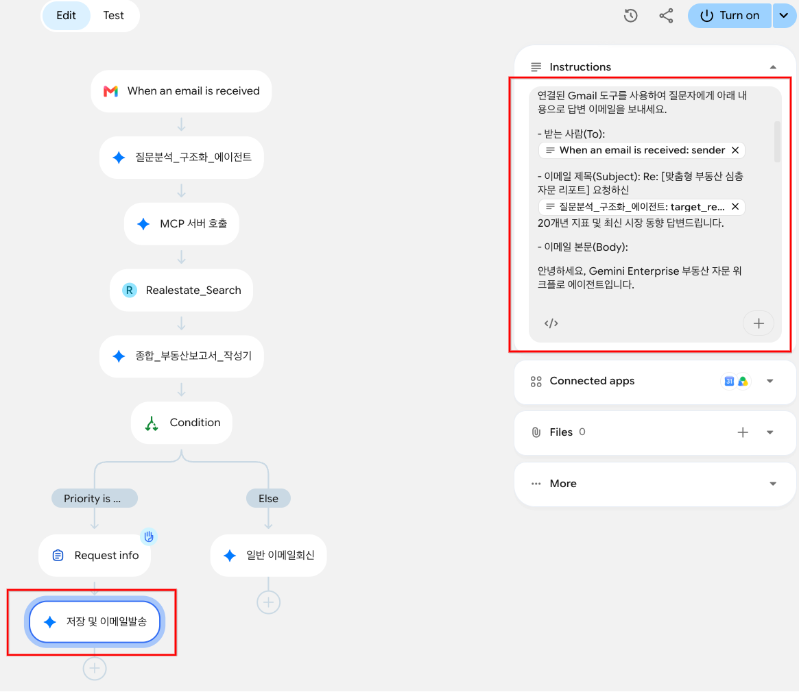
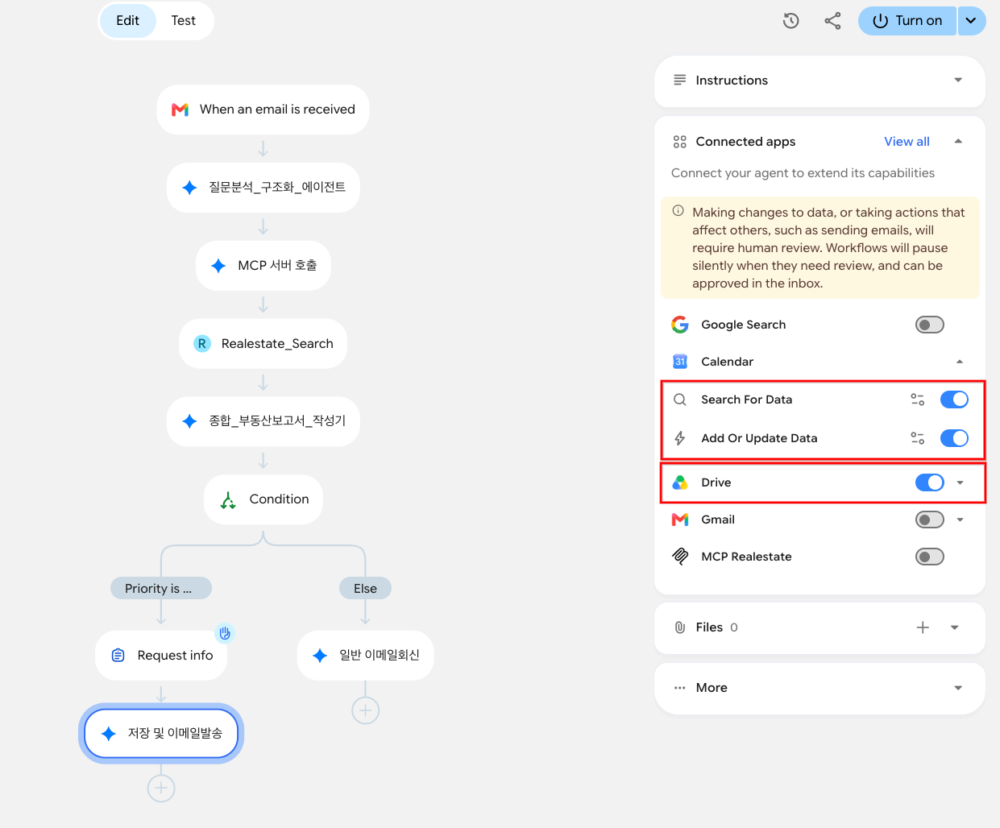


#### 3) [Step 8] `Else` 경로 (`Else` 분기 하단): 이메일만 발송하는 `Gemini Agent` 추가

`Priority`가 `High`가 아닌 일반 시황/지표 문의(`Else` 분기)에서는 사람의 승인이나 Google Drive 파일 저장 없이 **질문자에게 이메일만 빠르게 회신**하도록 별도의 `Gemini Agent`를 구성합니다.

1. 캔버스 오른쪽 갈래인 **`Else`** 분기 바로 아래의 **`+` (`+ Add step`)** 버튼을 클릭합니다.
2. 스텝 메뉴에서 **`Gemini Agent`**를 선택하여 노드를 추가하고, 상단 이름을 **`일반 이메일회신`**으로 지정합니다.
3. 우측 설정 패널의 **Connected apps** 항목에서 **Gmail만 켜고 Drive는 끕니다**:
   - **Gmail**: 토글 **`On`** ➔ `Search for data` (**Enable**) + `Add or update data` (**Enable**)
   - **Drive**: 토글 **`Off`** (비활성화 유지 — Google Drive에 파일을 쓰지 않음)
4. 우측 설정 패널의 **Instructions** 입력란에 `+` (변수 삽입) 버튼을 활용하여 **Gmail로 이메일만 발송하는 지침**을 입력합니다:

```text
당신은 일반 부동산 시황 문의에 대해 작성된 분석 보고서를 질문자에게 이메일(Gmail)로 신속히 회신하는 에이전트입니다.
Google Drive에는 파일을 저장하지 말고, 연결된 Gmail 도구만 사용하여 아래 내용으로 질문자(발송자)에게 답변 이메일을 즉시 발송하세요.

[Gmail 답변 이메일 발송 정보]
- 받는 사람(To): ${When an email is sent:sender}
- 이메일 제목(Subject): Re: [부동산 시황 분석 안내] 문의하신 ${질문분석_구조화_에이전트:target_region} 부동산 지표 및 최신 동향 답변드립니다.
- 이메일 본문(Body):
안녕하세요, Gemini Enterprise 부동산 자문 워크플로 에이전트입니다.

문의하신 부동산 질문(${질문분석_구조화_에이전트:summary})에 대한 한국 부동산 시계열 지표 및 최신 시장 동향 분석 결과를 아래와 같이 보내드립니다.

============================================================
${종합_부동산보고서_작성기:output}
============================================================

감사합니다.
```

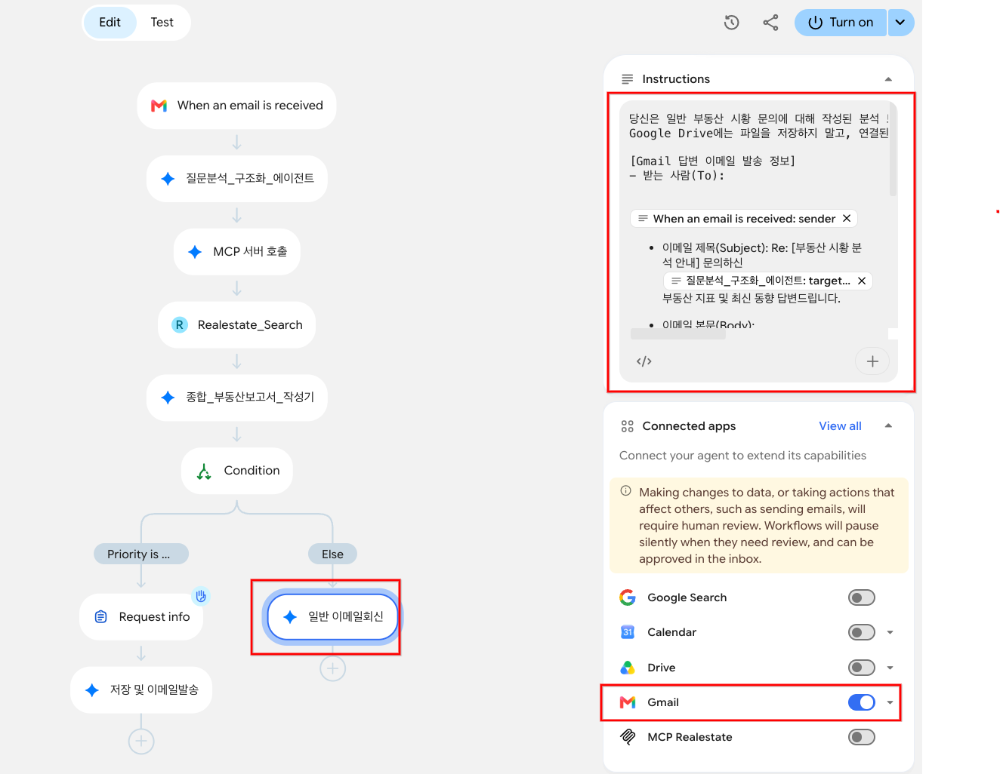

#### 4) 버전 스냅샷 저장 및 프로덕션 활성화 (`Save version` & `Turn on`)
1. 상단 버전 드롭다운에서 **`Save version`**을 클릭하고 `v1.0.0-manual-realestate-workflow` 버전 태그를 저장합니다.
2. 우측 상단의 **`Turn on` (활성화)** 버튼을 켜서 **실제 Gmail에서 부동산 질문 이메일 송신(`When an email is sent`) 시** 자동으로 작동하도록 배포합니다.
3. **`Share` (공유)** 버튼을 통해 팀원들과 워크플로를 공유하고, **`Runs`** 탭에서 실행 이력과 노드별 소요 시간(Execution Trace)을 모니터링합니다.

> [!NOTE]
> 아래 그림은 이미 **`Turn on`**이 완료된 상태의 화면이며, `Save version` 및 `Turn on` 이후 변경사항이 생기면 버튼이 **`Update`**로 표시됩니다.

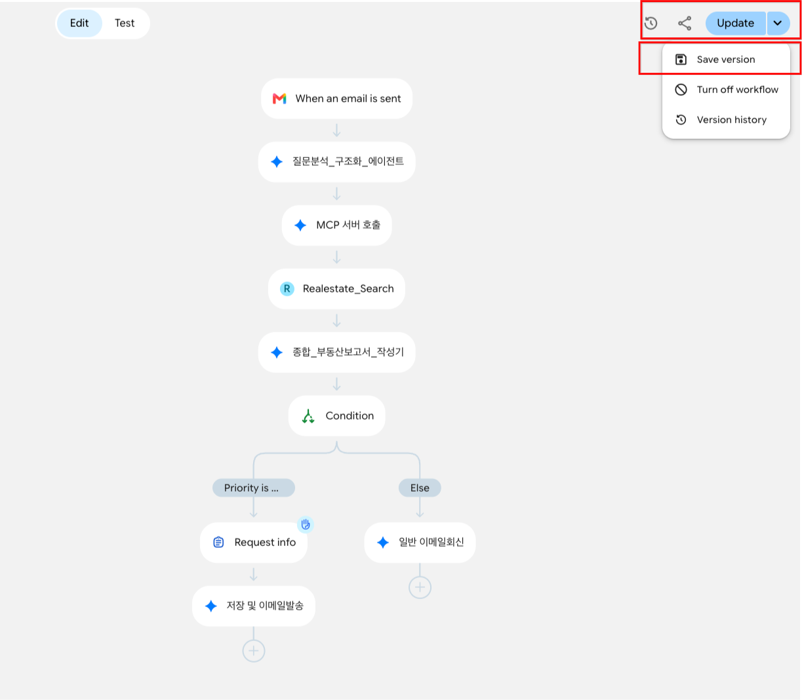


---

### Lab 7. 시뮬레이션 테스트(`Test`), 버전 배포(`Turn on`) 및 실행 로그(`Runs`) 검증

빈 캔버스에서 수동으로 조립한 8개 스텝이 처음부터 끝까지 완벽히 동작하는지 **`Test` 시뮬레이션**으로 검증하고 실 서비스로 배포합니다.

시뮬레이션 테스트를 진행하기 전에, 트리거 입력 데이터로 사용할 부동산 관련 질문 이메일을 먼저 한 통 발송해 둡니다.  
아래와 같이 `gmail.com`에 현재 실습 중인 계정으로 로그인합니다.

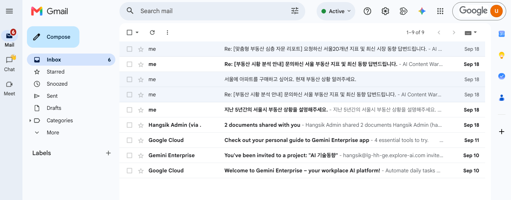

다음과 같이 테스트용 이메일을 하나 발송해 둡니다:
* **수신(To)**: `본인 이메일 계정 (예: user001@domain...)`
* **제목(Subject)**: `서울에 아파트를 구매하고 싶습니다. 전체적인 부동산 시장정보를 브리핑 해주세요.`
* **본문(Body)**: `비워둠(Blank)` 또는 `상세 질문 내용 입력`

방금 발송한 이메일 데이터를 선택하여 아래와 같이 테스트 시뮬레이션을 실행합니다.

> [!IMPORTANT]
> **참고**: 이메일 제목이나 본문에 실제 아파트 구매/투자 의사결정을 언급하면 중요도(`priority`)가 **`High`**로 설정되고, 단순 시황이나 지표만 문의하면 **`Low`**로 설정됩니다. 이 분류는 비결정론적(Non-deterministic)으로 **Step 1의 `질문분석_구조화_에이전트` 노드**에서 판단합니다.


#### 1) Test 시뮬레이션 실행 
1. 에디터 상단 바에서 **`Test`** 탭을 클릭한 뒤 우측의 **`Start simulation`** 버튼을 클릭합니다.
2. **`When an email is sent`** 트리거 설정 창에서 방금 발송한 이메일을 검색합니다. 

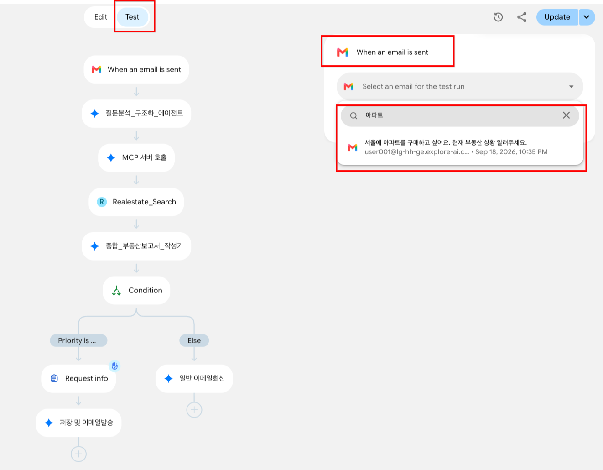

3. 해당 이메일을 선택한 뒤 **`Start a test run`** 버튼을 클릭하여 실행합니다.        
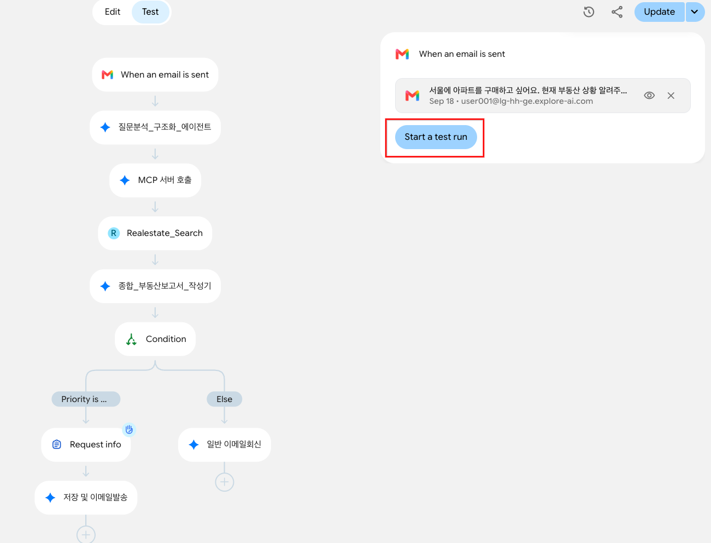

> [!IMPORTANT]
> **참고**: 시뮬레이션 실행 중 `MCP 서버 호출` (`MCP Realestate`) 단계에 도달하면 부동산 지표 조회를 위한 시작/종료 연도 파라미터 확인 및 실행 승인(Human-in-the-Loop 형태의 툴 호출 확인) 창이 표시됩니다. 화면 안내에 따라 연도 값을 확인하고 실행을 승인해 주세요.

4. **단계별 실행 그래프(Execution Graph) 검증 체크리스트**:
   - [ ] **[Step 1] `질문분석_구조화_에이전트`**: JSON 출력에서 `"target_region": "서울"`, `"start_year": 2015`, `"end_year": 2025`, `"priority": "High"`가 정확히 추출되었는가?
   - [ ] **[Step 2] `MCP 서버 호출` (`MCP Realestate`)**: 도구가 호출되어 특정 기간을 물어보면 해당 연도 정보를 확인/승인합니다. 10년 치 금리, 서울/지방 아파트 가격, M2, 미분양 데이터가 정상 반환되었는가?

   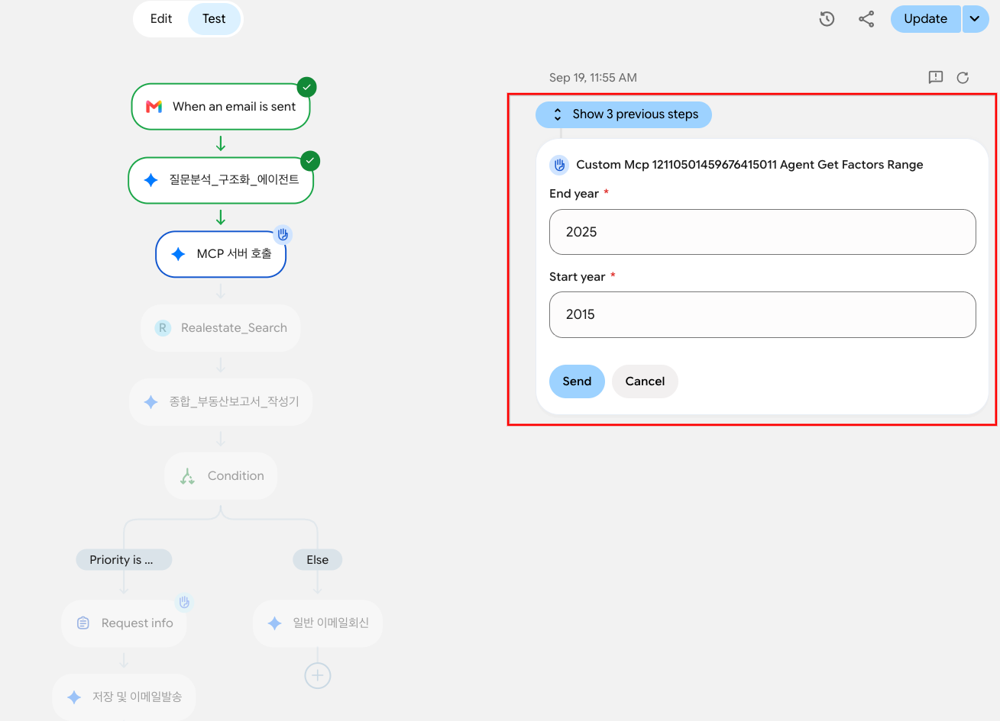

   - [ ] **[Step 3] `Realest_research` 에이전트**: 구글 검색(Google Search)을 통해 최신 서울 부동산 시장 동향, 거래 흐름, 대출·세제·공급 정책 분석 결과가 도출되었는가?
   - [ ] **[Step 4] `종합_부동산보고서_작성기`**: MCP 정량 시계열 표와 `Realest_research` 최신 부동산 검색 분석이 하나로 합쳐진 완성형 마크다운 보고서가 작성되었는가?
   - [ ] **[Step 5 & 6] `Condition` & `Request info`**: `priority == 'High'` 조건이 참(True)으로 평가되어 화면에 `Request info` 승인 팝업이 뜨고, **`승인 (Approve)`** 클릭 시 Step 7로 넘어가는가?

   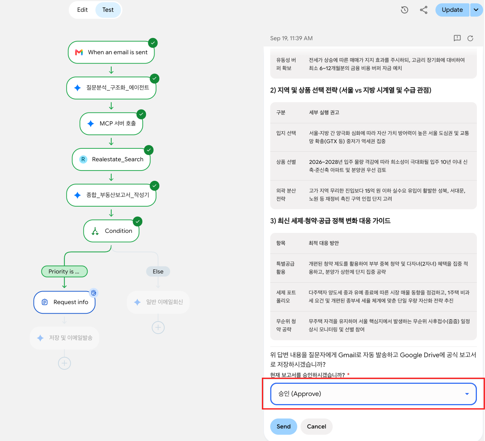

   - [ ] **[Step 7] `저장 및 이메일발송` (`High` 경로)**: 질문자(발송자) 이메일로 답변이 자동 발송되고, 동시에 내 Google Drive에 `[부동산자문리포트]_서울_2015-2025.md` 파일이 생성되었는가?

   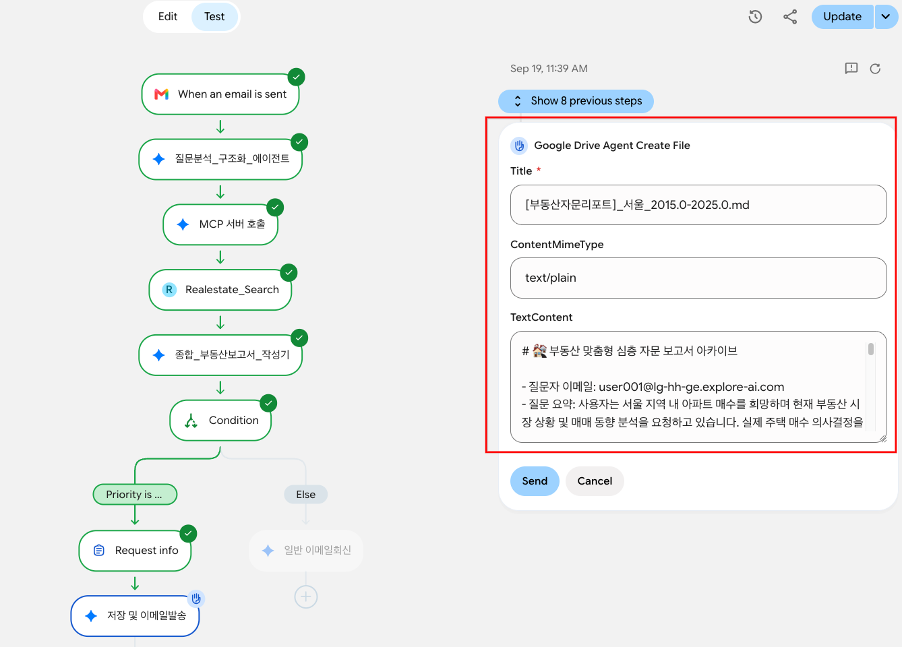

   - [ ] **[Step 8] `일반 이메일회신` (`Else` 경로 테스트 시)**: 단순 지표 질문을 입력하여 `priority == 'Low'`가 되었을 때, `Else` 경로로 이동해 Google Drive 파일 생성 없이 Gmail 답변 이메일만 발송되는가?


아래 그림은 모든 스텝이 최종적으로 완료된 실행 결과 화면입니다.

   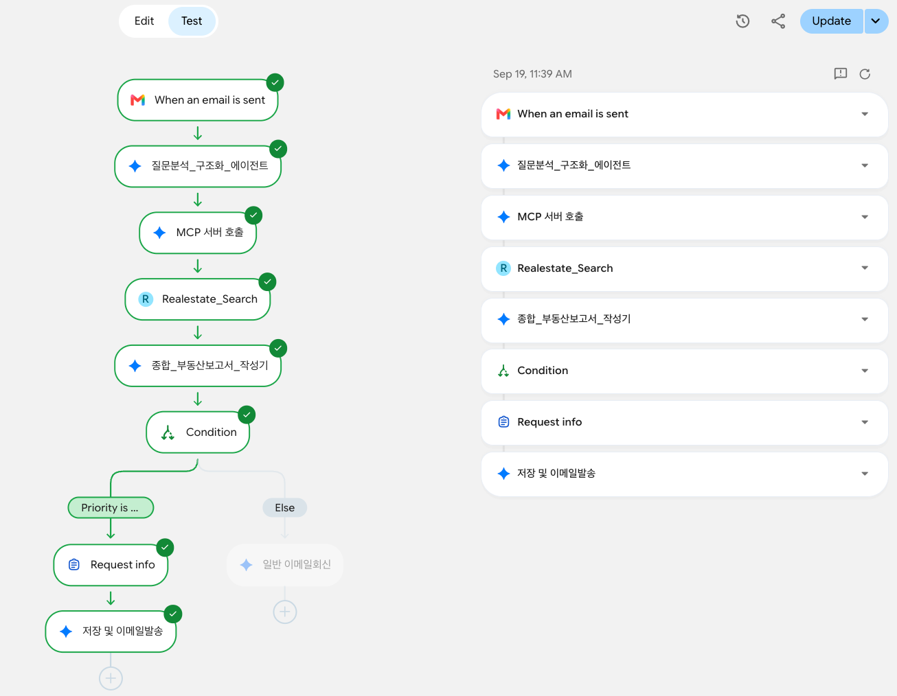

---

## 4. Workflow Agent Prompt 참고 

위에서 수동(Manual)으로 조립한 워크플로 에이전트를 자연어 프롬프트(Scaffolding) 방식으로 한 번에 자동 생성해보고 싶을 때 활용할 수 있는 프롬프트 템플릿입니다.

```text
이메일 제목에 '부동산' 또는 '아파트'가 포함된 이메일이 발송(Send Mail)될 때 자동으로 실행되는 '맞춤형 부동산 인사이트' 워크플로 에이전트를 생성해 줘.

전체 워크플로 흐름과 각 노드의 세부 구성은 다음과 같이 작성해 줘:

1. **트리거 (이메일 발송 이벤트)**
   - 발송 이메일 제목(Subject)에 '부동산' 또는 '아파트'가 포함된 경우 워크플로를 시작합니다.

2. **질문분석_구조화_에이전트 (분석 기획 단계)**
   - 모델: gemini-3.8-flash
   - 지식 소스(Google Drive): '2026년 부동산 세제 개편안 종합 분석 보고서', '정부 주택공급 대책 종합 분석 보고서' 문서 참조
   - 연결 App: Gmail, Google Drive
   - 역할 및 지시사항: 발송된 이메일 본문과 구글 드라이브 정책 문서를 분석하여 아래 6가지 구조화된 항목을 도출합니다.
     1) summary: 사용자 부동산 질문 핵심 요약 (2~3문장)
     2) target_region: 관심 대상 지역 (서울, 수도권, 지방, 전국 등)
     3) start_year: MCP 시계열 조회 시작 연도 (2006~2025 사이 정수, 미지정 시 2015)
     4) end_year: MCP 시계열 조회 종료 연도 (2006~2025 사이 정수, 미지정 시 2025)
     5) historical_topic: Realest_research 에이전트에 전달할 최신 부동산 시장·정책 검색 및 심층 분석 주제
     6) priority: 자문 중요도 분류 (실제 매수/매도 및 고액 투자는 'High', 단순 시황/지표 문의는 'Low')

3. **MCP 서버 호출 (데이터 조회 단계)**
   - 모델: gemini-3.8-flash
   - 연결 App: MCP Realestate
   - 역할 및 지시사항: 이전 단계에서 추출한 시작 연도와 종료 연도를 바탕으로 MCP 도구('get_factors_range')를 호출하여 해당 기간의 기준금리, KOSPI, 서울/지방 아파트 평균 매매가, M2 통화량, 미분양 주택 수 데이터를 조회 및 반환합니다.

4. **Realest_research (외부 에이전트 연동 단계)**
   - 참조 에이전트: Realest_research (ADK 에이전트)
   - 입력 프롬프트: 질문 요약, 관심 지역, 심층 분석 주제를 전달하고 구글 검색을 활용해 최신 부동산 매매·전세가 흐름, 거래량, 공급 물량, 정책·규제 변화 및 핵심 이슈를 심층 분석하여 3대 최신 시장 인사이트와 실천 제언을 도출하도록 요청합니다.

5. **종합_부동산보고서_작성기 (보고서 작성 단계)**
   - 모델: gemini-3.8-flash
   - 도구: Google Search
   - 역할 및 지시사항: 고객 질문 요약, MCP 20개년 정량 시계열 지표, 실시간 검색 분석 결과를 취합하여 아래 4개 섹션으로 구성된 마크다운 보고서를 작성합니다.
     - 1. 핵심 결론 및 맞춤형 자문 요약
     - 2. 한국 부동산 시계열 지표 분석 (표 및 상관관계 해설)
     - 3. 최신 부동산 시장 동향 및 정책 심층 분석
     - 4. 부동산 수요자/투자자를 위한 3대 실전 체크리스트

6. **조건 분기 (Condition)**
   - 질문분석 에이전트의 priority 결과가 'High'인 경우와 그 외('Else')로 분기합니다.

7. **Priority is High 분기 경로**
   - **승인 요청 (Request Info)**:
     - 질문 요약, 대상 지역 및 분석 연도, 작성된 보고서 초안을 관리자에게 보여주고 발송/저장 여부를 묻습니다.
     - 선택 옵션: '승인 (Approve)', '반려 (Reject)'
   - **저장 및 이메일발송 에이전트**:
     - 모델: gemini-3.1-pro-preview
     - 연결 App: Gmail, Google Drive
     - 역할: 관리자가 '승인'한 경우, Gmail을 통해 질문자에게 정중한 회신 메일을 전송하고, 동시에 Google Drive에 마크다운 파일('[부동산자문리포트]_{지역}_{시작연도}-{종료연도}.md')로 공식 저장합니다. '반려' 시에는 발송 및 저장을 취소합니다.

8. **Else 분기 경로 (일반 시황 문의)**
   - **일반 이메일회신 에이전트**:
     - 모델: gemini-3.1-pro-preview
     - 연결 App: Gmail
     - 역할: 별도 드라이브 저장 없이 Gmail을 통해 작성된 분석 결과를 질문자에게 즉시 회신합니다.
```

---

## 5. 엔터프라이즈 아키텍처 모범 사례 및 트러블슈팅 (Best Practices & FAQ)

| 증상 및 오류 현상 | 발생 원인 | 권장 조치 및 해결 방법 |
| :--- | :--- | :--- |
| **본인이 본인 주소로 테스트 이메일을 보냈는데 `When an email is received`가 전혀 작동하지 않음** | Gmail 수신 트리거는 자기 자신에게 보낸 메일(Self-sent email)을 수신 이벤트로 트리거링하지 않음 | 실습 및 사용자 직접 트리거링 환경에서는 반드시 트리거 이벤트를 **`When an email is sent`(이메일 송신 시)**로 설정하십시오. 본인이 이메일을 발송하는 즉시 안정적으로 트리거됩니다. |
| **`MCP Realestate`의 `get_factors_range` 노드에서 파라미터 타입 에러 발생** | JSON Schema에 연도가 `string`으로 선언됨 | Step 1(`질문분석_구조화_에이전트`)의 JSON Schema에서 `start_year`와 `end_year`의 타입을 반드시 **`Number` (`integer`)**로 선언하십시오. |
| **`Existing agents` 클릭 시 `Realest_research` 에이전트가 목록에 없음** | 에이전트 미배포 또는 권한 미공유 | [`src/agent/agent_realestate/`](file:///Users/hangsik/Documents/my_project/gemini_enterprise_lab/src/agent/agent_realestate/README.md) 패키지를 배포하여 Gemini Enterprise에 `Realest_research` 에이전트로 등록·공유했는지 확인하십시오. |
| **Step 7 또는 Step 8의 `Gemini Agent`에서 Gmail 발송 / Google Drive 파일 쓰기 실패** | `Connected apps`에서 `Add or update data` 또는 `Search for data` 권한 비활성화 | Step 7(`Gmail` + `Drive`) 및 Step 8(`Gmail`) 에이전트의 **Connected apps** 설정에서 **`Add or update data`와 `Search for data` 토글을 모두 활성화(Enable)**하십시오. |
| **Step 1(`질문분석_구조화_에이전트`)에서 지정한 부동산 파일 외의 문서까지 검색됨** | 동일 노드에 Drive `Search for Data`가 켜져 있음 | Step 1에서는 **Files(`Add from Drive`)만 설정**하고 Connected Apps의 Drive `Search for Data`는 Disable로 설정하십시오. |
| **실제 Gmail에서 부동산 질문 이메일을 송신(`When an email is sent`)했는데 즉시 시작되지 않음** | Gmail Event Trigger의 폴링 주기 (5~10분) | 개발 및 실습 중 즉각적인 전 구간 테스트는 상단 **`Test` (`Preview`) > `Start simulation`**을 활용하십시오. |

