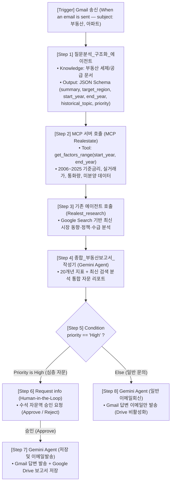

# 🏘️ Gemini Enterprise 심화 워크플로 에이전트(Workflow Agent) 개발 및 핸즈온 랩 가이드
### — 수동(Manual) 빌더로 직접 조립하는 맞춤형 부동산 자문 파이프라인 —

본 문서는 자연어 자동 생성(Scaffolding)을 쓰지 않고, **Gemini Enterprise Workflow Builder의 빈 캔버스(Empty Canvas)에서 트리거부터 에이전트, 도구, 조건 분기, 승인, 액션 노드까지 수동(Step-by-Step Manual)으로 직접 구축하는 심화 실습 가이드**입니다.

이 워크플로는 사용자가 Gmail에서 부동산 질문 이메일을 송신(`When an email is sent`)하면 자동으로 시작되어 다음 파이프라인을 수행합니다:
1. **질문 구조화**: 질문을 분석하여 **JSON Schema**로 핵심 변수(지역, 연도, 분석 주제, 중요도)를 추출합니다.
2. **20개년 지표 조회**: **`MCP Realestate`** 서버를 호출해 기준금리, 아파트 실거래가, M2, 미분양 시계열 데이터를 조회합니다.
3. **최신 시장 조사**: 구글 검색 기반 **`Realest_research`** 에이전트를 호출해 최신 시황, 규제 및 정책을 분석합니다.
4. **종합 보고서 작성**: 정량 지표와 최신 시장 동향을 통합한 고객 맞춤형 자문 보고서를 생성합니다.
5. **조건 분기 및 액션**: 중요도(`priority`)에 따라 분기하여 **`High` 등급은 사람(HITL) 승인 후 Gmail 답변 발송 및 Google Drive 저장**을 수행하고, **`Else`는 Gmail 답변만 발송**합니다.

---

## 📌 목차
1. [개요 및 사전 준비](#1-개요-및-사전-준비)
2. [전체 워크플로 아키텍처](#2-전체-워크플로-아키텍처)
3. [수동 빌더 기반 단계별 구축 실습 (7 Labs)](#3-수동-빌더-기반-단계별-구축-실습-7-labs)
   - [⚠️ 변수(Variable) 설정 핵심 원칙](#️-변수variable-설정-핵심-원칙)
   - [Lab 1. 빈 캔버스 생성 및 메일 송신 트리거(Trigger) 구성](#lab-1-빈-캔버스-생성-및-메일-송신-트리거trigger-구성)
   - [Lab 2. [Step 1] 질문분석_구조화_에이전트 (Knowledge & JSON Schema)](#lab-2-step-1-질문분석_구조화_에이전트-knowledge--json-schema)
   - [Lab 3. [Step 2] MCP 서버(MCP Realestate) 연동 (20개년 지표 조회)](#lab-3-step-2-mcp-서버mcp-realestate-연동-20개년-지표-조회)
   - [Lab 4. [Step 3 & 4] 최신 시장 검색(Realest_research) 및 종합 보고서 작성](#lab-4-step-3--4-최신-시장-검색realest_research-및-종합-보고서-작성)
   - [Lab 5. [Step 5 & 6] 조건 분기(Condition) 및 사람 승인(Request info)](#lab-5-step-5--6-조건-분기condition-및-사람-승인request-info)
   - [Lab 6. [Step 7 & 8] 분기별 실행 액션 (이메일 발송 및 Drive 저장)](#lab-6-step-7--8-분기별-실행-액션-이메일-발송-및-drive-저장)
   - [Lab 7. 시뮬레이션 테스트(Test) 및 배포(Turn on)](#lab-7-시뮬레이션-테스트test-및-배포turn-on)
4. [자동 생성용 프롬프트 참고 (Scaffolding Prompt)](#4-자동-생성용-프롬프트-참고-scaffolding-prompt)
5. [트러블슈팅 및 FAQ](#5-트러블슈팅-및-faq)

---

## 1. 개요 및 사전 준비

### 1.1 일반 챗 에이전트 vs. 수동 빌더 워크플로 비교
| 비교 항목 | 일반 대화형 에이전트 (Chat Agent) | 수동 빌더 기반 Workflow Agent |
| :--- | :--- | :--- |
| **구축 방식** | 단일 프롬프트 설정 | 빈 캔버스에서 **8개 노드 수동 배치 및 변수 바인딩** |
| **실행 트리거** | 채팅창 직접 입력 | **Gmail 질문 메일 송신(`When an email is sent`) 시 자동 실행** |
| **데이터 정형화** | 비정형 텍스트 | **JSON Schema** 기반 파라미터 구조화 |
| **지표 + 최신 정보**| 단일 LLM 검색 의존 | **MCP 20개년 지표 + Google Search 최신 시장 분석** 결합 |
| **최종 액션** | 화면 답변 출력 | **승인(HITL) 후 Gmail 발송 및 Google Drive 파일 저장** |

### 1.2 사전 점검 항목
실습 전 다음 3가지 환경이 준비되어 있는지 확인합니다:
1. **Workflow Builder 활성화**: Gemini Enterprise 에이전트 메뉴 내 워크플로 생성 권한.
2. **`MCP Realestate` 등록 확인**: Cloud Run 기반 한국 부동산 20개년 지표 MCP 서버 연결 상태.
3. **`Realest_research` 준비**: 구글 검색 기반 부동산 시장 분석 에이전트 사전 등록 상태.

---

## 2. 전체 워크플로 아키텍처



실제 구현 화면은 아래와 유사합니다.


---

## 3. 수동 빌더 기반 단계별 구축 실습 (7 Labs)

### ⚠️ 변수(Variable) 설정 핵심 원칙

> [!CAUTION]
> **🚨 절대 원칙: 변수 구문(`${...}`)을 텍스트로 단순 복사&붙여넣기하지 마십시오!**  
> 
> - **이유**: 단순 문자열로 붙여넣으면 시스템이 이를 동적 참조가 아닌 '일반 텍스트'로 인식하여, 실행 시 값이 누락되거나 파라미터 타입 에러가 발생합니다.
> - **올바른 방법**: 변수가 필요한 위치에서 **반드시 `+` (또는 `/`, `{x}`) 버튼을 클릭**하여 나타나는 트리 목록에서 **해당 노드의 변수를 직접 클릭**해야 합니다. (정상 연결 시 보라색 배지 토큰으로 표시됨)

---

### Lab 1. 빈 캔버스 생성 및 메일 송신 트리거(Trigger) 구성

#### 1) 빈 캔버스(Empty Canvas) 진입
1. 좌측 메뉴에서 **Agents** ➔ 우측 상단 **Create agent** ➔ **Workflows**를 선택합니다.
2. 프롬프트 창 대신 우측 하단의 **"빌더로 직접 만들기(Build Manually)"**를 클릭합니다.


3. 기본 정보를 입력합니다:
   - **Name**: `맞춤형 부동산 인사이트 에이전트`
   - **Description**: `Gmail에서 발송된 부동산 질문 이메일을 분석하여 20개년 지표(MCP)와 최신 시장 검색 결과를 결합한 뒤, Gmail 회신 및 Google Drive 저장을 수행하는 워크플로 에이전트입니다.`


#### 2) `Trigger` 노드 설정
중앙의 **Trigger** 블록을 클릭하고 우측 속성을 설정합니다:
1. **Trigger Type**: **`Event trigger`** 선택
2. **Connector**: `Google Mail` (`Gmail`)
3. **Event**: **`When an email is sent`** (이메일 송신 시) 선택
4. **Filter**: 부동산 질문 메일만 필터링하도록 입력:
   ```text
   subject: 부동산
   subject: 아파트
   ```

> [!NOTE]
> **`When an email is sent`를 사용하는 이유**: 사용자 본인이 본인 계정으로 질문 메일을 발송하여 테스트할 때, `When an email is received`는 자체 발송 메일을 감지하지 못하는 시스템 제약이 있습니다. 반면 `When an email is sent`는 즉시 확실하게 트리거됩니다.


---

### Lab 2. [Step 1] 질문분석_구조화_에이전트 (Knowledge & JSON Schema)

#### 1) 노드 추가 및 모델 지정
1. Trigger 하단의 **`+` (`+ Add step`)** ➔ **`Gemini Agent`**를 추가합니다.
2. **Name**: `질문분석_구조화_에이전트`
3. **Model**: `Gemini 3.8 Flash`

#### 2) Instructions 입력 및 변수 선택
아래 내용을 입력하되, `${...}` 위치에서는 **`+` 버튼(또는 `/`)**을 눌러 변수를 직접 선택합니다:

```text
당신은 부동산에 관심이 많은 사용자에게 최적의 데이터 분석 설계를 수행하는 '부동산 수석 분석 기획 에이전트'입니다.

송신(발송)된 이메일 본문(${when_an_email_is_sent.plaintextBody})과 제목(${when_an_email_is_sent.subject}), 그리고 연결된 Google Drive의 부동산 세제/청약 정책 문서를 참고하여 다음 6가지 항목을 정확히 도출하세요:

1. summary: 사용자의 부동산 질문 핵심 요약 (2~3문장)
2. target_region: 질문 대상 지역 (예: '서울', '수도권', '지방', '전국')
3. start_year: MCP 부동산 시계열 조회를 시작할 연도 (2006~2025 사이 정수, 명시되지 않으면 2015)
4. end_year: MCP 부동산 시계열 조회를 종료할 연도 (2006~2025 사이 정수, 명시되지 않으면 2025)
5. historical_topic: 'Realest_research' 에이전트에 질의할 최신 부동산 시장·정책 심층 검색 및 비교 분석 주제
6. priority: 자문 중요도 분류. 실제 매수/매도 의사결정 및 고액 투자 자문이면 'High', 단순 시황/지표 조회이면 'Low'로 분류하세요.
```

> 💡 **변수 연결**:
> - `${when_an_email_is_sent.plaintextBody}`: `+` 버튼 ➔ `Trigger` ➔ `plaintextBody` 직접 선택
> - `${when_an_email_is_sent.subject}`: `+` 버튼 ➔ `Trigger` ➔ `subject` 직접 선택


#### 3) Knowledge 바인딩 및 앱 권한 설정
1. **Knowledge**: `Add from Drive`를 눌러 사내 **부동산 세제 및 공급 관련 파일 2개**를 선택합니다.
2. **Connected apps**:
   - **Drive**: `Search for data` **Disable**, `Add or update data` **Enable** (지정된 2개 문서만 참조하도록 제한)
   - **Gmail**: `Search for data` **Enable**, `Add or update data` **Enable**


#### 4) Output format: JSON Schema 등록
우측 패널 하단 **Output format**을 **`Structured output`**으로 변경하고 6개 필드를 정의합니다:


| 필드명 (Property) | 데이터 타입 (Type) | 설명 (Description) | 필수 (Required) |
|---|---|---|---|
| `summary` | `string` | 사용자 부동산 질문 핵심 요약 | Yes |
| `target_region` | `string` | 관심 대상 지역 (서울, 수도권, 지방 등) | Yes |
| `start_year` | `number` | MCP 시계열 조회 시작 연도 (2006~2025 정수) | Yes |
| `end_year` | `number` | MCP 시계열 조회 종료 연도 (2006~2025 정수) | Yes |
| `historical_topic` | `string` | `Realest_research`에 전달할 최신 시장·정책 분석 주제 | Yes |
| `priority` | `string` (Enum: `"High"`, `"Medium"`, `"Low"`) | 자문 중요도 | Yes |


---

### Lab 3. [Step 2] MCP 서버(`MCP Realestate`) 연동 (20개년 지표 조회)

환경에 따라 **옵션 1** 또는 **옵션 2** 중 하나를 선택하여 진행합니다:   

**이 Lab에서는 옵션 1으로 진행해주세요**.


#### 🔹 옵션 1: `Gemini Agent` 매개 호출 방식 
1. `질문분석_구조화_에이전트` 하단의 **`+`** ➔ **`Gemini Agent`** 추가 (이름: `MCP 서버 호출`, 모델: `Gemini 3.8 Flash`).
2. **Connected Apps** ➔ **`MCP servers`** ➔ **`MCP Realestate`** 연결.


3. **Instructions** 입력 (변수는 `+` 버튼으로 직접 선택):
```text
이 에이전트는 MCP 서버(MCP Realestate)를 호출해서 정해진 결과값을 전달해 주는 에이전트입니다.
앞 단계에서 전달된 조회 시작 연도(${gemini_agent.start_year})와 종료 연도(${gemini_agent.end_year})를 기준으로, 연결된 MCP Realestate 서버의 도구를 호출하여 해당 기간의 한국 부동산 및 거시경제 지표(기준금리, KOSPI, 서울/지방 아파트 평균 매매가, M2 통화량, 미분양 주택 수) 데이터를 빠짐없이 조회한 뒤 결과값을 반환하세요.
```
> 💡 **변수 연결**:
> - `${gemini_agent.start_year}`: `+` 버튼 ➔ `질문분석_구조화_에이전트` ➔ `start_year` 직접 선택
> - `${gemini_agent.end_year}`: `+` 버튼 ➔ `질문분석_구조화_에이전트` ➔ `end_year` 직접 선택


#### 🔹 옵션 2: `MCP servers` 도구 노드 직접 배치 방식
1. **`+`** ➔ **`MCP servers`** ➔ **`MCP Realestate`** ➔ **`get_factors_range`** 도구 선택.
2. 파라미터 매핑:
   - **`start_year`**: 입력창 우측 **`{x}`** 클릭 ➔ `질문분석_구조화_에이전트` ➔ `output.start_year` 선택
   - **`end_year`**: 입력창 우측 **`{x}`** 클릭 ➔ `질문분석_구조화_에이전트` ➔ `output.end_year` 선택

---

### Lab 4. [Step 3 & 4] 최신 시장 검색(Realest_research) 및 종합 보고서 작성

#### 1) [Step 3] `Realest_research` 에이전트 호출 노드
1. `MCP 서버 호출` 노드 하단의 **`+`** ➔ **`Existing agents`** ➔ **`Realest_research`**를 추가합니다.


2. **Input / Prompt**에 전달할 프롬프트를 입력합니다:
```text
사용자의 부동산 질문 요약: ${gemini_agent.summary}
관심 대상 지역: ${gemini_agent.target_region}
중점 검색 및 심층 분석 주제: ${gemini_agent.historical_topic}

구글 검색(Google Search)을 활용하여 위 관심 지역(${gemini_agent.target_region})과 관련된 최신 부동산 시장 동향(최근 아파트 매매·전세가 흐름, 거래량 추이, 입주 및 공급 물량), 최신 부동산 정책 및 규제(금리·대출 규제·세제·청약 제도 변화), 그리고 주요 시장 핵심 이슈를 검색하여 심층 분석해 주세요.
이를 바탕으로 현재 시점에서 부동산 수요자 및 투자자가 주목해야 할 3대 최신 시장 인사이트와 실천 제언을 도출해 주세요.
```
> 💡 **변수 연결**: `${gemini_agent.summary}`, `${gemini_agent.target_region}`, `${gemini_agent.historical_topic}` 각각 `+` 버튼을 눌러 `질문분석_구조화_에이전트`에서 선택합니다.


#### 2) [Step 4] 종합 부동산 자문 보고서 작성기
1. `Realest_research` 하단의 **`+`** ➔ **`Gemini Agent`** 추가 (이름: `종합_부동산보고서_작성기`, 모델: `Gemini 3.8 Flash`).
2. **Instructions**에 아래 프롬프트를 입력합니다:

```text
당신은 부동산에 관심이 많은 고객에게 20개년 정량 시계열 데이터와 최신 실시간 시장 검색 분석이 결합된 최고 수준의 자문을 제공하는 '수석 부동산 컨설턴트'입니다.
앞선 스텝에서 수집된 3가지 핵심 결과물을 통합하여 고객에게 이메일로 발송하고 구글 드라이브에 보관할 최종 부동산 분석 보고서를 작성하세요.

[입력 데이터]
1. 고객 질문 요약 및 관심 지역:
   - 요약: ${gemini_agent.summary}
   - 관심 지역: ${gemini_agent.target_region} (시계열 분석 기간: ${gemini_agent.start_year}년 ~ ${gemini_agent.end_year}년)
2. 한국 부동산 20개년 정량 지표 (MCP Realestate 조회 결과):
   ${MCP 서버 호출:output}
3. 최신 부동산 시장 동향 및 정책 심층 분석 (Realest_research 구글 검색 분석 결과):
   ${Realest_research.output}

[최종 보고서 작성 포맷 (한국어 마크다운)]
# 🏘️ 맞춤형 부동산 심층 분석 및 최신 시장 동향 보고서

## 1. 📌 핵심 결론 및 맞춤형 자문 요약
- 고객님의 질문에 대한 핵심 결론을 3줄 이내로 명쾌하게 제시합니다.

## 2. 📊 한국 부동산 시계열 지표 분석 (MCP Realestate 데이터 기반)
- ${gemini_agent.start_year}년~${gemini_agent.end_year}년 구간의 기준금리, 서울/지방 아파트 평균 매매가, M2 통화량, 미분양 물량 추이를 표(Table)로 정리하고 장기 상관관계를 해설합니다.

## 3. 🔍 최신 부동산 시장 동향 및 정책 심층 분석 (Realest_research 검색 기반)
- Realest_research 에이전트가 구글 검색을 통해 분석한 최신 부동산 시황, 대출·세제 정책 변화, 관심 지역(${gemini_agent.target_region}) 이슈를 체계적으로 정리합니다.

## 4. 🧭 부동산 수요자/투자자를 위한 3대 실전 체크리스트
- 1) 매수/매도 타이밍 및 자금 계획
- 2) 지역 및 상품 선택 전략 (시계열 추이 및 수급 지표 관점)
- 3) 최신 세제·청약·공급 정책 변화 대응 가이드
```

> 💡 **변수 연결**:
> - 요약/지역/연도: `+` 버튼 ➔ `질문분석_구조화_에이전트` 각 필드 선택
> - MCP 지표 결과: `+` 버튼 ➔ `MCP 서버 호출` ➔ `output` 선택
> - 최신 검색 결과: `+` 버튼 ➔ `Realest_research` ➔ `output` 선택


---

### Lab 5. [Step 5 & 6] 조건 분기(Condition) 및 사람 승인(Request info)

#### 1) [Step 5] `Condition` 분기 노드
1. `종합_부동산보고서_작성기` 하단의 **`+`** ➔ **`Flow control`** ➔ **`Condition`** 추가.
2. **Branch 1 (`Priority is High`)**:
   - **Variable**: 입력란 우측 **`+` (또는 `{x}`)** 클릭 ➔ `질문분석_구조화_에이전트` ➔ **`priority`** 선택 *(직접 타이핑 금지)*
   - **Operator**: `equals`
   - **Value**: `High`
3. 반대 경로인 **`Else`** 분기가 자동으로 생성되었는지 확인합니다.


#### 2) [Step 6] `Request info` (HITL 승인 게이트)
1. 왼쪽 **`Priority is High` 분기선 아래의 `+`** ➔ **`Human in the loop`** ➔ **`Request info`** 추가.


2. **Message**:
```text
🚨 [중요 부동산 자문 메일 발송 승인 요청]
발송자(${When an email is sent:sender})로부터 중요도 'High' 등급의 부동산 자문 문의가 접수되어 보고서가 생성되었습니다.

• 질문 요약: ${질문분석_구조화_에이전트.summary}
• 관심 지역 및 분석 연도: ${질문분석_구조화_에이전트:target_region} (${질문분석_구조화_에이전트:start_year}~${질문분석_구조화_에이전트:end_year})

--- [작성된 부동산 자문 보고서 초안] ---
${종합_부동산보고서_작성기:output}
----------------------------------------

위 답변 내용을 질문자에게 Gmail로 발송하고 Google Drive에 공식 보고서로 저장하시겠습니까?
```
> 💡 **변수 연결**: 발송자(`Trigger` ➔ `sender`), 요약/지역/연도(`질문분석_구조화_에이전트`), 보고서 초안(`종합_부동산보고서_작성기` ➔ `output`)을 각각 `+` 버튼으로 선택합니다.


3. **Questions**:
   - **Question Type**: `Single-select`
   - **Question**: `위의 보고서 내용을 승인하시겠습니까? `
   - **Options**: `승인 (Approve)`, `반려 (Reject)`


---

### Lab 6. [Step 7 & 8] 분기별 실행 액션 (이메일 발송 및 Drive 저장)

> [!IMPORTANT]
> **권한 필수 설정**: 액션을 실행할 `Gemini Agent`의 **Connected apps**에서 각 앱(Gmail / Drive)의 **`Add or update data`와 `Search for data`를 모두 활성화(Enable)**해야 정상 작동합니다.

#### 1) [Step 7] High 경로: Gmail 발송 + Google Drive 저장 (`저장 및 이메일발송`)
1. `Request info` 하단의 **`+`** ➔ **`Gemini Agent`** 추가 (이름: `저장 및 이메일발송`).
2. **Connected apps**: **Gmail (`On`)** + **Google Drive (`On`)** (두 앱 모두 하위 권한 활성화).
3. **Instructions** 입력 (변수는 `+` 버튼으로 직접 선택):

```text
당신은 승인된 중요 부동산 자문 보고서를 질문자에게 이메일(Gmail)로 발송하고, 동시에 Google Drive에 공식 보고서 파일로 저장하는 실행 에이전트입니다.

앞 단계의 승인 응답(${Request info:Question 1})이 '승인 (Approve)'인 경우 아래 [작업 1]과 [작업 2]를 모두 실행하세요.
('반려 (Reject)'인 경우 발송을 취소하고 취소 메시지만 출력하세요.)

[작업 1: Gmail로 답변 이메일 발송]
연결된 Gmail 도구를 사용하여 질문자에게 답변 이메일을 발송하세요.
- 받는 사람(To): ${When an email is sent:sender}
- 이메일 제목: Re: [맞춤형 부동산 심층 자문 리포트] 요청하신 ${질문분석_구조화_에이전트:target_region} 20개년 지표 및 최신 시장 동향 답변드립니다.
- 이메일 본문:
안녕하세요, Gemini Enterprise 부동산 자문 워크플로 에이전트입니다.
문의하신 부동산 질문(${질문분석_구조화_에이전트:summary})에 대한 20개년 시계열 지표 및 최신 시장 동향 리포트를 보내드립니다.

============================================================
${종합_부동산보고서_작성기:output}
============================================================

[작업 2: Google Drive에 보고서 파일 저장]
연결된 Google Drive 도구를 사용하여 새 문서를 생성하세요.
- 파일명: [부동산자문리포트]_${질문분석_구조화_에이전트:target_region}_${질문분석_구조화_에이전트:start_year}-${질문분석_구조화_에이전트:end_year}.md
- 파일 내용:
# 🏘️ 부동산 맞춤형 심층 자문 보고서 아카이브
- 질문자 이메일: ${When an email is sent:sender}
- 질문 요약: ${질문분석_구조화_에이전트:summary}
- 관심 지역: ${질문분석_구조화_에이전트:target_region} (${질문분석_구조화_에이전트:start_year}년 ~ ${질문분석_구조화_에이전트:end_year}년)
- 자문 중요도: ${질문분석_구조화_에이전트:priority}

---
${종합_부동산보고서_작성기:output}
```

> 💡 **변수 연결**: `${Request info:Question 1}`, `${When an email is sent:sender}`, `${질문분석_구조화_에이전트:...}`, `${종합_부동산보고서_작성기:output}` 각각 `+` 버튼으로 선택합니다.


#### 2) [Step 8] Else 경로: 이메일만 발송 (`일반 이메일회신`)
1. 우측 **`Else` 분기 하단의 `+`** ➔ **`Gemini Agent`** 추가 (이름: `일반 이메일회신`).
2. **Connected apps**: **Gmail (`On`)**, **Drive (`Off`)**.
3. **Instructions** 입력:

```text
당신은 일반 부동산 시황 문의에 대해 작성된 분석 보고서를 질문자에게 이메일(Gmail)로 신속히 회신하는 에이전트입니다.
Google Drive에는 파일을 저장하지 말고, 연결된 Gmail 도구만 사용하여 질문자에게 답변 이메일을 발송하세요.

[Gmail 답변 이메일 발송 정보]
- 받는 사람(To): ${When an email is sent:sender}
- 이메일 제목: Re: [부동산 시황 분석 안내] 문의하신 ${질문분석_구조화_에이전트:target_region} 부동산 지표 및 최신 동향 답변드립니다.
- 이메일 본문:
안녕하세요, Gemini Enterprise 부동산 자문 워크플로 에이전트입니다.
문의하신 부동산 질문(${질문분석_구조화_에이전트:summary})에 대한 분석 결과를 보내드립니다.

============================================================
${종합_부동산보고서_작성기:output}
============================================================
```

> 💡 **변수 연결**: `${When an email is sent:sender}`, `${질문분석_구조화_에이전트:target_region}`, `${질문분석_구조화_에이전트:summary}`, `${종합_부동산보고서_작성기:output}`을 각각 `+` 버튼으로 선택합니다.


#### 3) 저장 및 배포 (`Save version` & `Turn on`)
1. 상단 드롭다운에서 **`Save version`**을 클릭하고 버전 태그를 저장합니다.
2. 우측 상단의 **`Turn on`** 버튼을 켜서 활성화합니다.


---

### Lab 7. 시뮬레이션 테스트(`Test`) 및 배포(`Turn on`)

#### 1) 사전 테스트 이메일 발송
`gmail.com`에 접속하여 테스트용 이메일을 1통 발송합니다:
- **수신(To)**: 본인 이메일 주소
- **제목(Subject)**: `서울에 아파트를 구매하고 싶습니다. 전체적인 부동산 시장정보를 브리핑 해주세요.`
- **본문(Body)**: 비워두거나 상세 질문 입력


#### 2) Test 시뮬레이션 실행 및 검증
1. 상단 **`Test`** 탭 ➔ **`Start simulation`** 클릭.
2. 방금 보낸 테스트 메일을 검색하여 선택 ➔ **`Start a test run`** 클릭.


3. **단계별 실행 검증**:
   - [ ] **[Step 1] JSON Schema**: `target_region: 서울`, `start_year: 2015`, `end_year: 2025`, `priority: High` 추출 완료
   - [ ] **[Step 2] MCP 호출**: 시작/종료 연도 확인 및 승인 팝업 후 20개년 시계열 지표 반환 완료
   
   - [ ] **[Step 3] Realest_research**: 구글 검색 기반 최신 시황 및 규제 분석 도출 완료
   - [ ] **[Step 4] 종합 보고서**: 시계열 표와 최신 분석이 통합된 완성형 리포트 작성 완료
   - [ ] **[Step 5 & 6] Condition & HITL**: `Priority is High`로 분기되어 `Request info` 승인 팝업 노출 ➔ **`승인 (Approve)`** 클릭
   
   - [ ] **[Step 7] High 액션**: 질문자 메일함으로 답변 도착 및 내 Google Drive에 보고서 마크다운 파일 저장 완료
   
   - [ ] **[Step 8] Else 경로 (선택 검증)**: 단순 지표 문의 메일로 테스트 시 `Low` 분류 ➔ Drive 파일 없이 이메일만 발송 완료

최종 완료 화면:


---

## 4. 자동 생성용 프롬프트 참고 (Scaffolding Prompt)

자연어 프롬프트 단 한 번으로 위 워크플로의 뼈대를 자동 생성하고 싶을 때 활용할 수 있는 프롬프트 템플릿입니다:

```text
이메일 제목에 '부동산' 또는 '아파트'가 포함된 이메일이 발송(Send Mail)될 때 자동으로 실행되는 '맞춤형 부동산 인사이트' 워크플로 에이전트를 생성해 줘.

전체 워크플로 흐름과 각 노드의 세부 구성:
1. 트리거 (이메일 발송 이벤트): 제목에 '부동산' 또는 '아파트' 포함 시 실행
2. 질문분석_구조화_에이전트 (gemini-3.8-flash): 구글 드라이브 부동산 세제/공급 문서를 참조하여 summary, target_region, start_year, end_year, historical_topic, priority를 JSON Schema로 추출
3. MCP 서버 호출: 추출한 연도로 'MCP Realestate'의 get_factors_range 도구를 호출해 20개년 거시경제 및 부동산 지표 조회
4. Realest_research (ADK 에이전트): 구글 검색으로 최신 시장 동향, 대출 규제, 정책을 분석해 3대 시장 인사이트 도출
5. 종합_부동산보고서_작성기 (gemini-3.8-flash): 정량 지표와 최신 검색 분석을 통합한 4개 섹션 마크다운 보고서 작성
6. Condition: priority가 'High'인 경우와 'Else'로 분기
7. Priority is High 분기:
   - Request info: 관리자에게 보고서 초안 확인 및 승인('승인 (Approve)' / '반려 (Reject)') 요청
   - 저장 및 이메일발송 에이전트: 승인 시 질문자에게 Gmail 회신 및 Google Drive에 마크다운 보고서 저장
8. Else 분기 (일반 문의):
   - 일반 이메일회신 에이전트: Google Drive 저장 없이 Gmail로 답변 이메일만 즉시 회신
```

---

## 5. 트러블슈팅 및 FAQ

| 증상 및 오류 | 원인 | 해결 방법 |
| :--- | :--- | :--- |
| **변수가 빈 값으로 전달되거나 `${...}`가 그대로 출력됨** | **변수를 텍스트로 복사&붙여넣기함** | 텍스트 복사를 취소하고, **반드시 `+` (또는 `{x}`) 버튼을 클릭**하여 목록에서 해당 변수를 직접 선택하세요. |
| **본인에게 보낸 테스트 메일이 트리거되지 않음** | Gmail 수신 트리거는 자기 자신에게 보낸 메일을 감지하지 않음 | 트리거 이벤트를 반드시 **`When an email is sent`(이메일 송신 시)**로 설정하십시오. |
| **`MCP Realestate` 파라미터 타입 에러** | JSON Schema에 연도가 `string`으로 선언됨 | Step 1의 JSON Schema에서 `start_year`와 `end_year`를 **`integer` (`number`)**로 선언하세요. |
| **`Existing agents`에 `Realest_research`가 안 보임** | 에이전트 미배포 또는 권한 미공유 | [`src/agent/agent_realestate/`](file:///Users/hangsik/Documents/my_project/gemini_enterprise_lab/src/agent/agent_realestate/README.md)를 배포하여 에이전트로 등록했는지 확인하세요. |
| **Gmail 발송 또는 Drive 파일 생성 실패** | `Connected apps`의 생성/검색 권한 비활성화 | 해당 `Gemini Agent`의 Connected apps에서 **`Add or update data`와 `Search for data`를 모두 활성화(Enable)**하세요. |
| **메일 발송 후 워크플로가 즉시 시작되지 않음** | Gmail Event Trigger의 주기적 폴링 (약 5~10분 소요) | 즉각적인 테스트는 상단 **`Test` > `Start simulation`**을 사용하세요. |
