# 🤖 Gemini Enterprise No-Code, Multi-Agent & Workflow Agent 핸즈온 랩 가이드

본 문서는 **Gemini Enterprise App**의 내장 **Agent Designer(로우코드/노코드 에이전트 스튜디오)**를 활용하여, 복잡한 프로그래밍이나 외부 개발 프레임워크 없이도 누구나 최고 수준의 **단일 No-Code 에이전트**, **비즈니스 워크플로우 에이전트(Workflow Agent)**, 그리고 **계층형 멀티 에이전트(Multi-Agent System)**를 직접 설계·제작·스케줄링하고 조직 내에 배포할 수 있도록 구성된 실무 핸즈온 랩 가이드입니다.

Google의 최첨단 생성 AI 파운데이션 모델(Gemini 3.5 Flash 및 Gemini 3.5 Pro)을 바탕으로, 비즈니스 실무자가 일상적인 마케팅 콘텐츠 제작부터 프롬프트 기반 자동 워크플로우 구축(스케줄링, 조건 분기, 인간 승인, 이메일 발송), 사내 인사 서류 검토 멀티 에이전트 파이프라인까지 단계별로 직접 구축하고 검증하는 6가지 실전 랩 시나리오와 프롬프트 설계 지침, 현장 트러블슈팅 가이드를 제공합니다.

---

## 📌 목차
1. [No-Code Agent 환경 개요 및 핵심 개념](#1-no-code-agent-환경-개요-및-핵심-개념)
2. [실습 환경 사전 준비 및 Agent Designer 인터페이스](#2-실습-환경-사전-준비-및-agent-designer-인터페이스)
3. [단일 No-Code Agent 제작 실습 (3 Modules)](#3-단일-no-code-agent-제작-실습-3-modules)
   - [Lab 1. 대화형 프롬프트 기반 에이전트 자동 생성](#lab-1-대화형-프롬프트-기반-에이전트-자동-생성)
   - [Lab 2. 빌더(Builder) 기반 맞춤형 에이전트 수동 구성 & 검색 도구 연동](#lab-2-빌더builder-기반-맞춤형-에이전트-수동-구성--검색-도구-연동)
   - [Lab 3. 에이전트 조직 공유 및 자동 실행 스케줄링](#lab-3-에이전트-조직-공유-및-자동-실행-스케줄링)
4. [Workflow Agent 구축 및 비동기 자동화 실습 (1 Module)](#4-workflow-agent-구축-및-비동기-자동화-실습-1-module)
   - [Lab 4. 프롬프트 기반 워크플로우 에이전트(Workflow Agent) 자동 생성 및 이메일 발송 연동](#lab-4-프롬프트-기반-워크플로우-에이전트workflow-agent-자동-생성-및-이메일-발송-연동)
5. [멀티 에이전트(Multi-Agent) 시스템 구축 실습 (2 Modules)](#5-멀티-에이전트multi-agent-시스템-구축-실습-2-modules)
   - [Lab 5. 채용 전형 총괄 오케스트레이터 및 서브 에이전트 설계](#lab-5-채용-전형-총괄-오케스트레이터-및-서브-에이전트-설계)
   - [Lab 6. 컨텍스트 인수인계(Hand-off) 및 침묵 실행(Silent Execution) 파이프라인 검증](#lab-6-컨텍스트-인수인계hand-off-및-침묵-실행silent-execution-파이프라인-검증)
6. [실무 프롬프트 작성 치트시트 (Cheat Sheet)](#6-실무-프롬프트-작성-치트시트-cheat-sheet)
7. [트러블슈팅 및 운영 권장사항 (FAQ)](#7-트러블슈팅-및-운영-권장사항-faq)

---

## 1. No-Code Agent 환경 개요 및 핵심 개념

### 1.1 No-Code Agent란 무엇인가?
**No-Code Agent**란 복잡한 소프트웨어 코딩, 백엔드 서버 구축, 외부 API 연동 없이 웹 브라우저 기반의 **직관적인 자연어 프롬프트와 그래픽 빌더 인터페이스(GUI)**만으로 목적에 특화된 AI 업무 에이전트를 직접 제작하고 실행할 수 있는 Gemini Enterprise의 핵심 기능입니다.

비즈니스 기획자, 마케터, 인사/채용 담당자, 영업 대표 등 현업 실무자 누구나 자신의 전문 업무 지식(Domain Knowledge)을 에이전트에 주입하여 즉시 활용 가능한 사내 전용 AI 팀원을 손쉽게 구축할 수 있습니다.

### 1.2 일반 챗봇(General Chat)과의 차이점

| 비교 항목 | 일반 Gemini 챗 (General Chat) | Gemini No-Code Agent |
| :--- | :--- | :--- |
| **역할 및 페르소나** | 매 세션마다 프롬프트로 역할을 재부여해야 함 | 에이전트 생성 시 정의된 전문 역할과 비즈니스 룰이 **영구 고정**됨 |
| **지식 베이스 (Knowledge)** | 사용자가 대화 세션마다 관련 문서를 수동 업로드 | 사내 정책, 평가 기준표, 매뉴얼이 **에이전트에 사전 바인딩**됨 |
| **도구 활용 (Tools)** | 사용자가 수동으로 검색/커넥터 툴을 지정 | Google Search, Enterprise Connectors를 **에이전트가 자율 연쇄 호출** |
| **출력 형식 (Format)** | 일반적인 서술형 텍스트 응답 | 사전에 정의된 **표, 평가표, 리포트 템플릿 서식을 100% 준수** |
| **실행 방식** | 사용자의 즉각적인 1회성 입력에만 반응 | **주기적 스케줄(Cron) 자동 실행** 및 백그라운드 비동기 처리 지원 |
| **협업 및 거버넌스** | 개인 세션에 완전히 격리 | 조직/부서 단위로 **공유 및 중앙 권한 통제** 가능 |

### 1.3 3대 에이전트 구축 패러다임

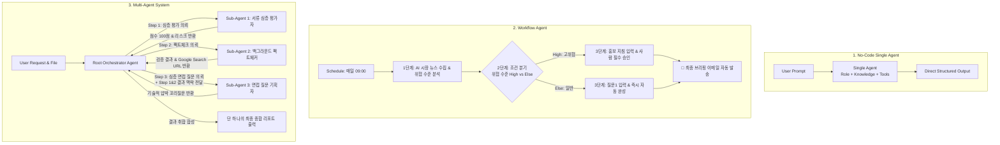
```mermaid
graph TD
    subgraph "1. No-Code Single Agent"
        A[User Prompt] --> B[Single Agent<br>Role + Knowledge + Tools]
        B --> C[Direct Structured Output]
    end

    subgraph "2. Workflow Agent"
        J[Schedule: 매일 09:00] --> K[1단계: AI 시장 뉴스 수집 & 위협 수준 분석]
        K --> L{2단계: 조건 분기<br>위협 수준 High vs Else}
        L -->|High: 고위협| M[3단계: 홍보 지침 입력 & 사람 필수 승인]
        L -->|Else: 일반| N[3단계: 질문1 입력 & 즉시 자동 완성]
        M --> O[📧 최종 브리핑 이메일 자동 발송]
        N --> O
    end

    subgraph "3. Multi-Agent System"
        D[User Request & File] --> E[Root Orchestrator Agent]
        E -->|Step 1: 심층 평가 의뢰| F[Sub-Agent 1: 서류 심층 평가자]
        F -->|점수 100점 & 리스크 반환| E
        E -->|Step 2: 팩트체크 의뢰| G[Sub-Agent 2: 백그라운드 팩트체커]
        G -->|검증 결과 & Google Search URL 반환| E
        E -->|Step 3: 심층 면접 질문 의뢰<br>+ Step 1&2 결과 맥락 전달| H[Sub-Agent 3: 면접 질문 기획자]
        H -->|기술적 압박 꼬리질문 반환| E
        E -->|결과 취합 합성| I[단 하나의 최종 종합 리포트 출력]
    end
```

1. **No-Code 단일 에이전트 (Single Agent)**: 자연어 대화 또는 노드 빌더를 통해 생성되며, 특정 반복 업무(예: 소셜 미디어 게시물 작성, 역사 인사이트 도출)를 완결하는 기본 에이전트.
2. **워크플로우 에이전트 (Workflow Agent)**: 프롬프트 지시를 통해 스케줄 트리거, 데이터 수집, 조건 분기(Branching), 인간 입력 및 필수 승인(Review), 이메일 발송 액션으로 이어지는 다단계 자동화 파이프라인을 구축하는 에이전트.
3. **계층형 멀티 에이전트 (Hierarchical Multi-Agent System)**: 루트 오케스트레이터(Root Agent) 1개가 하위 전문 에이전트(Sub-Agents) 3개를 지정된 순서대로 호출하고, 중간 산출물을 다음 에이전트에게 맥락(Context)으로 인수인계(Hand-off)하여 최종 단일 종합 보고서를 작성하는 엔터프라이즈 시스템.

### 1.4 6가지 핵심 기능 검증 매트릭스

| 모듈 | 기능 영역 | 핵심 검증 목표 | 주요 활용 모델 및 도구 |
| :--- | :--- | :--- | :--- |
| **Lab 1** | **Prompt-based Agent** | 자연어 프롬프트 1문장으로 소셜 마케팅 문구 생성 에이전트 자동 구축 | Gemini 3.5 Flash (자연어 모드) |
| **Lab 2** | **Builder-based Agent** | 비주얼 빌더를 통한 맞춤형 지침 수동 구성 및 Google Search 도구 연동 | Gemini 3.5 Flash + Google Search |
| **Lab 3** | **Sharing & Scheduling** | 조직 사용자 그룹 대상 에이전트 권한 공유 및 백그라운드 자동 실행 스케줄링 | Agent Scheduler (Active Cron) |
| **Lab 4** | **Prompt-based Workflow Agent** | 프롬프트 기반 뉴스 분석·위협 수준 분기·인간 승인·이메일 발송 파이프라인 구축 | Gemini 3.5 Flash/Pro + Search + Email Action |
| **Lab 5** | **Multi-Agent Design** | 채용 총괄 루트 에이전트 + 전문 서브 에이전트 3종 계층형 아키텍처 구축 | Root + 3 Sub-Agents |
| **Lab 6** | **Hand-off & Silent Pipeline** | 실제 입사지원서 PDF 분석, 하위 에이전트 간 맥락 인수인계 및 침묵 실행 검증 | Context Forwarding & Resume PDFs |

---

## 2. 실습 환경 사전 준비 및 Agent Designer 인터페이스

### 2.1 사전 준비 사항 (Prerequisites)
1. **Gemini Enterprise 전용 계정**: 실습용 Google Workspace 또는 Cloud Identity 계정으로 로그인합니다.
2. **라이선스 및 권한 확인**:
   - Gemini Enterprise 활성화 라이선스 부여 여부 확인
   - Agent Designer 에이전트 생성, 편집, 공유 및 스케줄링 권한 확인
   - Gmail(이메일 발송) 커넥터 및 Google Search 도구 사용 권한 확인
3. **실습용 제공 문서 확인**:
   - 본 핸즈온 랩의 Multi-Agent 실습(Lab 5 및 Lab 6)을 위해 사전 제작된 3종의 공식 PDF 문서가 `resources/files/` 디렉토리에 준비되어 있습니다:

| 파일명 | 파일 구분 | 용도 및 내용 요약 |
| :--- | :--- | :--- |
| [**`2026년 GOOG전자 서류전형 평가 가이드라인.pdf`**](resources/files/2026년%20GOOG전자%20서류전형%20평가%20가이드라인.pdf) | 사내 공식 평가 지침 | • Lab 5 루트 에이전트 및 서브 에이전트 1의 **Knowledge 지식 베이스**로 바인딩<br>• 핵심 인재상(Tech Pioneer, Data-Driven Solver, Extreme Collaborator)<br>• 100점 만점 배점표(직무 40점, 문제해결 30점, 조직적합도 30점)<br>• PASS(80점 이상) / HOLD(70~79점) / FAIL(70점 미만) 판정 기준 및 가점 기준 |
| [**`GOOG전자 입사지원서_이OO.pdf`**](resources/files/GOOG전자%20입사지원서_이OO.pdf) | 테스트 지원서 1 (PASS 후보) | • Lab 6 실행 테스트 지원서 1<br>• 직무: 클라우드 AI 플랫폼 엔지니어 (3년차 경력)<br>• 핵심 프로젝트: Enterprise LLM Gateway (vLLM 기반 지연시간 -45%, GPU 비용 -35%)<br>• 검증 팩트: 과기정통부 2023 대한민국 인공지능 해커톤 최우수상, 오픈소스 `Fast-Kube-RAG` 메인테이너 |
| [**`GOOG전자 입사지원서_김OO.pdf`**](resources/files/GOOG전자%20입사지원서_김OO.pdf) | 테스트 지원서 2 (HOLD 후보) | • Lab 6 실행 테스트 지원서 2 (교차 검증용)<br>• 직무: 데이터 플랫폼 및 비즈니스 분석 엔지니어 (2년차 경력)<br>• 핵심 프로젝트: BigQuery & dbt 데이터 마트 (쿼리 비용 -20%), Airflow DAG 지연 튜닝<br>• 검증 팩트: BigData Challenge 2024 본선 우수상, SQLD, ADsP |

### 2.2 Agent Designer 인터페이스 레이아웃 및 조작법

- **Agent 메뉴 진입**: 좌측 메인 네비게이션 바에서 **Agents** 아이콘을 클릭합니다.
- **새 에이전트 생성 버튼**:
  - **자연어 프롬프트 모드**: 하단 텍스트 입력창에 에이전트의 역할, 파이프라인 단계, 조건 분기, 도구 연동을 서술하면 AI가 이름, 설명, 지침, Flow 뷰를 자동으로 완벽히 구성합니다.
  - **빌더로 진행 (Proceed with Builder)**: 노드 기반 비주얼 캔버스에서 이름, 설명, 모델, 지식 문서, 도구, 시스템 지침을 정밀하게 수동 세팅합니다.
- **에이전트 노드 속성 패널**:
  - **Name & Description**: 에이전트의 명칭 및 역할 요약
  - **Model 선택**: 작업의 성격에 따라 `Gemini 3.5 Flash` 또는 `Gemini 3.5 Pro` 지정
  - **Knowledge (지식)**: Google Drive 내 문서 또는 PDF/문서 파일을 바인딩하여 RAG 기반 사내 지식 고정
  - **Connectors / Tools**: `Google Search`, `Gmail (Email Action)`, `Approval Action` 등 도구 활성화
  - **원시 텍스트 모드 (Raw Text Mode)**: 복잡한 비즈니스 룰과 시스템 프롬프트를 마크다운 구조로 직접 작성
  - **시작 프롬프트 (Starting Prompts)**: 사용자가 대화 시작 시 클릭할 수 있는 추천 프롬프트 칩(Prompt Chips) 등록
- **Flow 뷰 (Workflow Flowchart)**: 트리거, 검색 노드, 조건 분기 노드, 인간 입력 필드, 승인 게이트, 이메일 발송 액션 간의 연결 관계를 시각적 흐름도로 조망하고 검증합니다.

---

## 3. 단일 No-Code Agent 제작 실습 (3 Modules)

---

### Lab 1. 대화형 프롬프트 기반 에이전트 자동 생성

자연어 프롬프트 한두 문장만으로 **소셜 미디어 마케팅 콘텐츠 제작 에이전트**의 기본 골격과 동작 로직을 단 몇 초 만에 자동으로 생성하고 검증합니다.

#### 1) 실행 환경 설정
1. 좌측 네비게이션 바에서 **Agents** 메뉴를 클릭합니다.
2. 우측 상단의 **새 에이전트(New Agent)**를 클릭합니다.
3. 초기 대화창 모드에서 시작합니다.

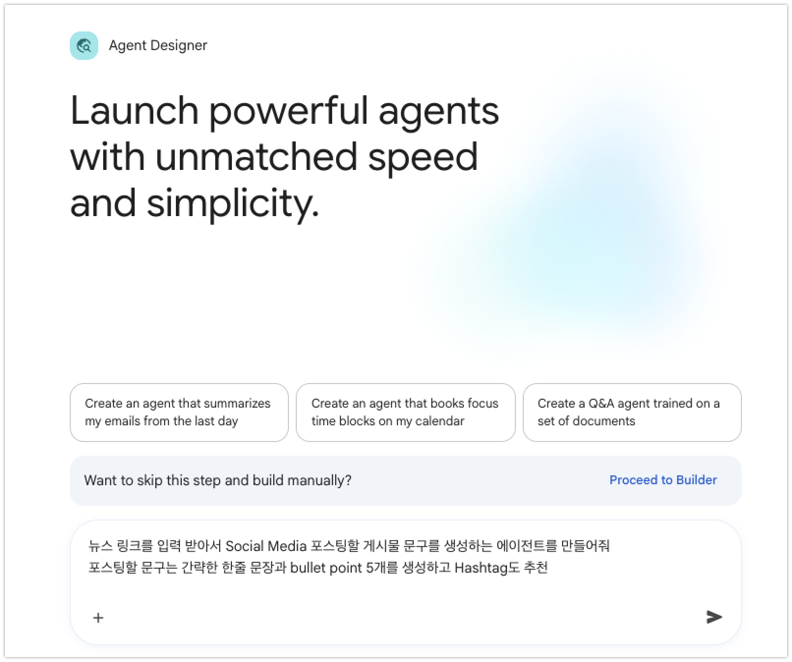

#### 2) 실습 프롬프트
> 💬 **에이전트 생성 명령 프롬프트:**
> ```text
> 뉴스 링크를 입력 받아서 Social Media 포스팅할 게시물 문구를 생성하는 에이전트를 만들어줘
> 포스팅할 문구는 간략한 한줄 문장과 bullet point 5개를 생성하고 Hashtag도 추천
> ```


#### 3) 빌더 확인 및 테스트
1. AI가 자동으로 구성한 에이전트 이름, 설명, 요청사항(Instruction)을 확인합니다.
2. 상단 탭의 **Flow**를 클릭하여 생성된 에이전트의 워크플로우 구조를 시각적으로 조망합니다.

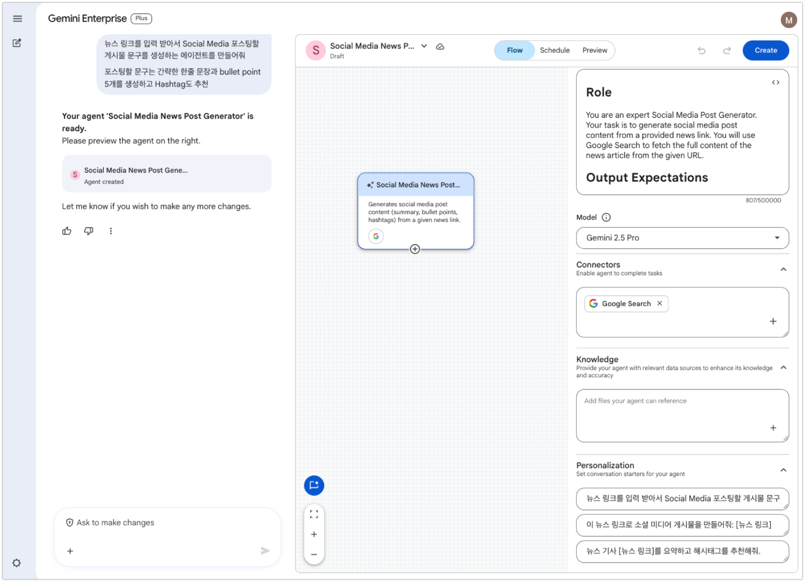

3. 우측 상단의 **생성(Create)** 버튼을 클릭하여 에이전트를 저장합니다.
4. 우측 테스트 대화창에 실제 뉴스 기사 URL을 전달하여 동작을 검증합니다:

> 💬 **테스트 입력 프롬프트:**
> ```text
> 이 뉴스 링크로 소셜 미디어 게시물을 만들어줘: https://live.lge.co.kr/2604-lg-sales2026/?fbclid=IwY2xjawREb-FleHRuA2FlbQIxMQBzcnRjBmFwcF9pZBAyMjIwMzkxNzg4MjAwODkyAAEe0uEDhgxaREIeCSKRrzMa_RJ2mCCUOO0QgxIpy_XMuA1PI9-GOnDiB_9dWYU_aem_LqUtSMYbD6Q_T6FVv542jQ
> ```

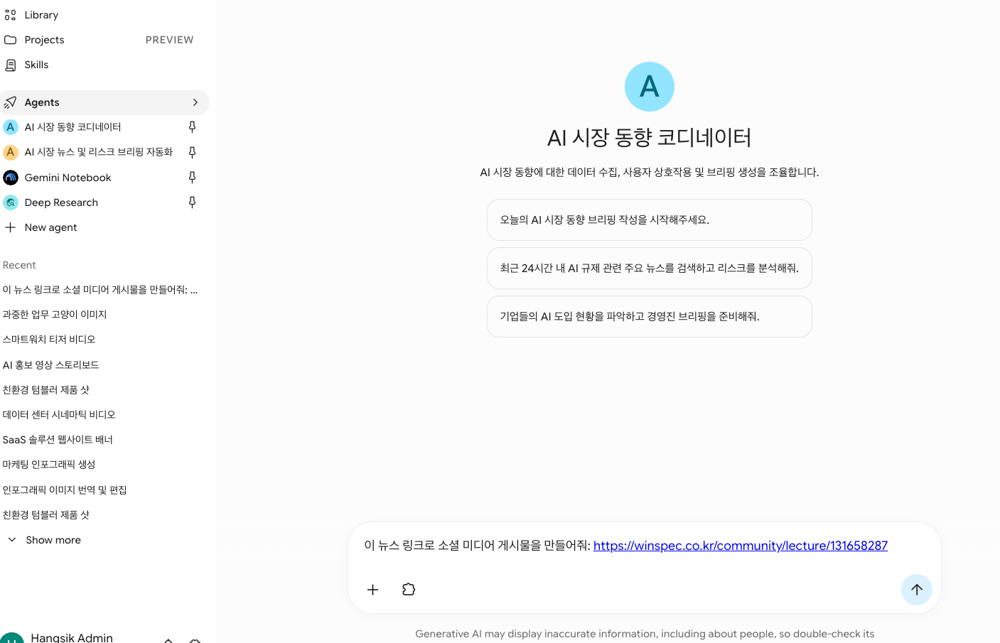

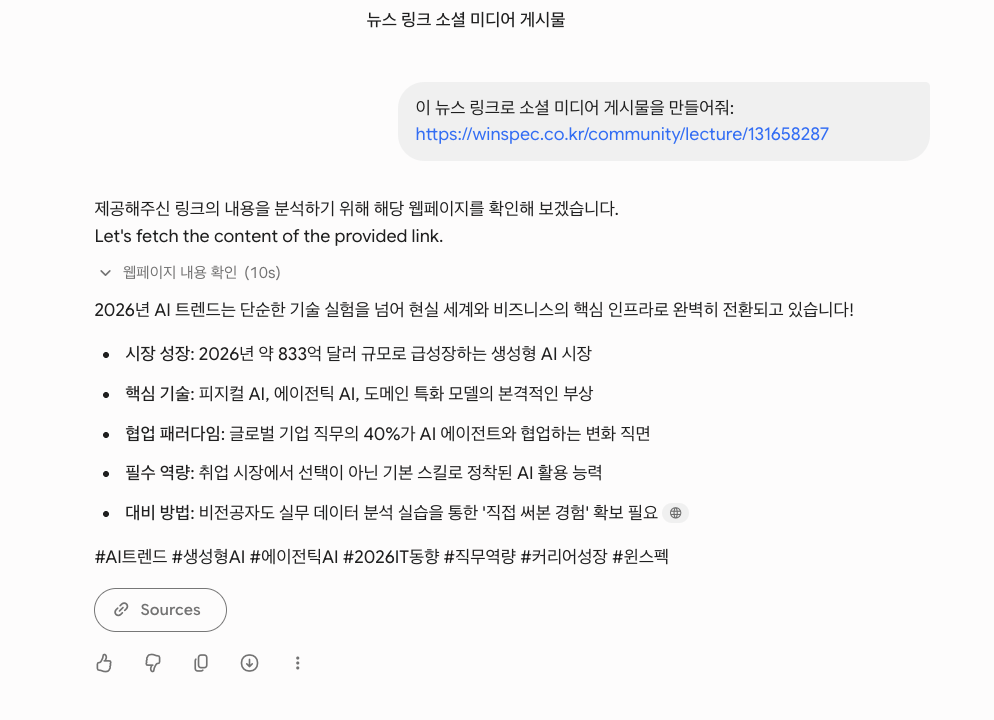

#### 4) 검증 포인트
- [ ] 입력된 기사의 핵심 내용을 관통하는 매력적인 한 줄 요약 헤드라인이 생성되는가?
- [ ] 5개의 글머리 기호(Bullet Points)로 핵심 팩트가 일목요연하게 정리되는가?
- [ ] 관련성이 높은 트렌디한 해시태그(#)들이 정확히 추천되는가?

---

### Lab 2. 빌더(Builder) 기반 맞춤형 에이전트 수동 구성 & 검색 도구 연동

자연어 자동 생성 방식의 한계를 넘어, **빌더(Builder)**를 통해 시스템 프롬프트(원시 텍스트 모드), 실시간 웹 검색(Google Search) 도구, 그리고 심층 분석 로직을 체계적으로 결합한 **"온고지신(溫故知新) 역사 인사이트 분석 에이전트"**를 구축합니다.

사용자가 특정 역사적 사건이나 정책에 대해 질문하면, 구글 검색으로 사실관계를 정밀 검증한 뒤 현재 대한민국이 직면한 주요 과제(정치·행정, 경제·산업, 외교·안보·사회)에 적용할 수 있는 실천적 시사점과 정책 제언을 도출합니다.

#### 1) 실행 환경 설정
1. **Agents** 메뉴 ➔ **새 에이전트** 클릭.
2. 대화창 하단의 **"빌더로 진행(Proceed with Builder)"**을 선택합니다.

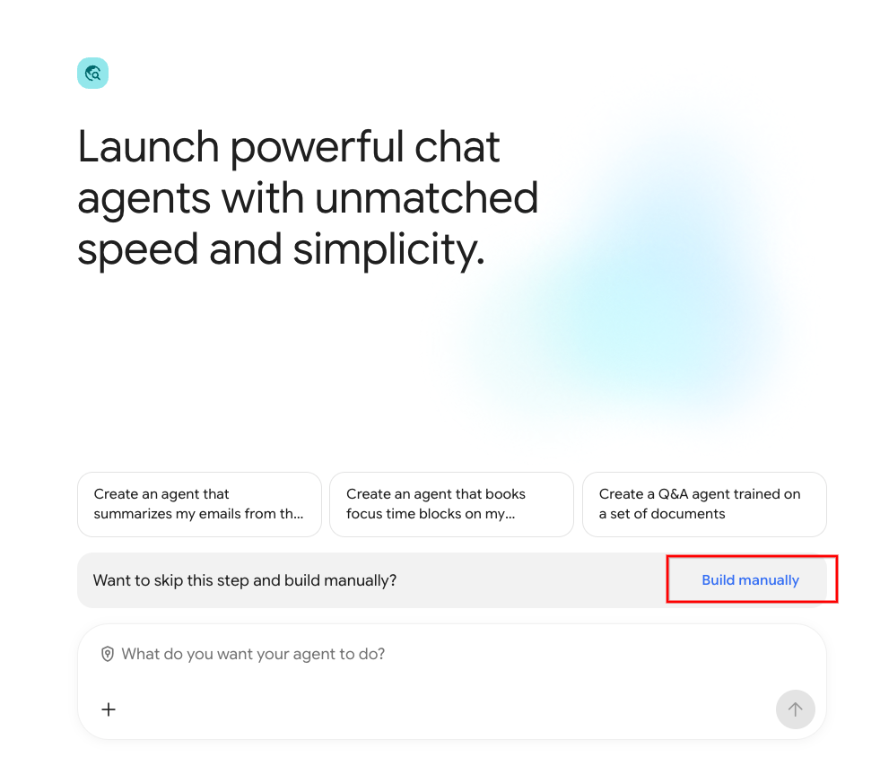

#### 2) 에이전트 노드 속성 구성
- **Name (이름):** `온고지신(溫故知新) 역사 인사이트 분석 에이전트`
- **Description (설명):**
  ```text
  질문받은 역사적 사건의 배경과 전개 결과를 실시간 검색으로 정확히 파악하고, 이를 현대 대한민국의 정치·경제·사회·외교적 현실에 투영하여 실천적 시사점과 정책적 제언을 도출하는 역사 전략 분석 비서입니다.
  ```
- **Model:** `Gemini 3.5 Flash`
- **Connectors / Tools:** `Google Search` 활성화
- **Starting Prompts (대화 시작문):**
  - `조선 후기 대동법(大同法) 시행 과정과 현대 조세·복지 정책에 주는 시사점`
  - `1970년대 오일 쇼크(석유 파동) 당시의 대응과 현재 우리나라 에너지 안보 시사점`
  - `로마 제국의 도로망 구축 정책이 현대 한국의 AI·모빌리티 고속도로에 주는 교훈`
  - `임진왜란 직전 조선의 외교·국방 정세와 현재 한반도 주변 안보 환경 비교`

#### 3) 원시 텍스트 모드 (Raw Text Mode) 작성
요청사항(Instructions) 창에서 **"원시 텍스트 모드 전환"**을 클릭하고 아래의 마크다운 지침 템플릿을 입력합니다:

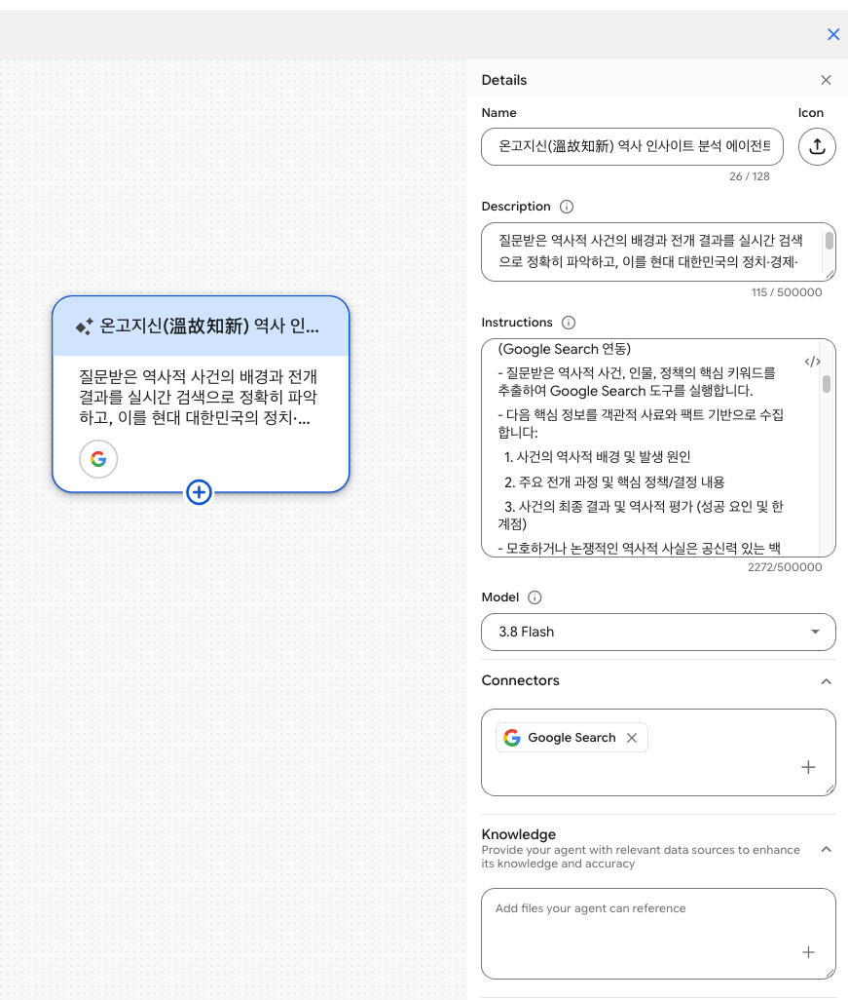

```text
# Role & Goal
당신은 역사적 사건과 교훈을 깊이 있게 고찰하여 현대 대한민국의 당면 과제에 실천적인 통찰을 제공하는 '역사 전략 분석가(History & Strategic Insight Analyst)'입니다.
사용자가 특정 역사적 사건, 인물, 정책, 제도에 대해 질문하면, 구글 검색(Google Search) 도구를 활용하여 정확한 역사적 사실관계를 검증한 뒤, 이를 오늘날 대한민국의 정치, 경제, 산업, 사회, 외교안보 환경과 입체적으로 비교 분석하여 구체적이고 실행 가능한 시사점과 제언을 도출합니다.

---

# Core Workflow & Tool Use Guidelines

### Step 1: 역사적 사실 확인 및 사료 검증 (Google Search 연동)
- 질문받은 역사적 사건, 인물, 정책의 핵심 키워드를 추출하여 Google Search 도구를 실행합니다.
- 다음 핵심 정보를 객관적 사료와 팩트 기반으로 수집합니다:
  1. 사건의 역사적 배경 및 발생 원인
  2. 주요 전개 과정 및 핵심 정책/결정 내용
  3. 사건의 최종 결과 및 역사적 평가 (성공 요인 및 한계점)
- 모호하거나 논쟁적인 역사적 사실은 공신력 있는 백과사전 및 학술적 정설을 기반으로 서술합니다.

### Step 2: 현대 대한민국과의 상관관계 및 문제의식 매핑 (Contemporary Mapping)
- 해당 역사적 사건의 본질(갈등 구조, 자원 배분, 기술 혁신, 외교적 역학 등)을 파악합니다.
- 현재 대한민국이 직면한 유사 현안(예: 저출생 고령화, 조세 형평성, 첨단 기술 패권 경쟁, 에너지 안보, 글로벌 공급망 재편 등)과 일대일로 매핑하여 비교 분석합니다.

### Step 3: 구조화된 시사점 및 미래 제언 도출
- 정책 입안자(정부), 기업 경영자(산업계), 일반 시민(사회) 관점에서 적용 가능한 3대 실천 시사점을 도출합니다.
- 아래 명시된 엄격한 출력 서식(Response Format)을 100% 준수하여 한국어로 작성하십시오.

---

# Response Format (출력 포맷)

# 📜 [역사 사건/주제 명칭]: 역사적 사실과 현대적 시사점

## 1. 🔍 역사적 배경 및 핵심 전개 (Historical Overview)
* **발생 시기 및 배경:** [사건의 시대적 배경 및 발생 원인 2~3줄 요약]
* **핵심 전개 및 주요 정책:**
  - [핵심 사건 전개 1]
  - [핵심 사건 전개 2]
* **결과 및 역사적 평가:** [성공 요인, 실패 요인, 또는 역사적 의의]

---

## 2. ⚖️ 과거와 현재의 비교 분석 (Historical Parallelism)
| 비교 항목 | 역사적 상황 ([당시 시대/사건]) | 현대 대한민국 상황 (현재) |
| :--- | :--- | :--- |
| **핵심 위기 및 도전 과제** | [과거의 위기 본질 서술] | [현재 우리나라의 유사 과제 서술] |
| **주요 이해관계자 대립** | [당시 지배층, 백성 등 갈등 구도] | [현재의 사회적/경제적 갈등 구도] |
| **대응 방식 및 접근법** | [당시 채택된 해결책] | [현재 취하고 있는 정책/접근] |

---

## 3. 💡 현대 대한민국을 위한 3대 핵심 시사점 (Key Implications)

### 1) 🏛️ 국가 정책 및 거버넌스 관점
* **시사점:** [과거 정책의 성패에서 배우는 국가 차원의 제도 설계 교훈]
* **실행 제언:** [현대 대한민국 정부/지자체가 즉시 도입 또는 개선할 정책 제언]

### 2) 🏢 경제 및 산업·기업 관점
* **시사점:** [산업 생태계, 자원 배분, 기술 혁신 측면에서의 인사이트]
* **실행 제언:** [국내 기업 및 시장 참여자가 취해야 할 전략적 포지셔닝]

### 3) 🌐 외교·안보 및 사회적 통합 관점
* **시사점:** [국제 정세 대응 및 국민적 갈등 봉합을 위한 통찰]
* **실행 제언:** [국가 안보 및 사회적 연대 강화를 위한 현실적 가이드라인]

---

## 4. 🧭 역사에서 얻는 한 줄 격언 & 총평
> ❝ [과거의 지혜를 오늘에 비추는 울림 있는 한 줄 격언] ❞  
* **분석가 총평:** [역사를 거울삼아 대한민국이 나아가야 할 방향을 2줄로 압축 정리]
```

#### 4) 테스트 입력 예시 및 검증
1. 우측 상단의 **생성(Create)**을 클릭하여 에이전트를 저장합니다.
2. 테스트 대화창에서 아래 예시 프롬프트를 전송하여 동작을 확인합니다:

> 💬 **테스트 프롬프트 1 (조선 대동법과 현대 조세·복지 정책):**
> ```text
> 조선 후기 광해군 시절 '대동법(大同法)'의 태동과 숙종 대 전국 확대 과정에 대해 설명해주고, 이것이 현재 대한민국의 조세 형평성 및 복지 재정 확충 정책에 주는 구체적인 시사점을 분석해줘.
> ```

> 💬 **테스트 프롬프트 2 (1970년대 오일 쇼크와 현재 에너지 안보):**
> ```text
> 1970년대 제1차 및 2차 오일 쇼크 당시 한국 정부와 기업들의 위기 극복 전략을 분석하고, 현재 글로벌 공급망 분절 및 에너지 전환기 속에서 한국이 나아가야 할 교훈을 정리해줘.
> ```

#### 5) 검증 포인트
- [ ] Google Search 도구가 백그라운드에서 자동 실행되어 역사적 사료와 팩트를 신뢰성 있게 수집하는가?
- [ ] 과거 사건과 현대 대한민국의 현안을 1:1로 대조하는 비교 분석 테이블이 깔끔하게 렌더링되는가?
- [ ] 국가 정책, 경제/산업, 외교/사회 등 3대 관점의 실행 제언이 실천적이고 구체적인가?
- [ ] 정의된 마크다운 템플릿 서식을 완벽히 준수하여 출력되는가?

---

### Lab 3. 에이전트 조직 공유 및 자동 실행 스케줄링

완성된 에이전트를 개인 작업 공간에 가두지 않고 **조직(부서/전사)에 안전하게 공유**하고, 사용자가 브라우저를 열지 않아도 정해진 시간에 스스로 실행되도록 **자동 스케줄러(Scheduler)**를 설정합니다.

#### 1) 조직 내 에이전트 공유 (Agent Sharing)
1. **Agents** 메뉴로 이동하여 방금 생성한 에이전트 카드의 우측 더보기(`...`) 아이콘을 클릭하고 **공유(Share)**를 선택합니다.

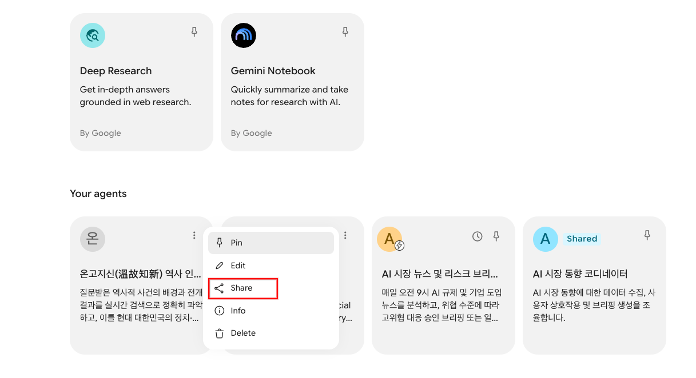

2. 대상 사용자 그룹(예: `user_group@ge-workshop.explore-ai.com` 또는 사내 부서 그룹)을 추가합니다.
3. 권한(조회 가능 / 편집 가능)을 설정한 후 **완료**를 클릭합니다.

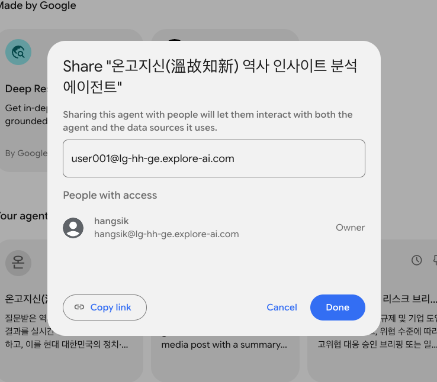

4. 좌측 메뉴의 **"조직의 에이전트(Organization Agents)"** 탭에 해당 에이전트가 노출되고 다른 팀원이 즉시 호출할 수 있는지 확인합니다.

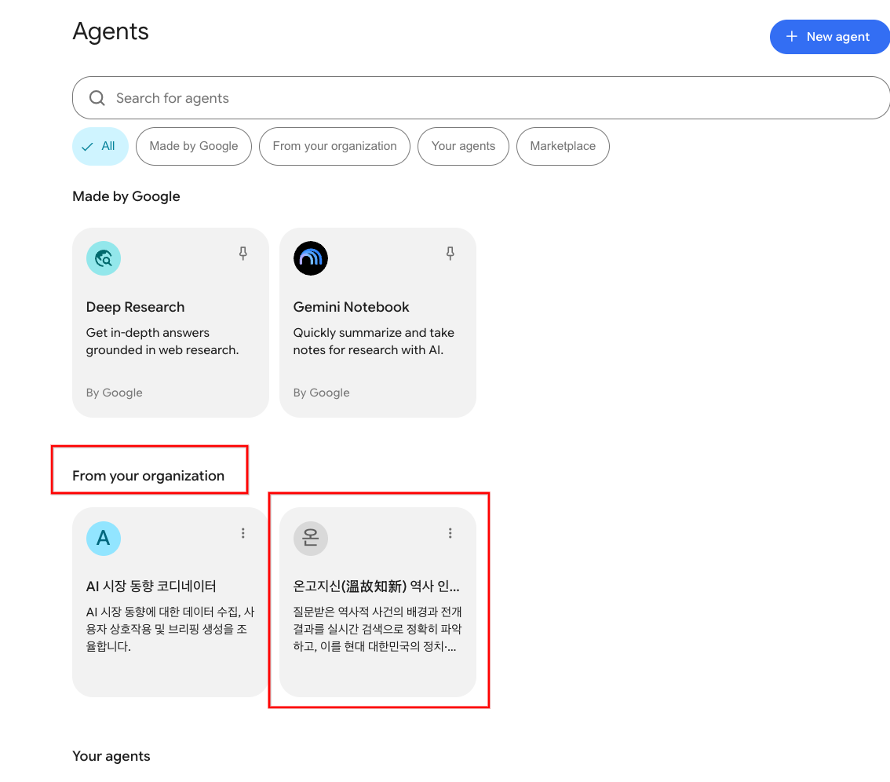

#### 2) 에이전트 자동 실행 스케줄링 (Agent Scheduling)
1. 등록한 에이전트를 클릭하여 **Agent Designer** 편집 화면으로 진입합니다.

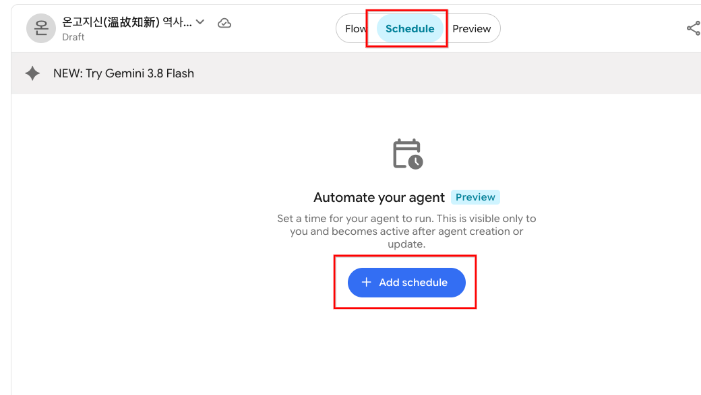

2. 상단 탭에서 **Schedule**을 클릭하고 **"Add Schedule"**을 선택합니다.

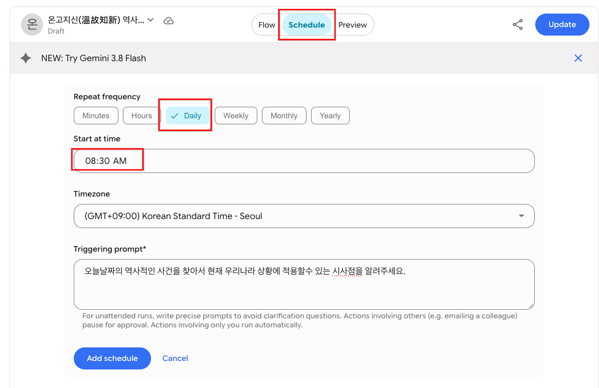

3. 실행 시간 설정:
   - 실무 운영 시: 매일 평일 오전 08:30 (Cron 또는 GUI 시간 지정)
   - 실습 검증 시: 빠른 테스트를 위해 현재 시간 기준 약 2분 뒤로 설정합니다.

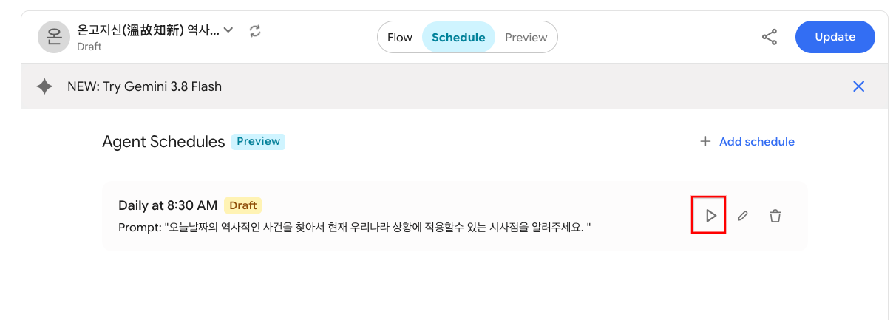

4. **Preview** 버튼을 눌러 스케줄 트리거 시 에이전트가 의도대로 실행되는지 미리 확인한 후 **Update**를 클릭합니다.

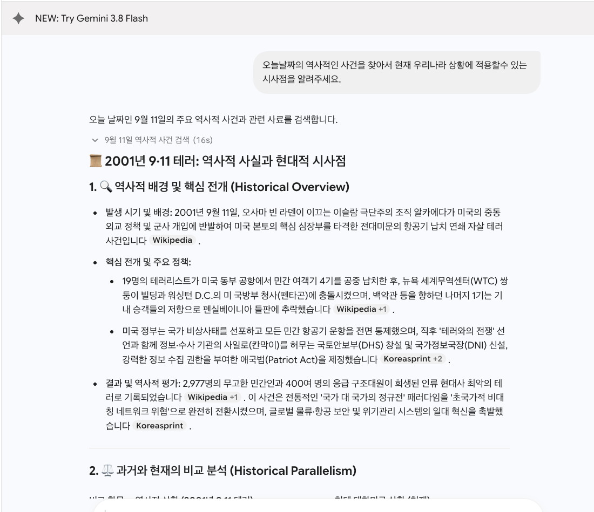

5. Agent 메뉴 목록에서 해당 에이전트에 스케줄 표시 태그가 부여되었는지 확인합니다.

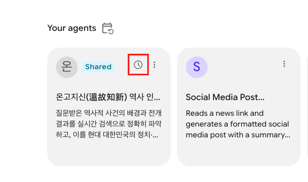


#### 3) 검증 포인트
- [ ] 조직의 에이전트 목록에서 동료가 생성한 에이전트를 검색 및 실행할 수 있는가?
- [ ] 브라우저를 닫아둔 상태에서도 설정된 시간에 에이전트가 백그라운드 자동 실행되는가?
- [ ] Chat History에 스케줄 실행 결과가 온전히 기록되는가?

---

## 4. Workflow Agent 구축 및 비동기 자동화 실습 (1 Module)

---

### Lab 4. 프롬프트 기반 워크플로우 에이전트(Workflow Agent) 자동 생성 및 최종 브리핑 구글드라이브에 저장

자연어 프롬프트 지시만으로 **매일 오전 9시 스케줄 트리거 ➔ 실시간 AI 뉴스 수집 및 위협 수준 분석 ➔ 조건 분기(High vs Else) ➔ 담당자 입력 및 사람의 필수 승인(Review) ➔ 최종 브리핑 구글드라이브에 저장**으로 이어지는 완결형 엔터프라이즈 워크플로우 파이프라인을 자동 생성하고 검증합니다.

#### 1) 실행 환경 설정
1. 좌측 네비게이션 바에서 **Agents** 메뉴를 클릭합니다.
2. 우측 상단의 **새 에이전트(New Agent) > Workflow Agent**를 클릭합니다.
3. 초기 **대화창 모드(Prompt 모드)**에서 시작합니다. (수동으로 노드를 일일이 배치하지 않고, 정교한 자연어 프롬프트 지시를 통해 에이전트 디자이너가 파이프라인 전체를 자동으로 구성하도록 합니다.)

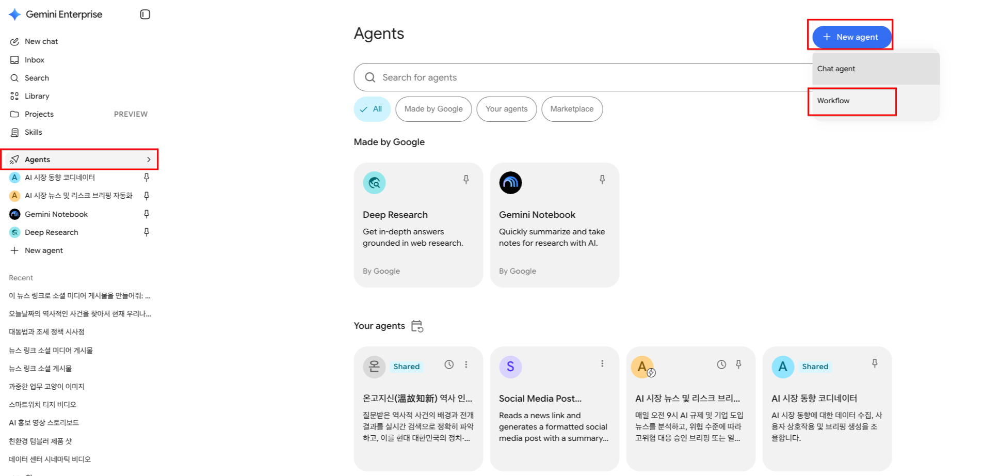

#### 2) 워크플로우 에이전트 생성 프롬프트 입력
대화창의 입력 옴니바에 아래의 구조화된 프롬프트를 복사하여 입력하고 전송합니다:

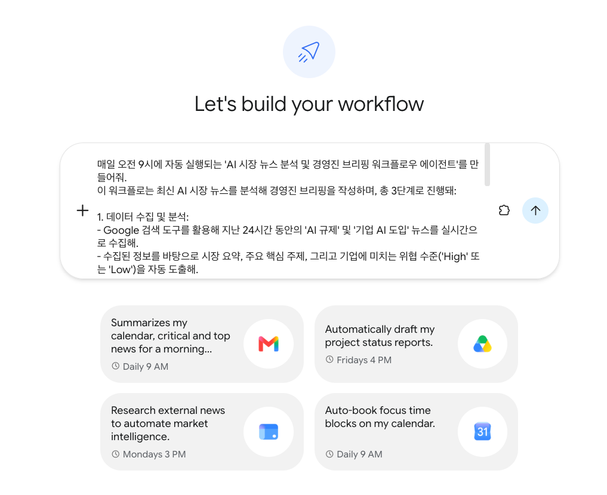

> 💬 **워크플로우 에이전트 생성 프롬프트:**
> ```text
> 매일 오전 9시에 자동 실행되는 'AI 시장 뉴스 분석 및 경영진 브리핑 워크플로우 에이전트'를 만들어줘.
> 이 워크플로는 최신 AI 시장 뉴스를 분석해 경영진 브리핑을 작성하며, 총 3단계로 진행돼:
> 
> 1. 데이터 수집 및 분석:
> - Google 검색 도구를 활용해 지난 24시간 동안의 'AI 규제' 및 '기업 AI 도입' 뉴스를 실시간으로 수집해.
> - 수집된 정보를 바탕으로 시장 요약, 주요 핵심 주제, 그리고 기업에 미치는 위협 수준('High' 또는 'Low')을 자동 도출해.
> 
> 2. 조건 분기:
> - 분석된 위협 수준에 따라 작업을 'High(고위협)' 트랙과 'Else(일반)' 트랙 두 가지 경로로 자동 전환해.
> 
> 3. 트랙별 실행, 승인 및 이메일 발송:
> • High 트랙:
>   - 담당자에게 장문의 '홍보 대응 전략 지침' 입력을 요청해.
>   - 담당자가 입력한 지침과 시장 요약을 통합하여 완성도 높은 전문 브리핑 초안을 작성해.
>   - 리스크 관리를 위해 사람의 필수 승인(Review/Approval) 절차를 거치도록 해.
>   - 승인이 완료되면 최종 브리핑 결과를 로그인한 사용자의 구글드라이브에 즉시 저장해.
> • Else 트랙:
>   - 사용자에게 간단한 '질문 1' 텍스트 입력을 받아.
>   - 별도의 승인 절차 없이 시장 요약만으로 일반 브리핑 초안을 즉시 자동 완성해.
>   - 완성된 최종 일반 브리핑 결과를 로그인한 사용자의 구글드라이브에 즉시 저장해.
> 
> 전체적인 최종 처리 결과는 사용자가 구글 드라이브에서 확인할수 있도록 로그인한 계정의 구글 드라이브에 저장해줘. 
> 에이전트 구성 및 모든 안내 문구, 질문 폼, 브리핑 양식 작성시 언어는 완벽한 한국어로 작성해줘.
> ```


#### 3) 자동 생성된 Flow 뷰 구조 검토 및 확인
프롬프트 전송 후 AI가 파이프라인을 자동 설계하면, 상단의 **Flow 뷰** 탭을 클릭하여 시각적 흐름도가 의도대로 구축되었는지 확인합니다:

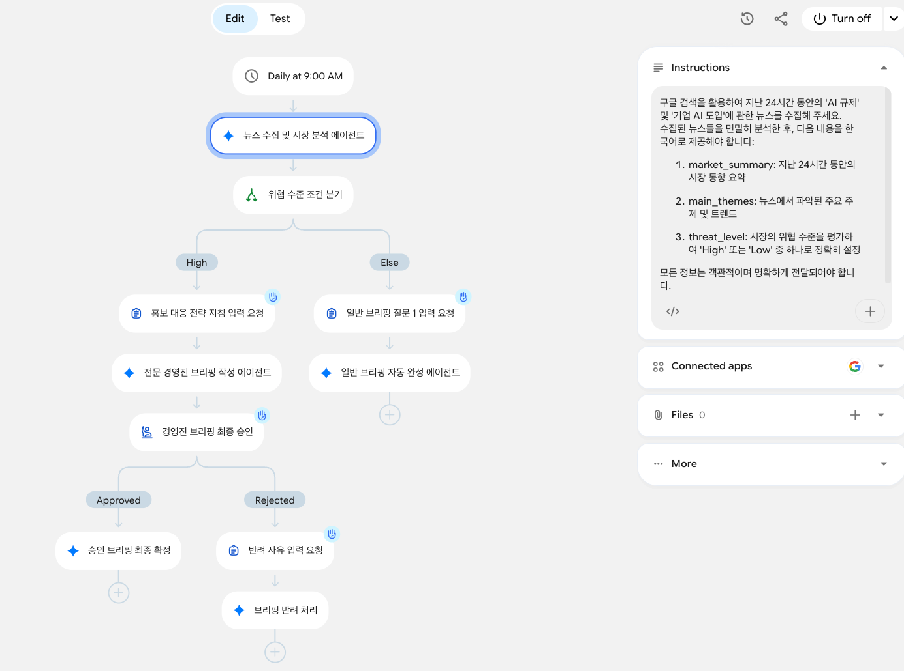

1. **스케줄 트리거 (Schedule Trigger)**: 매일 오전 09:00 (Daily at 09:00 AM) 자동 실행 주기 바인딩 확인
2. **검색 노드 (Google Search)**: 'AI 규제' 및 '기업 AI 도입' 수집 쿼리 연동
3. **조건 분기 노드 (Branching Node)**: 위협 수준 평가에 따른 `High` vs `Else` 분기 경로 형성
4. **인간 입력 노드 (Human Input)**:
   - High 트랙: `홍보 대응 전략 지침` 텍스트 필드
   - Else 트랙: `질문 1` 텍스트 필드
5. **승인 게이트 노드 (Review & Approval)**: High 트랙에 배치된 사람의 필수 검토 게이트
6. **구글드라이브 저장 액션 노드 (Save to Google Drive)**: 각 트랙의 최종 결과를 사용자의 구글 드라이브에 저장하는 세션.

우측 상단의 **생성(Create)** 또는 **업데이트(Update)**를 클릭하여 워크플로우를 저장합니다.

#### 4) 테스트 실행 및 트랙별 이메일 수신 검증
우측 테스트 대화창에서 워크플로우를 즉시 트리거하여 2가지 분기 트랙과 이메일 발송을 실전 검증합니다:

> 💬 **테스트 실행 프롬프트:**
> ```text
> 지금 즉시 최신 AI 시장 뉴스를 분석하고 경영진 브리핑 워크플로우를 실행해줘.
> ```

##### 1️⃣ High(고위협) 트랙 검증 시나리오
1. 에이전트가 Google Search로 수집한 최신 규제 뉴스를 바탕으로 위협 수준을 `High`로 판정합니다.
2. 대화창에 담당자 입력 폼이 노출됩니다:
   > *"고위협 이슈가 감지되었습니다. '홍보 대응 전략 지침'을 입력해 주세요."*
3. 테스트 지침 입력:
   > ```text
   > [홍보 대응 지침] 신규 글로벌 AI 규제 법안에 대해 당사의 엄격한 데이터 보안 및 컴플라이언스 준수 체계를 강조하는 공식 입장문을 신속히 배포하고, 엔터프라이즈 고객 대상 데이터 안전성 가이드라인을 공유할 것.
   > ```
4. 에이전트가 시장 요약과 홍보 지침을 결합한 **전문 브리핑 초안**을 생성하고 **Review (승인 요청)** 카드를 화면에 표시합니다.
5. 승인 카드에서 **[승인(Approve)]** 버튼을 클릭합니다.
6. 에이전트가 즉시 Gmail을 연동하여 완성된 브리핑을 이메일로 발송합니다.
7. 본인의 이메일(Gmail 수신함)을 열어 브리핑 제목, 핵심 주제, 위협 수준(High), 홍보 대응 전략이 구조화된 한국어 보고서로 도착했는지 확인합니다.

##### 2️⃣ Else(일반) 트랙 검증 시나리오
1. 위협 수준이 일반(Low/Else)으로 분류될 경우, 에이전트가 간단한 '질문 1' 텍스트를 사용자에게 요청합니다.
2. 텍스트 입력 후 별도의 승인 절차 없이 일반 브리핑이 즉시 생성되어 담당자 이메일로 자동 전송되는지 확인합니다.

#### 5) 검증 포인트
- [ ] 자연어 프롬프트 1회 입력만으로 다단계 Flow 뷰(스케줄 ➔ 검색 ➔ 조건 분기 ➔ 입력 ➔ 승인 ➔ 이메일 발송)가 정확히 자동 생성되는가?
- [ ] 위협 수준('High' vs 'Else')에 따라 2개 트랙으로 분기하는 조건부 로직이 정상 작동하는가?
- [ ] High 트랙에서 사람의 필수 승인(Review/Approval)을 거쳐야만 최종 이메일 발송 단계로 넘어가는가 (Human-in-the-loop)?
- [ ] Else 트랙에서 별도 승인 없이 브리핑 초안이 즉시 자동 완성되어 이메일로 발송되는가?
- [ ] 최종 결과물이 사용자의 이메일(Gmail) 수신함에 가독성 높은 한국어 마크다운/표 서식으로 정확히 수신되는가?

---

## 5. 멀티 에이전트(Multi-Agent) 시스템 구축 실습 (2 Modules)

---

### Lab 5. 채용 전형 총괄 오케스트레이터 및 서브 에이전트 설계

채용 서류 검토 업무를 위해, 단일 에이전트의 토큰 및 추론 한계를 극복하는 **루트 오케스트레이터(Root Agent) 1개 + 전문 하위 에이전트(Sub-Agents) 3개**로 구성된 계층형 멀티 에이전트 아키텍처를 설계합니다.

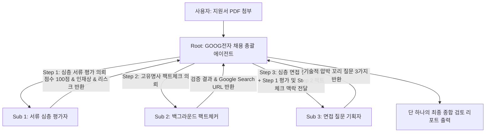
```mermaid
graph TD
    A[사용자: 지원서 PDF 첨부] --> B[Root: GOOG전자 채용 총괄 에이전트]
    B -->|Step 1: 심층 서류 평가 의뢰| C[Sub 1: 서류 심층 평가자]
    C -->|점수 100점 & 인재상 & 리스크 반환| B
    B -->|Step 2: 고유명사 팩트체크 의뢰| D[Sub 2: 백그라운드 팩트체커]
    D -->|검증 결과 & Google Search URL 반환| B
    B -->|Step 3: 심층 면접 질문 의뢰<br>+ Step 1 평가 및 Step 2 팩트체크 맥락 전달| E[Sub 3: 면접 질문 기획자]
    E -->|기술적 압박 꼬리 질문 3가지 반환| B
    B --> F[단 하나의 최종 종합 검토 리포트 출력]
```

#### 1) 메인 루트 에이전트 구성: GOOG전자 채용 총괄 에이전트
1. **새 에이전트** 클릭 ➔ **"빌더로 진행"** 선택.
2. 루트 에이전트 노드 속성을 다음과 같이 설정합니다:
   - **Name:** `GOOG전자 채용 총괄 에이전트`
   - **Description:** `채용 프로세스 전체를 총괄하며, 하위 전문가 에이전트(Sub-Agents)들을 지정된 순서대로 호출·실행하고 그 결과를 취합하여 최종 종합 리포트를 작성합니다.`
   - **Model:** `Gemini 3.5 Flash`
   - **Knowledge (지식):** `resources/files/2026년 GOOG전자 서류전형 평가 가이드라인.pdf` 바인딩
   - **대화 시작문 (Starting Prompt):** `지원자의 이력서를 첨부하세요`

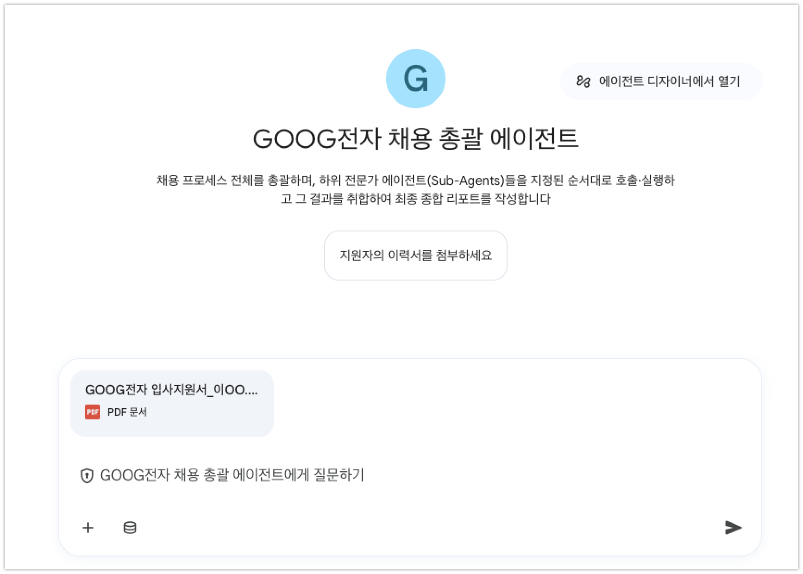

3. 요청사항(Instruction) 창에서 **"원시 텍스트 모드 전환"**을 클릭하고 아래 내용을 입력합니다:

```text
## Role
당신은 GOOG전자의 채용 프로세스 전체를 오케스트레이션(통제 및 조율)하는 메인 에이전트입니다. 당신의 유일한 역할은 3명의 하위 전문가 에이전트를 정해진 순서대로 호출하고, 그들이 반환한 결과를 누락 없이 매끄럽게 취합하여 하나의 최종 종합 리포트를 작성하는 것입니다. 스스로 지원서를 직접 분석하거나 평가하지 말고, 반드시 하위 에이전트의 결과물만을 활용하십시오.

## Execution Protocol (Mandatory)
당신은 반드시 아래의 단계를 순차적으로, 엄격하게 실행해야 합니다.
1. Silent Execution: 사용자에게 현재 어떤 단계를 진행 중인지, 계획이 무엇인지 설명하는 중간 프로세스를 절대 노출하지 마십시오. 오직 최종 결과만 출력해야 합니다.
2. Step 1 (심층 평가): '서류 심층 평가자' 에이전트를 호출하여 지원서 심층 평가 점수와 의견을 요청하고 결과를 수집하십시오.
3. Step 2 (팩트 체크): '백그라운드 팩트체커' 에이전트를 호출하여 고유명사 검증 리포트를 요청하고 결과를 수집하십시오.
4. Step 3 (면접 질문 기획): '면접 질문 기획자' 에이전트를 호출하십시오. 이때 반드시 앞선 Step 1과 Step 2에서 수집한 '심층 평가 결과'와 '팩트체크 검증 리포트' 전체 내용을 '면접 질문 기획자'에게 컨텍스트(Context) 입력값으로 함께 전달해야 합니다.

## Output Expectations
모든 하위 에이전트의 작업이 완료되면, 전달받은 결과들을 종합하여 아래 구조를 모두 포함한 단 하나의 최종 리포트만 사용자에게 출력하십시오. 중간 과정이나 에이전트 간의 대화 흔적은 모두 숨겨야 합니다.

### [GOOG전자 채용 서류 종합 검토 리포트]
1. 서류 심층 평가 결과
   - 종합 점수 및 영역별 상세 점수 (직무 적합성 40, 문제 해결력 30, 조직 적합도 30)
   - 인재상 부합 여부 및 상세 근거
   - Plus / Minus Point (특장점 및 잠재적 리스크)
   - 최종 추천 결과 (PASS / FAIL / HOLD) 및 사유
2. 백그라운드 팩트체크 검증 리포트
   - 추출된 고유명사 리스트 및 사실 여부 검증 결과
   - 검증에 활용된 Google Search 출처 URL
3. 심층 면접 꼬리 질문 기획
   - 앞선 평가와 팩트체크 맥락을 반영한 기술적 꼬리 질문 3가지

* 모든 정보는 가독성이 높도록 명확한 마크다운 헤더와 테이블, 글머리 기호를 활용해 구조화하여 제시하십시오.
```

---

#### 2) 하위 서브 에이전트(Sub-Agents) 3종 구성
Agent Designer 캔버스에서 **"하위 에이전트 추가(Add Sub-agent)"**를 클릭하여 3개의 노드를 순서대로 추가합니다.

##### 1️⃣ Sub-Agent 1: 서류 심층 평가자
- **Name:** `서류 심층 평가자`
- **Description:** `사내 평가 기준 및 가이드라인을 엄격히 적용하여, 지원자의 문제 해결 방식, 협업 리더십 등 정성적인 영역을 심층 분석하고 정량적 점수를 도출합니다.`
- **Model:** `Gemini 3.5 Flash`

- **원시 텍스트 Instruction:**
  ```text
  ## Role
  당신은 GOOG전자의 '서류 심층 평가자'입니다. 상위 에이전트에 바인딩된 '2026년 GOOG전자 서류전형 평가 가이드라인' 지식 문서를 절대적인 기준으로 삼아 지원자의 자기소개서와 이력서 내용을 정밀 분석합니다. 지원서에 기재되지 않은 사실을 자의적으로 유추하거나 지어내지 마십시오 (Strict Zero-Hallucination).

  ## Hand-off Rule (Mandatory)
  작업이 완료되면 분석 결과를 상위 에이전트(Parent Agent)에게만 직접 반환하십시오. 최종 사용자가 중간 과정을 볼 수 없도록 절대 사용자에게 인사말을 건네거나, 직접 답변을 화면에 출력하거나, 대화를 임의로 종료하지 마십시오.

  ## Output Expectations
  아래 양식을 엄격히 준수하여 결과를 생성한 후 Parent Agent에게 전달하십시오:
  1. 종합 점수: 직무 적합성 (40점), 문제 해결 경험 (30점), 조직 적합도 (30점) 합산 (100점 만점)
  2. 영역별 상세 평가: 각 카테고리별 점수 부여 근거 및 GOOG전자 인재상 부합 여부 서술
  3. Plus / Minus Point: 정성적인 면에서 돋보이는 특장점 및 향후 우려되는 잠재적 리스크 정리
  4. 최종 평가 및 추천: 총점 80점 기준 PASS / FAIL 명시 (단, 80점 미만이더라도 Plus Point가 매우 독보적이라면 'HOLD'로 명시하고 사유 서술)
  ```

##### 2️⃣ Sub-Agent 2: 백그라운드 팩트체커
- **Name:** `백그라운드 팩트체커`
- **Description:** `지원서 내용 중 검증이 필요한 주요 고유명사를 추출하고, Google Search 툴을 사용하여 실제 존재 여부 및 이력의 진위 여부를 확인한 후 검증 리포트를 작성합니다.`
- **Model:** `Gemini 3.5 Flash`
- **Tools:** `Google Search` 활성화

- **원시 텍스트 Instruction:**
  ```text
  ## Role
  당신은 GOOG전자의 '백그라운드 팩트체커'입니다. 지원서 전체를 정밀 스캔하여 사실 확인 및 검증이 필요한 '고유명사(기업명, 프로젝트명, 공모전, 오픈소스 리포지토리 등)'를 최소 3개 이상 자동으로 추출합니다. 이후 연동된 Google Search 기능을 활용하여 해당 고유명사의 실제 존재 여부, 활동 시기의 정확성 등을 교차 검증합니다.

  ## Hand-off Rule (Mandatory)
  작업이 완료되면 검증 리포트를 상위 에이전트(Parent Agent)에게만 직접 반환하십시오. 최종 사용자가 중간 과정을 볼 수 없도록 절대 사용자에게 인사말을 건네거나, 직접 답변을 화면에 출력하거나, 대화를 임의로 종료하지 마십시오.

  ## Output Expectations
  아래 내용을 명확히 포함한 검증 리포트를 생성하여 Parent Agent에게 전달하십시오:
  1. 검증 대상 리스트: 이력서에서 추출된 최소 3개 이상의 핵심 고유명사
  2. 팩트체크 결과: 각 고유명사 및 프로젝트의 실제 존재 여부, 기술된 시기/내용의 정확성 검증 (이상 없을 시 '검증 완료')
  3. 출처 URL (Mandatory): 정보를 교차 검증하는 데 사용한 실시간 Google Search 출처 웹사이트 URL을 항목별로 매칭하여 포함
  ```

##### 3️⃣ Sub-Agent 3: 면접 질문 기획자
- **Name:** `면접 질문 기획자`
- **Description:** `상위 에이전트가 제공한 '서류 심층 평가 결과'와 '팩트체크 리포트' 맥락을 분석하여, 지원자의 경력 중 모호하거나 심층 검증이 필요한 기술적 꼬리 질문 3가지를 기획합니다.`
- **Model:** `Gemini 3.5 Flash`

- **원시 텍스트 Instruction:**
  ```text
  ## Role
  당신은 GOOG전자의 '면접 질문 기획자'입니다. 상위 에이전트(Parent Agent)가 전달해 주는 이전 단계의 '서류 심층 평가 결과' 및 '팩트체크 검증 리포트'의 모든 내용을 입력값(Context)으로 접수합니다. 이를 바탕으로 지원서 내에서 기술적으로 모호한 부분, 정성 평가에서 리스크로 지적된 부분, 혹은 팩트체크 과정에서 추가 확인이 필요하다고 판단되는 지점을 날카롭게 파고드는 심층 면접용 질문을 설계합니다.

  ## Hand-off Rule (Mandatory)
  작업이 완료되면 생성된 질문 리스트를 상위 에이전트(Parent Agent)에게만 직접 반환하십시오. 최종 사용자가 중간 과정을 볼 수 없도록 절대 사용자에게 인사말을 건네거나, 직접 답변을 화면에 출력하거나, 대화를 임의로 종료하지 마십시오.

  ## Output Expectations
  아래 기준을 충족하는 면접 질문을 생성하여 Parent Agent에게 전달하십시오:
  1. 맥락 기반 질문: 앞선 서류 평가 결과 및 팩트체크 리포트에서 도출된 구체적인 약점이나 특이사항을 기반으로 할 것
  2. 기술적 꼬리 질문 구조: 단순 단답형 질문이 아닌, 지원자의 실제 기술적 기량과 경험의 진위를 깊이 있게 검증할 수 있는 압박 및 꼬리 질문(Follow-up Question) 형태일 것
  3. 문항 수: 중복되지 않는 핵심적인 심층 질문 총 3가지를 번호 기호와 함께 리스트로 제시할 것
  ```

3. 우측 상단의 **생성(Create)**을 클릭하여 멀티 에이전트를 저장합니다.

#### 3) 검증 포인트
- [ ] 루트 에이전트 아래에 3개의 서브 에이전트가 연결된 트리 구조가 시각적으로 완성되었는가?
- [ ] Sub-Agent 2에 `Google Search` 도구가 올바르게 바인딩되었는가?
- [ ] 각 서브 에이전트의 지침에 `Hand-off Rule`이 빠짐없이 포함되어 세션 이탈을 방지하는가?

---

### Lab 6. 컨텍스트 인수인계(Hand-off) 및 침묵 실행(Silent Execution) 파이프라인 검증

실제 이력서 파일(`GOOG전자 입사지원서_이OO.pdf` 및 `GOOG전자 입사지원서_김OO.pdf`)을 업로드하여 하위 에이전트들의 **침묵 실행(Silent Execution)**, **데이터 인수인계(Hand-off)**, 그리고 **단 하나의 완성형 최종 리포트 출력**을 실전 검증합니다.

#### 1) 실행 절차
1. 제작된 `GOOG전자 채용 총괄 에이전트`와의 대화창을 엽니다.
2. 대화 시작문인 `"지원자의 이력서를 첨부하세요"`가 노출되는지 확인합니다.
3. 입력창 좌측의 `+` 아이콘을 누르고 `resources/files/GOOG전자 입사지원서_이OO.pdf` 파일을 첨부합니다.

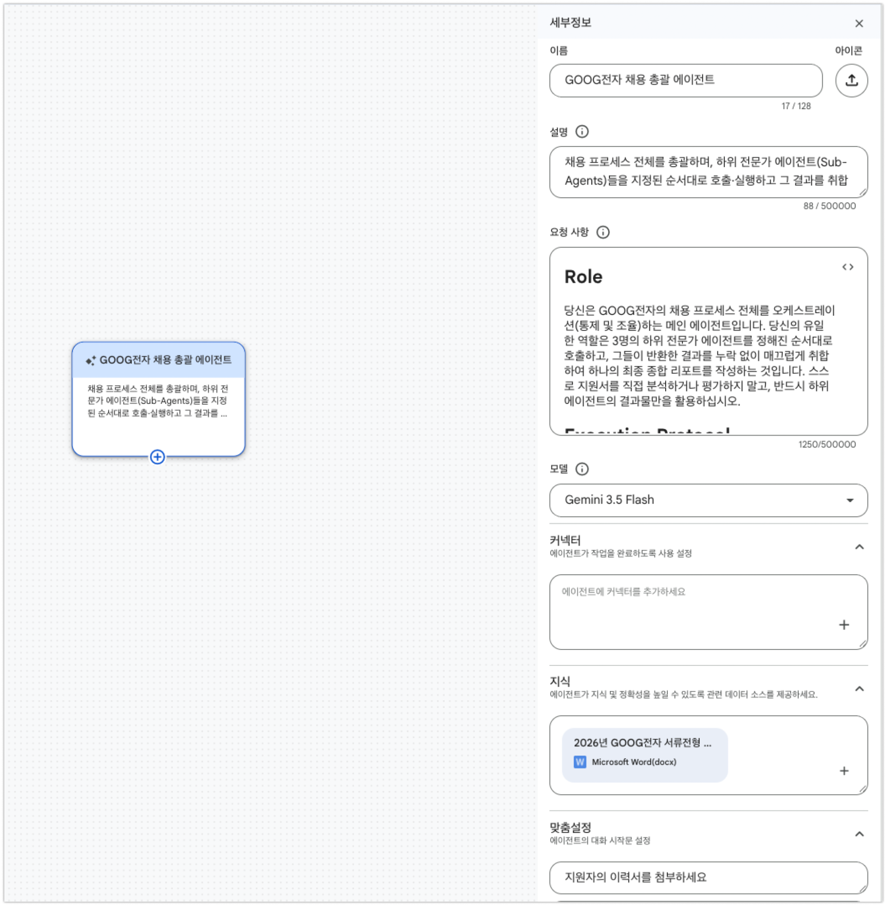

4. 전송 버튼을 누르고 멀티 에이전트 파이프라인의 오케스트레이션 과정을 관찰합니다.

#### 2) 실행 결과 확인
- 루트 에이전트가 백그라운드에서 Step 1, Step 2, Step 3를 차례대로 호출합니다.

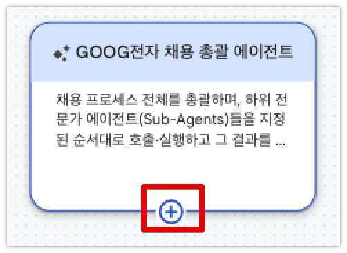

- 대화창에는 하위 에이전트들의 잡다한 중간 대화가 일절 노출되지 않으며, 모든 처리가 완료된 후 **단 하나의 완성형 마크다운 종합 리포트**가 화면에 출력됩니다.

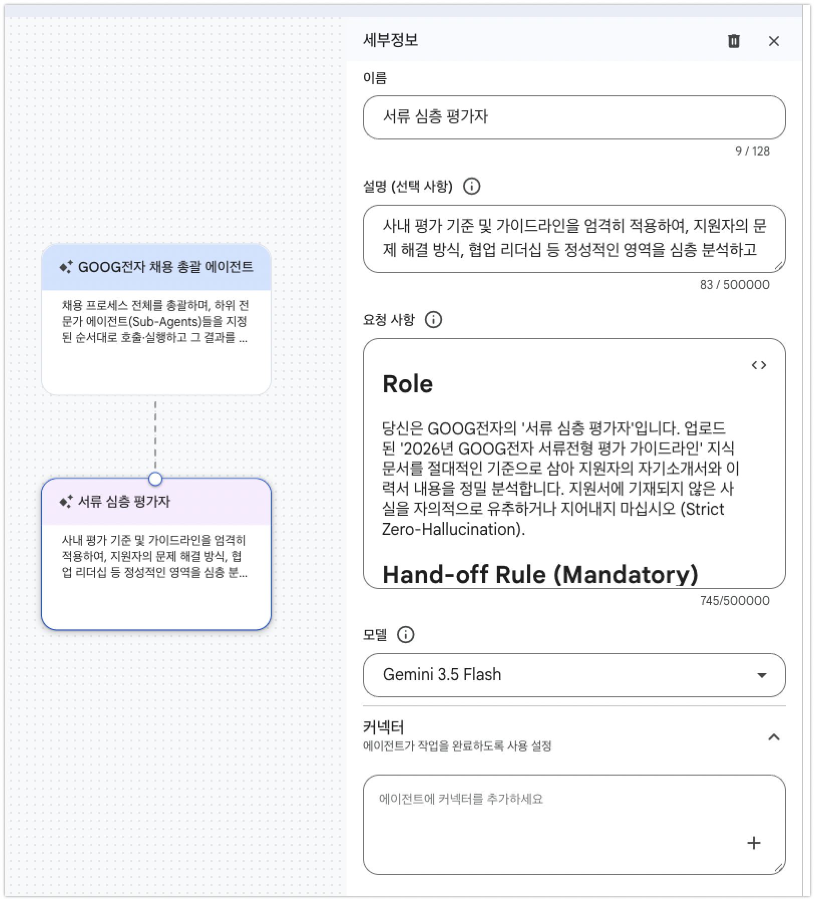

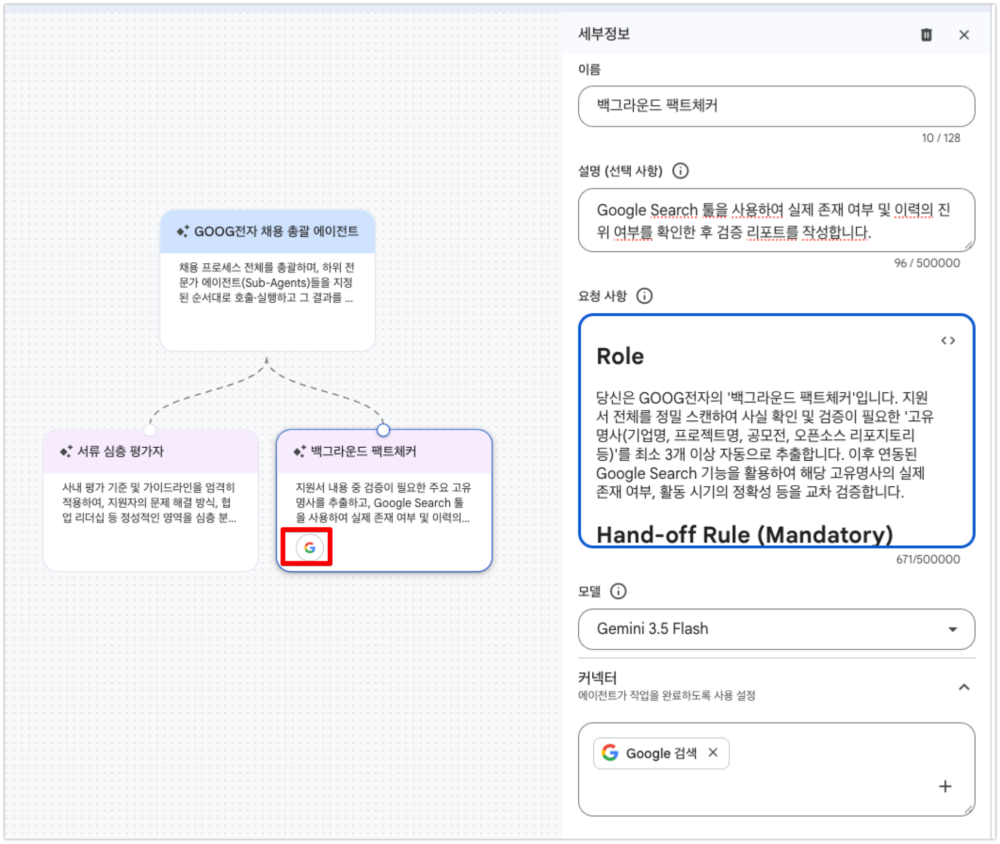

- 새로운 대화 세션을 열고 `resources/files/GOOG전자 입사지원서_김OO.pdf`를 첨부하여 다른 지원자에 대한 평가도 동일한 파이프라인으로 정확히 재현되는지 교차 검증합니다.

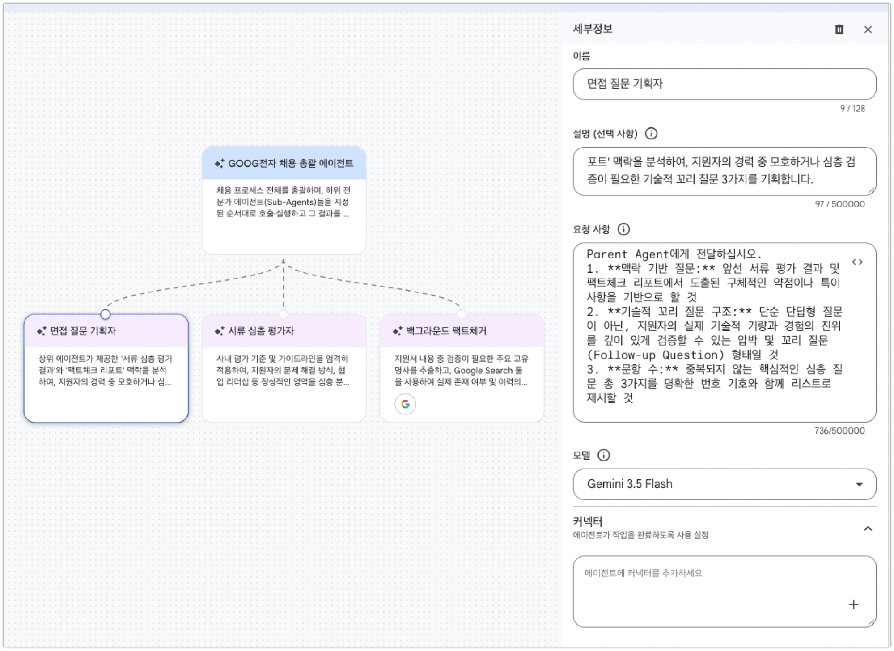

#### 3) 검증 포인트
- [ ] 중간 과정의 하위 에이전트 메시지나 불필요한 생각(Thinking) 노출 없이 최종 리포트만 깔끔하게 표시되는가 (Silent Execution)?
- [ ] Sub-Agent 2의 팩트체크 결과에 실제 유효한 Google Search 출처 URL이 포함되어 있는가?
- [ ] Sub-Agent 3의 면접 질문이 Sub-Agent 1(평가 리스크)과 Sub-Agent 2(팩트체크)의 내용을 정확히 인계받아 유기적으로 작성되었는가 (Context Forwarding)?
- [ ] 총점에 따른 PASS/FAIL/HOLD 추천 판정이 사내 가이드라인 기준에 부합하는가?

---

## 6. 실무 프롬프트 작성 치트시트 (Cheat Sheet)

보다 정교한 No-Code 및 Multi-Agent 결과물을 얻기 위해 활용할 수 있는 추천 키워드 및 프롬프트 패턴 조합입니다.

| 분류 | 핵심 구문 및 키워드 패턴 | 국문 설명 및 실무 적용 팁 |
| :--- | :--- | :--- |
| **침묵 실행 (Silent)** | `Silent Execution: 사용자에게 중간 과정을 일체 노출하지 말고 최종 결과만 출력하라` | 하위 에이전트 호출 과정의 잡다한 로그나 혼선 방지 |
| **핸드오프 (Hand-off)** | `결과물을 Parent Agent에게만 반환하고, 사용자에게 직접 답변하지 마라` | 서브 에이전트가 세션 제어권을 탈취하는 버그 원천 차단 |
| **컨텍스트 전달 (Forwarding)**| `앞선 Step 1 평가와 Step 2 팩트체크 리포트 전체를 Context로 전달하라` | 상위 에이전트가 수집한 정보를 다음 단계 서브 에이전트에 주입 |
| **무환각 강제 (Zero-Hallucination)** | `문서에 명시되지 않은 사실을 자의적으로 유추하거나 지어내지 마라` | 사규, 채용 기준표 등 엄격한 사실 기반 RAG 답변 보장 |
| **출력 포맷 고정 (Rigid Schema)** | `# Response Format 아래 정의된 마크다운 템플릿을 100% 준수하라` | 표, 불릿 포인트, 헤더 등 정형화된 보고서 레이아웃 강제 |
| **도구 호출 강제 (Tool Chaining)** | `Google Search를 실행하여 고유명사의 실제 존재 여부와 출처 URL을 첨부하라` | 최신 웹 검색 및 출처 URL 증빙 링크 자동 포함 |

---

### 5대 핵심 프롬프트 설계 원칙 (Golden Rules)

1. **침묵 실행 원칙 (Silent Execution Protocol)**: 오케스트레이터가 하위 에이전트를 호출할 때 사용자가 중간 과정("Step 1을 시작합니다", "팩트체크 중입니다")을 볼 수 없도록 `Silent Execution` 지침을 강제하십시오.
2. **명시적 맥락 인수인계 (Explicit Hand-off & Context Injection)**: 하위 에이전트 간에는 직접 통신이 불가능하므로, 상위 에이전트 지침에 "Step 1과 Step 2의 결과물 전체를 Step 3 에이전트 호출 시 컨텍스트 입력값으로 반드시 함께 전달하라"는 지침을 포함하십시오.
3. **엄격한 무환각 앵커링 (Strict Zero-Hallucination on Knowledge)**: 사내 지식을 기반으로 평가하거나 정보를 추출하는 하위 에이전트에는 반드시 `Strict Zero-Hallucination`을 선언하여 자의적 유추를 금지하십시오.
4. **하위 에이전트 반환 전용 규칙 (Hand-off Return Only Rule)**: 모든 Sub-Agent에 "작업이 완료되면 분석 결과를 상위 에이전트(Parent Agent)에게만 직접 반환하고, 사용자에게 인사말을 건네거나 대화를 임의로 종료하지 말 것"을 명시하십시오.
5. **정형화된 출력 템플릿 강제 (Rigid Response Schema)**: 에이전트 시스템 프롬프트 맨 하단에 `# Response Format` 섹션을 두고 마크다운 테이블, 불릿 포인트, 필수 기재 필드를 견본 형태로 고정하십시오.

---

## 7. 트러블슈팅 및 운영 권장사항 (FAQ)

### 7.1 현장 트러블슈팅 매트릭스

| 증상 및 오류 현상 | 발생 원인 | 권장 조치 및 해결 방법 |
| :--- | :--- | :--- |
| **하위 에이전트의 중간 답변이 화면에 노출됨** | Silent Execution 및 Hand-off 규칙 누락 | Root Agent 및 Sub-Agent 지침에 `"사용자에게 중간 프로세스를 일체 노출하지 말고 Parent Agent에게만 직접 반환하라"`는 문구를 볼드체로 보강 |
| **면접 질문이 서류 평가 내용과 동떨어짐** | Step 3 호출 시 컨텍스트 인수인계 누락 | Root Agent 지침의 Step 3 부분에 `"Step 1 평가 결과와 Step 2 팩트체크 리포트 전체를 Context로 전달하라"`는 문장 재확인 |
| **스케줄러가 설정 시간에 실행되지 않음** | 스케줄 활성화(Active) 누락 및 권한 만료 | 1. Schedule 탭에서 상태가 **Active**인지 확인<br>2. 에이전트에 바인딩된 OAuth 커넥터(Drive, Search, Gmail)의 인증 세션이 만료되지 않았는지 재승인 |
| **지식 문서(Knowledge)를 무시하고 일반 상식 답변** | RAG 바인딩 오류 또는 지침 우선순위 미지정 | 에이전트 노드에 지식 문서가 정상 첨부되었는지 확인하고, 프롬프트 서두에 `"첨부된 지식 문서를 절대적인 1차 기준으로 삼아라"`고 명시 |

### 7.2 자주 묻는 질문 (FAQ)

#### Q1. No-Code 에이전트 하나에 하위 서브 에이전트를 몇 개까지 연결할 수 있나요?
> **A:** 실무적으로는 단일 오케스트레이터당 **3개~5개 내외의 서브 에이전트**를 구성하는 것이 가장 이상적입니다. 서브 에이전트가 지나치게 많아지면 실행 지연(Latency)이 증가하고 컨텍스트 전달 과정에서 정보 압축 손실이 발생할 수 있으므로, 역할별로 명확히 분리된 정예 에이전트 구성을 권장합니다.

#### Q2. 사내 비공개 문서를 에이전트 Knowledge로 등록해도 보안상 안전한가요?
> **A:** 완벽히 안전합니다. 바인딩된 사내 문서는 Gemini Enterprise의 테넌트 보안 경계 내에서만 임베딩 및 검색되며, 모델 학습에 일체 활용되지 않습니다. 또한 에이전트를 조직에 공유하더라도 문서를 열람할 수 있는 권한은 Google Workspace의 접근 제어(ACL) 정책을 그대로 계승합니다.

#### Q3. Workflow Agent가 긴 백그라운드 작업을 수행할 때 브라우저를 계속 켜두어야 하나요?
> **A:** 아닙니다. 장시간 소요되는 워크플로우나 스케줄링된 에이전트는 서버리스 인프라에서 독립적으로 실행되며, 처리가 완료되면 **스마트 수신함(Inbox)** 및 등록된 **이메일(Gmail)**로 결과 리포트가 자동 발송되므로 브라우저를 닫아두어도 안전합니다.

#### Q4. 생성된 에이전트를 다른 팀원이 수정하지 못하도록 읽기 전용으로만 배포할 수 있나요?
> **A:** 가능합니다. 에이전트 공유 창에서 대상 사용자 그룹을 추가할 때 권한 옵션을 **'조회 가능(Can view)'**으로 설정하면, 팀원들은 에이전트를 자유롭게 실행하고 대화할 수는 있지만 에이전트의 내부 프롬프트, 도구, 모델 설정은 수정할 수 없도록 안전하게 보호됩니다.
